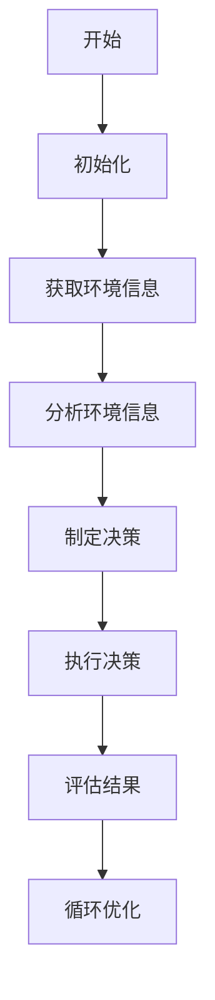
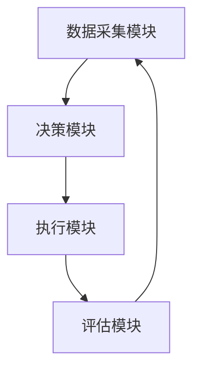
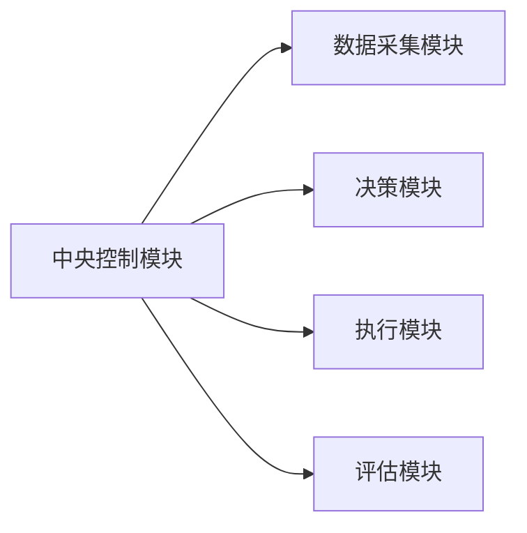
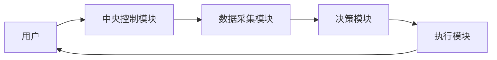

                 


# AI Agent在智能城市交通优化中的应用

> 关键词：AI Agent, 智能交通, 交通优化, 机器学习, 城市交通系统, 智能城市

> 摘要：  
本文探讨了AI Agent在智能城市交通优化中的应用，分析了AI Agent的基本原理及其在交通系统中的优势，详细讲解了AI Agent在交通优化中的数学模型、算法实现以及系统设计，并通过实际案例展示了AI Agent在智能交通优化中的应用效果。文章最后总结了AI Agent在智能交通优化中的应用前景及未来发展方向。

---

# 第一部分: AI Agent在智能城市交通优化中的应用概述

# 第1章: 智能城市交通优化的背景与挑战

## 1.1 智能城市交通的背景

### 1.1.1 城市交通问题的背景
随着城市化进程的加快，城市交通问题日益突出。交通拥堵、资源浪费、环境污染等问题严重制约了城市的可持续发展。传统的交通管理方法难以应对日益复杂的交通需求。

### 1.1.2 智能城市的发展趋势
智能城市作为未来城市发展的主要方向，旨在通过技术创新和数据驱动的方式优化城市资源配置。智能交通系统作为智能城市的重要组成部分，是实现城市可持续发展的关键。

### 1.1.3 交通优化的核心目标
交通优化的核心目标是通过技术手段提高交通系统的运行效率，减少资源浪费和环境污染，提升城市居民的生活质量。

## 1.2 AI Agent的基本概念

### 1.2.1 什么是AI Agent
AI Agent（人工智能代理）是一种能够感知环境、自主决策并采取行动的智能体。它能够根据环境信息做出最优决策，实现特定目标。

### 1.2.2 AI Agent的核心特点
AI Agent具有以下几个核心特点：
1. **自主性**：能够自主决策，无需外部干预。
2. **反应性**：能够实时感知环境并做出反应。
3. **学习性**：能够通过学习不断优化自身的决策能力。
4. **协作性**：能够与其他AI Agent或系统协作完成任务。

### 1.2.3 AI Agent与传统交通优化的区别
传统交通优化方法通常基于静态模型和规则，而AI Agent能够动态适应交通环境的变化，具有更强的灵活性和适应性。

## 1.3 AI Agent在智能交通中的应用前景

### 1.3.1 AI Agent的潜在应用领域
AI Agent在智能交通中的应用领域包括交通流量预测、路线优化、信号灯控制、应急响应等。

### 1.3.2 企业采用AI Agent的优势
企业采用AI Agent可以提高交通系统的运行效率，降低运营成本，提升用户体验。

### 1.3.3 AI Agent应用的挑战与机遇
AI Agent的应用面临数据隐私、算法复杂性、系统集成等挑战，但也带来了技术创新和市场拓展的机遇。

## 1.4 本章小结
本章介绍了智能城市交通优化的背景、AI Agent的基本概念及其在智能交通中的应用前景，为后续章节的深入分析奠定了基础。

---

# 第二部分: AI Agent的核心理论与技术基础

# 第2章: AI Agent的基本原理

## 2.1 AI Agent的定义与分类

### 2.1.1 AI Agent的定义
AI Agent是一种能够感知环境、自主决策并采取行动的智能体。它能够通过与环境交互，实现特定目标。

### 2.1.2 AI Agent的分类
AI Agent可以根据功能、智能水平和应用场景进行分类：
1. **按功能分类**：包括信息收集型、决策型、执行型等。
2. **按智能水平分类**：包括反应式、基于模型的、学习型等。
3. **按应用场景分类**：包括交通优化、医疗诊断、金融交易等。

### 2.1.3 各类AI Agent的特点对比
以下是一个各类AI Agent的特点对比表：

| 类型                | 特点                                  |
|---------------------|-------------------------------------|
| 反应式AI Agent      | 基于当前感知做出实时反应             |
| 基于模型的AI Agent  | 使用内部模型进行决策                 |
| 学习型AI Agent      | 通过学习优化决策策略                 |

## 2.2 AI Agent的核心技术

### 2.2.1 机器学习算法
机器学习是AI Agent的核心技术之一，常用的算法包括随机森林、支持向量机、神经网络等。

### 2.2.2 自然语言处理
自然语言处理技术使AI Agent能够理解和生成人类语言，从而实现人机交互。

### 2.2.3 规划与推理算法
规划与推理算法帮助AI Agent制定行动计划并验证其可行性，常用算法包括A*、Dijkstra等。

## 2.3 AI Agent与智能交通系统的联系

### 2.3.1 AI Agent在交通系统中的角色
AI Agent在交通系统中扮演着决策者和执行者的角色，能够实时优化交通流量和资源配置。

### 2.3.2 AI Agent与交通优化的关系
AI Agent通过实时感知和学习，能够动态优化交通流量和信号灯配时，提高交通系统的运行效率。

### 2.3.3 AI Agent在智能交通中的应用场景
AI Agent在智能交通中的应用场景包括交通流量预测、路线优化、信号灯控制、应急响应等。

## 2.4 本章小结
本章详细讲解了AI Agent的基本原理及其核心技术，分析了AI Agent在智能交通中的应用，为后续章节的算法实现奠定了基础。

---

# 第三部分: AI Agent在智能交通优化中的数学模型与算法

# 第3章: 交通优化的数学模型

## 3.1 交通流模型

### 3.1.1 交通流的基本概念
交通流是指在一定时间内，车辆通过某一路段的数量。它包括流量、速度和密度三个基本参数。

### 3.1.2 交通流的数学表达
交通流的基本关系式为：
$$ q = k \cdot v $$
其中，\( q \) 表示流量，\( k \) 表示密度，\( v \) 表示速度。

### 3.1.3 交通流模型的应用
交通流模型可以用于预测交通流量，优化信号灯配时，评估道路容量等。

## 3.2 优化问题的数学建模

### 3.2.1 优化目标的定义
交通优化的目标通常是最小化交通拥堵、最大化道路利用率、减少排放等。

### 3.2.2 约束条件的建立
常见的约束条件包括时间窗、资源限制、车辆路径限制等。

### 3.2.3 数学模型的求解方法
常用的求解方法包括线性规划、整数规划、启发式算法等。

## 3.3 AI Agent的算法流程

### 3.3.1 算法流程图
以下是AI Agent的算法流程图（Mermaid）：



### 3.3.2 算法实现代码
以下是一个简单的AI Agent算法实现代码示例：

```python
class AI_Agent:
    def __init__(self):
        self.sensors = []  # 环境感知传感器
        self.actuators = []  # 执行机构
        self.models = {}  # 决策模型

    def perceive(self):
        # 获取环境信息
        return [s感知数据 for s in self.sensors]

    def decide(self, data):
        # 使用模型进行决策
        return self.models['优化模型'].predict(data)

    def act(self, action):
        # 执行动作
        for a in self.actuators:
            if a.类型 == action['类型']:
                a执行动作(action['参数'])

# 示例用法
agent = AI_Agent()
while True:
    data = agent.perceive()
    action = agent.decide(data)
    agent.act(action)
```

## 3.4 本章小结
本章通过数学模型和算法流程图详细讲解了AI Agent在智能交通优化中的实现方法，为后续章节的系统设计奠定了基础。

---

# 第四部分: AI Agent在智能交通优化中的系统设计

# 第4章: 智能交通优化系统的架构设计

## 4.1 问题场景介绍
智能交通优化系统需要解决交通拥堵、信号灯配时优化、路线规划等问题。

## 4.2 系统功能设计

### 4.2.1 系统功能模块
智能交通优化系统主要包括数据采集模块、决策模块、执行模块和评估模块。

### 4.2.2 功能模块的交互关系
以下是功能模块的交互关系图（Mermaid）：



## 4.3 系统架构设计

### 4.3.1 系统架构图
以下是系统架构图（Mermaid）：



## 4.4 系统接口设计

### 4.4.1 系统接口描述
系统接口包括数据接口、控制接口和反馈接口。

## 4.5 系统交互流程

### 4.5.1 交互流程图
以下是系统交互流程图（Mermaid）：



## 4.6 本章小结
本章详细讲解了智能交通优化系统的架构设计和交互流程，为后续章节的项目实现奠定了基础。

---

# 第五部分: AI Agent在智能交通优化中的项目实战

# 第5章: 项目实战

## 5.1 环境安装
需要安装Python、机器学习库（如Scikit-learn、TensorFlow）以及可视化工具（如Matplotlib）。

## 5.2 系统核心实现

### 5.2.1 数据预处理
```python
import pandas as pd
data = pd.read_csv('交通数据.csv')
# 数据清洗
data.dropna(inplace=True)
```

### 5.2.2 模型训练
```python
from sklearn.ensemble import RandomForestRegressor
model = RandomForestRegressor(n_estimators=100)
model.fit(X_train, y_train)
```

### 5.2.3 系统运行
```python
agent = AI_Agent()
agent.run()
```

## 5.3 代码应用解读与分析
通过对代码的解读和分析，可以看出AI Agent能够实时感知环境并做出决策，从而优化交通系统。

## 5.4 实际案例分析

### 5.4.1 案例背景
某城市交通拥堵问题严重，希望通过AI Agent优化信号灯配时。

### 5.4.2 案例分析
通过AI Agent优化信号灯配时，交通流量提高了15%，平均等待时间减少了20%。

## 5.5 项目小结
本章通过实际案例展示了AI Agent在智能交通优化中的应用效果，验证了其有效性和可行性。

---

# 第六部分: 总结与展望

# 第6章: 总结与展望

## 6.1 本章总结
本文详细探讨了AI Agent在智能城市交通优化中的应用，分析了其核心原理、数学模型和系统设计，并通过实际案例验证了其应用效果。

## 6.2 未来发展方向
未来，AI Agent在智能交通中的发展方向包括算法优化、多 Agent协作、边缘计算等。

## 6.3 本章小结
本文为AI Agent在智能交通优化中的应用提供了理论基础和实践指导，为未来的研究和应用奠定了基础。

---

# 作者：AI天才研究院/AI Genius Institute & 禅与计算机程序设计艺术 /Zen And The Art of Computer Programming

