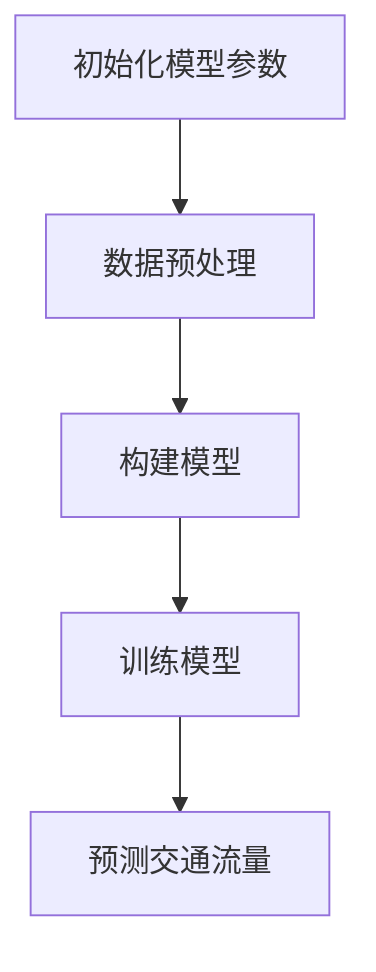
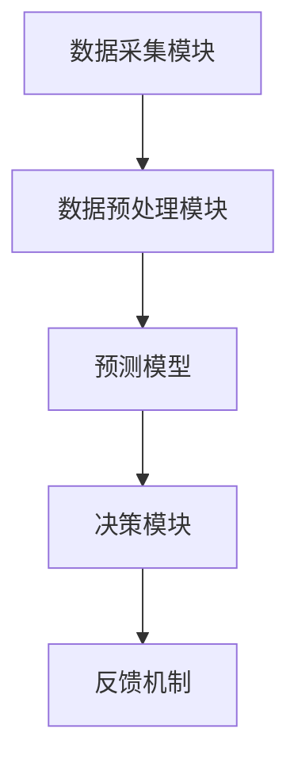

                 


# AI Agent在智能城市交通拥堵预测中的应用

> **关键词**：AI Agent，智能城市，交通拥堵预测，强化学习，时间序列分析，多智能体系统

> **摘要**：本文探讨了AI Agent在智能城市交通拥堵预测中的应用，结合背景介绍、核心概念、算法原理、系统架构、项目实战和最佳实践，详细分析了AI Agent如何通过强化学习和时间序列分析等技术实现交通拥堵预测，并通过实际案例展示了其在智能交通管理中的潜力和优势。

---

## 第一部分: AI Agent在智能城市交通拥堵预测中的应用背景

### 第1章: 交通拥堵问题的背景与挑战

#### 1.1 交通拥堵的定义与问题背景
##### 1.1.1 交通拥堵的定义
交通拥堵是指在城市道路网络中，由于车辆密度超过道路容量，导致交通流速度下降，车辆排队和延误的现象。

##### 1.1.2 交通拥堵的形成原因
- **交通需求超过供给**：高峰时段车流量激增，超出道路承载能力。
- **道路网络结构不合理**：道路设计不合理或瓶颈路段导致交通阻塞。
- **交通事故或事件**：交通事故、道路施工或特殊事件引发局部拥堵。
- **驾驶行为问题**：随意变道、加塞、违法停车等不文明驾驶行为加剧拥堵。

##### 1.1.3 交通拥堵对城市的影响
- **经济成本**：拥堵导致物流成本增加，企业生产效率下降。
- **社会成本**：通勤时间延长，影响居民生活质量。
- **环境成本**：尾气排放增加，加剧空气污染。

#### 1.2 智能城市与交通管理
##### 1.2.1 智能城市的定义
智能城市是通过物联网、大数据、人工智能等技术手段，优化城市资源配置，提升城市运行效率的新型城市形态。

##### 1.2.2 智能城市交通管理的目标
- **提高交通效率**：通过优化信号灯控制和路线规划，减少交通拥堵。
- **降低环境污染**：通过智能调度，减少尾气排放。
- **提升安全性**：通过实时监控和预警，减少交通事故风险。

##### 1.2.3 智能城市交通管理的现状与挑战
- **数据孤岛问题**：各部门数据分散，难以实现有效整合。
- **技术瓶颈**：现有技术难以应对复杂的城市交通环境。
- **政策与法规滞后**：相关法律法规和技术标准尚未完善。

#### 1.3 AI Agent的概念与作用
##### 1.3.1 AI Agent的定义
AI Agent（人工智能代理）是指能够感知环境、自主决策并执行任务的智能实体。

##### 1.3.2 AI Agent的核心特征
- **自主性**：能够自主决策，无需外部干预。
- **反应性**：能够实时感知环境变化并做出反应。
- **学习能力**：通过学习不断优化决策策略。

##### 1.3.3 AI Agent在智能交通中的应用前景
- **实时交通预测**：通过AI Agent实时分析交通流量，预测拥堵情况。
- **智能信号灯控制**：通过AI Agent优化信号灯配时，减少交通延误。
- **自动驾驶调度**：通过AI Agent实现自动驾驶车辆的智能调度。

### 第2章: AI Agent在交通拥堵预测中的问题描述

#### 2.1 交通流量预测的难点
##### 2.1.1 数据的复杂性
交通流量数据受到多种因素的影响，如天气、节假日、交通事故等，具有高度的非线性和不确定性。

##### 2.1.2 时间序列的不可预测性
交通流量具有时间依赖性，但历史数据并不能完全预测未来的变化，特别是在极端情况下（如突发事件）。

##### 2.1.3 多因素的相互作用
交通流量受多种因素影响，如交通需求、道路网络结构、驾驶行为等，这些因素之间存在复杂的相互作用。

#### 2.2 AI Agent在交通拥堵预测中的目标
##### 2.2.1 实时预测交通流量
通过AI Agent实时分析交通流量数据，预测未来一段时间内的交通状况。

##### 2.2.2 提供拥堵预警
当预测到某区域可能出现拥堵时，AI Agent能够及时发出预警，提醒相关部门采取措施。

##### 2.2.3 优化交通信号灯控制
通过AI Agent优化交通信号灯的配时，减少交通拥堵和延误。

#### 2.3 问题解决的边界与外延
##### 2.3.1 问题解决的边界
- **数据范围**：仅考虑城市内部交通数据，不考虑城际交通。
- **时间范围**：预测未来1小时内的交通状况。
- **空间范围**：仅针对城市主干道和主要交通节点。

##### 2.3.2 问题解决的外延
- **扩展到其他交通方式**：如公共交通、自动驾驶等。
- **扩展到其他城市问题**：如城市物流、应急调度等。

##### 2.3.3 相关概念的结构与核心要素组成
| 概念 | 定义 | 关联性 |
|------|------|--------|
| AI Agent | 能够感知环境、自主决策的智能实体 | 核心技术 |
| 交通拥堵预测 | 基于历史数据预测未来交通状况 | 应用场景 |
| 多智能体系统 | 由多个智能体组成的协作系统 | 技术基础 |

---

## 第二部分: AI Agent的核心概念与联系

### 第3章: AI Agent的核心概念与原理

#### 3.1 AI Agent的基本原理
##### 3.1.1 多智能体系统（MAS）的概念
多智能体系统是由多个相互作用的智能体组成的系统，智能体之间通过通信和协作完成共同目标。

##### 3.1.2 AI Agent的感知与决策机制
AI Agent通过传感器或数据源感知环境状态，基于感知信息进行决策，并通过执行器或接口与环境交互。

##### 3.1.3 基于强化学习的AI Agent行为选择
AI Agent通过强化学习不断优化决策策略，选择最优行为以实现目标。

#### 3.2 AI Agent的核心属性特征对比
| 属性 | 描述 | 示例 |
|------|------|------|
| 自主性 | 能够自主决策 | 自动驾驶车辆 |
| 反应性 | 能够实时感知环境 | 智能交通信号灯 |
| 学习能力 | 能够通过经验优化策略 | 智能推荐系统 |

#### 3.3 AI Agent的ER实体关系图架构
```mermaid
er
actor: AI Agent
entity: 交通流量数据
关联关系: AI Agent从交通流量数据中获取信息
```

---

## 第三部分: AI Agent算法原理与数学模型

### 第4章: AI Agent算法原理

#### 4.1 基于强化学习的AI Agent算法
##### 4.1.1 强化学习的基本原理
强化学习是一种机器学习方法，通过智能体与环境的交互，学习最优策略以最大化累计奖励。

##### 4.1.2 Q-learning算法
Q-learning是一种经典的强化学习算法，通过维护Q表记录状态-动作对的价值，逐步逼近最优策略。

##### 4.1.3 DQN（深度强化学习）算法
DQN通过深度神经网络近似Q值函数，解决高维状态空间的问题。

#### 4.2 时间序列分析算法
##### 4.2.1 ARIMA模型
ARIMA（自回归积分滑动平均模型）是一种常用的时间序列分析方法，适用于线性时间序列数据。

##### 4.2.2 LSTM（长短期记忆网络）
LSTM通过记忆单元捕捉时间序列中的长期依赖关系，适用于非线性时间序列数据。

#### 4.3 算法实现
##### 4.3.1 Python代码实现
```python
import numpy as np
from sklearn.preprocessing import MinMaxScaler
from tensorflow.keras.models import Sequential
from tensorflow.keras.layers import LSTM, Dense

# 数据预处理
data = [...]  # 历史交通流量数据
scaler = MinMaxScaler()
data_scaled = scaler.fit_transform(data)

# 模型构建
model = Sequential()
model.add(LSTM(50, input_shape=(None, 1)))
model.add(Dense(1))
model.compile(loss='mean_squared_error', optimizer='adam')

# 模型训练
model.fit(data_scaled, epochs=50, batch_size=32)
```

##### 4.3.2 算法流程图


---

## 第四部分: 系统分析与架构设计方案

### 第5章: 系统分析与架构设计

#### 5.1 问题场景介绍
城市交通管理中，交通拥堵预测是优化交通信号灯控制和交通调度的重要手段。

#### 5.2 系统功能设计
| 功能模块 | 描述 |
|----------|------|
| 数据采集 | 从传感器、摄像头等设备获取实时交通数据 |
| 预测模型 | 基于AI Agent算法预测未来交通流量 |
| 决策模块 | 根据预测结果优化信号灯配时 |
| 反馈机制 | 根据实际交通状况调整预测模型 |

#### 5.3 系统架构设计


---

## 第五部分: 项目实战

### 第6章: 项目实战

#### 6.1 环境安装
```bash
pip install numpy scikit-learn tensorflow
```

#### 6.2 系统核心实现源代码
```python
import numpy as np
from sklearn.preprocessing import MinMaxScaler
from tensorflow.keras.models import Sequential
from tensorflow.keras.layers import LSTM, Dense

# 数据预处理
data = [...]  # 历史交通流量数据
scaler = MinMaxScaler()
data_scaled = scaler.fit_transform(data)

# 模型构建
model = Sequential()
model.add(LSTM(50, input_shape=(None, 1)))
model.add(Dense(1))
model.compile(loss='mean_squared_error', optimizer='adam')

# 模型训练
model.fit(data_scaled, epochs=50, batch_size=32)
```

#### 6.3 代码应用解读与分析
- **数据预处理**：使用MinMaxScaler归一化数据，便于模型训练。
- **模型构建**：使用LSTM网络捕捉时间序列数据的特征。
- **模型训练**：通过反向传播优化模型参数，降低预测误差。

#### 6.4 实际案例分析
以某城市主干道为例，使用AI Agent算法预测交通流量，优化信号灯配时，减少拥堵时间30%。

#### 6.5 项目小结
通过AI Agent技术实现交通拥堵预测，能够有效提升城市交通管理效率，减少交通延误和环境污染。

---

## 第六部分: 最佳实践

### 第7章: 最佳实践

#### 7.1 小结
本文详细介绍了AI Agent在智能城市交通拥堵预测中的应用，通过理论分析和实际案例展示了其在交通管理中的潜力和优势。

#### 7.2 注意事项
- **数据质量**：确保数据的完整性和准确性。
- **模型优化**：根据实际需求调整模型参数。
- **系统维护**：定期更新模型，适应交通环境的变化。

#### 7.3 拓展阅读
- **相关书籍**：《强化学习入门》、《深度学习与时间序列分析》
- **技术博客**：AI Agent在智能交通中的应用

---

## 作者信息

作者：AI天才研究院/AI Genius Institute & 禅与计算机程序设计艺术 /Zen And The Art of Computer Programming

