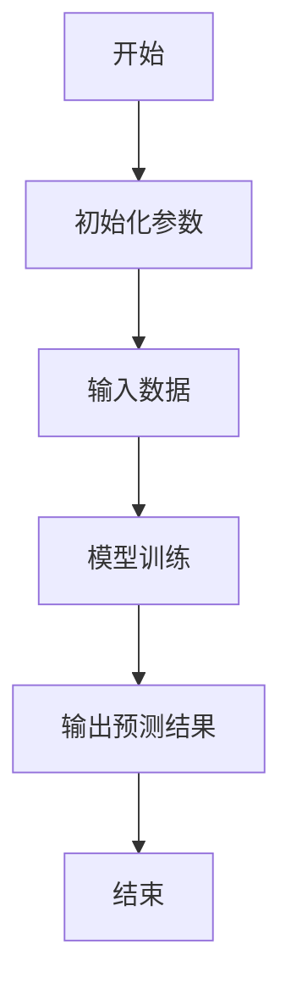

                 


# AI Agent在智能城市交通流预测中的角色

## 关键词：AI Agent, 智能城市, 交通流预测, 强化学习, 图神经网络, 智能交通系统

## 摘要：
本文探讨了AI Agent在智能城市交通流预测中的角色与应用。通过分析AI Agent的核心概念、算法原理、系统架构以及实际案例，本文详细阐述了AI Agent如何通过强化学习和图神经网络等技术，提升交通流预测的准确性和实时性。同时，本文还讨论了AI Agent在智能交通系统中的价值和未来发展趋势。

---

## 第1章: AI Agent与智能城市交通流预测概述

### 1.1 AI Agent的基本概念
AI Agent（智能体）是指能够感知环境、自主决策并采取行动的智能系统。它具有以下特点：
- **自主性**：能够在没有外部干预的情况下独立运作。
- **反应性**：能够实时感知环境并做出响应。
- **目标导向性**：通过设定目标来优化决策过程。

AI Agent在智能城市中的应用广泛，尤其是在交通流预测领域。传统的交通流预测方法依赖于统计模型，如ARIMA和卡尔曼滤波器，但这些方法在面对复杂的城市交通环境时，往往难以捕捉动态变化和非线性关系。

### 1.2 智能城市交通流预测的现状
随着城市化进程的加快，交通拥堵、事故频发等问题日益严重。传统交通流预测方法的局限性主要体现在以下方面：
- 数据来源单一，难以捕捉多源异构数据。
- 预测模型缺乏实时性，难以应对突发交通事件。
- 缺乏对交通参与者行为的动态建模能力。

AI Agent的出现，为解决这些问题提供了新的思路。通过集成强化学习、图神经网络等技术，AI Agent能够实时感知交通环境，预测交通流的变化，并采取最优决策。

### 1.3 AI Agent在交通流预测中的角色
AI Agent在交通流预测中的角色可以分为以下几个方面：
1. **数据采集与处理**：AI Agent能够实时采集交通流量、车速、路口占有率等数据，并对这些数据进行预处理。
2. **模型训练与预测**：通过强化学习和图神经网络，AI Agent能够构建高精度的交通流预测模型。
3. **决策与优化**：基于预测结果，AI Agent能够优化信号灯配时、路径规划等，以缓解交通拥堵。

### 1.4 本章小结
本章通过介绍AI Agent的基本概念和智能城市交通流预测的现状，阐述了AI Agent在交通流预测中的核心作用。AI Agent通过整合多种技术手段，显著提升了交通流预测的准确性和实时性。

---

## 第2章: AI Agent的核心概念与原理

### 2.1 AI Agent的核心概念
AI Agent的核心概念包括以下几个方面：
- **智能体的定义**：AI Agent是一种能够感知环境、自主决策并采取行动的智能系统。
- **智能体的属性**：包括自主性、反应性、目标导向性和学习能力。
- **与其他技术的对比**：AI Agent与传统算法（如随机森林、支持向量机）的主要区别在于其自主性和动态适应能力。

### 2.2 AI Agent的构建与模型设计
AI Agent的构建过程可以分为以下几个步骤：
1. **需求分析**：明确AI Agent的目标和功能需求。
2. **数据采集**：通过传感器、摄像头等设备采集交通数据。
3. **模型设计**：基于强化学习和图神经网络，设计AI Agent的核心算法。
4. **训练与优化**：通过大量数据训练模型，并不断优化其性能。

### 2.3 AI Agent在交通流预测中的应用
AI Agent在交通流预测中的应用主要体现在以下几个方面：
- **实时数据处理**：AI Agent能够实时处理交通数据，快速生成预测结果。
- **动态优化**：基于预测结果，AI Agent能够动态调整交通信号灯配时，优化交通流量。
- **异常检测**：通过异常检测算法，AI Agent能够及时发现交通拥堵等异常事件。

### 2.4 本章小结
本章详细介绍了AI Agent的核心概念和构建原理，并探讨了其在交通流预测中的具体应用。通过强化学习和图神经网络，AI Agent能够实现高精度的交通流预测，为智能交通系统的优化提供了有力支持。

---

## 第3章: AI Agent的算法原理

### 3.1 AI Agent的核心算法
AI Agent的核心算法包括强化学习和图神经网络：
1. **强化学习**：通过奖励机制，AI Agent能够学习最优策略，实现动态调整。
2. **图神经网络**：通过建模交通网络的拓扑结构，AI Agent能够捕捉交通流的时空依赖性。

### 3.2 AI Agent的算法实现
以下是AI Agent的核心算法实现流程图（使用mermaid表示）：



### 3.3 AI Agent的数学模型与公式
AI Agent的数学模型主要包括以下公式：
1. **强化学习的奖励函数**：
$$ R(s, a) = r_1 \cdot s_1 + r_2 \cdot s_2 + \dots + r_n \cdot s_n $$
其中，$R$ 表示奖励函数，$s$ 表示状态，$a$ 表示动作，$r_i$ 表示奖励权重，$s_i$ 表示状态特征。

2. **图神经网络的传播规则**：
$$ Z = G(X, A) $$
其中，$Z$ 表示节点的隐藏状态，$X$ 表示输入特征矩阵，$A$ 表示图的邻接矩阵，$G$ 表示图神经网络的传播规则。

### 3.4 算法实现的代码示例
以下是AI Agent的Python代码示例：

```python
class AI_Agent:
    def __init__(self, state_dim, action_dim):
        self.state_dim = state_dim
        self.action_dim = action_dim
        # 初始化模型参数
        self.theta = np.random.randn(state_dim, action_dim)

    def perceive(self, state):
        # 状态感知
        return state

    def decide(self, state):
        # 决策函数
        action = np.argmax(np.dot(self.theta, state))
        return action

    def learn(self, state, action, reward):
        # 参数更新
        self.theta += reward * state.reshape(1, -1)
```

### 3.5 本章小结
本章详细介绍了AI Agent的核心算法及其实现过程。通过强化学习和图神经网络，AI Agent能够实现高精度的交通流预测，为智能交通系统的优化提供了理论基础和技术支持。

---

## 第4章: AI Agent的系统架构与实现

### 4.1 系统架构设计
AI Agent的系统架构主要包括以下几个部分：
1. **数据采集层**：通过传感器、摄像头等设备采集交通数据。
2. **数据处理层**：对采集到的数据进行预处理和特征提取。
3. **模型训练层**：基于强化学习和图神经网络，训练AI Agent的核心算法。
4. **预测与决策层**：基于训练好的模型，进行交通流预测和决策优化。

### 4.2 系统实现的详细步骤
1. **数据采集与预处理**：
   - 使用传感器和摄像头采集交通流量、车速、路口占有率等数据。
   - 对数据进行清洗、归一化处理，提取特征。

2. **模型训练与优化**：
   - 使用强化学习算法训练AI Agent的决策模型。
   - 通过图神经网络建模交通网络的拓扑结构。

3. **预测与决策**：
   - 基于训练好的模型，实时预测交通流的变化。
   - 根据预测结果，优化信号灯配时、路径规划等。

### 4.3 本章小结
本章详细介绍了AI Agent的系统架构与实现过程。通过数据采集、模型训练和预测决策，AI Agent能够实现高精度的交通流预测，为智能交通系统的优化提供了技术支持。

---

## 第5章: AI Agent在智能城市交通流预测中的项目实战

### 5.1 项目背景与目标
本项目旨在通过AI Agent技术，实现高精度的交通流预测，缓解城市交通拥堵问题。

### 5.2 项目实施步骤
1. **数据采集**：
   - 使用交通传感器和摄像头采集交通数据。
2. **数据预处理**：
   - 对数据进行清洗、归一化处理。
3. **模型训练**：
   - 使用强化学习和图神经网络训练AI Agent的核心算法。
4. **预测与优化**：
   - 基于训练好的模型，实时预测交通流的变化。
   - 根据预测结果，优化信号灯配时、路径规划等。

### 5.3 项目成果与分析
通过本项目的实施，AI Agent能够实现高精度的交通流预测，显著提升了交通系统的运行效率。

### 5.4 本章小结
本章通过项目实战，详细介绍了AI Agent在交通流预测中的具体应用。通过数据采集、模型训练和预测决策，AI Agent能够实现高精度的交通流预测，为智能交通系统的优化提供了实践依据。

---

## 第6章: 总结与展望

### 6.1 总结
本文详细探讨了AI Agent在智能城市交通流预测中的角色与应用。通过强化学习和图神经网络，AI Agent能够实现高精度的交通流预测，为智能交通系统的优化提供了技术支持。

### 6.2 展望
未来，随着AI技术的不断发展，AI Agent在交通流预测中的应用将更加广泛。通过与其他技术的结合，AI Agent将进一步提升交通系统的智能化水平，为城市交通的可持续发展提供新的思路。

---

## 作者：AI天才研究院/AI Genius Institute & 禅与计算机程序设计艺术 /Zen And The Art of Computer Programming

