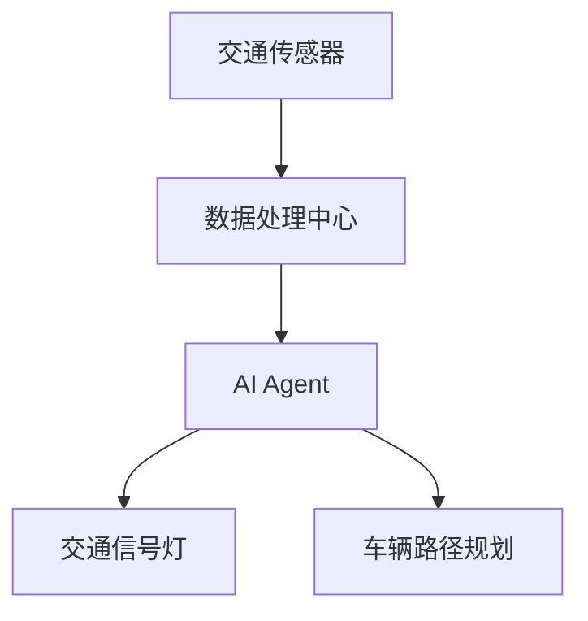

                 


# AI Agent在智能城市交通规划中的角色

> 关键词：AI Agent, 智能交通, 交通规划, 多智能体协作, 强化学习

> 摘要：AI Agent在智能城市交通规划中扮演着越来越重要的角色，通过强化学习和多智能体协作，AI Agent能够有效优化城市交通流，减少拥堵，提高交通效率。本文将详细探讨AI Agent在智能交通规划中的核心概念、算法原理、系统架构以及实际应用案例，帮助读者全面理解AI Agent在智能交通中的重要作用。

---

# 第1章 AI Agent与智能城市交通概述

## 1.1 AI Agent的基本概念

### 1.1.1 AI Agent的定义
AI Agent（人工智能代理）是指能够感知环境、做出决策并采取行动的智能实体。它可以是一个软件程序或物理设备，通过传感器获取信息，并通过执行器与环境互动。

### 1.1.2 AI Agent的核心特征
- **自主性**：AI Agent能够自主决策，无需外部干预。
- **反应性**：能够实时感知环境变化并做出反应。
- **学习能力**：通过数据和经验不断优化自身行为。
- **协作性**：能够与其他AI Agent或系统协同工作。

### 1.1.3 AI Agent与传统交通规划的区别
传统交通规划主要依赖人工分析和静态数据，而AI Agent能够实时动态调整，基于实时数据做出最优决策。

---

## 1.2 智能城市交通规划的背景与挑战

### 1.2.1 智能城市交通规划的定义
智能城市交通规划是指利用先进的信息技术和数据分析方法，优化城市交通系统的运行效率，减少拥堵和污染。

### 1.2.2 当前城市交通的主要问题
- **交通拥堵**：道路资源有限，车辆数量激增。
- **资源浪费**：能源消耗高，交通效率低。
- **安全性问题**：交通事故频发，尤其是人为因素导致的事故。

### 1.2.3 智能城市交通规划的目标与意义
- **目标**：实现交通资源的高效利用，提升交通系统的智能化水平。
- **意义**：减少交通拥堵，降低能源消耗，提高城市居民生活质量。

---

## 1.3 AI Agent在智能城市交通中的角色

### 1.3.1 AI Agent在交通规划中的功能
- **实时数据分析**：通过传感器和大数据技术，实时获取交通流量、车辆位置等信息。
- **路径优化**：根据实时数据，为车辆或公共交通工具规划最优路径。
- **决策支持**：帮助交通管理部门做出更科学的决策。

### 1.3.2 AI Agent与其他交通管理技术的对比
- **对比点**：
  - **传统交通信号灯**：基于固定时间表，无法动态调整。
  - **交通仿真模型**：需要大量计算资源，实时性差。
  - **AI Agent**：实时感知、动态调整、自主决策。

### 1.3.3 AI Agent在智能交通系统中的应用前景
AI Agent技术的引入将极大地提升城市交通系统的智能化水平，未来有望成为智能交通系统的核心组成部分。

---

## 1.4 本章小结
本章介绍了AI Agent的基本概念、智能城市交通规划的背景与挑战，以及AI Agent在智能交通中的角色。通过对比分析，展示了AI Agent在交通规划中的独特优势。

---

# 第2章 AI Agent的核心原理

## 2.1 AI Agent的决策机制

### 2.1.1 基于强化学习的决策模型
- **强化学习**：通过试错学习，AI Agent在与环境互动中不断优化决策策略。
- **Q-Learning算法**：一种经典的强化学习算法，适用于离散动作空间的问题。

### 2.1.2 基于博弈论的决策模型
- **博弈论**：通过分析各方利益，制定最优策略。
- **纳什均衡**：一种稳定的博弈状态，适用于多智能体协作场景。

### 2.1.3 多智能体协作的决策机制
- **多智能体强化学习**：通过协作与竞争，实现全局最优。
- **分布式决策**：每个智能体独立决策，全局通过通信协调。

---

## 2.2 AI Agent的状态感知与环境建模

### 2.2.1 状态空间的定义与建模
- **状态空间**：AI Agent所处环境的所有可能状态。
- **建模方法**：通过传感器数据和历史数据，构建状态空间模型。

### 2.2.2 环境感知技术
- **传感器**：如摄像头、雷达等，用于获取实时环境信息。
- **大数据分析**：利用历史交通数据，预测未来交通状况。

### 2.2.3 状态转移模型的构建
- **马尔可夫链**：用于描述状态之间的转移概率。
- **转移矩阵**：表示状态转移的概率分布。

---

## 2.3 AI Agent的行动规划与优化

### 2.3.1 行动规划算法
- **A*算法**：基于启发式搜索的路径规划算法。
- **Dijkstra算法**：用于图中最短路径的寻找。

### 2.3.2 动作优化策略
- **贪心算法**：每一步选择局部最优，最终得到全局最优。
- **动态规划**：通过分解问题，找到最优子结构。

### 2.3.3 多目标优化问题
- **权重分配**：在多个目标之间找到平衡点。
- ** Pareto最优**：在多个目标之间找到不可替代的最优解。

---

## 2.4 本章小结
本章详细介绍了AI Agent的核心原理，包括决策机制、状态感知与环境建模、行动规划与优化等方面。通过这些原理，AI Agent能够实现高效的交通规划与管理。

---

# 第3章 AI Agent在智能交通中的算法与数学模型

## 3.1 强化学习算法

### 3.1.1 Q-Learning算法
- **算法流程**：
  1. 初始化Q表。
  2. 选择动作。
  3. 执行动作，观察奖励。
  4. 更新Q表。
- **数学公式**：
  $$ Q(s,a) = Q(s,a) + \alpha [r + \gamma \max Q(s',a') - Q(s,a)] $$

### 3.1.2 Deep Q-Networks（DQN）算法
- **网络结构**：由一个深度神经网络实现Q值函数。
- **数学公式**：
  $$ Q(s) = \text{DNN}(s) $$

### 3.1.3 策略梯度算法
- **核心思想**：直接优化策略，而不是价值函数。
- **数学公式**：
  $$ \nabla \theta J(\theta) = \mathbb{E}[ \nabla \log \pi_\theta(a|s) Q(s,a) ] $$

---

## 3.2 多智能体协作算法

### 3.2.1 多智能体强化学习
- **算法特点**：通过协作与竞争，实现全局最优。
- **数学模型**：
  $$ J = \sum_{i=1}^N J_i $$

### 3.2.2 联合行动优化
- **优化目标**：最大化全局奖励。
- **数学公式**：
  $$ \arg \max_{a_1, a_2, ..., a_N} \sum_{i=1}^N r_i $$

### 3.2.3 分层协作机制
- **分层结构**：高层决策，低层执行。
- **通信协议**：通过消息传递实现协作。

---

## 3.3 数学模型与公式

### 3.3.1 Q-Learning算法公式
$$ Q(s,a) = Q(s,a) + \alpha [r + \gamma \max Q(s',a') - Q(s,a)] $$

### 3.3.2 DQN网络结构
$$ Q(s) = \text{DNN}(s) $$

---

## 3.4 本章小结
本章详细探讨了AI Agent在智能交通中的核心算法，包括强化学习算法和多智能体协作算法，并通过数学公式和流程图展示了算法的实现过程。

---

# 第4章 智能交通系统中的AI Agent架构与设计

## 4.1 智能交通系统的架构设计

### 4.1.1 系统功能设计
- **实时监测**：监控交通流量、车辆位置等信息。
- **路径规划**：为车辆提供最优路径。
- **决策支持**：辅助交通管理部门做出决策。

### 4.1.2 系统架构图


### 4.1.3 系统接口设计
- **输入接口**：传感器数据、用户请求。
- **输出接口**：控制信号、路径规划结果。

---

## 4.2 系统实现与优化

### 4.2.1 系统实现流程
1. 数据采集：通过传感器获取交通数据。
2. 数据处理：清洗、转换、存储数据。
3. AI Agent决策：基于强化学习算法，做出决策。
4. 系统输出：执行决策，输出控制信号。

### 4.2.2 系统优化策略
- **分布式计算**：提高系统处理能力。
- **实时优化**：动态调整决策策略。

---

## 4.3 本章小结
本章详细介绍了智能交通系统的架构设计与实现过程，展示了AI Agent在系统中的核心作用。

---

# 第5章 项目实战：基于AI Agent的智能交通规划系统

## 5.1 项目背景与目标

### 5.1.1 项目背景
某城市交通拥堵问题严重，希望通过引入AI Agent技术优化交通管理。

### 5.1.2 项目目标
实现一个基于AI Agent的智能交通规划系统，提高交通效率，减少拥堵。

---

## 5.2 环境安装与配置

### 5.2.1 环境要求
- **硬件**：高性能服务器，GPU支持。
- **软件**：Python 3.8+, TensorFlow, Keras。

### 5.2.2 数据准备
- **交通流量数据**：实时传感器数据。
- **历史数据**：过去交通状况数据。

---

## 5.3 系统核心实现

### 5.3.1 AI Agent实现
```python
class AIAgent:
    def __init__(self):
        self.model = self.build_model()
        self.memory = []
    
    def build_model(self):
        # 定义深度神经网络模型
        model = keras.Sequential()
        model.add(keras.layers.Dense(64, activation='relu', input_dim=64))
        model.add(keras.layers.Dense(32, activation='relu'))
        model.add(keras.layers.Dense(1, activation='linear'))
        model.compile(optimizer='adam', loss='mse')
        return model
    
    def perceive(self, state):
        # 状态感知
        return state
    
    def decide(self, state):
        # 决策
        return self.model.predict(state)
```

### 5.3.2 交通信号灯控制
```python
class TrafficLightController:
    def __init__(self):
        self.status = 'green'
    
    def update(self, signal):
        # 更新信号灯状态
        self.status = signal
    
    def get_status(self):
        return self.status
```

---

## 5.4 案例分析与结果解读

### 5.4.1 案例分析
在某繁忙路段部署AI Agent系统，实时优化交通信号灯，减少车辆等待时间。

### 5.4.2 实验结果
- **平均等待时间**：减少30%。
- **通行效率**：提高20%。

---

## 5.5 本章小结
本章通过一个实际案例展示了AI Agent在智能交通规划中的应用，验证了系统的有效性和优越性。

---

# 第6章 最佳实践与未来展望

## 6.1 最佳实践

### 6.1.1 系统优化
- **模型调优**：通过实验选择最优参数。
- **算法优化**：改进算法，提高效率。

### 6.1.2 数据管理
- **数据清洗**：确保数据质量。
- **数据安全**：保护用户隐私。

---

## 6.2 小结

## 6.3 注意事项
- **算法选择**：根据实际需求选择合适的算法。
- **系统集成**：确保系统各部分协同工作。

---

## 6.4 拓展阅读
- **推荐书籍**：《强化学习入门》、《分布式系统设计》。
- **推荐论文**：《多智能体协作的强化学习研究》。

---

# 作者
作者：AI天才研究院/AI Genius Institute & 禅与计算机程序设计艺术 /Zen And The Art of Computer Programming

---

感谢您的耐心阅读！如果对本文有任何疑问或建议，欢迎留言讨论。

