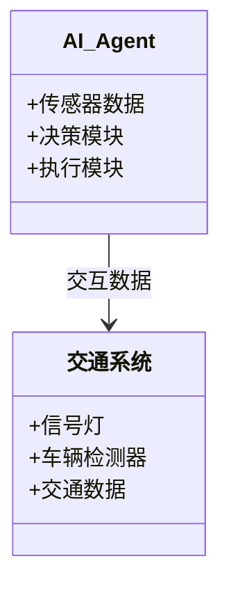
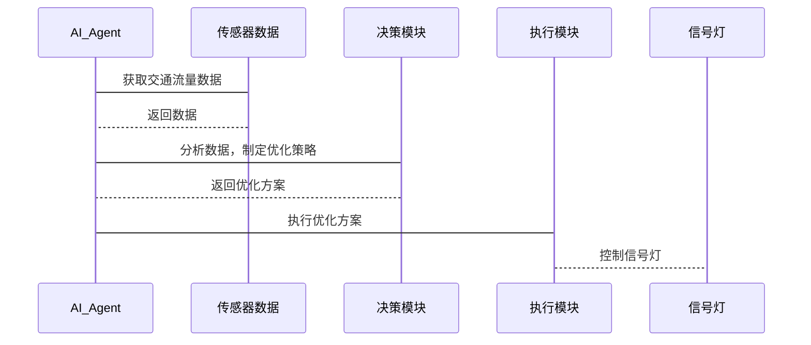

                 


# AI Agent在智能城市交通规划中的角色

---

## 关键词
- AI Agent
- 智能城市
- 交通规划
- 强化学习
- 智能交通系统

---

## 摘要
随着城市化进程的加快，交通拥堵、资源浪费和环境污染等问题日益严重，智能城市交通规划成为解决这些问题的重要手段。AI Agent（人工智能代理）作为一种智能化工具，在交通规划中发挥着越来越重要的作用。本文从AI Agent的基本概念出发，详细探讨其在智能城市交通规划中的角色，分析其核心原理、算法实现、系统架构以及实际应用案例。通过本文的阐述，读者可以全面理解AI Agent在智能交通规划中的潜力与价值。

---

## 第一部分: AI Agent与智能城市交通规划的背景

### 第1章: AI Agent与智能城市交通规划概述

#### 1.1 AI Agent的基本概念
- **1.1.1 AI Agent的定义**
  AI Agent是一种能够感知环境、自主决策并执行任务的智能实体。它通过传感器获取信息，利用算法进行分析，并通过执行器与环境交互。
  
- **1.1.2 AI Agent的核心特征**
  - **自主性**：能够在没有外部干预的情况下独立运作。
  - **反应性**：能够实时感知环境变化并做出响应。
  - **学习能力**：通过数据和经验不断优化自身行为。

- **1.1.3 AI Agent在智能城市中的应用领域**
  - 交通管理
  - 城市规划
  - 智能安防

#### 1.2 智能城市交通规划的现状与挑战
- **1.2.1 智能城市交通规划的定义**
  智能城市交通规划是利用先进的信息技术和数据分析方法，优化城市交通系统的运行效率，减少拥堵和污染。

- **1.2.2 当前交通规划中的主要问题**
  - 交通拥堵
  - 资源浪费
  - 环境污染

- **1.2.3 AI Agent在交通规划中的潜在价值**
  - 提高交通系统的智能化水平
  - 实现资源的优化配置
  - 降低环境污染

#### 1.3 AI Agent在智能城市交通规划中的角色定位
- **1.3.1 AI Agent作为交通优化工具的角色**
  AI Agent可以实时分析交通流量，优化信号灯控制和路线规划。

- **1.3.2 AI Agent作为决策支持系统的功能**
  通过数据挖掘和预测模型，AI Agent为交通管理部门提供科学的决策依据。

- **1.3.3 AI Agent在交通管理中的应用前景**
  随着技术的进步，AI Agent将在交通预测、应急响应等领域发挥更大的作用。

#### 1.4 本章小结
本章介绍了AI Agent的基本概念、核心特征及其在智能城市中的应用领域，重点分析了AI Agent在交通规划中的角色和价值。

---

## 第二部分: AI Agent的核心概念与技术原理

### 第2章: AI Agent的核心原理

#### 2.1 AI Agent的基本原理
- **2.1.1 AI Agent的感知机制**
  AI Agent通过传感器、摄像头和数据接口等手段获取交通流量、天气状况等信息。

- **2.1.2 AI Agent的决策过程**
  AI Agent基于感知到的信息，利用算法进行分析，制定最优的决策策略。

- **2.1.3 AI Agent的执行策略**
  根据决策结果，AI Agent通过执行器（如信号灯控制器）实现对交通系统的干预。

#### 2.2 AI Agent的特性分析
- **2.2.1 智能性**
  AI Agent能够通过学习和推理提高自身的决策能力。

- **2.2.2 自适应性**
  AI Agent能够根据环境变化动态调整自己的行为。

- **2.2.3 学习能力**
  AI Agent通过强化学习、监督学习等方法不断优化自身的性能。

#### 2.3 AI Agent与智能交通系统的关联
- **2.3.1 AI Agent在智能交通系统中的位置**
  AI Agent是智能交通系统的核心组成部分，负责数据处理、决策制定和执行控制。

- **2.3.2 AI Agent与其他交通管理工具的对比**
  - AI Agent的优势：智能化、自主性
  - 其他工具的劣势：依赖人工干预、缺乏灵活性

- **2.3.3 AI Agent在智能交通系统中的数据流**
  数据流从传感器流向AI Agent，经过处理后，AI Agent向执行器发送指令，形成闭环。

#### 2.4 本章小结
本章详细分析了AI Agent的核心原理和特性，并探讨了其在智能交通系统中的地位和作用。

### 第3章: AI Agent的算法原理

#### 3.1 常见的AI Agent算法
- **3.1.1 强化学习算法**
  强化学习是一种通过试错机制优化决策的算法。AI Agent通过与环境的交互，学习最优策略。

- **3.1.2 监督学习算法**
  监督学习基于标记数据训练模型，AI Agent可以利用监督学习进行分类和预测。

- **3.1.3 非监督学习算法**
  非监督学习适用于无标记数据的分析，AI Agent可以利用其进行聚类和异常检测。

#### 3.2 AI Agent在交通优化中的算法选择
- **3.2.1 算法选择的依据**
  - 问题类型：预测、分类、优化
  - 数据特性：结构化、非结构化
  - 计算资源：计算复杂度

- **3.2.2 算法的优缺点分析**
  - 强化学习：优点是适合动态环境，缺点是训练时间较长。
  - 监督学习：优点是结果稳定，缺点是依赖高质量数据。
  - 非监督学习：优点是适合无标签数据，缺点是需要人工干预。

- **3.2.3 算法的适用场景**
  - 强化学习：适用于实时交通优化。
  - 监督学习：适用于交通流量预测。
  - 非监督学习：适用于异常交通模式检测。

#### 3.3 AI Agent算法的数学模型
- **3.3.1 基于强化学习的数学模型**
  $$ R(s, a) = \text{奖励函数} $$
  $$ Q(s, a) = \text{动作价值函数} $$
  $$ \pi(s) = \text{策略函数} $$

- **3.3.2 基于监督学习的数学模型**
  $$ y = f(x) $$
  其中，\( y \) 是目标值，\( x \) 是输入特征。

- **3.3.3 基于非监督学习**
  $$ z = g(x) $$
  其中，\( z \) 是潜在空间的表示，\( x \) 是输入数据。

#### 3.4 本章小结
本章分析了AI Agent常用的算法及其在交通优化中的应用，重点介绍了强化学习和监督学习的数学模型。

---

## 第三部分: AI Agent在智能交通规划中的应用

### 第4章: AI Agent在交通优化中的系统架构设计

#### 4.1 问题场景介绍
智能城市交通规划的目标是通过AI Agent优化交通流量，减少拥堵和污染。

#### 4.2 项目介绍
以城市交通信号优化为例，设计一个基于AI Agent的交通管理系统。

#### 4.3 系统功能设计
- **4.3.1 领域模型（Mermaid 类图）**



- **4.3.2 系统架构设计（Mermaid 架构图）**


- **4.3.3 系统接口设计**
  - 数据接口：AI Agent与交通系统的数据交互。
  - 控制接口：AI Agent对信号灯的控制。

- **4.3.4 系统交互（Mermaid 序列图）**



#### 4.4 本章小结
本章通过一个具体案例，详细设计了AI Agent在交通优化中的系统架构，并通过Mermaid图展示了系统的交互过程。

### 第5章: 项目实战——城市交通信号优化

#### 5.1 环境安装
- 需要安装的工具：
  - Python
  - TensorFlow
  - Mermaid
  - PyCharm

#### 5.2 系统核心实现源代码
- AI Agent的强化学习实现：

```python
import numpy as np
import gym

class AI_Agent:
    def __init__(self, env):
        self.env = env
        self.state_size = env.observation_space.shape[0]
        self.action_size = env.action_space.n
        self.Q_table = np.zeros([self.state_size, self.action_size])
        self.learning_rate = 0.1
        self.gamma = 0.9

    def act(self, state):
        return np.argmax(self.Q_table[state, :])

    def learn(self, state, action, reward, next_state):
        self.Q_table[state, action] = self.Q_table[state, action] + self.learning_rate * (reward + self.gamma * np.max(self.Q_table[next_state, :]) - self.Q_table[state, action])

# 创建环境
env = gym.make('CustomTrafficEnv-v0')
agent = AI_Agent(env)

# 训练过程
for episode in range(1000):
    state = env.reset()
    total_reward = 0
    done = False
    while not done:
        action = agent.act(state)
        next_state, reward, done, info = env.step(action)
        agent.learn(state, action, reward, next_state)
        total_reward += reward
    print(f"Episode {episode}: Total Reward = {total_reward}")
```

#### 5.3 代码应用解读与分析
- **代码解读**
  - AI_Agent类：实现强化学习算法，维护Q表。
  - act方法：选择最优动作。
  - learn方法：更新Q表。

- **案例分析**
  - AI Agent通过强化学习优化交通信号灯，减少等待时间。

#### 5.4 项目小结
本章通过一个具体的项目案例，展示了AI Agent在交通信号优化中的实际应用，并提供了完整的代码实现。

---

## 第四部分: 总结与展望

### 第6章: 总结与展望

#### 6.1 总结
AI Agent在智能城市交通规划中具有重要的作用。通过强化学习、监督学习等算法，AI Agent能够优化交通流量，提高交通系统的效率。

#### 6.2 展望
未来，AI Agent将在交通预测、应急响应等领域发挥更大的作用。同时，随着技术的进步，AI Agent将更加智能化、自主化。

#### 6.3 最佳实践 tips
- 在实际应用中，建议结合具体场景选择合适的算法。
- 数据质量对AI Agent的性能影响重大，需要重视数据采集和处理。
- 系统设计时，要注意模块的可扩展性和可维护性。

#### 6.4 注意事项
- 避免过度依赖AI Agent，需要结合人工干预。
- 注意数据隐私和系统安全。

#### 6.5 拓展阅读
- 推荐阅读《强化学习入门》和《智能交通系统设计》。

---

## 作者：AI天才研究院/AI Genius Institute & 禅与计算机程序设计艺术 /Zen And The Art of Computer Programming

---

通过本文的详细阐述，读者可以全面理解AI Agent在智能城市交通规划中的角色，并能够实际应用这些技术解决现实问题。

