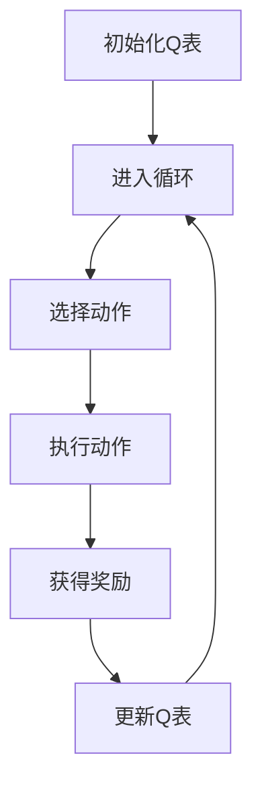
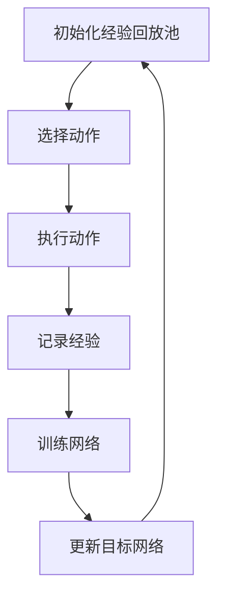
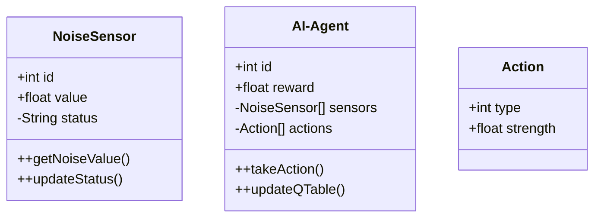
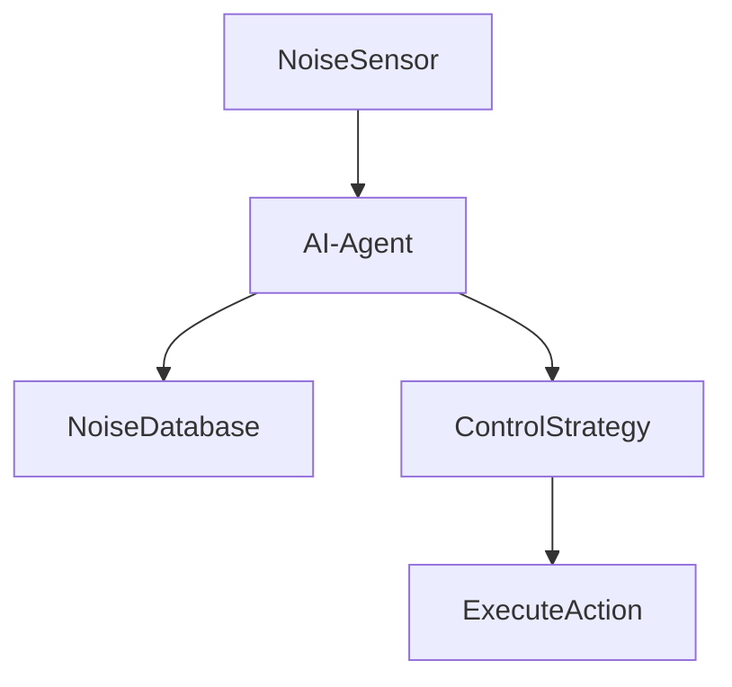

                 


# AI Agent在智能城市噪声管理中的实践

> 关键词：AI Agent, 智能城市, 噪声管理, 强化学习, 系统架构, 项目实战

> 摘要：随着城市化进程的加快，噪声污染已成为影响城市居民生活质量的重要问题。本文探讨了AI Agent在智能城市噪声管理中的应用，从核心概念、算法原理到系统架构和项目实战，全面分析了AI Agent如何帮助城市实现噪声污染的智能化管理。文章结合理论与实践，提供了一套完整的解决方案，为城市噪声管理的智能化转型提供了参考。

---

## 第一部分: AI Agent与智能城市噪声管理的背景与概念

### 第1章: AI Agent的基本概念

#### 1.1 AI Agent的定义与特点

AI Agent（人工智能代理）是指能够感知环境、自主决策并执行任务的智能体。AI Agent具备以下特点：
- **自主性**：能够在没有外部干预的情况下独立运行。
- **反应性**：能够实时感知环境并做出响应。
- **目标导向性**：基于预设目标或学习目标进行决策和行动。
- **学习能力**：通过数据和经验不断优化自身的算法和策略。

#### 1.2 智能城市噪声管理的背景与问题

随着城市化进程的加快，交通、工业和建筑活动导致的噪声污染日益严重。噪声污染不仅影响居民的生活质量，还可能引发健康问题，如听力损失、失眠和心血管疾病。智能城市噪声管理的目标是通过技术手段实现对噪声源的实时监测、识别和控制。

---

### 第2章: AI Agent在智能城市噪声管理中的核心作用

#### 2.1 噪声管理的核心问题

智能城市噪声管理面临以下核心问题：
- **噪声源识别**：准确识别噪声来源（如交通、建筑等）。
- **噪声监测与预测**：实时监测噪声强度并预测未来趋势。
- **噪声控制策略**：制定有效的噪声减少措施。

#### 2.2 AI Agent在噪声管理中的优势

AI Agent在噪声管理中的优势体现在以下几个方面：
- **实时性**：能够实时感知噪声数据并做出快速响应。
- **智能性**：通过机器学习算法不断优化噪声监测和控制策略。
- **自主性**：能够在复杂环境中自主决策，减少人工干预。

---

## 第二部分: AI Agent的核心算法与数学模型

### 第3章: 强化学习算法在噪声管理中的应用

#### 3.1 强化学习的基本原理

强化学习是一种通过试错机制来优化决策策略的算法。AI Agent通过与环境的交互获得奖励或惩罚，从而学习最优策略。强化学习的核心要素包括：
- **状态（State）**：环境当前的状况。
- **动作（Action）**：AI Agent的决策。
- **奖励（Reward）**：对决策的评价。

#### 3.2 Q-Learning算法

Q-Learning是一种经典的强化学习算法，适用于离散动作空间的问题。其核心思想是通过更新Q表（Q-Table）来记录状态-动作对的最优价值。

**Q-Learning算法流程图（Mermaid）**：



#### 3.3 Deep Q-Networks (DQN)算法

DQN算法通过深度神经网络近似Q值函数，适用于连续动作空间的问题。其核心思想是通过经验回放和目标网络来优化模型。

**DQN算法流程图（Mermaid）**：



#### 3.4 算法实现与代码示例

以下是一个简单的Q-Learning算法实现示例：

```python
import numpy as np

class QLearningAgent:
    def __init__(self, state_space, action_space, alpha=0.1, gamma=0.9):
        self.state_space = state_space
        self.action_space = action_space
        self.alpha = alpha
        self.gamma = gamma
        self.q_table = np.zeros((state_space, action_space))

    def take_action(self, state):
        if np.random.random() < 0.1:
            action = np.random.randint(self.action_space)
        else:
            action = np.argmax(self.q_table[state])
        return action

    def update_q_table(self, state, action, reward, next_state):
        self.q_table[state, action] = self.q_table[state, action] + self.alpha * (reward + self.gamma * np.max(self.q_table[next_state]) - self.q_table[state, action])
```

---

## 第三部分: 系统分析与架构设计

### 第4章: 智能城市噪声管理系统的架构

#### 4.1 系统组成部分

智能城市噪声管理系统主要包括以下几个组成部分：
- **噪声传感器**：用于实时采集噪声数据。
- **数据传输网络**：将噪声数据传输到云端。
- **AI Agent**：对噪声数据进行分析并制定控制策略。
- **执行机构**：根据AI Agent的决策执行噪声控制措施。

#### 4.2 系统功能设计

**领域模型类图（Mermaid）**：



#### 4.3 系统架构设计

**系统架构图（Mermaid）**：



---

## 第四部分: 项目实战

### 第5章: AI Agent在噪声管理中的项目实现

#### 5.1 环境安装

以下是项目所需的环境配置：

```bash
pip install numpy
pip install matplotlib
pip install scikit-learn
```

#### 5.2 核心代码实现

以下是AI Agent的核心代码实现：

```python
import numpy as np
import matplotlib.pyplot as plt
from sklearn.svm import SVC

class NoiseManager:
    def __init__(self, data):
        self.data = data
        self.classifier = SVC()

    def train_model(self):
        X = self.data[:, :-1]
        y = self.data[:, -1]
        self.classifier.fit(X, y)

    def predict_noise(self, input_data):
        return self.classifier.predict(input_data)

# 示例数据
data = np.array([[80, 0], [75, 1], [85, 2], [70, 0], [80, 1]])
noise_manager = NoiseManager(data)
noise_manager.train_model()
test_data = np.array([[75, 0], [80, 1]])
prediction = noise_manager.predict_noise(test_data)
print("预测结果：", prediction)
```

#### 5.3 实际案例分析

假设我们有一个城市区域的噪声数据，我们可以通过AI Agent进行噪声源识别和控制策略制定。以下是具体的案例分析步骤：

1. **数据采集**：通过噪声传感器采集噪声数据。
2. **数据预处理**：对噪声数据进行清洗和标准化。
3. **模型训练**：使用监督学习算法（如SVM）训练噪声分类模型。
4. **噪声源识别**：通过模型预测噪声源类型。
5. **控制策略制定**：根据噪声源类型制定相应的控制措施（如调整交通信号灯、限制工业噪声排放）。

---

## 第五部分: 最佳实践与总结

### 第6章: 最佳实践与经验分享

#### 6.1 实施AI Agent的注意事项

在实施AI Agent进行噪声管理时，需要注意以下几点：
- **数据质量**：确保噪声数据的准确性和完整性。
- **模型选择**：根据具体场景选择合适的算法和模型。
- **系统维护**：定期更新模型和优化算法，确保系统的高效运行。

#### 6.2 项目小结

通过AI Agent在智能城市噪声管理中的实践，我们可以实现噪声污染的智能化控制。AI Agent的核心算法（如强化学习和监督学习）在噪声监测和控制中发挥了重要作用。未来，随着技术的进步，AI Agent在智能城市中的应用将更加广泛和深入。

---

## 作者

作者：AI天才研究院 & 禅与计算机程序设计艺术

