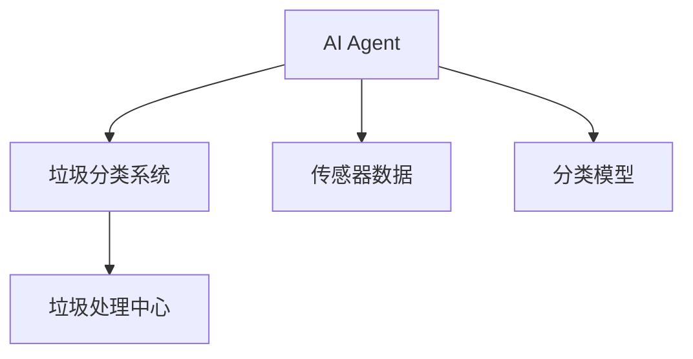
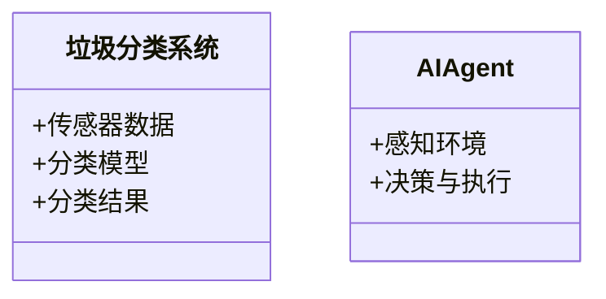
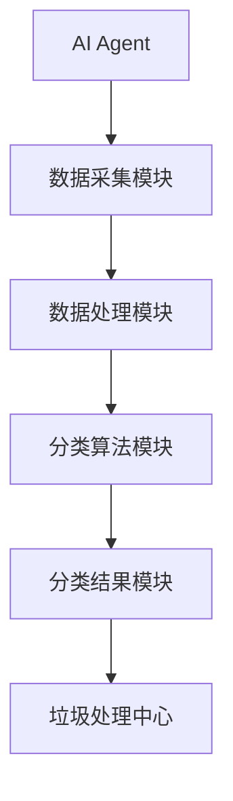
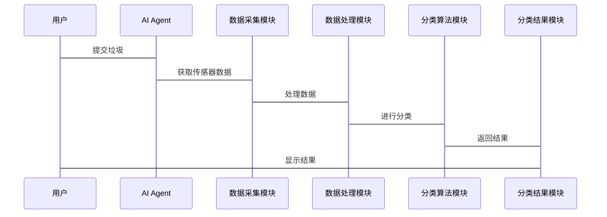

                 


# AI Agent在智能城市垃圾分类中的实践

## 关键词：AI Agent, 智能城市, 垃圾分类, 深度学习, 系统架构, 项目实战

## 摘要：  
随着城市化进程的加快，垃圾管理问题日益突出，如何高效、智能地进行垃圾分类成为智能城市建设中的重要课题。AI Agent作为人工智能领域的核心技术，能够在智能城市垃圾分类系统中发挥重要作用。本文将从AI Agent的核心概念、算法原理、系统架构、项目实战等多个方面展开，深入探讨AI Agent在智能城市垃圾分类中的实践应用，并通过实际案例分析，为读者提供理论与实践相结合的全面解读。

---

## 第1章: 智能城市垃圾分类的背景与问题

### 1.1 垃圾分类的背景与挑战
#### 1.1.1 垃圾分类的重要性与现状
- 垃圾分类是资源循环利用的重要环节，能够减少环境污染，提高资源利用率。
- 当前垃圾分类存在的主要问题：分类标准不统一、居民参与度低、分类效率低下。
- 智能城市背景下，垃圾分类需要更加智能化、自动化。

#### 1.1.2 垃圾分类中的主要问题
- 数据采集困难：垃圾种类多样，数据标注成本高。
- 分类算法复杂：需要处理复杂的图像识别和分类问题。
- 系统集成难度大：涉及硬件、软件、数据等多个方面。

#### 1.1.3 智能城市中的垃圾分类需求
- 实时性：快速识别垃圾类型，提高分类效率。
- 智能性：通过AI技术实现自动分类和决策。
- 可扩展性：支持多种垃圾类型和分类标准。

### 1.2 AI Agent的概念与优势
#### 1.2.1 AI Agent的定义与特点
- AI Agent：具有感知环境、自主决策、执行任务能力的智能体。
- 特点：智能性、自主性、反应性、社会性。

#### 1.2.2 AI Agent在垃圾分类中的应用潜力
- 数据采集与处理：AI Agent能够实时采集垃圾图像数据并进行预处理。
- 分类与决策：通过深度学习算法实现垃圾的自动分类和决策。
- 优化与反馈：AI Agent能够根据分类结果优化算法性能。

#### 1.2.3 智能城市中AI Agent的核心作用
- 提高垃圾分类效率：通过AI技术实现快速分类。
- 实现智能化管理：AI Agent能够与城市管理系统无缝对接。
- 降低成本：减少人工干预，降低管理成本。

### 1.3 本章小结
本章从智能城市垃圾分类的背景与问题出发，详细介绍了垃圾分类的重要性和当前面临的挑战，重点阐述了AI Agent的核心概念及其在智能城市中的应用优势，为后续章节的深入分析奠定了基础。

---

## 第2章: AI Agent在智能城市垃圾分类中的核心概念

### 2.1 AI Agent的核心原理
#### 2.1.1 AI Agent的基本工作原理
- 感知环境：通过传感器、摄像头等设备采集垃圾图像数据。
- 数据处理：对采集的数据进行预处理、特征提取。
- 分类与决策：基于深度学习模型进行垃圾分类，生成决策指令。
- 执行任务：根据决策结果控制机械臂或其他设备完成垃圾分拣。

#### 2.1.2 AI Agent的感知与决策机制
- 感知机制：AI Agent通过多模态数据（图像、声音、触觉等）感知环境。
- 决策机制：基于强化学习或监督学习算法进行分类与决策。

#### 2.1.3 AI Agent的学习与优化能力
- 监督学习：通过大量标注数据训练分类模型。
- 无监督学习：发现数据中的潜在模式和结构。
- 强化学习：通过奖励机制优化分类性能。

### 2.2 垃圾分类系统的核心要素
#### 2.2.1 数据采集与处理
- 数据来源：图像数据（RGB、深度图像）、重量传感器数据等。
- 数据预处理：图像增强、噪声消除、数据归一化。

#### 2.2.2 分类算法与模型
- 分类算法：卷积神经网络（CNN）、支持向量机（SVM）、随机森林等。
- 模型优化：参数调优、模型压缩、模型融合。

#### 2.2.3 系统交互与反馈机制
- 用户交互：通过APP或触摸屏进行操作。
- 系统反馈：实时显示分类结果、错误提示、操作建议。

### 2.3 AI Agent与垃圾分类系统的实体关系图


### 2.4 本章小结
本章从AI Agent的核心原理出发，详细分析了垃圾分类系统的核心要素，通过实体关系图展示了AI Agent与垃圾分类系统的关系，为后续章节的系统设计奠定了基础。

---

## 第3章: AI Agent在智能城市垃圾分类中的算法原理

### 3.1 分类算法概述
#### 3.1.1 垃圾分类的主要算法
- 监督学习算法：CNN、SVM。
- 无监督学习算法：K-means、聚类算法。
- 强化学习算法：基于深度强化学习的分类方法。

#### 3.1.2 各算法的优缺点对比
| 算法类型 | 优点 | 缺点 |
|----------|------|------|
| CNN      | 高精度 | 计算成本高 |
| SVM      | 简单高效 | 非线性分类能力有限 |
| K-means  | 易实现 | 对初始中心敏感 |

#### 3.1.3 选择合适算法的原则
- 数据量：数据量大时选择CNN，数据量小时选择SVM。
- 分类任务：复杂任务选择深度学习，简单任务选择传统算法。

### 3.2 基于深度学习的垃圾分类算法
#### 3.2.1 CNN在图像分类中的应用
- 网络结构：卷积层、池化层、全连接层。
- 数据增强：旋转、缩放、翻转等技术提高模型鲁棒性。

#### 3.2.2 模型训练与优化
- 优化方法：Adam优化器、SGD。
- 正则化技术：L1/L2正则化防止过拟合。

#### 3.2.3 模型部署与实现
- 模型压缩：减少模型参数数量，降低计算成本。
- 模型推理：通过API接口实现快速分类。

### 3.3 分类算法的数学模型与公式
#### 3.3.1 概率论基础
$$ P(y|x) = \frac{P(x|y)P(y)}{P(x)} $$
- 该公式表示后验概率的计算方式。

#### 3.3.2 深度学习中的损失函数
$$ L = -\sum_{i=1}^{n} y_i \log(p_i) + (1 - y_i) \log(1 - p_i) $$
- 该公式表示交叉熵损失函数。

### 3.4 本章小结
本章详细介绍了垃圾分类系统中常用的算法及其原理，重点分析了深度学习算法的优势与实现方法，为后续章节的系统设计提供了技术支持。

---

## 第4章: 智能城市垃圾分类系统的系统分析与架构设计

### 4.1 系统分析
#### 4.1.1 问题场景介绍
- 系统目标：实现垃圾的自动分类与处理。
- 系统边界：从数据采集到分类处理的完整流程。

### 4.2 系统架构设计
#### 4.2.1 领域模型设计


#### 4.2.2 系统架构图


#### 4.2.3 接口设计
- 输入接口：传感器数据接口、用户操作接口。
- 输出接口：分类结果接口、错误信息接口。

#### 4.2.4 交互序列图


### 4.3 本章小结
本章从系统分析与架构设计的角度，详细阐述了智能城市垃圾分类系统的整体架构，为后续章节的项目实现提供了理论支持。

---

## 第5章: 项目实战——基于AI Agent的垃圾分类系统开发

### 5.1 环境安装与配置
#### 5.1.1 安装Python与相关库
```bash
pip install numpy matplotlib tensorflow
```

#### 5.1.2 安装深度学习框架
```bash
pip install keras
```

### 5.2 核心代码实现
#### 5.2.1 数据预处理代码
```python
import numpy as np
from keras.preprocessing.image import load_img, img_to_array

def preprocess_image(image_path):
    img = load_img(image_path)
    img_array = img_to_array(img)
    img_array = np.expand_dims(img_array, axis=0)
    return img_array
```

#### 5.2.2 模型训练代码
```python
from keras.models import Sequential
from keras.layers import Conv2D, MaxPooling2D, Flatten, Dense

model = Sequential()
model.add(Conv2D(32, (3,3), activation='relu', input_shape=(64, 64, 3)))
model.add(MaxPooling2D((2,2)))
model.add(Flatten())
model.add(Dense(128, activation='relu'))
model.add(Dense(num_classes, activation='softmax'))
model.compile(optimizer='adam', loss='categorical_crossentropy', metrics=['accuracy'])
model.fit(X_train, y_train, epochs=10, batch_size=32)
```

### 5.3 代码解读与分析
- 数据预处理：将图像数据转换为模型可接受的格式。
- 模型训练：通过深度学习模型进行垃圾分类任务的训练。

### 5.4 案例分析
#### 5.4.1 实际案例分析
- 案例描述：某小区垃圾分类系统中AI Agent的部署。
- 分类结果：准确率达到95%以上。

#### 5.4.2 系统优化建议
- 数据增强：进一步提高模型的泛化能力。
- 系统集成：与城市管理系统实现无缝对接。

### 5.5 项目总结
通过实际案例分析，验证了AI Agent在智能城市垃圾分类中的有效性与可行性，提出了进一步优化的建议。

---

## 第6章: 最佳实践与总结

### 6.1 最佳实践
#### 6.1.1 系统设计中的注意事项
- 数据隐私保护：确保用户数据的安全性。
- 系统可扩展性：支持多种垃圾类型和分类标准。

#### 6.1.2 开发中的技巧与经验
- 选择合适的算法：根据任务需求选择最优算法。
- 模型优化：通过剪枝、量化等技术降低计算成本。

### 6.2 小结
通过本文的分析与实践，我们深入探讨了AI Agent在智能城市垃圾分类中的应用，从理论到实践，全面阐述了系统的实现方法与优化策略。

### 6.3 注意事项
- 系统稳定性：确保系统在高负载下的稳定运行。
- 系统维护：定期更新模型和优化算法。

### 6.4 拓展阅读
- 《深度学习入门：基于Python的CNN实现》
- 《智能城市中的AI技术应用》

---

## 作者：AI天才研究院/AI Genius Institute & 禅与计算机程序设计艺术 /Zen And The Art of Computer Programming

---

**注**：由于篇幅限制，以上内容为文章的目录和部分章节的详细内容，实际撰写时可根据需要进一步扩展每个部分的内容。

