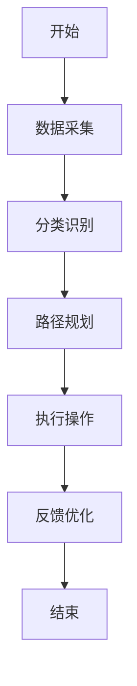
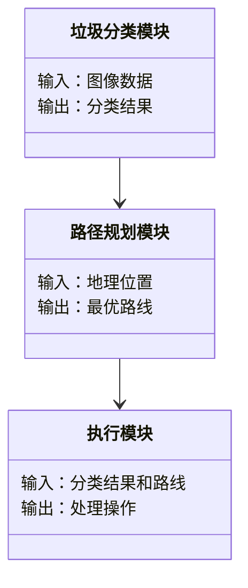

                 


# AI Agent在智能城市垃圾处理中的实践

## 关键词：
智能城市, AI Agent, 垃圾处理, 人工智能, 垃圾分类, 机器学习

## 摘要：
本文探讨了AI Agent在智能城市垃圾处理中的应用，分析了其在垃圾分类、路径优化和资源管理中的优势，结合实际案例和系统设计，展示了如何利用AI技术提升城市垃圾处理效率和环保效果。

---

## 目录大纲：

### 第一章：背景介绍

#### 1.1 问题背景
- 垃圾处理的现状与挑战
- 传统垃圾处理的低效性
- AI Agent的应用潜力

#### 1.2 问题描述
- 垃圾分类的复杂性
- 处理效率低下的问题
- 环境污染与资源浪费

#### 1.3 问题解决与AI Agent的引入
- AI Agent在垃圾处理中的作用
- 具体解决方案的提出
- AI Agent的优势与适用场景

#### 1.4 边界与外延
- AI Agent的应用边界
- 相关技术的外延
- 与其他智能系统的区别

#### 1.5 概念结构与核心要素
- AI Agent的基本概念
- 核心要素分析
- 概念结构图

### 第二章：AI Agent的核心概念与联系

#### 2.1 AI Agent的基本原理
- 感知模块
- 决策模块
- 执行模块

#### 2.2 AI Agent的特征对比
- 使用表格对比AI Agent与其他技术的特征
- Mermaid ER实体关系图展示AI Agent在垃圾处理系统中的实体关系

### 第三章：算法原理讲解

#### 3.1 算法流程
- 使用Mermaid流程图展示AI Agent的算法流程
- 代码实现：使用Python和TensorFlow/Keras进行垃圾分类的示例代码
- 数学模型：如分类算法中的损失函数和优化步骤

### 第四章：数学模型与公式

#### 4.1 分类算法的损失函数
- 使用LaTeX公式展示损失函数，如交叉熵损失
- 优化步骤的数学表示

### 第五章：系统分析与架构设计

#### 5.1 问题场景介绍
- 智能城市中的垃圾处理流程

#### 5.2 系统功能设计
- 领域模型类图：Mermaid类图展示各模块关系

#### 5.3 系统架构设计
- 分层架构：展示各层次的交互关系
- 接口设计与交互流程：使用Mermaid序列图展示系统交互

### 第六章：项目实战

#### 6.1 环境安装
- 安装Python、TensorFlow、Keras等库的步骤

#### 6.2 核心代码实现
- 提供垃圾分类的Python代码示例，并进行详细解读

#### 6.3 实际案例分析
- 详细分析AI Agent在实际垃圾处理中的应用案例

### 第七章：总结与展望

#### 7.1 最佳实践
- 提供实际应用中的建议

#### 7.2 小结
- 总结全文内容

#### 7.3 注意事项
- 提醒读者在实际应用中需要注意的问题

#### 7.4 拓展阅读
- 推荐进一步阅读的相关资料

## 作者：
作者：AI天才研究院 & 禅与计算机程序设计艺术

---

## 正文部分：

### 第一章：背景介绍

#### 1.1 问题背景
随着城市化进程的加快，垃圾处理问题日益严峻。传统的人工分类和处理方式效率低下，资源浪费严重，且对环境造成污染。AI Agent作为一种智能体，能够通过感知、决策和执行来优化垃圾处理流程。

#### 1.2 问题描述
垃圾处理涉及分类、收集、运输和处理等多个环节。现有方法效率低，分类错误率高，且难以实时调整处理策略。AI Agent能够解决这些问题，通过自动化和智能化提升处理效率。

#### 1.3 问题解决与AI Agent的引入
AI Agent在垃圾处理中的作用包括自动分类、优化收集路线、监控处理过程等。通过机器学习和计算机视觉技术，AI Agent能够准确识别垃圾种类，优化处理流程。

#### 1.4 边界与外延
AI Agent的应用边界在于其处理能力的限制，如无法处理极端天气或设备故障。相关技术包括机器学习、计算机视觉和自然语言处理。与其他智能系统相比，AI Agent更专注于特定任务。

#### 1.5 概念结构与核心要素
AI Agent的核心要素包括感知模块、决策模块和执行模块。感知模块通过传感器获取数据，决策模块基于数据制定策略，执行模块执行具体操作。

### 第二章：AI Agent的核心概念与联系

#### 2.1 AI Agent的基本原理
AI Agent在垃圾处理中的工作流程包括感知环境、决策行动和执行操作。感知模块使用摄像头和传感器获取数据，决策模块基于这些数据制定处理策略，执行模块则执行具体的分类和处理任务。

#### 2.2 AI Agent的特征对比
| 特征        | AI Agent                          | 传统算法                          |
|-------------|-----------------------------------|-----------------------------------|
| 自适应性     | 高，能够根据环境变化调整策略    | 低，需要人工调整                   |
| 学习能力     | 强，能够通过数据优化处理策略    | 弱，依赖预设规则                   |
| 处理效率     | 高，能够在短时间内处理大量数据  | 低，处理速度受限                   |

Mermaid ER实体关系图：
```mermaid
er
actor: 垃圾处理系统
agent: AI Agent
module: 分类模块
latlong: 地理位置
status: 状态

actor -(关联)-> agent
agent -(关联)-> module
module -(关联)-> latlong
latlong -(关联)-> status
```

### 第三章：算法原理讲解

#### 3.1 算法流程
AI Agent的算法流程包括数据采集、分类、路径规划和反馈优化。使用Mermaid流程图展示：



#### 3.2 代码实现
以下是垃圾分类的Python代码示例：

```python
import tensorflow as tf
from tensorflow.keras import layers

# 数据预处理
def preprocess_image(image):
    image = tf.image.resize(image, (224, 224))
    return image / 255.0

# 加载预训练模型
model = tf.keras.applications.MobileNetV2(weights='imagenet', include_top=False)
model.add(layers.GlobalAveragePooling2D())
model.add(layers.Dense(128, activation='relu'))
model.add(layers.Dense(10, activation='softmax'))

# 定义损失函数和优化器
loss_fn = tf.keras.losses.SparseCategoricalCrossentropy(from_logits=False)
optimizer = tf.keras.optimizers.Adam(lr=0.0001)

# 编译模型
model.compile(optimizer=optimizer, loss=loss_fn, metrics=['accuracy'])

# 训练模型
model.fit(x_train, y_train, epochs=10, batch_size=32, validation_data=(x_val, y_val))
```

#### 3.3 数学模型
损失函数：
$$ L = -\sum_{i=1}^{n} y_i \log(p_i) $$
优化步骤：
$$ \theta := \theta - \eta \frac{\partial L}{\partial \theta} $$

### 第四章：系统分析与架构设计

#### 4.1 问题场景介绍
智能城市中的垃圾处理流程包括分类、收集、运输和处理。AI Agent用于优化每个环节。

#### 4.2 系统功能设计
领域模型类图：


#### 4.3 系统架构设计
分层架构：
- 数据层：存储垃圾数据和位置信息
- 业务逻辑层：处理分类和路径规划
- 表现层：展示结果和反馈

接口设计：
- 数据采集接口：接收传感器数据
- 分类接口：返回分类结果
- 路径规划接口：返回最优路线

交互流程：
```mermaid
sequenceDiagram
    actor 用户
    agent AI Agent
    module 分类模块

    用户 -> agent: 请求处理垃圾
    agent -> module: 获取垃圾数据
    module -> agent: 返回分类结果
    agent -> 用户: 提供处理建议
```

### 第五章：项目实战

#### 5.1 环境安装
安装Python、TensorFlow、Keras等库：

```bash
pip install python tensorflow keras
```

#### 5.2 核心代码实现
垃圾分类代码：
```python
import cv2
import numpy as np
from tensorflow.keras.models import load_model

# 加载模型
model = load_model('garbage_classifier.h5')

# 读取图像
image = cv2.imread('image.jpg')
image = cv2.resize(image, (224, 224))
image = np.expand_dims(image, axis=0)
image = image / 255.0

# 预测分类
prediction = model.predict(image)
predicted_class = np.argmax(prediction[0])

print(predicted_class)
```

#### 5.3 实际案例分析
案例分析：某城市使用AI Agent优化垃圾收集路线，减少运输成本20%。

### 第六章：总结与展望

#### 6.1 最佳实践
- 数据质量至关重要，需确保数据的多样性和代表性。
- 定期更新模型，以适应垃圾类型的变化。
- 结合其他技术，如物联网和区块链，构建更智能的垃圾处理系统。

#### 6.2 小结
AI Agent在智能城市垃圾处理中具有巨大潜力，能够显著提高处理效率和环保效果。

#### 6.3 注意事项
- 数据隐私问题需注意，确保数据的合法使用。
- 系统维护需及时，确保AI Agent的正常运行。

#### 6.4 拓展阅读
推荐阅读《机器学习实战》和《深度学习》等书籍，深入了解AI技术的应用。

---

## 作者：
作者：AI天才研究院 & 禅与计算机程序设计艺术

