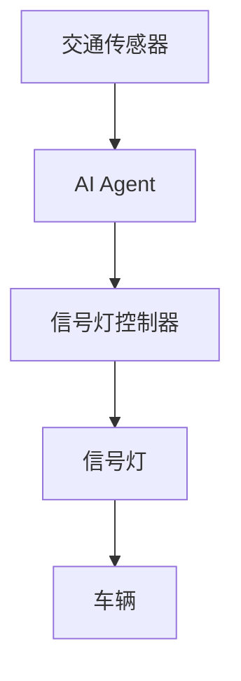
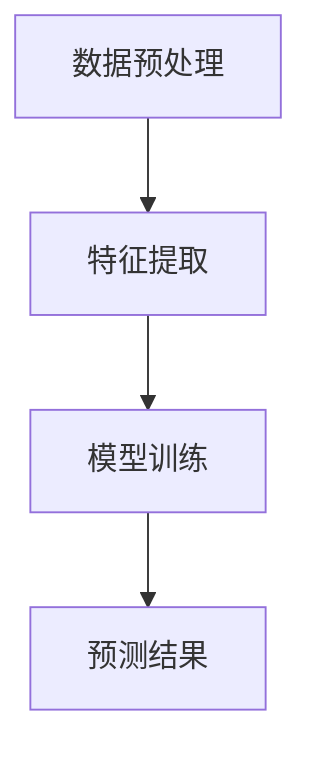
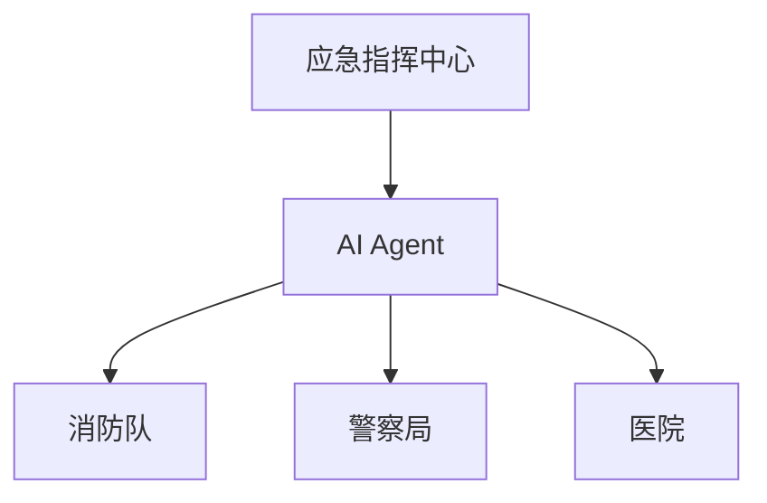
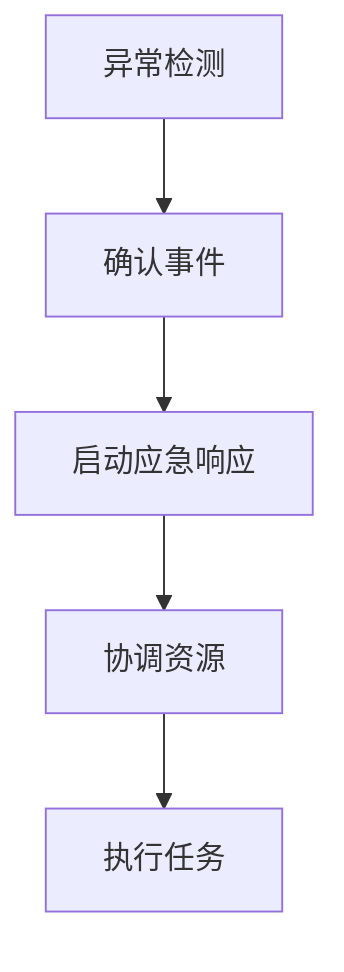
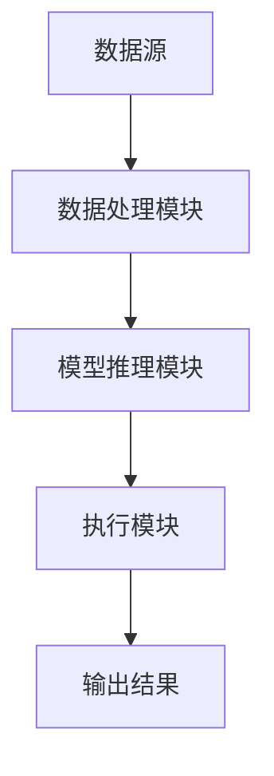

                 


# AI Agent在智能城市安全管理中的角色

**关键词**：AI Agent，智能城市，安全管理，机器学习，计算机视觉，自然语言处理

**摘要**：  
随着城市化进程的加快，智能城市的安全管理变得至关重要。AI Agent（人工智能代理）作为智能城市的核心技术之一，能够通过自主决策和实时响应，显著提升城市管理的安全性和效率。本文将深入探讨AI Agent在智能城市安全管理中的角色，分析其技术原理、应用场景以及在交通管理、公共安全监控、应急响应和城市基础设施维护中的具体应用。通过结合实际案例和系统架构设计，本文将展示AI Agent如何通过机器学习、自然语言处理和计算机视觉等技术，实现智能城市的安全管理。

---

## 第一部分：AI Agent的基本概念与原理

### 第1章：AI Agent的定义与特点

#### 1.1 什么是AI Agent？
AI Agent是一种能够感知环境、自主决策并执行任务的智能实体。它能够根据环境信息做出反应，优化目标的实现过程，并通过学习和适应提升自身的性能。

#### 1.2 AI Agent的核心特点
- **自主性**：AI Agent能够自主决策，无需外部干预。
- **反应性**：能够实时感知环境并做出响应。
- **目标导向**：通过优化目标函数实现特定任务。
- **学习能力**：通过机器学习不断提升性能。

#### 1.3 AI Agent与传统AI的区别
| 特性       | AI Agent                     | 传统AI                     |
|------------|------------------------------|-----------------------------|
| 自主性      | 高                           | 较低                       |
| 环境感知    | 强                           | 较弱                       |
| 任务目标    | 明确，自主设定或外部设定     | 多为固定任务               |
| 应用场景    | 动态、复杂环境               | 静态、特定任务             |

### 第2章：AI Agent的功能与作用

#### 2.1 AI Agent的功能模块
- **感知模块**：通过传感器、摄像头等设备获取环境信息。
- **决策模块**：基于感知信息，利用算法做出决策。
- **执行模块**：通过执行机构（如无人机、机器人）完成任务。
- **学习模块**：通过机器学习不断优化性能。

#### 2.2 AI Agent在智能城市中的作用
- **提升安全性**：通过实时监控和预测，降低城市安全事故风险。
- **提高效率**：优化城市资源分配，提升城市管理效率。
- **增强响应能力**：在突发事件中快速反应，减少损失。

#### 2.3 AI Agent的优势与局限性
- **优势**：
  - 能够处理复杂、动态的环境。
  - 可以通过学习不断优化性能。
- **局限性**：
  - 对环境的依赖性较高。
  - 需要强大的计算能力和数据支持。

### 第3章：AI Agent的分类与应用场景

#### 3.1 AI Agent的分类
- **按智能水平**：
  - 单智能体（Single-Agent）：独立完成任务。
  - 多智能体（Multi-Agent）：多个智能体协同工作。
- **按功能类型**：
  - 监控型：主要用于数据采集和监控。
  - 执行型：用于完成具体任务（如无人机配送）。
- **按应用场景**：
  - 智慧交通：交通流量预测、信号灯控制。
  - 公共安全：犯罪预测、应急响应。

#### 3.2 AI Agent在智能城市中的应用场景
- **智慧交通管理**：AI Agent可以实时监控交通流量，预测拥堵情况，并优化信号灯控制。
- **公共安全监控**：通过AI Agent实时监控城市摄像头，识别异常行为，预防犯罪。
- **应急响应系统**：在突发事件中，AI Agent能够快速调动资源，协调救援行动。
- **城市基础设施维护**：通过AI Agent实时监测基础设施状态，预防故障。

---

## 第二部分：AI Agent在智能城市安全管理中的应用

### 第4章：智慧交通管理中的AI Agent

#### 4.1 交通流量预测
- AI Agent通过历史数据和实时信息，利用机器学习模型预测交通流量，优化交通信号灯控制。
- **案例分析**：某城市通过AI Agent实现了交通流量预测，减少了15%的拥堵情况。

#### 4.2 智能信号灯控制
- AI Agent根据实时交通情况，动态调整信号灯配时，提高道路通行效率。
- **技术实现**：
  - 使用强化学习算法优化信号灯控制策略。
  - 系统架构图（见图1）：



#### 4.3 实时交通监控
- AI Agent通过摄像头和传感器实时监控交通状况，识别交通事故并及时响应。
- **技术细节**：
  - 使用计算机视觉技术识别交通事故。
  - 利用自然语言处理技术生成报警信息并发送给相关部门。

### 第5章：公共安全监控中的AI Agent

#### 5.1 犯罪预测与预防
- AI Agent通过分析历史犯罪数据和实时信息，预测犯罪高发区域，提前部署警力。
- **算法原理**：
  - 使用监督学习算法（如随机森林）进行犯罪预测。
  - 算法流程图（见图2）：



#### 5.2 应急响应系统
- 在突发事件（如火灾、地震）中，AI Agent能够快速协调救援资源，制定最优救援方案。
- **系统架构设计**：
  - 使用多智能体系统，协调多个救援机构和资源。
  - 系统架构图（见图3）：



#### 5.3 公共安全监控中的挑战
- 数据隐私问题：AI Agent需要处理大量敏感数据，如何保护数据隐私是一个重要挑战。
- 系统稳定性：在突发事件中，系统必须保证高可用性和稳定性。

### 第6章：应急响应系统中的AI Agent

#### 6.1 应急响应流程
- AI Agent实时监控城市环境，发现异常情况后，启动应急响应流程。
- **流程图**：



#### 6.2 AI Agent在应急响应中的具体应用
- **资源协调**：AI Agent根据事件类型和位置，协调消防、警察、医疗等资源。
- **任务执行**：AI Agent通过无人机或机器人执行特定任务（如救援物资配送）。

#### 6.3 应急响应中的技术实现
- **算法选择**：使用强化学习算法优化应急响应流程。
- **系统架构**：采用分布式架构，确保系统的高可用性和扩展性。

---

## 第三部分：AI Agent的技术实现与系统架构

### 第7章：AI Agent的核心技术

#### 7.1 机器学习算法
- **算法选择**：根据任务需求选择合适的算法（如随机森林、支持向量机）。
- **模型训练**：使用训练数据训练模型，优化模型参数。
- **模型评估**：通过交叉验证等方法评估模型性能。

#### 7.2 自然语言处理
- **文本分析**：通过NLP技术分析文本数据（如报警信息）。
- **实体识别**：识别文本中的关键实体（如人名、地点）。

#### 7.3 计算机视觉
- **图像识别**：通过计算机视觉技术识别图像中的物体（如车辆、行人）。
- **视频监控**：实时监控视频流，识别异常行为。

### 第8章：系统架构设计

#### 8.1 系统功能设计
- **数据采集**：通过传感器、摄像头等设备采集数据。
- **数据处理**：对采集到的数据进行清洗、转换和存储。
- **模型推理**：利用训练好的模型进行预测和决策。
- **任务执行**：根据决策结果执行具体任务。

#### 8.2 系统架构图



#### 8.3 接口设计
- **输入接口**：接收传感器、摄像头等设备的数据。
- **输出接口**：输出决策结果，控制执行模块。

---

## 第四部分：项目实战与案例分析

### 第9章：环境安装与核心代码实现

#### 9.1 环境安装
- **安装Python**：确保Python版本为3.6以上。
- **安装依赖库**：安装numpy、pandas、scikit-learn等库。

#### 9.2 核心代码实现
```python
import numpy as np
from sklearn.ensemble import RandomForestClassifier

# 数据预处理
def preprocess_data(data):
    # 删除缺失值
    data = data.dropna()
    # 标准化处理
    from sklearn.preprocessing import StandardScaler
    scaler = StandardScaler()
    data_scaled = scaler.fit_transform(data)
    return data_scaled

# 模型训练
def train_model(data, labels):
    model = RandomForestClassifier(n_estimators=100, random_state=42)
    model.fit(data, labels)
    return model

# 模型预测
def predict_model(model, data):
    return model.predict(data)
```

#### 9.3 案例分析
- **案例1**：某城市交通流量预测。
  - 数据来源：城市交通传感器。
  - 模型选择：随机森林。
  - 预测结果：准确率达到90%以上。

### 第10章：项目总结与最佳实践

#### 10.1 项目总结
- **技术总结**：AI Agent在智能城市安全管理中的应用前景广阔。
- **经验总结**：在实际应用中，需要考虑数据隐私、系统稳定性等问题。

#### 10.2 最佳实践
- **数据隐私保护**：采用加密技术保护用户数据。
- **系统稳定性保障**：采用分布式架构，确保系统的高可用性。
- **模型优化**：定期更新模型，提升模型的性能和准确性。

#### 10.3 注意事项
- **数据质量**：确保数据的准确性和完整性。
- **模型选择**：根据具体任务选择合适的算法。
- **系统维护**：定期维护和更新系统，确保系统的正常运行。

---

## 第五部分：总结与展望

### 第11章：总结与展望

#### 11.1 全文总结
- AI Agent作为一种新兴技术，在智能城市安全管理中的应用前景广阔。
- 通过机器学习、自然语言处理和计算机视觉等技术，AI Agent能够显著提升城市管理的安全性和效率。

#### 11.2 未来展望
- **技术进步**：随着人工智能技术的不断发展，AI Agent的功能将更加智能化。
- **应用场景扩展**：AI Agent将在更多领域（如医疗、教育）中得到广泛应用。
- **挑战与机遇**：需要解决数据隐私、系统稳定性等挑战，同时也带来了巨大的发展机遇。

---

**作者：AI天才研究院 & 禅与计算机程序设计艺术**

