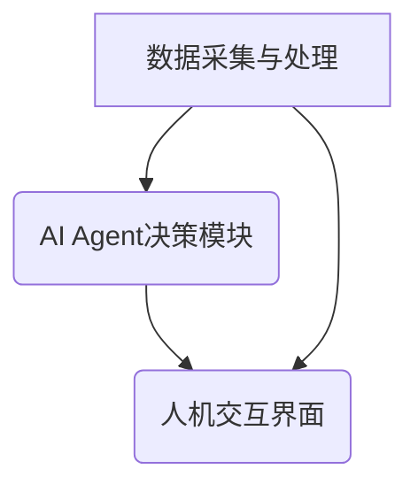

                 


# AI Agent在智能城市规划决策支持中的应用

> 关键词：AI Agent, 智能城市, 决策支持, 强化学习, 多智能体协作, 城市规划, 知识图谱

> 摘要：随着城市化进程的加快，城市规划的复杂性日益增加，传统的决策支持方法已难以满足需求。AI Agent作为一种智能决策支持工具，能够通过数据驱动和智能算法，为城市规划提供更加高效和精准的决策支持。本文将详细探讨AI Agent在智能城市规划中的应用，从基本概念、算法原理到系统架构设计，再到实际案例分析，全面解析其在智能城市中的重要作用。

---

## 第1章: AI Agent与智能城市规划的概述

### 1.1 AI Agent的基本概念

AI Agent（智能体）是指在计算机系统中能够感知环境并采取行动以实现目标的实体。AI Agent的核心特征包括自主性、反应性、主动性、社会性和社会性。与传统决策系统相比，AI Agent具有更强的适应性和灵活性，能够实时响应环境变化并做出最优决策。

### 1.2 智能城市规划的基本概念

智能城市是指通过数字化技术优化城市运行效率、提升居民生活质量的城市形态。智能城市规划的目标是实现资源的高效利用、交通的智能管理、环境的可持续发展等。然而，城市数据的多样性和复杂性使得传统规划方法难以应对复杂的决策问题。

### 1.3 AI Agent在智能城市规划中的作用

AI Agent能够通过数据驱动和智能算法，为城市规划提供实时、动态的决策支持。AI Agent的优势在于其能够处理海量数据、模拟多种场景，并提供最优解决方案。AI Agent与城市规划的结合模式主要体现在数据驱动的决策支持、多智能体协作和知识图谱构建等方面。

---

## 第2章: AI Agent与城市数据的结合

### 2.1 城市数据的多样性与复杂性

城市数据包括交通、环境、能源、人口等多个方面，具有时空特征和异构性。数据的清洗与预处理是实现数据驱动决策的基础，特征提取则是将数据转化为有用信息的关键步骤。

### 2.2 AI Agent对城市数据的处理能力

AI Agent通过强化学习、多智能体协作等算法，能够从城市数据中提取有用信息，并生成决策建议。数据驱动的决策模型是AI Agent在城市规划中的重要工具，能够帮助规划者优化决策过程。

### 2.3 数据驱动的城市规划决策

数据驱动的决策模型通过数学建模和优化算法，为城市规划提供科学依据。例如，强化学习算法可以模拟城市交通流量的变化，优化交通信号灯的配时方案。

---

## 第3章: AI Agent的算法原理与实现

### 3.1 AI Agent的核心算法

AI Agent的核心算法包括强化学习、多智能体协作和知识图谱构建。强化学习通过奖励机制优化决策策略，多智能体协作通过分布式决策实现全局最优，知识图谱构建则通过知识表示和推理支持决策过程。

### 3.2 AI Agent的数学模型

强化学习的数学模型包括状态、动作、奖励和策略空间等。多智能体协作的数学模型涉及分布式决策和博弈论。知识图谱的表示与推理模型则通过图论和逻辑推理实现。

### 3.3 算法实现的代码示例

以下是一个强化学习算法的Python实现示例：

```python
class Agent:
    def __init__(self, state_space, action_space):
        self.state_space = state_space
        self.action_space = action_space
        # 初始化策略参数
        self.theta = np.random.randn(1)

    def act(self, state):
        # 策略函数
        return np.argmax(state.dot(self.theta))

    def update(self, reward):
        # 策略梯度更新
        self.theta += reward * self.theta
```

### 3.4 本章小结

本章详细介绍了AI Agent的核心算法及其数学模型，并通过代码示例展示了算法的实现过程。强化学习和多智能体协作算法是AI Agent在城市规划中的重要工具。

---

## 第4章: AI Agent在城市规划中的系统架构设计

### 4.1 系统架构的总体设计

系统的总体设计包括功能模块划分、分层架构和可扩展性设计。功能模块包括数据采集与处理、AI Agent决策和人机交互界面。

### 4.2 系统功能模块的详细设计

数据采集与处理模块负责城市数据的清洗和预处理。AI Agent决策模块通过强化学习和多智能体协作算法生成决策建议。人机交互界面提供可视化展示和用户反馈。

### 4.3 系统架构图

以下是系统架构的Mermaid图：



### 4.4 本章小结

本章通过系统架构设计展示了AI Agent在城市规划中的应用，功能模块和系统架构的设计为后续实现提供了基础。

---

## 第5章: 项目实战——AI Agent在城市交通管理中的应用

### 5.1 项目背景

城市交通管理是智能城市规划的重要组成部分，AI Agent可以通过实时数据处理和智能决策优化交通流量。

### 5.2 系统核心实现源代码

以下是一个AI Agent在交通管理中的实现代码示例：

```python
import numpy as np

class TrafficAgent:
    def __init__(self, num_signals):
        self.num_signals = num_signals
        self.theta = np.random.randn(1)

    def get_action(self, state):
        return np.argmax(state.dot(self.theta))

    def update(self, reward):
        self.theta += reward * self.theta
```

### 5.3 项目小结

本章通过实际案例展示了AI Agent在城市交通管理中的应用，验证了其在智能城市规划中的有效性。

---

## 第6章: 结论与展望

### 6.1 研究成果总结

本文详细探讨了AI Agent在智能城市规划中的应用，从算法原理到系统架构设计，再到实际案例分析，全面展示了其在城市规划中的重要性。

### 6.2 未来研究方向

未来的研究可以进一步优化AI Agent算法，探索多智能体协作的分布式决策，以及结合边缘计算提升实时性。

---

## 作者：AI天才研究院/AI Genius Institute & 禅与计算机程序设计艺术 /Zen And The Art of Computer Programming

