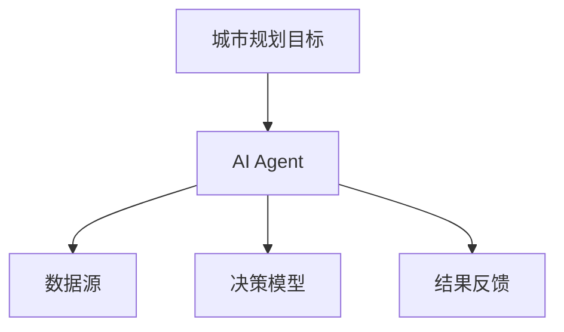
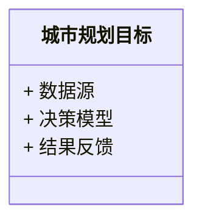
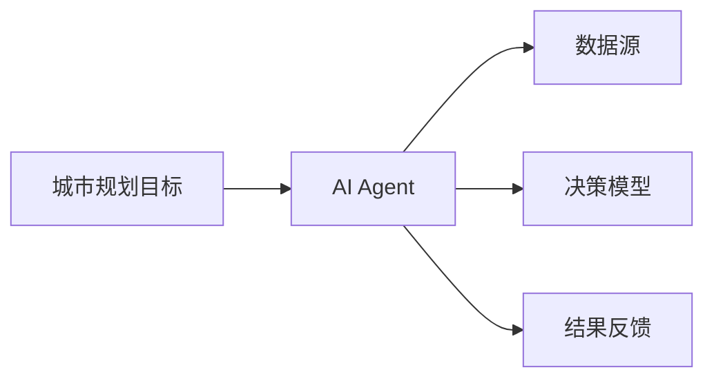

                 


# AI Agent在智能城市规划模拟中的角色

> 关键词：智能城市，AI Agent，城市模拟，城市规划，人工智能，强化学习，多智能体协作

> 摘要：本文探讨AI Agent在智能城市规划中的角色，分析其通过强化学习和多智能体协作提升城市规划效率和质量的过程。文章详细讲解AI Agent的核心概念、算法原理、系统架构，并通过实战案例和最佳实践提供深入见解。

---

## 第一部分: AI Agent在智能城市规划模拟中的背景与概念

### 第1章: AI Agent的基本概念与背景介绍

#### 1.1 AI Agent的定义与核心要素
##### 1.1.1 AI Agent的定义
AI Agent（人工智能代理）是能够感知环境、自主决策并执行任务的智能实体，具备学习、推理和自适应能力。

##### 1.1.2 AI Agent的核心要素
- **智能性**：通过学习和推理做出决策。
- **自主性**：无需外部干预，自主行动。
- **反应性**：实时感知环境变化并调整行为。
- **协作性**：与其他Agent或系统协同工作。

##### 1.1.3 AI Agent的属性与特征
| 属性 | 特征 |
|------|------|
| 智能性 | 能够理解任务目标并采取最优行动 |
| 自主性 | 可以独立决策和执行任务 |
| 反应性 | 对环境变化做出实时响应 |
| 协作性 | 能够与其他Agent或系统协同合作 |

#### 1.2 智能城市规划的背景与挑战
##### 1.2.1 智能城市的定义与目标
智能城市利用信息技术优化城市运营，提升居民生活质量，实现可持续发展。

##### 1.2.2 城市规划中的传统方法与不足
传统方法依赖人工经验和静态模型，存在效率低、适应性差的问题。

##### 1.2.3 AI Agent在城市规划中的潜在价值
AI Agent能够实时分析数据，提供动态优化方案，提高城市规划的效率和质量。

#### 1.3 AI Agent在智能城市规划中的角色定位
##### 1.3.1 AI Agent在城市模拟中的功能定位
AI Agent作为模拟工具，帮助城市规划者进行场景建模和决策优化。

##### 1.3.2 AI Agent与其他技术的协同作用
结合大数据、物联网等技术，构建智能城市生态系统。

##### 1.3.3 AI Agent在城市规划中的应用场景
- 交通流量优化
- 城市扩展规划
- 紧急疏散模拟



---

## 第二部分: AI Agent的核心概念与原理

### 第2章: AI Agent的核心概念与原理

#### 2.1 AI Agent的核心概念
##### 2.1.1 知识表示与推理
AI Agent通过知识表示技术（如语义网络）进行推理，生成决策。

##### 2.1.2 行为决策与规划
基于当前状态和目标，AI Agent制定行动计划。

##### 2.1.3 多智能体协作
多个AI Agent协同工作，共同完成复杂任务。

#### 2.2 AI Agent的属性特征对比
##### 2.2.1 AI Agent与传统算法的对比
| 特性 | 传统算法 | AI Agent |
|------|----------|----------|
| 学习能力 | 无 | 有 |
| 决策能力 | 单一 | 多维度 |

##### 2.2.2 AI Agent与机器学习模型的对比
AI Agent不仅学习数据，还能根据环境动态调整行为。

##### 2.2.3 AI Agent与强化学习的对比
强化学习是AI Agent决策的重要机制，AI Agent通过与环境互动获得奖励。

---

## 第三部分: AI Agent的算法原理与数学模型

### 第3章: AI Agent的算法原理

#### 3.1 强化学习算法
##### 3.1.1 Q-learning算法
通过状态-动作价值函数优化决策。

##### 3.1.2 Deep Q-Network (DQN)算法
结合深度学习，处理高维状态空间。

##### 3.1.3 多智能体强化学习
多个AI Agent协作，共享决策信息。

#### 3.2 多智能体协作算法
##### 3.2.1 多智能体强化学习框架
采用分布式决策机制，优化全局目标。

##### 3.2.2 联合决策与协作机制
通过通信协议共享信息，协调行动。

##### 3.2.3 跨智能体通信与协调
建立通信通道，实现实时信息交换。

#### 3.3 AI Agent的数学模型
##### 3.3.1 Q-learning算法的数学模型
$$ Q(s,a) = r + \gamma \max Q(s',a') $$

##### 3.3.2 DQN算法的数学模型
$$ Q(s,a) = \theta \cdot \phi(s,a) $$

### 第4章: AI Agent的系统架构设计

#### 4.1 项目背景
AI Agent在城市规划中的应用需求和目标。

#### 4.2 系统功能设计
##### 4.2.1 领域模型设计


##### 4.2.2 系统架构设计


##### 4.2.3 接口设计
系统接口定义和交互序列图。

---

## 第四部分: 项目实战

### 第5章: 项目实战

#### 5.1 环境安装
安装Python、TensorFlow等开发工具。

#### 5.2 核心代码实现
```python
import numpy as np
import gym

class AI-Agent:
    def __init__(self, env):
        self.env = env
        self.Q = np.zeros((env.observation_space.shape[0], env.action_space.n))
    
    def learn(self, learning_rate=0.1, gamma=0.99):
        for _ in range(1000):
            state = self.env.reset()
            while True:
                action = np.argmax(self.Q[state])
                new_state, reward, done, _ = self.env.step(action)
                self.Q[state][action] += learning_rate * (reward + gamma * np.max(self.Q[new_state])) 
                state = new_state
                if done:
                    break
```

#### 5.3 代码解读与分析
解释代码功能和实现细节。

#### 5.4 实际案例分析
分析AI Agent在交通优化中的应用案例。

#### 5.5 项目小结
总结项目成果和经验教训。

---

## 第五部分: 最佳实践与小结

### 第6章: 最佳实践

#### 6.1 小结
AI Agent在智能城市规划中的重要性。

#### 6.2 注意事项
确保数据质量和模型泛化能力。

#### 6.3 拓展阅读
推荐相关书籍和论文。

---

## 作者信息

作者：AI天才研究院/AI Genius Institute & 禅与计算机程序设计艺术 /Zen And The Art of Computer Programming

---

以上就是完整的文章内容，涵盖了从基础概念到实战应用的各个层面，帮助读者全面理解AI Agent在智能城市规划中的角色和应用。

