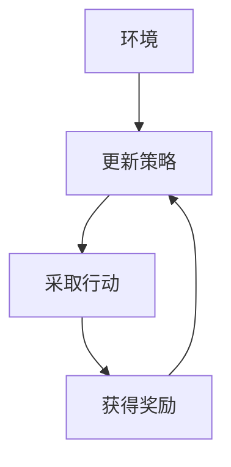
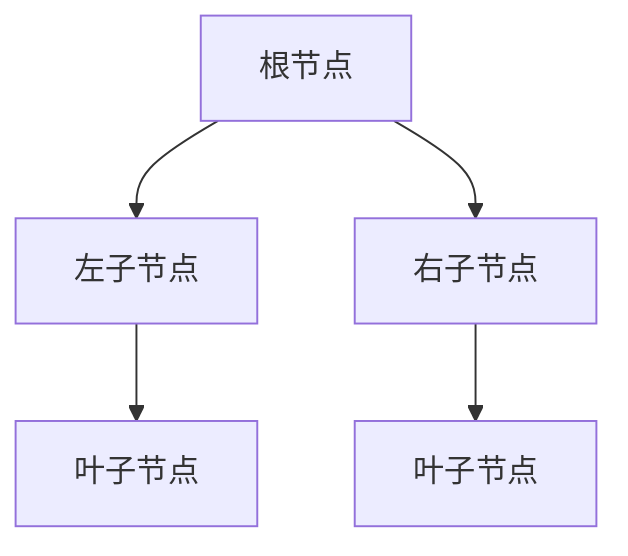
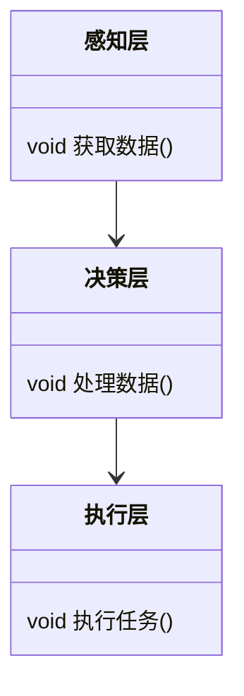
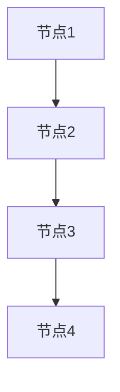
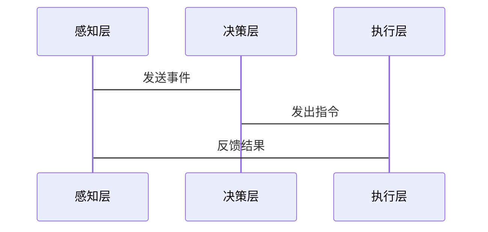
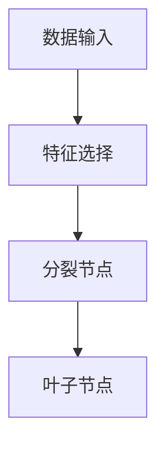
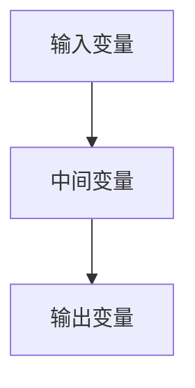
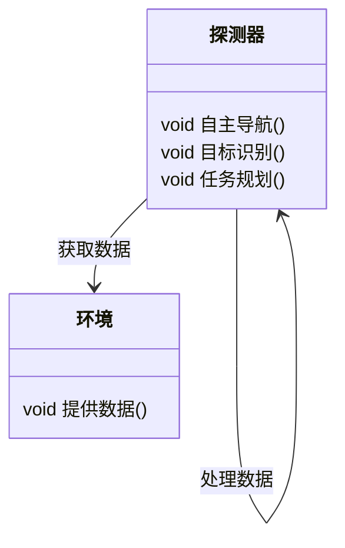
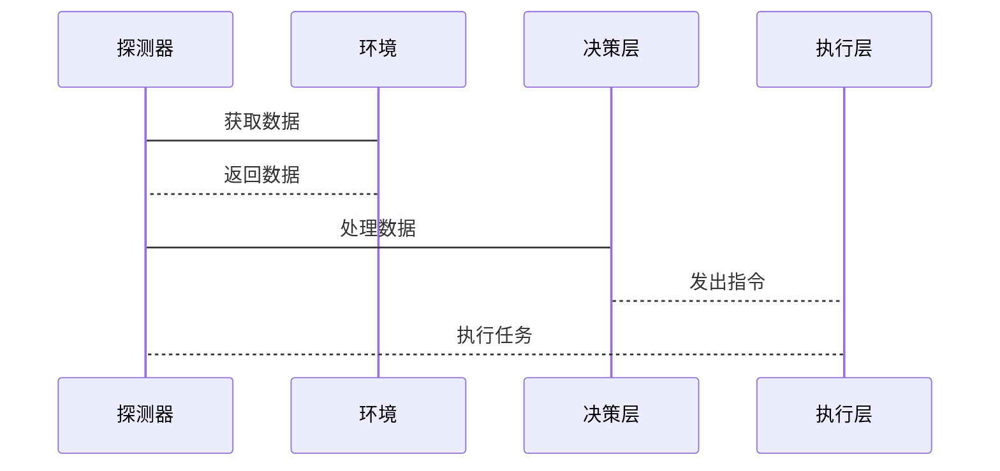

                 


# AI Agent在智能太空探索中的实践

## 关键词：AI Agent、智能太空探索、算法原理、系统架构、项目实战

## 摘要：本文深入探讨了AI Agent在智能太空探索中的应用，从背景介绍、核心概念到算法原理、系统架构，再到项目实战和最佳实践，全面分析了AI Agent在太空探索中的实践价值和实现方法。

---

# 第一部分: AI Agent在智能太空探索中的背景与基础

## 第1章: AI Agent与智能太空探索的背景介绍

### 1.1 AI Agent的基本概念

#### 1.1.1 AI Agent的定义
AI Agent（人工智能代理）是一种能够感知环境、自主决策并执行任务的智能实体。它能够通过传感器获取信息，利用算法进行推理，并通过执行器与环境互动。

#### 1.1.2 AI Agent的特点
AI Agent具有以下几个核心特点：
1. **自主性**：能够在没有外部干预的情况下独立运作。
2. **反应性**：能够实时感知环境并做出响应。
3. **目标导向**：通过设定目标来驱动行为。
4. **学习能力**：能够从经验中学习并优化决策。

#### 1.1.3 AI Agent的核心要素组成
AI Agent主要由以下三个核心要素组成：
1. **感知层**：负责获取环境信息（如传感器数据）。
2. **决策层**：负责对信息进行处理并制定决策。
3. **执行层**：负责执行决策并产生行动。

### 1.2 智能太空探索的背景与需求

#### 1.2.1 太空探索的现状与挑战
太空探索涉及的任务复杂多样，包括行星探测、卫星部署、深空通信等。这些任务通常面临以下挑战：
1. **极端环境**：太空环境严酷，设备需要高度可靠性。
2. **通信延迟**：地球与深空探测器之间的通信延迟可能长达数小时，限制了实时控制的可能性。
3. **任务复杂性**：任务目标可能需要动态调整，传统程序化控制难以应对。

#### 1.2.2 AI Agent在太空探索中的应用价值
AI Agent的引入为太空探索带来了以下价值：
1. **自主决策能力**：能够在通信延迟或完全断开的情况下自主完成任务。
2. **适应性**：能够根据环境变化动态调整任务策略。
3. **高效性**：通过智能算法优化资源利用，提高任务执行效率。

#### 1.2.3 智能太空探索的核心问题与目标
智能太空探索的核心问题包括：
1. **任务规划**：如何制定高效的探测路径和任务序列。
2. **环境感知与识别**：如何准确感知和识别太空环境中的目标。
3. **自主决策与执行**：如何在复杂环境中做出正确决策并执行。

核心目标是通过AI Agent实现探测器的自主导航、目标识别和任务优化。

### 1.3 AI Agent与智能太空探索的结合

#### 1.3.1 AI Agent在太空探索中的应用场景
AI Agent在太空探索中的应用场景包括：
1. **自主导航**：探测器自主规划路径，避开障碍。
2. **目标识别**：通过图像识别技术识别潜在的科学目标。
3. **资源优化**：优化能源使用、通信频次等资源分配。

#### 1.3.2 AI Agent与传统太空探索技术的区别
传统太空探索技术主要依赖预先编写的程序和地面控制，而AI Agent能够实现自主学习和动态调整，具备更强的适应性和灵活性。

#### 1.3.3 AI Agent在智能太空探索中的边界与外延
AI Agent的应用边界在于其感知和决策能力的限制。目前主要应用于中低复杂度任务，而对于极端复杂或高风险任务，仍需结合人类专家的指导。

---

## 第2章: AI Agent的核心概念与原理

### 2.1 AI Agent的核心概念

#### 2.1.1 AI Agent的感知、决策与执行机制
AI Agent通过感知层获取环境信息，经过决策层处理后，通过执行层采取行动。这一过程形成一个闭环系统。

#### 2.1.2 AI Agent的智能决策模型
智能决策模型包括以下步骤：
1. **信息感知**：通过传感器获取数据。
2. **信息处理**：对数据进行分析和理解。
3. **决策制定**：基于分析结果制定行动方案。
4. **行动执行**：通过执行器将决策转化为实际行动。

#### 2.1.3 AI Agent的学习与自适应能力
AI Agent通过强化学习、监督学习等方法不断优化自身的决策模型，提升适应性和执行效率。

### 2.2 AI Agent的核心算法原理

#### 2.2.1 强化学习算法
强化学习是一种通过试错机制优化决策的算法。探测器通过与环境互动，逐步学习最优策略。

**强化学习算法流程图（Mermaid）：**



#### 2.2.2 决策树算法
决策树是一种基于树状结构进行决策的算法，适用于任务规划和路径选择。

**决策树示例（Mermaid）：**



#### 2.2.3 贝叶斯网络
贝叶斯网络用于概率推理，帮助探测器在不确定环境中做出决策。

### 2.3 AI Agent的系统架构

#### 2.3.1 分层架构
分层架构将系统分为感知层、决策层和执行层，各层之间相对独立，便于模块化开发。

**分层架构类图（Mermaid）：**



#### 2.3.2 分布式架构
分布式架构将功能分散到多个节点，通过协同工作提高系统的容错性和扩展性。

**分布式架构架构图（Mermaid）：**



#### 2.3.3 基于事件驱动的架构
基于事件驱动的架构通过处理事件来触发行动，适用于实时响应的场景。

**事件驱动架构序列图（Mermaid）：**



---

## 第3章: AI Agent在智能太空探索中的算法原理

### 3.1 强化学习算法的实现

#### 3.1.1 算法流程
强化学习通过试错机制优化策略，适用于需要动态调整的任务。

**Q-learning算法公式：**

$$ Q(s, a) = r + \gamma \max Q(s', a') $$

其中，\( Q(s, a) \) 表示当前状态下采取行动 \( a \) 的价值，\( r \) 是奖励，\( \gamma \) 是折扣因子，\( s' \) 是下一个状态。

#### 3.1.2 Python代码实现
以下是一个简单的Q-learning实现示例：

```python
import numpy as np

# 初始化Q表
Q = np.zeros([state_space, action_space])
gamma = 0.9  # 折扣因子
alpha = 0.1  # 学习率

def q_learning(state, action, reward, next_state):
    Q[state, action] += alpha * (reward + gamma * np.max(Q[next_state, :]) - Q[state, action])
```

### 3.2 决策树算法的实现

#### 3.2.1 算法流程
决策树通过特征选择构建树状结构，用于分类或回归任务。

**决策树构建流程图（Mermaid）：**



#### 3.2.2 Python代码实现
以下是一个简单的决策树实现示例：

```python
from sklearn.tree import DecisionTreeClassifier

# 初始化决策树模型
model = DecisionTreeClassifier()

# 训练模型
model.fit(X_train, y_train)

# 预测
y_pred = model.predict(X_test)
```

### 3.3 贝叶斯网络的实现

#### 3.3.1 算法流程
贝叶斯网络通过概率推理进行决策，适用于不确定性高的环境。

**贝叶斯网络结构图（Mermaid）：**



#### 3.3.2 Python代码实现
以下是一个简单的贝叶斯网络实现示例：

```python
from sklearn.naive_bayes import GaussianNB

# 初始化贝叶斯模型
model = GaussianNB()

# 训练模型
model.fit(X_train, y_train)

# 预测
y_pred = model.predict(X_test)
```

---

## 第4章: AI Agent在智能太空探索中的系统分析与架构设计

### 4.1 问题场景介绍
以月球探测任务为例，探测器需要自主导航、识别目标并规划路径。

### 4.2 系统功能设计

#### 4.2.1 领域模型（Mermaid类图）：**



### 4.3 系统架构设计

#### 4.3.1 分层架构（Mermaid架构图）：**

```mermaid
graph TD
    A[感知层] --> B[决策层]
    B --> C[执行层]
    C --> A: 反馈
```

#### 4.3.2 系统接口设计
主要接口包括数据输入接口、决策接口和执行接口。

#### 4.3.3 系统交互（Mermaid序列图）：**



---

## 第5章: AI Agent在智能太空探索中的项目实战

### 5.1 环境搭建
需要安装Python、NumPy、scikit-learn等库。

### 5.2 核心实现代码

#### 5.2.1 自主导航模块
```python
import numpy as np

def autonomous_navigation():
    # 模拟传感器数据
    sensor_data = np.random.rand(10)
    # 模拟决策
    decision = np.argmax(sensor_data)
    return decision
```

#### 5.2.2 目标识别模块
```python
from sklearn import tree

def target_recognition(X_train, y_train):
    # 初始化决策树模型
    model = tree.DecisionTreeClassifier()
    # 训练模型
    model.fit(X_train, y_train)
    return model
```

### 5.3 实际案例分析
以月球探测任务为例，展示AI Agent如何实现自主导航和目标识别。

### 5.4 代码应用解读与分析
详细解读上述代码的功能和应用场景。

---

## 第6章: AI Agent在智能太空探索中的最佳实践

### 6.1 最佳实践 Tips
1. **模块化设计**：将系统划分为感知、决策和执行模块，便于维护和扩展。
2. **实时性优化**：在任务规划和决策过程中，尽量减少计算复杂度。
3. **容错性设计**：确保系统在部分模块失效时仍能继续执行任务。

### 6.2 小结
AI Agent通过智能化的感知、决策和执行能力，显著提升了太空探索的效率和能力。

### 6.3 注意事项
1. **数据质量问题**：确保传感器数据的准确性和完整性。
2. **算法选择**：根据具体任务选择合适的算法，避免过度复杂化。
3. **系统安全性**：确保系统在极端条件下仍能稳定运行。

### 6.4 拓展阅读
推荐阅读《强化学习实战》、《机器学习实战》等书籍，深入理解AI Agent的实现细节。

---

## 作者信息

作者：AI天才研究院/AI Genius Institute & 禅与计算机程序设计艺术 /Zen And The Art of Computer Programming

---

# 结语

AI Agent在智能太空探索中的应用前景广阔，通过不断的技术创新和实践积累，未来将能够实现更复杂、更高效的太空探测任务。

