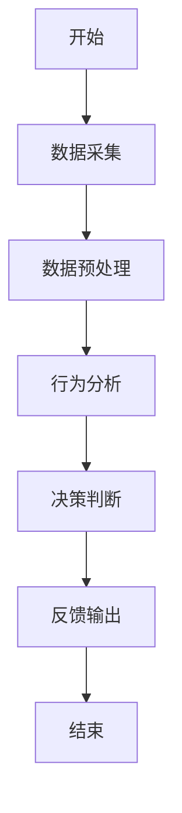
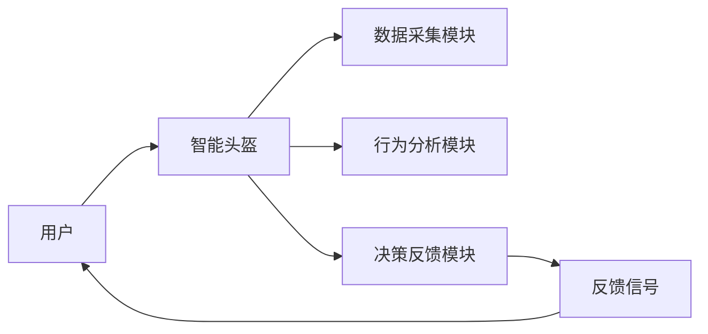
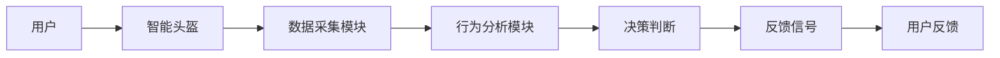

                 


# AI Agent在智能头盔中的运动安全监控

## 关键词：AI Agent, 智能头盔, 运动安全监控, 人工智能, 运动安全

## 摘要：本文详细探讨了AI Agent在智能头盔中的运动安全监控应用，从背景、核心概念、算法原理到系统设计和项目实战，全面解析了AI Agent在运动安全监控中的重要性及实现方式，为运动安全监控提供了新的技术视角和解决方案。

---

# 第1章: AI Agent与智能头盔背景介绍

## 1.1 AI Agent的基本概念

### 1.1.1 AI Agent的定义
AI Agent（人工智能代理）是指能够感知环境、自主决策并采取行动的智能实体。它通过传感器获取信息，利用算法进行分析和推理，并通过执行器对外界产生影响。

### 1.1.2 AI Agent的核心特点
- **自主性**：能够自主决策和行动，无需人工干预。
- **反应性**：能够实时感知环境变化并做出反应。
- **学习能力**：能够通过数据和经验不断优化自身行为。
- **协作性**：能够与其他Agent或系统协同工作。

### 1.1.3 AI Agent与传统AI的区别
AI Agent不仅仅是静态的算法或模型，而是具有动态性和交互性的智能实体，能够根据环境反馈实时调整行为。

## 1.2 智能头盔的基本概念

### 1.2.1 智能头盔的定义
智能头盔是一种集成了多种传感器和智能计算单元的 wearable device，能够实时采集佩戴者的行为数据，并通过AI技术进行分析和反馈。

### 1.2.2 智能头盔的功能特点
- **数据采集**：集成摄像头、加速度计、陀螺仪等多种传感器。
- **实时分析**：通过AI算法对佩戴者的行为进行实时分析。
- **反馈机制**：通过震动、语音等方式向佩戴者提供反馈。

### 1.2.3 智能头盔的应用场景
- **运动安全监控**：如滑雪、足球、自行车等高风险运动。
- **工业安全**：如工人在危险环境中的安全监控。
- **医疗康复**：帮助患者进行康复训练。

## 1.3 运动安全监控的背景与问题

### 1.3.1 运动安全监控的背景
随着运动项目的普及和人们对健康生活的追求，运动安全问题日益受到关注。尤其是在高风险运动中，运动员受伤的风险较高。

### 1.3.2 运动安全监控的主要问题
- **实时性**：传统的安全监控系统通常存在延迟，无法实时提供反馈。
- **准确性**：依赖人工观察的监控方式容易出现误判。
- **便捷性**：传统的监控设备通常笨重，佩戴不便。

### 1.3.3 AI Agent在运动安全监控中的作用
AI Agent能够实时感知运动员的行为，通过分析数据提前发现潜在危险，并通过反馈机制提醒运动员调整行为，从而降低受伤风险。

---

# 第2章: AI Agent的核心概念与原理

## 2.1 AI Agent的核心概念

### 2.1.1 AI Agent的定义与分类
AI Agent可以根据智能水平分为 **反应式AI Agent** 和 **认知式AI Agent**。反应式AI Agent基于当前感知做出反应，而认知式AI Agent则具备更复杂的推理和规划能力。

### 2.1.2 AI Agent的智能模型
AI Agent的智能模型通常包括 **感知层**、**决策层** 和 **执行层**。感知层负责数据采集，决策层负责分析和决策，执行层负责输出结果。

### 2.1.3 AI Agent的行为决策机制
行为决策机制是AI Agent的核心，通常基于 **强化学习** 或 **规则引擎**。强化学习通过不断试错优化决策，而规则引擎则基于预设规则进行判断。

## 2.2 AI Agent与智能头盔的结合

### 2.2.1 AI Agent在智能头盔中的角色
AI Agent在智能头盔中主要负责 **数据处理**、**行为分析** 和 **决策反馈**。它通过传感器数据实时分析佩戴者的运动状态，并根据分析结果提供反馈。

### 2.2.2 智能头盔中AI Agent的功能模块
- **数据采集模块**：负责采集运动数据。
- **行为分析模块**：对数据进行分析，识别异常行为。
- **决策反馈模块**：根据分析结果提供反馈。

### 2.2.3 AI Agent与智能头盔的交互方式
AI Agent与智能头盔的交互通常通过 **传感器数据** 和 **反馈信号** 实现。AI Agent根据传感器数据做出决策，并通过反馈信号指导佩戴者调整行为。

## 2.3 AI Agent的算法原理

### 2.3.1 基于深度学习的AI Agent
深度学习是一种机器学习技术，通过多层神经网络模型进行特征提取和分类。例如，YOLO算法用于目标检测，可以实时识别运动员的姿态。

### 2.3.2 基于强化学习的AI Agent
强化学习是一种通过试错优化决策的算法。AI Agent通过不断尝试不同的动作，学习最优行为策略。

### 2.3.3 基于规则的AI Agent
基于规则的AI Agent通过预设规则进行判断和决策。例如，当检测到运动员的某个动作异常时，触发预警。

## 2.4 本章小结

---

# 第3章: AI Agent在运动安全监控中的应用

## 3.1 运动安全监控的场景分析

### 3.1.1 运动安全监控的主要场景
- **足球**：检测运动员的碰撞和摔倒。
- **滑雪**：监测运动员的速度和姿态。
- **自行车**：识别骑手的危险动作。

### 3.1.2 不同运动项目的安全监控需求
不同运动项目对安全监控的需求有所不同，例如足球需要检测球员之间的碰撞，而滑雪则需要检测运动员的姿态和速度。

### 3.1.3 运动安全监控的挑战
- **实时性**：需要快速响应。
- **准确性**：需要准确识别危险动作。
- **便捷性**：设备需要轻便易戴。

## 3.2 AI Agent在运动安全监控中的核心功能

### 3.2.1 实时监测与预警
AI Agent通过传感器实时监测运动员的运动数据，当检测到潜在危险时，立即发出预警。

### 3.2.2 运动姿态识别与分析
通过深度学习算法，AI Agent能够识别运动员的姿态，并分析其是否符合安全规范。

### 3.2.3 紧急情况下的快速反应
在检测到紧急情况时，AI Agent能够迅速触发反馈机制，例如震动提醒或语音警告。

## 3.3 AI Agent在运动安全监控中的实际案例

### 3.3.1 智能头盔在足球运动中的应用
通过AI Agent实时监测球员的位置和动作，识别潜在的碰撞风险，并通过震动提醒球员调整位置。

### 3.3.2 智能头盔在滑雪运动中的应用
AI Agent通过分析滑雪运动员的姿态和速度，预测可能的摔倒风险，并发出预警。

### 3.3.3 智能头盔在自行车运动中的应用
AI Agent识别骑手的危险动作，例如突然刹车或转向，提醒骑手注意安全。

## 3.4 本章小结

---

# 第4章: AI Agent的算法原理与实现

## 4.1 AI Agent的核心算法

### 4.1.1 基于深度学习的目标检测算法
目标检测算法用于识别运动员的姿态和位置。例如，YOLO算法可以实时检测足球运动员的位置和姿态。

### 4.1.2 基于强化学习的行为决策算法
强化学习用于优化AI Agent的决策策略。例如，通过强化学习训练AI Agent在滑雪运动中做出最优的转向决策。

### 4.1.3 基于规则的应急处理算法
应急处理算法用于在紧急情况下快速做出反应。例如，当检测到运动员可能摔倒时，触发震动提醒。

## 4.2 算法实现的详细步骤

### 4.2.1 数据采集与预处理
- **数据采集**：通过智能头盔中的传感器采集运动数据。
- **数据清洗**：去除噪声数据，提取有效特征。

### 4.2.2 模型训练与优化
- **数据标注**：根据实际场景标注数据。
- **模型训练**：使用深度学习框架（如TensorFlow）训练目标检测和行为识别模型。
- **模型优化**：通过调整超参数优化模型性能。

### 4.2.3 模型部署与测试
- **模型部署**：将训练好的模型部署到智能头盔中。
- **模型测试**：在实际场景中测试模型的准确性和实时性。

## 4.3 算法实现的数学模型与公式

### 4.3.1 目标检测的损失函数公式
目标检测的损失函数通常包括分类损失和定位损失：
$$ \text{总损失} = \lambda_1 \times \text{分类损失} + \lambda_2 \times \text{定位损失} $$

### 4.3.2 行为决策的策略优化公式
强化学习中的策略优化通常基于Q-learning算法：
$$ Q(s, a) = Q(s, a) + \alpha \times (r + \gamma \times \max Q(s', a') - Q(s, a)) $$

### 4.3.3 应急处理的规则逻辑公式
应急处理的规则逻辑可以表示为：
$$ \text{触发条件} = \text{姿态异常} \land \text{速度超过阈值} $$

## 4.4 本章小结

---

# 第5章: 系统分析与架构设计方案

## 5.1 系统功能设计

### 5.1.1 系统功能模块划分
- **数据采集模块**：负责采集运动数据。
- **行为分析模块**：对数据进行分析和识别。
- **决策反馈模块**：根据分析结果发出反馈信号。

### 5.1.2 系统功能流程图


### 5.1.3 系统功能的实现方式
- 数据采集通过传感器完成。
- 行为分析通过深度学习算法实现。
- 决策判断基于预设规则或强化学习模型。

## 5.2 系统架构设计

### 5.2.1 系统架构图


### 5.2.2 系统接口设计
- **输入接口**：传感器数据接口。
- **输出接口**：震动反馈和语音反馈接口。

### 5.2.3 系统交互流程图


## 5.3 本章小结

---

# 第6章: 项目实战

## 6.1 环境安装

### 6.1.1 开发环境
- **操作系统**：Windows 10 或更高版本。
- **开发工具**：Python 3.8+，TensorFlow 2.0+，OpenCV 4.0+。

### 6.1.2 传感器安装
- 使用加速度计和陀螺仪传感器。
- 安装必要的驱动程序。

## 6.2 系统核心实现源代码

### 6.2.1 数据采集模块
```python
import numpy as np

def collect_data():
    # 模拟传感器数据采集
    data = np.random.randn(100, 3)  # 假设采集100个数据点，每个数据点有3个特征
    return data
```

### 6.2.2 行为分析模块
```python
import tensorflow as tf
from tensorflow.keras import layers

def build_model():
    model = tf.keras.Sequential()
    model.add(layers.Dense(64, activation='relu', input_shape=(3,)))
    model.add(layers.Dense(1, activation='sigmoid'))
    model.compile(optimizer='adam', loss='binary_crossentropy')
    return model
```

### 6.2.3 决策反馈模块
```python
def feedback_system():
    # 模拟反馈机制
    feedback = "调整姿态"  # 根据模型预测结果发出反馈
    return feedback
```

## 6.3 代码应用解读与分析
- **数据采集模块**：通过传感器采集运动员的运动数据。
- **行为分析模块**：使用深度学习模型对数据进行分类和识别。
- **决策反馈模块**：根据分析结果发出反馈信号。

## 6.4 实际案例分析
- **案例1**：足球运动员的碰撞检测。
- **案例2**：滑雪运动员的姿态识别。

## 6.5 项目小结

---

# 第7章: 总结与展望

## 7.1 本章小结
本文详细探讨了AI Agent在智能头盔中的运动安全监控应用，从背景、核心概念、算法原理到系统设计和项目实战，全面解析了AI Agent在运动安全监控中的重要性及实现方式。

## 7.2 未来展望
未来，随着AI技术的不断发展，AI Agent在运动安全监控中的应用将更加广泛和智能化。例如，结合5G技术实现更快速的数据传输和反馈。

---

# 作者：AI天才研究院/AI Genius Institute & 禅与计算机程序设计艺术 /Zen And The Art of Computer Programming

---

**感谢您的阅读！**

