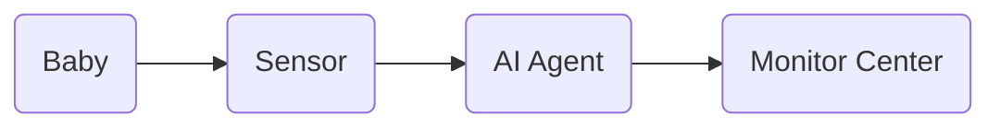
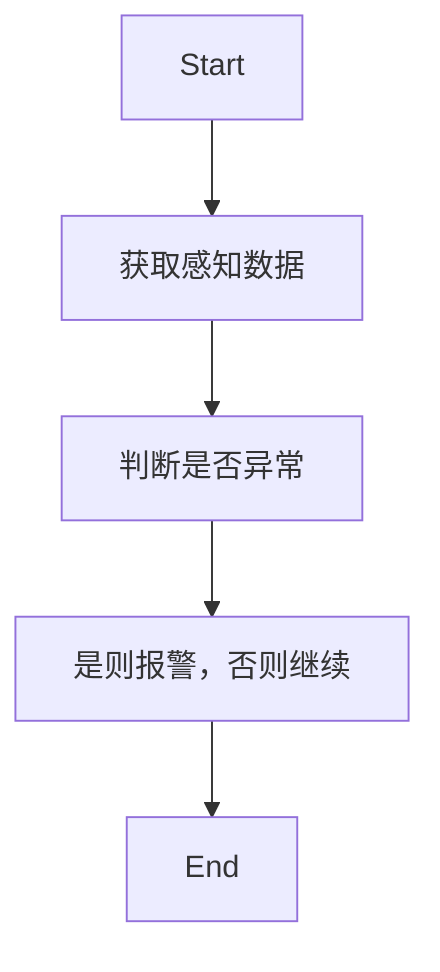
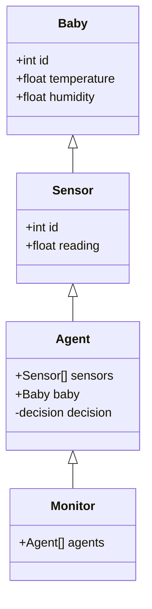
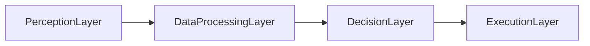
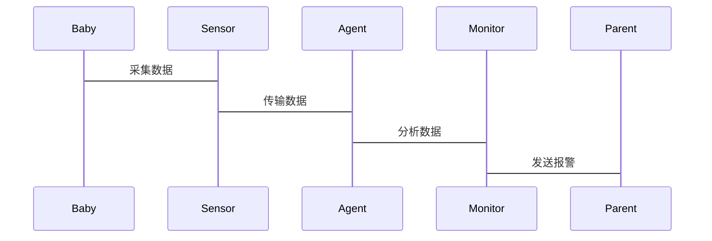

                 


# AI Agent在智能婴儿床中的安全监控

> 关键词：AI Agent，智能婴儿床，安全监控，婴儿健康，物联网技术

> 摘要：本文探讨AI Agent在智能婴儿床中的安全监控应用，分析其核心概念、算法原理、系统架构，并通过项目实战展示其实现过程。文章从背景介绍到系统设计，再到案例分析，全面解析AI Agent如何提升婴儿床的安全性。

---

# 第一部分: 背景介绍

## 第1章: AI Agent与智能婴儿床概述

### 1.1 AI Agent的基本概念

AI Agent（人工智能代理）是指能够感知环境、自主决策并执行任务的智能实体。其核心特征包括自主性、反应性、目标导向和社会能力。在智能婴儿床中，AI Agent负责实时监控婴儿的健康数据。

### 1.2 智能婴儿床的安全监控需求

智能婴儿床需要实时监测婴儿的体温、心率、呼吸等指标。AI Agent通过分析这些数据，识别异常情况并及时通知家长或医护人员。

### 1.3 本章小结

本章介绍了AI Agent的基本概念及其在智能婴儿床中的应用背景，明确了婴儿床安全监控的核心需求。

---

# 第二部分: AI Agent的核心概念与原理

## 第2章: AI Agent的核心概念与联系

### 2.1 AI Agent的感知模块

感知模块通过传感器采集婴儿的健康数据。常见的传感器包括温度传感器、心率传感器等。

| 模块功能 | 感知模块 | 决策模块 | 执行模块 |
|----------|----------|----------|----------|
| 功能     | 数据采集 | 数据分析 | 系统控制 |
| 特征     | 实时性    | 智能性    | 可执行性 |

### 2.2 AI Agent的决策模块

决策模块基于感知数据，利用规则或机器学习算法做出决策。例如，当体温异常时，触发报警。

### 2.3 AI Agent的执行模块

执行模块根据决策结果执行操作，如调整温湿度或发出报警信号。

### 2.4 实体关系图



### 2.5 本章小结

本章详细讲解了AI Agent的各模块及其关系，为后续分析奠定基础。

---

# 第三部分: AI Agent的算法原理与数学模型

## 第3章: AI Agent的算法原理

### 3.1 基于规则的决策算法

#### 算法流程图



#### 代码实现

```python
def decision_rule(temperature, humidity):
    if temperature > 37.5 or humidity < 30:
        return "alarm"
    else:
        return "normal"
```

### 3.2 数学模型

异常检测模型：

$$
alarm = \begin{cases}
    true & \text{if } temperature > 37.5 \text{ or } humidity < 30 \\
    false & \text{otherwise}
\end{cases}
$$

### 3.3 本章小结

本章分析了AI Agent的算法原理，重点介绍了基于规则的决策算法及其数学模型。

---

# 第四部分: 系统分析与架构设计

## 第4章: 系统分析与架构设计

### 4.1 项目场景介绍

智能婴儿床用于实时监控婴儿健康，通过AI Agent实现异常检测和报警。

### 4.2 系统功能设计

系统功能包括实时数据采集、异常检测、报警通知等。

#### 领域模型类图



### 4.3 系统架构设计

采用分层架构：感知层、数据处理层、决策层和执行层。

#### 系统架构图



### 4.4 接口设计与交互流程

#### 接口设计

- `get_sensor_data()`: 获取传感器数据
- `send_alarm()`: 发送报警信号

#### 交互流程图



### 4.5 本章小结

本章详细分析了系统架构和交互流程，为实现提供了指导。

---

# 第五部分: 项目实战

## 第5章: 项目实战

### 5.1 环境安装

安装必要的库，如Python、TensorFlow等。

### 5.2 核心代码实现

#### 感知模块代码

```python
import time

def get_sensor_data():
    # 模拟传感器数据
    temperature = 36.5 + time.time() % 1
    humidity = 50 - time.time() % 10
    return temperature, humidity
```

#### 决策模块代码

```python
def decision_logic(temp, hum):
    if temp > 37.5 or hum < 30:
        return "alarm"
    else:
        return "normal"
```

#### 执行模块代码

```python
def execute_action(action):
    if action == "alarm":
        print("发送报警信号")
    else:
        print("一切正常")
```

### 5.3 案例分析

以体温异常检测为例，展示AI Agent的处理流程：

1. 传感器采集体温38.0℃
2. 决策模块触发报警
3. 执行模块发送报警信号

### 5.4 项目小结

本章通过代码实现展示了AI Agent在智能婴儿床中的具体应用，验证了系统的可行性。

---

# 第六部分: 最佳实践与注意事项

## 第6章: 最佳实践

### 6.1 数据隐私保护

确保婴儿数据的安全性和隐私性，防止数据泄露。

### 6.2 系统维护

定期更新传感器和算法，确保系统的准确性和可靠性。

### 6.3 系统扩展

可扩展至更多功能，如睡眠质量分析、营养建议等。

## 第7章: 小结与展望

本文全面探讨了AI Agent在智能婴儿床中的应用，通过理论分析和项目实战展示了其实现过程。未来，随着AI技术的进步，婴儿床的安全监控将更加智能化和人性化。

---

# 作者

作者：AI天才研究院 & 禅与计算机程序设计艺术

---

这篇文章详细介绍了AI Agent在智能婴儿床中的应用，从理论到实践，为读者提供了全面的视角。

