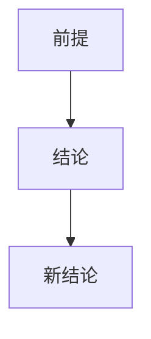
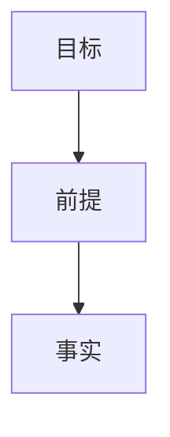
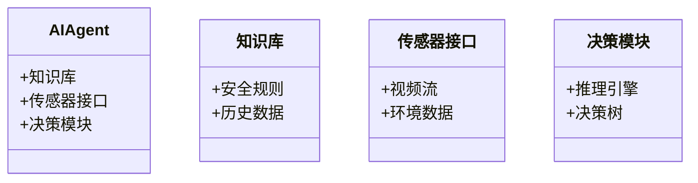
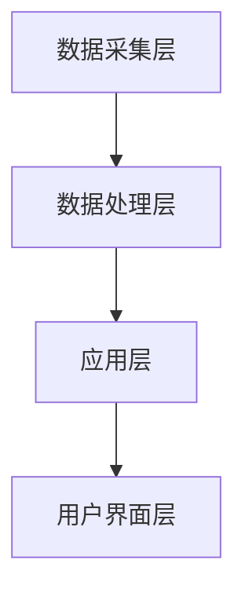

                 


# AI Agent在智能安防系统中的角色

> **关键词**：AI Agent，智能安防系统，知识表示，推理算法，多智能体协作，系统架构设计，算法优化  
> **摘要**：本文探讨AI Agent在智能安防系统中的核心角色，涵盖其基本概念、算法原理、系统设计、项目实战及最佳实践。通过详细的技术分析和实际案例，展示AI Agent如何提升智能安防系统的效率与智能性。

---

## 第1章: AI Agent的基本概念与背景

### 1.1 AI Agent的定义与特点

#### 1.1.1 AI Agent的定义  
AI Agent（人工智能代理）是一种智能体，能够感知环境、自主决策并执行任务。它通过传感器获取数据，利用知识库进行推理，做出决策并执行动作。

#### 1.1.2 AI Agent的核心特点  
- **自主性**：无需外部干预，自主决策。  
- **反应性**：实时感知环境变化并做出响应。  
- **知识性**：依赖知识库进行推理和决策。  
- **协作性**：与其他智能体或系统协同工作。  

#### 1.1.3 AI Agent与传统安防系统的区别  
传统安防系统依赖人工监控和简单规则，而AI Agent具备自主学习、推理和协作能力，能够处理复杂场景。

---

### 1.2 AI Agent在智能安防中的应用背景

#### 1.2.1 智能安防系统的概念  
智能安防系统是结合AI、大数据和物联网技术的综合系统，用于监控、预警和处理安全事件。

#### 1.2.2 AI Agent在智能安防中的作用  
AI Agent在智能安防中负责实时监控、异常检测、事件处理和决策优化。

#### 1.2.3 智能安防系统的演变历程  
从传统安防到AI Agent的引入，智能安防系统逐步实现了从被动响应到主动决策的转变。

---

## 第2章: AI Agent的核心概念与原理

### 2.1 AI Agent的核心概念

#### 2.1.1 知识表示与推理  
知识表示是AI Agent进行推理的基础，常用逻辑推理和概率推理方法。

#### 2.1.2 行为决策机制  
基于知识推理的结果，AI Agent通过决策树或策略网络做出最优决策。

#### 2.1.3 多智能体协作  
AI Agent在智能安防中通常需要与多个智能体协作，共同完成任务。

---

### 2.2 AI Agent的算法原理

#### 2.2.1 知识表示的数学模型  
使用概率论和逻辑推理模型表示知识，例如贝叶斯网络和一阶逻辑。

#### 2.2.2 推理算法的实现  
- **前向链推理**：从已知事实推导结论。  
- **后向链推理**：从目标反向推导前提。  

#### 2.2.3 决策树的构建与优化  
通过ID3算法构建决策树，并使用剪枝技术优化模型。

---

## 第3章: AI Agent的算法实现与数学模型

### 3.1 知识表示的数学模型

#### 3.1.1 基于概率的推理公式  
$$ P(A|B) = \frac{P(B|A)P(A)}{P(B)} $$  

#### 3.1.2 基于逻辑的推理规则  
$$ A \rightarrow B \quad \text{和} \quad B \rightarrow C \quad \Rightarrow \quad A \rightarrow C $$  

---

### 3.2 推理算法的实现

#### 3.2.1 前向链推理  


#### 3.2.2 后向链推理  


---

## 第4章: 系统分析与架构设计

### 4.1 系统功能设计

#### 4.1.1 领域模型设计  


---

### 4.2 系统架构设计

#### 4.2.1 分层架构  


---

## 第5章: 项目实战

### 5.1 环境安装

#### 5.1.1 安装Python与TensorFlow  
```bash
pip install numpy
pip install tensorflow
pip install matplotlib
```

#### 5.1.2 安装OpenCV与Pillow  
```bash
pip install opencv-python
pip install Pillow
```

---

### 5.2 核心代码实现

#### 5.2.1 推理引擎实现  
```python
import numpy as np

def forward_propagate(input, weights):
    return np.dot(input, weights)

def backward_propagate(output_error, weights):
    return np.dot(output_error, weights.T)

# 示例输入和权重
input = np.array([1, 2, 3])
weights = np.array([0.1, 0.2, 0.3])

output = forward_propagate(input, weights)
print("输出:", output)

# 反向传播
output_error = np.array([0.1, 0.2])
updated_weights = backward_propagate(output_error, weights)
print("更新后的权重:", updated_weights)
```

---

## 第6章: 最佳实践与小结

### 6.1 小结  
AI Agent在智能安防系统中扮演着关键角色，通过知识表示、推理和决策优化系统性能。

### 6.2 注意事项  
- 确保知识库的准确性和及时更新。  
- 优化算法以提高推理效率。  
- 处理多智能体协作中的同步问题。  

### 6.3 拓展阅读  
建议深入学习强化学习和多智能体协作算法，以进一步提升AI Agent的能力。

---

**作者**：AI天才研究院（AI Genius Institute） & 禅与计算机程序设计艺术（Zen And The Art of Computer Programming）

