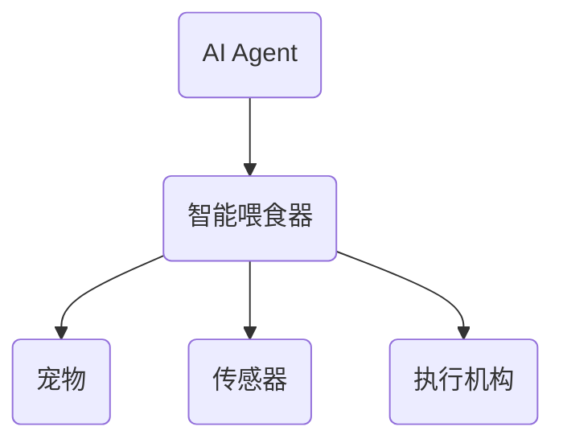
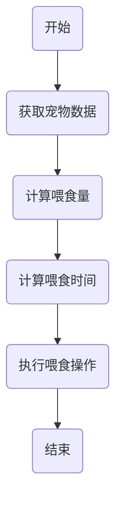
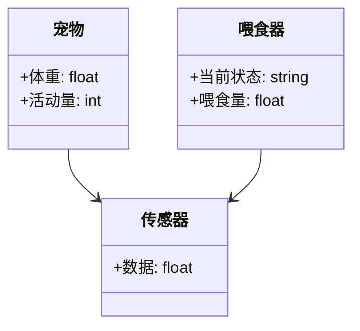
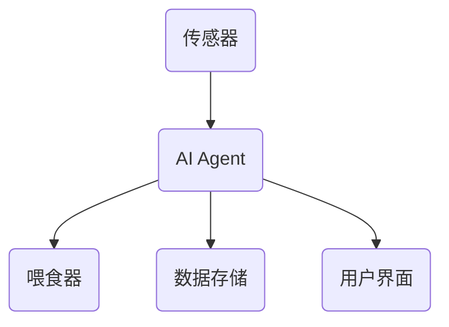
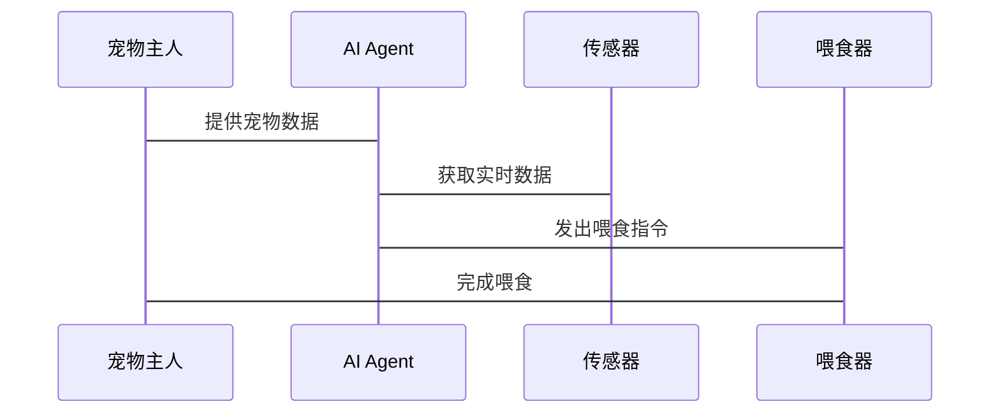

                 


# AI Agent在智能宠物喂食器中的定量控制

> 关键词：AI Agent，智能宠物喂食器，定量控制，宠物健康管理，传感器数据，机器学习算法，智能硬件

> 摘要：本文详细探讨了AI Agent在智能宠物喂食器中的定量控制应用。通过分析宠物喂食的精准控制需求，结合AI Agent的核心原理，阐述了如何利用传感器数据、机器学习算法和系统架构设计，实现智能喂食器的精准定量控制。本文还提供了具体的算法实现流程和系统架构设计，并通过实际案例分析，展示了AI Agent在智能宠物喂食器中的实际应用价值。

---

# 第一部分: AI Agent在智能宠物喂食器中的定量控制概述

## 第1章: 问题背景与需求分析

### 1.1 问题背景

#### 1.1.1 宠物喂食器的传统喂食方式
传统的宠物喂食器通常采用定时定量的机械结构，虽然能够满足基本的喂食需求，但存在以下问题：
- 喂食量固定，无法根据宠物的体重、活动量或健康状况进行调整。
- 缺乏对宠物行为的实时感知和反馈，无法应对突发情况（如宠物生病或食欲不振）。
- 无法与其他智能设备联动，难以实现智能化管理。

#### 1.1.2 AI技术在宠物喂食中的应用潜力
随着AI技术的快速发展，AI Agent（人工智能代理）能够通过传感器数据、历史记录和实时反馈，实现对宠物喂食的智能化管理。AI Agent的核心优势在于其自主决策和学习能力，能够根据宠物的具体需求动态调整喂食策略。

#### 1.1.3 定量控制的重要性与挑战
定量控制是智能宠物喂食器的核心功能，其重要性体现在以下方面：
- 确保宠物的健康与营养均衡。
- 提高宠物主人的喂养效率。
- 通过数据积累优化喂食计划。

实现定量控制的挑战包括：
- 如何准确感知宠物的行为和生理需求。
- 如何处理多源异构的传感器数据。
- 如何设计高效的决策算法。

### 1.2 问题描述

#### 1.2.1 宠物喂食的精准控制需求
宠物喂食的精准控制需要考虑以下因素：
- 宠物的体重和年龄。
- 宠物的活动量和健康状况。
- 宠物的饮食偏好。

#### 1.2.2 现有喂食器的局限性
现有喂食器的主要局限性包括：
- 喂食量固定，无法动态调整。
- 缺乏对宠物行为的实时感知。
- 无法与其他智能设备联动。

#### 1.2.3 AI Agent在解决喂食问题中的作用
AI Agent可以通过以下方式解决喂食问题：
- 实时感知宠物的行为和生理需求。
- 动态调整喂食量和喂食时间。
- 与其他智能设备联动，实现智能化管理。

### 1.3 问题解决与边界

#### 1.3.1 AI Agent在喂食控制中的解决方案
AI Agent通过以下步骤实现喂食控制：
1. 收集传感器数据（如宠物的体重、活动量等）。
2. 分析数据，生成喂食计划。
3. 根据实时反馈调整喂食策略。

#### 1.3.2 系统边界与功能范围
系统的边界包括：
- 系统输入：宠物体重、活动量、健康数据。
- 系统输出：喂食量、喂食时间。
- 系统功能：实时监测、动态调整、数据记录。

#### 1.3.3 系统的外延与扩展性
系统可以通过以下方式扩展：
- 增加更多传感器（如心率传感器）。
- 支持更多宠物品种。
- 提供更多喂食计划选项。

### 1.4 核心概念与结构

#### 1.4.1 AI Agent的定义与核心要素
AI Agent是一种能够感知环境、自主决策并执行任务的智能体。其核心要素包括：
- 感知能力：通过传感器获取数据。
- 决策能力：基于数据生成决策。
- 执行能力：通过执行机构实现决策。

#### 1.4.2 智能宠物喂食器的系统架构
智能宠物喂食器的系统架构包括：
- 传感器模块：负责收集数据。
- AI Agent模块：负责数据处理和决策。
- 执行机构：负责执行喂食操作。

#### 1.4.3 定量控制的实现逻辑
定量控制的实现逻辑包括：
1. 收集宠物数据（体重、活动量）。
2. 通过AI算法计算喂食量。
3. 根据实时反馈调整喂食量。

---

## 第2章: AI Agent的核心概念与原理

### 2.1 AI Agent的基本原理

#### 2.1.1 AI Agent的定义与分类
AI Agent可以分为以下几类：
- 简单反射式Agent：基于规则进行决策。
- 基于模型的反射式Agent：基于模型进行决策。
- 基于学习的Agent：通过学习优化决策。

#### 2.1.2 基于AI Agent的决策机制
AI Agent的决策机制包括：
- 规则引擎：基于预定义规则进行决策。
- 机器学习模型：基于历史数据进行预测。
- 强化学习模型：通过试错优化决策。

#### 2.1.3 AI Agent在智能喂食器中的应用特点
在智能喂食器中，AI Agent的应用特点包括：
- 实时性：能够快速响应宠物的需求。
- 自适应性：能够根据数据动态调整喂食策略。
- 可扩展性：能够与其他智能设备联动。

### 2.2 智能宠物喂食器的系统模型

#### 2.2.1 系统输入与输出
系统输入包括：
- 宠物体重（kg）。
- 宠物活动量（步数/分钟）。
- 宠物健康数据（如心率）。

系统输出包括：
- 喂食量（g）。
- 喂食时间（分钟）。

#### 2.2.2 系统状态与动作
系统状态包括：
- 正常状态：喂食器正常运行。
- 异常状态：传感器故障或喂食器故障。

系统动作包括：
- 开始喂食。
- 停止喂食。
- 发出警报。

#### 2.2.3 系统与环境的交互
系统与环境的交互包括：
- 通过传感器感知环境（宠物行为）。
- 通过执行机构影响环境（喂食）。
- 通过数据接口与外部系统交互（如智能家居系统）。

### 2.3 AI Agent与智能喂食器的实体关系



---

## 第3章: 系统算法与数学模型

### 3.1 AI Agent的决策算法

#### 3.1.1 基于规则的决策算法
基于规则的决策算法适用于简单的场景，例如：
- 如果宠物体重 > 5kg，则喂食量 = 50g。
- 如果宠物体重 ≤ 5kg，则喂食量 = 30g。

#### 3.1.2 基于机器学习的决策算法
基于机器学习的决策算法适用于复杂的场景，例如：
- 使用回归模型预测宠物的每日所需热量。
- 使用分类模型判断宠物的健康状态。

#### 3.1.3 基于强化学习的决策算法
基于强化学习的决策算法适用于需要优化的场景，例如：
- 通过试错优化喂食量。
- 通过奖励机制优化喂食时间。

### 3.2 定量控制的数学模型

#### 3.2.1 喂食量的计算公式
$$ 喂食量 = \text{宠物体重} \times \text{每日所需热量} / \text{每克食物热量} $$

#### 3.2.2 时间间隔的计算公式
$$ 时间间隔 = \text{喂食次数} / \text{每日喂食次数} $$

### 3.3 算法实现流程



---

## 第4章: 系统分析与架构设计

### 4.1 系统分析

#### 4.1.1 项目场景介绍
项目场景包括：
- 宠物主人希望实现智能化喂食。
- 宠物需要根据体重和活动量动态调整喂食量。
- 系统需要与其他智能设备联动。

#### 4.1.2 系统功能设计
系统功能包括：
- 数据采集：收集宠物体重、活动量等数据。
- 数据处理：计算喂食量和喂食时间。
- 系统控制：执行喂食操作。

### 4.2 系统架构设计

#### 4.2.1 领域模型类图



#### 4.2.2 系统架构图



#### 4.2.3 系统接口设计
系统接口包括：
- 传感器接口：向AI Agent发送数据。
- 喂食器接口：接收AI Agent的控制指令。
- 用户界面接口：显示喂食计划和状态。

#### 4.2.4 系统交互序列图



---

## 第5章: 项目实战

### 5.1 环境安装

#### 5.1.1 硬件环境
硬件环境包括：
- 微处理器（如Raspberry Pi）。
- 传感器模块（如重量传感器）。
- 执行机构（如电机）。

#### 5.1.2 软件环境
软件环境包括：
- Python编程语言。
- 机器学习框架（如TensorFlow）。
- 数据库（如MySQL）。

### 5.2 核心代码实现

#### 5.2.1 数据采集代码

```python
import RPi.GPIO as GPIO
import time

def read_sensor():
    # 传感器读取数据
    weight =  # 获取宠物体重
    activity =  # 获取宠物活动量
    return weight, activity
```

#### 5.2.2 算法实现代码

```python
def calculate_feeding(weight, activity):
    # 计算喂食量
    base_feeding = 30  # 基础喂食量
    additional_feeding = weight * 0.5  # 根据体重调整
    total_feeding = base_feeding + additional_feeding
    return total_feeding
```

#### 5.2.3 系统控制代码

```python
def control_feeder(feeding_amount):
    # 控制喂食器执行喂食操作
    GPIO.output(feeder_motor_pin, feeding_amount)
```

### 5.3 案例分析与实现解读

#### 5.3.1 实际案例
实际案例包括：
- 宠物体重为5kg，活动量为100步/分钟。
- 喂食量计算为50g，喂食时间为5分钟。

#### 5.3.2 代码应用解读
代码应用解读包括：
- 数据采集模块：通过传感器获取宠物体重和活动量。
- 算法模块：根据体重和活动量计算喂食量。
- 系统控制模块：根据计算结果控制喂食器执行喂食操作。

### 5.4 项目小结
项目小结包括：
- 通过AI Agent实现了智能宠物喂食器的定量控制。
- 系统能够根据宠物的体重和活动量动态调整喂食量。
- 系统具有良好的扩展性和可维护性。

---

## 第6章: 最佳实践与总结

### 6.1 最佳实践

#### 6.1.1 数据采集的准确性
数据采集的准确性是系统的核心，建议使用高精度传感器。

#### 6.1.2 算法的可解释性
算法的可解释性是系统的重要特性，建议采用易于解释的规则引擎。

#### 6.1.3 系统的安全性
系统的安全性是系统的重要保障，建议采用多层防护机制。

### 6.2 小结

#### 6.2.1 核心收获
通过本项目，我们掌握了AI Agent在智能宠物喂食器中的应用方法。

#### 6.2.2 系统架构的设计思路
系统架构的设计思路包括：
- 明确系统功能需求。
- 设计合理的系统架构。
- 实现高效的系统控制。

### 6.3 注意事项

#### 6.3.1 数据安全
数据安全是系统的重要保障，建议采取数据加密措施。

#### 6.3.2 系统维护
系统的维护是系统长期运行的重要保障，建议定期检查和维护。

### 6.4 拓展阅读

#### 6.4.1 AI在宠物健康管理中的应用
AI在宠物健康管理中的应用包括：
- 宠物疾病预测。
- 宠物行为分析。
- 宠物健康管理。

#### 6.4.2 智能硬件的发展趋势
智能硬件的发展趋势包括：
- 更高的智能化。
- 更强的互联性。
- 更多的功能扩展。

---

# 作者

作者：AI天才研究院/AI Genius Institute & 禅与计算机程序设计艺术 /Zen And The Art of Computer Programming

