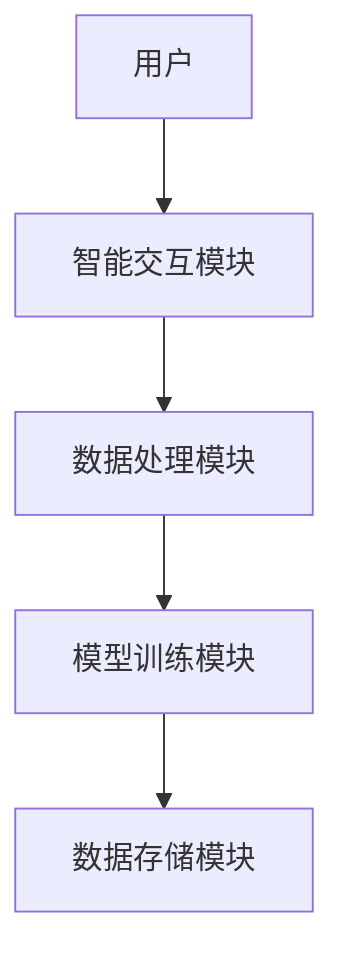

                 


# AI Agent在智能客户关系管理中的作用

> **关键词**：AI Agent，智能CRM，客户关系管理，人工智能，机器学习  
> **摘要**：随着人工智能技术的快速发展，AI Agent（人工智能代理）在客户关系管理（CRM）中的应用越来越广泛。本文将深入探讨AI Agent在智能CRM中的作用，涵盖其核心概念、技术原理、系统架构设计以及实际项目实现。通过分析AI Agent如何提升CRM的智能化水平，本文旨在为读者提供一个全面的技术视角，帮助他们在实际应用中更好地利用AI Agent技术。

---

## 第1章: AI Agent与智能客户关系管理的背景

### 1.1 AI Agent的基本概念

#### 1.1.1 AI Agent的定义
AI Agent（人工智能代理）是指能够感知环境、自主决策并执行任务的智能实体。它可以理解为一种软件或系统，通过算法和数据驱动的方式，模仿人类的决策过程，实现自动化和智能化的任务处理。

#### 1.1.2 AI Agent的核心特征
- **自主性**：AI Agent能够在没有人工干预的情况下独立执行任务。
- **反应性**：能够实时感知环境变化并做出相应调整。
- **目标导向**：基于预设目标或学习到的目标，优化决策和行动。
- **学习能力**：通过数据和经验不断优化自身的算法和模型。

#### 1.1.3 AI Agent的类型
- **基于规则的AI Agent**：通过预定义的规则和逻辑进行决策。
- **基于机器学习的AI Agent**：利用机器学习算法从数据中学习规律和模式。
- **基于自然语言处理的AI Agent**：能够理解和生成自然语言，与用户进行交互。

### 1.2 智能客户关系管理的背景与需求

#### 1.2.1 客户关系管理（CRM）的定义与目标
CRM（Customer Relationship Management）是指企业通过管理与客户之间的关系，提升客户满意度和忠诚度，从而实现业务目标的一种管理方式。其核心目标是通过客户数据的收集、分析和利用，优化企业的销售、营销和服务流程。

#### 1.2.2 智能化CRM的发展趋势
随着大数据和人工智能技术的快速发展，CRM系统逐渐从传统的数据管理工具向智能化方向演进。智能化CRM能够通过AI技术实现客户行为预测、个性化推荐和自动化服务，从而提升客户体验和企业效率。

#### 1.2.3 AI Agent在CRM中的应用价值
- **提升客户体验**：通过智能化的交互和服务，提供个性化的客户体验。
- **提高运营效率**：自动化处理重复性任务，减少人工干预。
- **数据驱动的决策支持**：通过分析大量数据，提供精准的决策支持。

### 1.3 AI Agent在智能CRM中的作用

#### 1.3.1 提升客户体验
AI Agent能够通过自然语言处理和机器学习技术，实现与客户的智能交互，提供个性化的服务和建议，从而提升客户满意度和忠诚度。

#### 1.3.2 提高运营效率
AI Agent能够自动化处理大量的客户数据和请求，减少人工干预，提高CRM系统的处理效率。

#### 1.3.3 数据驱动的决策支持
通过分析客户数据和行为模式，AI Agent能够为企业提供精准的市场洞察和决策支持，帮助企业优化资源配置和业务流程。

## 第2章: AI Agent的核心概念与技术原理

### 2.1 AI Agent的核心技术

#### 2.1.1 机器学习
机器学习是AI Agent的核心技术之一。通过监督学习、无监督学习和强化学习等方法，AI Agent能够从数据中学习规律和模式，从而做出智能决策。

#### 2.1.2 自然语言处理
自然语言处理（NLP）技术使得AI Agent能够理解和生成自然语言，实现与客户的智能交互。NLP技术包括文本解析、情感分析和意图识别等。

#### 2.1.3 强化学习
强化学习是一种通过试错机制优化决策的机器学习方法。AI Agent可以通过强化学习不断优化其决策策略，以实现目标。

### 2.2 AI Agent的工作原理

#### 2.2.1 信息感知与数据收集
AI Agent通过传感器、API或其他数据源获取环境中的信息，并将其转化为可处理的数据。

#### 2.2.2 智能决策与行动
AI Agent基于收集到的数据，通过算法和模型进行分析和决策，并执行相应的行动。

#### 2.2.3 人机交互与反馈优化
AI Agent通过与用户或系统的交互，获取反馈信息，并根据反馈优化自身的算法和模型。

### 2.3 AI Agent与CRM系统的集成

#### 2.3.1 CRM系统的核心功能模块
- **客户信息管理**：存储和管理客户的详细信息。
- **销售自动化**：自动化处理销售流程。
- **营销自动化**：自动化执行营销活动。
- **客户支持**：提供客户支持和服务。

#### 2.3.2 AI Agent在CRM中的功能定位
AI Agent作为CRM系统的一部分，负责处理客户交互、数据分析和智能决策等任务。

#### 2.3.3 AI Agent与CRM系统的交互流程
1. **数据收集**：通过API或其他方式获取客户数据。
2. **数据分析**：利用机器学习算法分析客户行为和偏好。
3. **智能决策**：基于分析结果，生成决策建议。
4. **执行行动**：根据决策结果执行相应的操作，如发送邮件或调整销售策略。

### 2.4 本章小结

---

## 第3章: AI Agent的算法原理与数学模型

### 3.1 机器学习算法

#### 3.1.1 监督学习
监督学习是一种通过标记数据训练模型的方法。常用算法包括线性回归、支持向量机（SVM）和随机森林等。

#### 3.1.2 无监督学习
无监督学习用于从无标记数据中发现模式和结构。常用算法包括聚类（K-means）和主题模型（LDA）。

#### 3.1.3 强化学习
强化学习通过试错机制优化决策。常用算法包括Q-learning和Deep Q-Networks（DQN）。

### 3.2 自然语言处理算法

#### 3.2.1 文本解析
文本解析是将自然语言文本转化为结构化数据的过程。常用技术包括分词、句法分析和实体识别。

#### 3.2.2 情感分析
情感分析用于判断文本中表达的情感倾向。常用算法包括基于词袋模型的分类和深度学习模型（如LSTM）。

#### 3.2.3 意图识别
意图识别旨在理解文本背后的目标和意图。常用方法包括规则匹配和基于机器学习的意图分类。

### 3.3 数学模型与公式

#### 3.3.1 机器学习模型的数学表示
以线性回归为例，其数学模型可以表示为：
$$ y = \theta_0 + \theta_1x + \epsilon $$
其中，$y$ 是目标变量，$x$ 是自变量，$\theta_0$ 和 $\theta_1$ 是模型参数，$\epsilon$ 是误差项。

#### 3.3.2 深度学习模型的数学表示
以卷积神经网络（CNN）为例，其数学表示包括卷积层、池化层和全连接层的组合。例如，一个简单的CNN模型可以表示为：
$$ y = f(W_k * x + b) $$
其中，$W_k$ 是卷积核，$x$ 是输入数据，$b$ 是偏置项，$f$ 是激活函数。

### 3.4 本章小结

---

## 第4章: AI Agent的系统架构设计与实现

### 4.1 系统需求分析

#### 4.1.1 功能需求
- **客户信息管理**：支持客户信息的录入、查询和修改。
- **智能交互**：支持自然语言交互和智能推荐。
- **数据分析**：提供数据可视化和预测分析功能。

#### 4.1.2 性能需求
- **响应时间**：系统需在合理时间内完成任务。
- **扩展性**：系统需支持数据和功能的扩展。

### 4.2 系统架构设计

#### 4.2.1 模块划分
- **数据采集模块**：负责采集客户数据。
- **数据处理模块**：对数据进行清洗和预处理。
- **模型训练模块**：训练机器学习模型。
- **智能交互模块**：实现与客户的智能交互。

#### 4.2.2 系统架构图


### 4.3 接口设计

#### 4.3.1 API接口设计
- **GET /customers**：获取客户列表。
- **POST /recommendations**：生成推荐列表。
- **PUT /update_customer**：更新客户信息。

#### 4.3.2 接口实现
使用RESTful API设计接口，并通过JSON格式传递数据。

### 4.4 本章小结

---

## 第5章: AI Agent的项目实战

### 5.1 项目背景与目标

#### 5.1.1 项目背景
本项目旨在开发一个基于AI Agent的智能CRM系统，实现客户交互、数据分析和智能推荐功能。

#### 5.1.2 项目目标
- 实现客户信息管理功能。
- 实现自然语言交互功能。
- 实现客户行为预测和推荐功能。

### 5.2 环境搭建

#### 5.2.1 安装Python
安装Python 3.8以上版本，并安装必要的库，如numpy、pandas、scikit-learn和tensorflow。

#### 5.2.2 安装依赖
通过pip安装必要的依赖库：
```bash
pip install numpy pandas scikit-learn tensorflow
```

### 5.3 核心功能实现

#### 5.3.1 数据预处理
读取客户数据并进行清洗和标准化：
```python
import pandas as pd
import numpy as np

data = pd.read_csv('customers.csv')
data.dropna(inplace=True)
data['age'] = data['age'].astype(int)
```

#### 5.3.2 模型训练
训练一个基于机器学习的客户推荐模型：
```python
from sklearn.model

