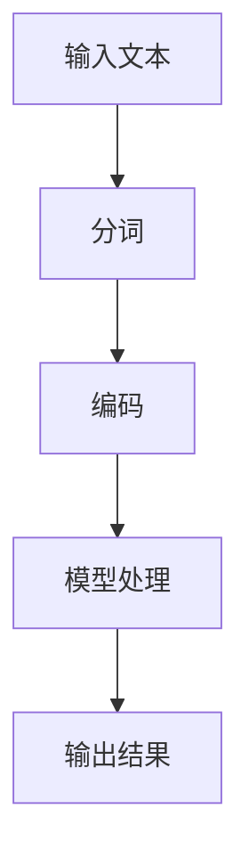
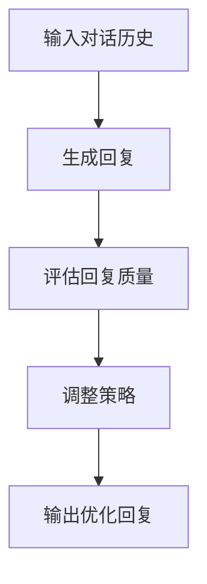
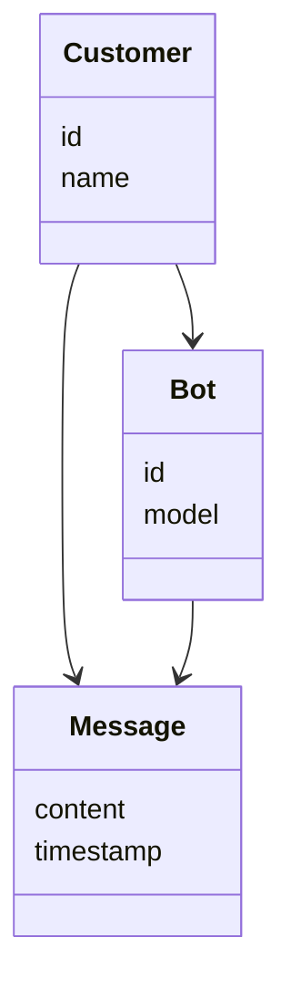
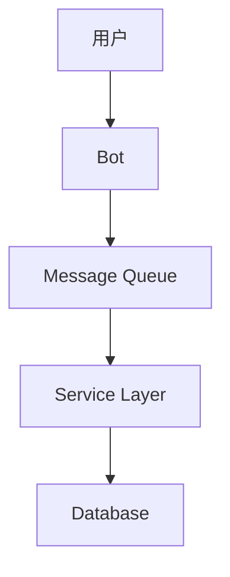
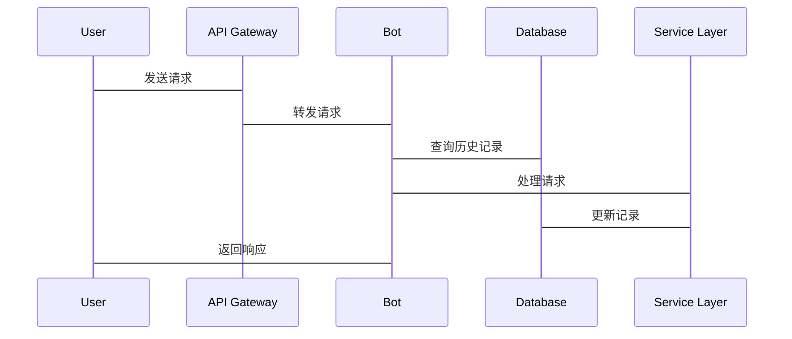

                 


# AI Agent在智能客服中的应用

## 关键词：
AI Agent, 智能客服, 自然语言处理, 机器学习, 系统架构, 项目实战

## 摘要：
本文详细探讨了AI Agent在智能客服中的应用，从背景介绍、核心概念到算法原理、系统架构，再到项目实战和最佳实践，全面解析AI Agent如何提升智能客服的效率和服务质量。通过实际案例分析和代码实现，帮助读者深入了解AI Agent的技术原理和应用价值。

---

## 第一部分：AI Agent与智能客服的背景介绍

### 第1章：AI Agent与智能客服的背景

#### 1.1 AI Agent的基本概念
- **1.1.1 AI Agent的定义**  
  AI Agent（人工智能代理）是指能够感知环境并采取行动以实现目标的智能实体。在智能客服中，AI Agent通常以聊天机器人或虚拟助手的形式出现，帮助用户解决各种问题。

- **1.1.2 AI Agent的核心特点**  
  - 自主性：能够独立决策。
  - 反应性：能够实时响应用户输入。
  - 学习能力：通过数据和反馈不断优化自身性能。

- **1.1.3 AI Agent与传统客服的区别**  
  传统客服依赖人工操作，而AI Agent能够24/7全天候工作，且能够处理大量复杂请求。

#### 1.2 智能客服的发展历程
- **1.2.1 传统客服模式的局限性**  
  传统客服存在响应时间长、成本高、效率低等问题，难以满足现代企业的需求。

- **1.2.2 AI技术如何改变智能客服**  
  AI技术的引入使得智能客服更加智能化，能够提供更高效、个性化的服务。

- **1.2.3 当前智能客服的应用现状**  
  当前，智能客服已广泛应用于多个行业，如电商、金融、医疗等，且逐渐从规则驱动向数据驱动转变。

#### 1.3 AI Agent在智能客服中的应用背景
- **1.3.1 企业对高效客服的需求**  
  随着市场竞争的加剧，企业需要更快、更准确的客户服务。

- **1.3.2 AI技术在客服领域的优势**  
  AI技术能够提高客服效率、降低成本、提供7x24小时服务。

- **1.3.3 智能客服的未来发展趋势**  
  随着AI技术的不断进步，智能客服将更加智能化、个性化，甚至具备情感识别能力。

---

## 第二部分：AI Agent的核心概念与技术原理

### 第2章：AI Agent的核心技术

#### 2.1 自然语言处理（NLP）
- **2.1.1 NLP的基本概念**  
  NLP（Natural Language Processing）是研究如何让计算机理解和生成人类语言的科学。

- **2.1.2 常见的NLP技术**  
  - 分词：将连续的文本分割成有意义的词语。
  - 实体识别：识别文本中的关键实体（如人名、地名、组织名）。
  - 情感分析：分析文本中的情感倾向。

- **2.1.3 NLP在智能客服中的应用**  
  在智能客服中，NLP用于解析用户意图、生成自然语言回复等。

#### 2.2 机器学习
- **2.2.1 机器学习的基本概念**  
  机器学习是一种通过数据训练模型，使其能够从经验中学习并做出预测的技术。

- **2.2.2 常见的机器学习算法**  
  - 分类算法：如决策树、随机森林。
  - 回归算法：如线性回归。
  - 聚类算法：如K-means。

- **2.2.3 机器学习在智能客服中的应用**  
  机器学习用于客户意图识别、需求预测、服务质量评估等。

#### 2.3 对比分析：AI Agent与传统客服的技术联系
- **2.3.1 技术对比表格**  

| 技术特性         | 传统客服               | AI Agent             |
|------------------|------------------------|----------------------|
| 响应速度         | 较慢                   | 实时                 |
| 处理能力         | 有限                   | 强大                 |
| 成本             | 高                     | 低                   |
| 可扩展性         | 有限                   | 高                   |

- **2.3.2 ER实体关系图**  

```mermaid
er
  %%{init: {'theme': 'none', 'title_bg_color': '#f3f3f3'}}
  title 实体关系图
  Customer
  Bot
  (
    Customer -[1..n]-> Message
    Bot -[1..n]-> Message
    Bot -[1]-> TrainingData
  )
```

---

## 第三部分：AI Agent的算法原理讲解

### 第3章：AI Agent的算法原理

#### 3.1 基于BERT的自然语言处理算法
- **3.1.1 BERT模型简介**  
  BERT（Bidirectional Encoder Representations from Transformers）是一种预训练的深度学习模型，广泛应用于NLP任务。

- **3.1.2 BERT的工作原理**  
  BERT通过双向Transformer结构，能够捕获文本中的上下文信息。

- **3.1.3 BERT在智能客服中的应用**  
  BERT用于意图识别、实体识别、文本生成等任务。

- **3.1.4 算法流程图**  



- **3.1.5 Python代码实现**

```python
from transformers import BertTokenizer, BertModel
import torch

# 加载预训练模型和分词器
model = BertModel.from_pretrained('bert-base-uncased')
tokenizer = BertTokenizer.from_pretrained('bert-base-uncased')

# 定义输入文本
text = "我有一个问题需要解决。"
# 对文本进行分词
inputs = tokenizer(text, return_tensors='pt')
# 模型处理
with torch.no_grad():
    outputs = model(**inputs)
# 提取隐藏层状态
last_hidden_state = outputs.last_hidden_state
print(last_hidden_state)
```

#### 3.2 基于强化学习的对话生成算法
- **3.2.1 强化学习的基本概念**  
  强化学习是一种通过试错机制来优化策略的技术。

- **3.2.2 强化学习在对话生成中的应用**  
  强化学习用于优化对话生成模型的回复质量。

- **3.2.3 算法流程图**  



- **3.2.4 算法数学模型**  
  强化学习的目标是最大化奖励函数 \( R \)，通过策略 \( \pi \) 优化动作 \( a \)：

  $$
  J(\pi) = \mathbb{E}[R]
  $$

  其中，\( J \) 是目标函数，\( R \) 是奖励。

---

## 第四部分：AI Agent的系统分析与架构设计

### 第4章：AI Agent的系统架构

#### 4.1 系统功能设计
- **4.1.1 系统功能模型**  



#### 4.2 系统架构设计
- **4.2.1 系统架构图**  



#### 4.3 系统接口设计
- **4.3.1 接口描述**  
  - API Gateway：处理外部请求。
  - Database：存储用户数据和对话历史。

- **4.3.2 接口交互流程图**  



---

## 第五部分：AI Agent的项目实战

### 第5章：智能客服对话系统的实现

#### 5.1 环境安装
- **5.1.1 安装Python**  
  下载并安装Python 3.8或更高版本。

- **5.1.2 安装依赖库**  
  使用以下命令安装必要的库：

  ```bash
  pip install transformers torch numpy
  ```

#### 5.2 核心代码实现
- **5.2.1 对话历史管理**  

```python
class MessageHistory:
    def __init__(self):
        self.history = []

    def add_message(self, message):
        self.history.append(message)

    def get_last_message(self):
        return self.history[-1] if self.history else None
```

- **5.2.2 对话生成模块**  

```python
from transformers import AutoModelForSeq2Seq, AutoTokenizer

class DialogGenerator:
    def __init__(self, model_name):
        self.model = AutoModelForSeq2Seq.from_pretrained(model_name)
        self.tokenizer = AutoTokenizer.from_pretrained(model_name)

    def generate_response(self, input_text):
        inputs = self.tokenizer(input_text, return_tensors='pt')
        outputs = self.model.generate(inputs.input_ids, max_length=50)
        response = self.tokenizer.decode(outputs[0], skip_special_tokens=True)
        return response
```

#### 5.3 实际案例分析
- **5.3.1 案例背景**  
  某电商平台的智能客服系统，使用BERT模型处理用户咨询。

- **5.3.2 代码解读**  
  如上代码实现了一个简单的对话生成模块，能够根据用户输入生成回复。

- **5.3.3 案例分析**  
  通过分析对话历史，系统能够更好地理解用户需求，提供更准确的回复。

---

## 第六部分：最佳实践与总结

### 第6章：总结与建议

#### 6.1 总结
- AI Agent通过NLP和机器学习技术，显著提升了智能客服的效率和质量。
- 系统架构设计和项目实战是实现AI Agent的关键步骤。

#### 6.2 最佳实践
- **选择合适的模型**：根据具体需求选择适合的NLP模型。
- **优化系统性能**：通过并行计算和缓存优化提升响应速度。
- **收集用户反馈**：持续收集用户反馈，优化模型性能。

#### 6.3 注意事项
- 确保数据安全和隐私保护。
- 定期更新模型，适应用户需求的变化。

#### 6.4 拓展阅读
- 《深度学习实战》
- 《自然语言处理入门》

---

## 作者信息

作者：AI天才研究院/AI Genius Institute & 禅与计算机程序设计艺术/Zen And The Art of Computer Programming

---

以上是《AI Agent在智能客服中的应用》的技术博客文章目录和内容概要，涵盖了从基础概念到算法实现再到项目实战的全过程，旨在帮助读者全面理解并掌握AI Agent在智能客服中的应用。

