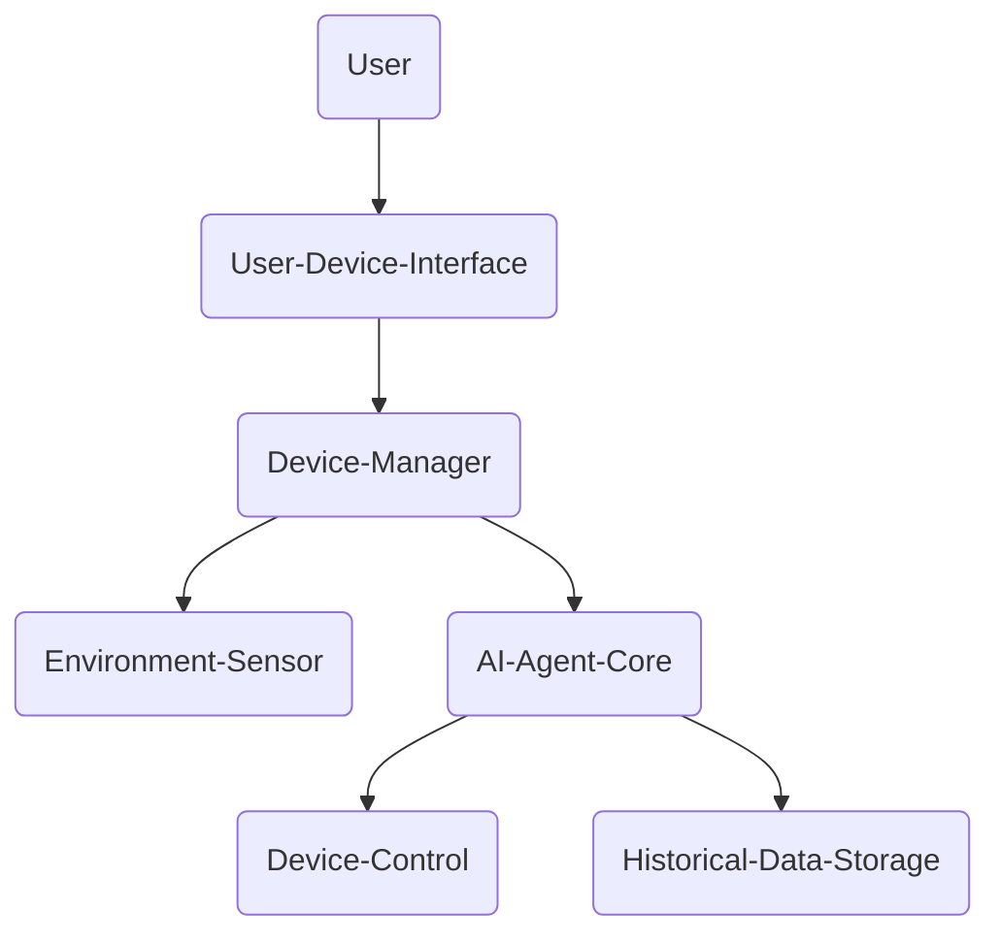

                 


# AI Agent在智能家居中的应用

> 关键词：AI Agent, 智能家居, 人工智能, 强化学习, 系统架构

> 摘要：本文探讨AI Agent在智能家居中的应用，从背景、核心概念到算法原理、系统架构，再到项目实战和最佳实践，全面解析AI Agent如何赋能智能家居，提升用户体验和系统效率。

---

## 第一部分: AI Agent与智能家居的背景介绍

### 第1章: AI Agent与智能家居的概述

#### 1.1 AI Agent的基本概念

AI Agent是一种智能体，能够感知环境、自主决策并执行任务。与传统AI不同，AI Agent强调主动性，能适应动态变化的环境。在智能家居中，AI Agent用于优化能源使用、提升居住舒适度，并实现设备间的高效协同。

#### 1.2 智能家居的发展现状

智能家居通过物联网技术将家电、照明、安防等设备连接，实现远程控制和自动化管理。然而，传统智能家居面临设备孤岛、用户体验差等问题。AI Agent的引入，为智能家居带来了智能化升级，使其能够根据用户行为和环境变化自动调整。

#### 1.3 AI Agent在智能家居中的问题背景

智能家居的痛点包括设备联动复杂、用户需求个性化强、环境动态变化等。AI Agent通过实时感知和自主决策，解决了这些问题，提升了智能家居的智能化水平和用户体验。

---

## 第二部分: AI Agent的核心概念与联系

### 第2章: AI Agent的核心概念

#### 2.1 AI Agent的定义与特征

AI Agent具备感知、决策、执行和自适应能力。其核心特征包括主动性、自主性、反应性和社会性。在智能家居中，AI Agent能够实时感知用户行为和环境变化，自主决策以优化设备运行。

#### 2.2 AI Agent与传统AI的区别

传统AI依赖于预设规则，而AI Agent具备自主决策能力。AI Agent能够根据环境反馈动态调整策略，适应复杂变化的场景。这种灵活性使得AI Agent在智能家居中更具应用价值。

#### 2.3 AI Agent在智能家居中的应用

AI Agent可应用于能耗优化、场景切换、异常检测等领域。例如，在能耗优化方面，AI Agent可以根据用户习惯和环境数据，动态调整设备运行状态，降低能源消耗。

#### 2.4 实体关系分析

以下是AI Agent在智能家居中的实体关系图：

```mermaid
graph TD
    A(I-A)>>B(用户)
    B-->C(设备)
    C-->D(环境)
    E(AI Agent)-->B
    E-->C
    E-->D
```

---

## 第三部分: AI Agent的算法原理

### 第3章: AI Agent的核心算法

#### 3.1 强化学习算法

强化学习通过试错机制优化决策策略。例如，Q-learning算法用于设备调度，通过状态-动作-奖励机制，优化设备运行顺序，提升效率。

#### 3.2 监督学习算法

监督学习适用于用户行为建模。通过历史数据训练分类模型，识别用户的使用习惯，实现个性化服务。

#### 3.3 算法实现代码示例

以下是Q-learning算法的Python代码示例：

```python
import random

class AI-Agent:
    def __init__(self, actions):
        self.actions = actions
        self.q_table = {}

    def choose_action(self, state, epsilon=0.1):
        if random.random() < epsilon:
            return random.choice(self.actions)
        max_action = max(self.q_table.get(state, {action:0 for action in self.actions}))
        return max_action

    def learn(self, state, action, reward, next_state):
        if state not in self.q_table:
            self.q_table[state] = {action:0 for action in self.actions}
        current_q = self.q_table[state][action]
        next_max_q = max(self.q_table.get(next_state, {}).values()) if next_state else 0
        new_q = current_q + 0.1 * (reward + 0.9 * next_max_q - current_q)
        self.q_table[state][action] = new_q
```

#### 3.4 数学公式

Q-learning算法的更新公式为：

$$ Q(s, a) = Q(s, a) + \alpha [r + \gamma \max Q(s', a') - Q(s, a)] $$

其中，$\alpha$是学习率，$\gamma$是折扣因子。

---

## 第四部分: 智能家居系统分析与架构设计

### 第4章: 智能家居系统设计

#### 4.1 问题场景介绍

智能家居系统需要协调多个设备，满足用户个性化需求。例如，用户离家时，系统需自动关闭灯光和空调，同时根据天气调整室内温度。

#### 4.2 系统功能设计

系统功能包括设备控制、场景切换、能耗管理等。通过领域模型类图，展示各组件之间的关系。

#### 4.3 系统架构设计

以下是系统架构图：



---

## 第五部分: 项目实战

### 第5章: 实战项目实施

#### 5.1 环境安装

安装Python、TensorFlow和相关库，配置开发环境。

#### 5.2 核心功能实现

实现AI Agent的设备调度算法，通过代码实现状态感知和决策执行。

#### 5.3 代码解读

解释代码逻辑，分析如何实现设备联动和用户行为预测。

#### 5.4 案例分析

通过具体案例，展示AI Agent在智能家居中的实际应用效果。

---

## 第六部分: 最佳实践与总结

### 第6章: 最佳实践

#### 6.1 实用建议

建议合理配置硬件和算法模型，确保数据安全和系统稳定性。

#### 6.2 注意事项

注意隐私保护和系统兼容性问题，避免设备冲突和数据泄露。

#### 6.3 拓展阅读

推荐相关书籍和论文，鼓励读者深入研究AI Agent技术。

---

## 结语

AI Agent正在 revolutionize 智能家居领域，通过智能化的决策和自主执行，为用户带来更舒适、更高效的生活体验。随着技术进步，AI Agent在智能家居中的应用将更加广泛和深入。

---

**作者：AI天才研究院/AI Genius Institute & 禅与计算机程序设计艺术 /Zen And The Art of Computer Programming**

