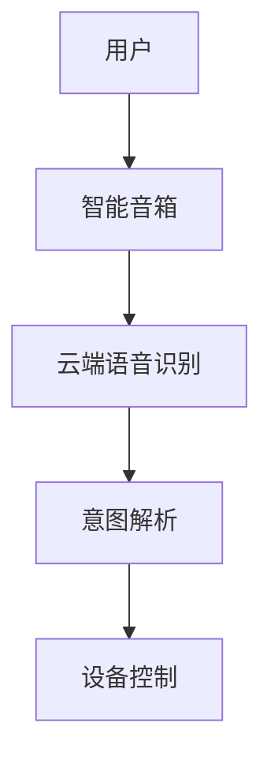

                 


# AI Agent在智能家居中的语音控制应用

## 关键词：
AI Agent, 智能家居, 语音控制, 深度学习, 自然语言处理, 智能设备

## 摘要：
随着人工智能技术的飞速发展，AI Agent在智能家居中的应用越来越广泛。本文将详细探讨AI Agent在智能家居语音控制中的实现原理、技术挑战和解决方案。通过分析AI Agent的核心算法，如语音识别和自然语言理解，结合智能家居的实际应用场景，展示如何利用AI技术提升智能家居的用户体验。文章还涵盖了系统架构设计、项目实战和最佳实践，为读者提供全面的技术指导。

---

## 第1章: AI Agent与智能家居的背景介绍

### 1.1 AI Agent的基本概念
AI Agent是一种能够感知环境、自主决策并执行任务的智能实体。它通过传感器获取信息，利用算法处理数据，并通过执行器与环境交互。AI Agent的核心特征包括自主性、反应性、目标导向和社会能力。

**AI Agent的分类**：
1. **反应式AI Agent**：基于当前感知做出反应，适用于实时任务。
2. **认知式AI Agent**：具备复杂推理和规划能力，适用于复杂场景。
3. **协作式AI Agent**：能够与其他Agent或人类协作完成任务。

### 1.2 智能家居的基本概念
智能家居是利用物联网技术将家中设备（如灯光、空调、安防系统）连接起来，通过智能化的控制实现便捷的生活。智能家居的主要组成部分包括感知层（传感器）、网络层（通信模块）和应用层（控制设备）。

### 1.3 AI Agent在智能家居中的问题背景
智能家居的控制痛点主要体现在用户体验差、设备孤岛和控制复杂性。AI Agent通过语音控制技术，解决了这些问题，提升了用户的便捷性和智能化体验。

---

## 第2章: AI Agent与语音控制的核心概念

### 2.1 AI Agent的核心原理
AI Agent通过感知环境、分析数据、制定决策并执行操作。其工作流程包括信息获取、数据处理、决策制定和行动执行。

### 2.2 语音控制的核心原理
语音控制通过语音识别和自然语言理解，将用户的指令转化为设备的控制信号。其流程包括语音信号采集、特征提取、模型匹配和指令执行。

### 2.3 AI Agent与语音控制的结合
AI Agent在语音控制中的作用是理解用户意图并协调设备执行。这种结合使得智能家居能够实现更复杂的交互和场景管理。

---

## 第3章: 语音识别算法原理

### 3.1 语音识别的基本流程
1. **预处理**：去除噪音，提取有用的语音信号。
2. **特征提取**：提取频域特征（如MFCC）和时域特征（如能量）。
3. **模型训练**：利用深度学习模型（如CNN、RNN）进行训练。

### 3.2 基于深度学习的语音识别
深度学习模型在语音识别中的优势在于其强大的特征提取能力和自适应能力。例如，使用Transformer架构可以实现高效的语音识别。

### 3.3 语音识别的数学模型
语音识别的损失函数通常采用交叉熵损失：
$$ \mathcal{L} = -\sum_{i=1}^{n} \log P(y_i|x_i) $$

---

## 第4章: 自然语言理解的算法原理

### 4.1 自然语言理解的核心任务
包括意图识别、实体识别和语义分析。意图识别通过分类模型确定用户意图，实体识别通过NLP技术提取关键信息。

### 4.2 基于深度学习的NLU实现
使用预训练语言模型（如BERT）进行微调，可以提高意图识别的准确率。

---

## 第5章: 系统架构设计

### 5.1 智能家居场景分析
智能家居系统包括前端设备（如智能音箱）、云端处理和后端服务（如API接口）。

### 5.2 系统功能设计
- **用户交互界面**：支持语音输入和显示反馈。
- **设备控制**：通过API调用智能家居设备。
- **数据存储**：记录用户指令和设备状态。

### 5.3 系统架构图（Mermaid）


---

## 第6章: 项目实战

### 6.1 环境安装
需要安装Python、TensorFlow和Keras库：
```bash
pip install python-tts
pip install speechRecognition
```

### 6.2 核心代码实现
```python
import speech_recognition as sr
from gtts import gTTS

# 语音识别
r = sr.Recognizer()
audio = sr.AudioFile("input.wav")
with audio as source:
    audio_data = r.record(source)
text = r.recognize(audio_data, sr.AudioFile.DEEP_SPEECH)

# 语音合成
tts = gTTS(text="Hello, how are you?")
tts.save("output.mp3")
```

### 6.3 实际案例分析
通过案例分析，展示如何利用AI Agent实现智能家居的语音控制，例如：通过语音指令调节室温。

---

## 总结与展望

AI Agent在智能家居中的语音控制应用正在快速发展，未来将更加智能化和个性化。随着技术的进步，AI Agent将能够处理更复杂的任务，提升用户体验。

---

## 最佳实践 Tips

1. **优化语音识别模型**：使用更多的训练数据和更先进的算法。
2. **提升设备兼容性**：确保不同设备之间的互联互通。
3. **保护用户隐私**：在数据处理和传输过程中加强安全措施。

---

## 小结

本文详细介绍了AI Agent在智能家居中的语音控制应用，涵盖了从基础概念到实际项目的各个方面。通过系统的分析和实践，读者可以深入了解这一领域的技术细节和应用前景。

---

## 注意事项

在实际应用中，需注意设备兼容性、数据安全和用户体验优化。

---

## 拓展阅读

推荐阅读《深度学习实战》和《自然语言处理入门》。

---

## 作者信息

作者：AI天才研究院 & 禅与计算机程序设计艺术

---

通过以上结构和内容，您可以撰写一篇详细且专业的技术博客文章。

