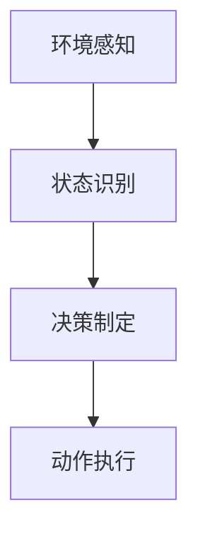
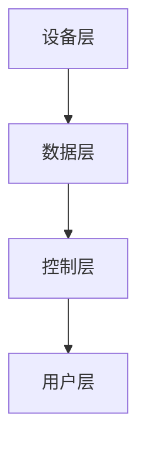

                 


# AI Agent在智能家居自动化中的应用

## 关键词：AI Agent, 智能家居, 自动化, 智能设备, 物联网

## 摘要：  
本文深入探讨了AI Agent在智能家居自动化中的应用，从基本概念到算法实现，再到系统架构设计，全面分析了AI Agent如何提升智能家居的智能化水平。通过实际案例分析和代码实现，展示了AI Agent在智能家居中的具体应用方式，并提出了系统设计的最佳实践。

---

## 第1章: AI Agent与智能家居自动化概述

### 1.1 AI Agent的基本概念  
AI Agent（人工智能代理）是指一种能够感知环境、自主决策并执行任务的智能实体。它可以理解为一个软件或硬件系统，通过传感器获取信息，利用算法进行分析，并通过执行器完成操作。AI Agent的核心特征包括自主性、反应性、目标导向和社交能力。与传统自动化相比，AI Agent能够根据环境变化动态调整行为，具有更强的适应性和智能性。

### 1.2 智能家居的发展现状  
智能家居是指通过物联网技术将家庭中的设备（如灯光、空调、安防系统等）连接到一起，实现智能化管理和控制。智能家居的发展趋势是设备的互联互通和场景化的智能化控制。随着AI技术的进步，智能家居的自动化水平不断提高，但目前仍面临设备兼容性差、用户体验不佳、安全性不足等问题。

### 1.3 AI Agent在智能家居中的应用前景  
AI Agent在智能家居中的应用前景广阔。通过AI Agent，智能家居可以实现更智能的设备控制、更个性化的用户体验和更高效的资源管理。AI Agent能够根据用户的行为习惯和环境变化，主动调整设备状态，从而提升居住舒适度和能源利用率。

---

## 第2章: AI Agent的核心概念与原理

### 2.1 AI Agent的感知与决策机制  
AI Agent的感知模块通过传感器获取环境信息，如温度、湿度、光照等。决策模块基于感知信息，结合预设的目标和策略，生成相应的动作指令。执行模块负责将决策结果转化为实际操作，如打开灯光或调节空调。

### 2.2 智能家居设备的实体关系分析  
智能家居设备的实体关系可以通过ER图进行分析。设备实体包括灯光、空调、安防系统等，每个设备都有对应的属性和状态。设备与用户之间存在交互关系，用户可以通过手机APP或语音助手控制设备。设备与环境之间也存在相互作用，设备的状态会受到环境的影响。

```mermaid
er
    entity 设备 {
       属性：设备ID、设备类型、设备状态
    }
    entity 用户 {
       属性：用户ID、用户权限
    }
    entity 环境 {
       属性：温度、湿度、光照
    }
    设备 -> 用户：被控制
    设备 -> 环境：受环境影响
```

### 2.3 AI Agent的算法原理  
AI Agent的核心算法包括感知、决策和执行三个步骤。感知阶段通过传感器获取环境信息，决策阶段基于强化学习算法生成动作指令，执行阶段通过执行器完成操作。以下是强化学习算法的数学模型：

$$
R(s, a) = r_{t+1} \quad \text{其中} \quad s \text{是状态，} a \text{是动作}
$$

### 2.4 本章小结  
本章介绍了AI Agent的基本概念和核心特征，分析了智能家居的发展现状和应用前景，详细讲解了AI Agent的感知与决策机制，并通过ER图和数学公式展示了智能家居设备的实体关系和算法原理。

---

## 第3章: AI Agent的算法实现

### 3.1 算法原理与流程  
AI Agent的算法流程包括环境感知、状态识别、决策制定和动作执行四个步骤。以下是算法的mermaid流程图：



### 3.2 算法的数学模型  
以下是强化学习算法的数学模型：

$$
Q(s, a) = Q(s, a) + \alpha \left[r + Q(s', a') - Q(s, a)\right]
$$

其中，$\alpha$是学习率，$r$是奖励值，$s$是当前状态，$s'$是下一个状态，$a$是当前动作，$a'$是下一个动作。

### 3.3 算法的实现代码  
以下是Python实现的强化学习算法代码：

```python
class AI_Agent:
    def __init__(self, state_space, action_space):
        self.state_space = state_space
        self.action_space = action_space
        self.Q = np.zeros((state_space, action_space))
    
    def感知(self, 状态):
        # 获取环境信息
        return 状态
    
    def 决策(self, 状态):
        # 基于Q-learning算法生成动作
        q_values = self.Q[状态, :]
        return np.argmax(q_values)
    
    def 学习(self, 当前状态, 动作, 奖励, 下一状态):
        # 更新Q值
        self.Q[当前状态, 动作] = self.Q[当前状态, 动作] + 0.1 * (奖励 + np.max(self.Q[下一状态, :]))
```

### 3.4 本章小结  
本章详细讲解了AI Agent的算法实现，包括算法的原理与流程、数学模型和代码实现。通过强化学习算法，AI Agent能够根据环境信息做出最优决策，并通过不断学习提升控制精度。

---

## 第4章: 智能家居自动化系统的架构设计

### 4.1 系统功能模块设计  
智能家居自动化系统的功能模块包括设备管理模块、用户交互模块和数据采集模块。以下是系统的mermaid类图：

```mermaid
classDiagram
    class 设备管理模块 {
        属性：设备列表、设备状态
        方法：获取设备状态、控制设备
    }
    class 用户交互模块 {
        属性：用户输入、用户权限
        方法：接收用户指令、发送控制命令
    }
    class 数据采集模块 {
        属性：环境数据
        方法：采集环境信息、发送环境数据
    }
    设备管理模块 --> 用户交互模块：接收控制指令
    用户交互模块 --> 数据采集模块：获取环境数据
```

### 4.2 系统架构设计  
智能家居自动化系统的架构包括设备层、数据层、控制层和用户层。以下是系统的mermaid架构图：



### 4.3 系统接口设计  
系统接口设计包括设备控制接口和用户交互接口。以下是系统的mermaid序列图：

```mermaid
sequenceDiagram
    用户 -->+ 设备管理模块：发送控制指令
    设备管理模块 --> 设备层：执行操作
    设备层 --> 数据层：更新设备状态
    数据层 --> 用户：返回操作结果
```

### 4.4 本章小结  
本章详细设计了智能家居自动化系统的架构，包括功能模块、系统架构和接口设计。通过合理的系统架构设计，能够实现设备的高效控制和数据的实时交互。

---

## 第5章: 项目实战

### 5.1 环境安装与配置  
首先需要安装Python和必要的库，如numpy和matplotlib。然后安装智能家居设备的SDK，如智能灯泡和空调的控制库。

### 5.2 系统核心实现源代码  
以下是AI Agent的核心代码实现：

```python
import numpy as np

class AI_Agent:
    def __init__(self, state_space, action_space):
        self.state_space = state_space
        self.action_space = action_space
        self.Q = np.zeros((state_space, action_space))
    
    def感知(self, 状态):
        return 状态
    
    def 决策(self, 状态):
        return np.argmax(self.Q[状态, :])
    
    def 学习(self, 当前状态, 动作, 奖励, 下一状态):
        self.Q[当前状态, 动作] += 0.1 * (奖励 + np.max(self.Q[下一状态, :]))

# 初始化环境
state_space = 5
action_space = 3
agent = AI_Agent(state_space, action_space)

# 训练过程
for _ in range(100):
    当前状态 = 环境.获取状态()
    动作 = agent.决策(当前状态)
    下一状态, 奖励 = 环境.执行动作(动作)
    agent.学习(当前状态, 动作, 奖励, 下一状态)
```

### 5.3 代码的功能解读  
上述代码实现了AI Agent的基本功能，包括感知、决策和学习。通过强化学习算法，AI Agent能够在不断训练中提升对智能家居设备的控制能力。

### 5.4 案例分析与详细讲解  
以智能灯泡控制为例，AI Agent可以根据环境中的光照强度和用户的行为习惯，自动调节灯泡的亮度和颜色。以下是具体的实现步骤：

1. 环境感知：AI Agent通过光线传感器获取当前环境的光照强度。
2. 状态识别：AI Agent将光照强度转换为具体的状态值。
3. 决策制定：AI Agent根据当前状态和历史数据，生成相应的控制指令。
4. 动作执行：AI Agent通过智能灯泡的API发送控制指令，调节灯泡的亮度和颜色。

### 5.5 项目小结  
本章通过具体的项目实战，展示了AI Agent在智能家居自动化中的实际应用。通过代码实现和案例分析，读者可以更好地理解AI Agent的核心原理和实际应用价值。

---

## 第6章: 最佳实践、小结、注意事项和拓展阅读

### 6.1 最佳实践  
在实际应用中，建议从简单的设备控制开始，逐步扩展到复杂的场景控制。同时，要注意设备的兼容性和数据的安全性。

### 6.2 小结  
本文详细介绍了AI Agent在智能家居自动化中的应用，从基本概念到算法实现，再到系统架构设计和项目实战，全面展示了AI Agent在智能家居中的潜力和价值。

### 6.3 注意事项  
在实际应用中，需要注意设备的兼容性、数据的安全性和系统的可扩展性。同时，要根据具体需求选择合适的算法和工具。

### 6.4 拓展阅读  
建议读者进一步阅读强化学习相关的书籍和论文，了解更多的算法实现和应用案例。同时，可以关注智能家居领域的最新动态和技术进展。

---

## 作者：AI天才研究院/AI Genius Institute & 禅与计算机程序设计艺术 /Zen And The Art of Computer Programming

---

以上是《AI Agent在智能家居自动化中的应用》的完整内容，涵盖了从理论到实践的各个方面，希望对您有所帮助！

