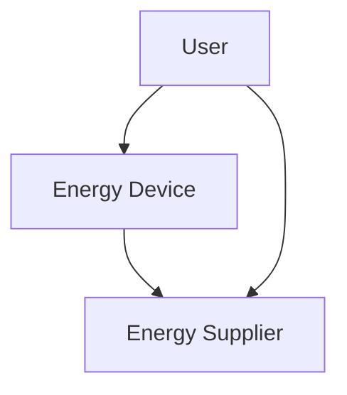
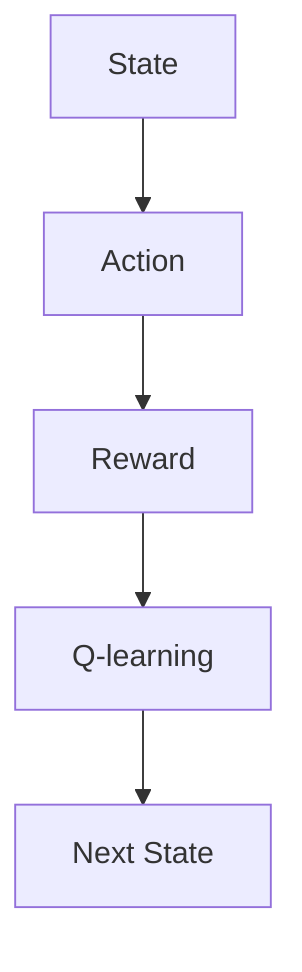
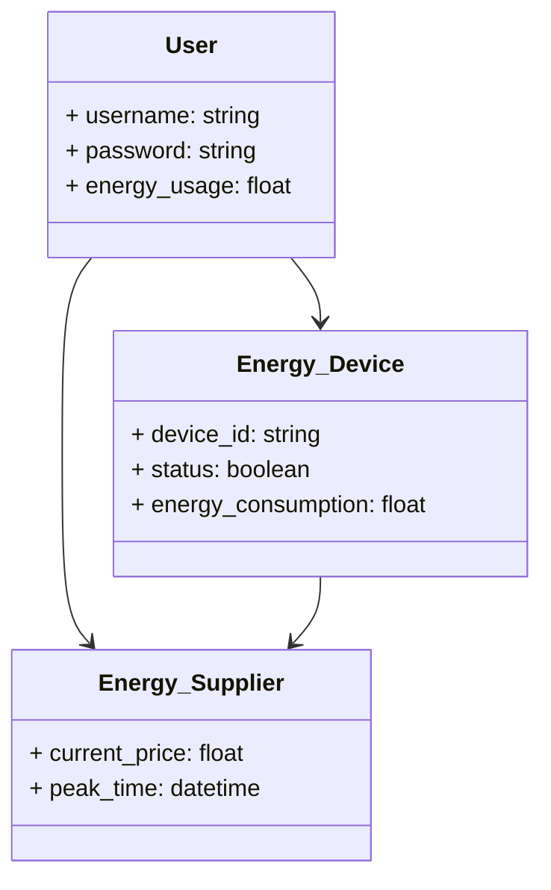
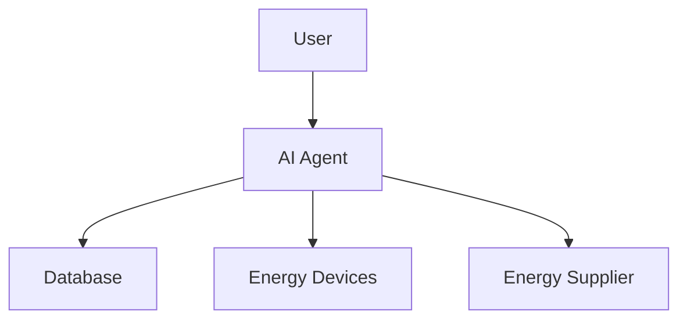
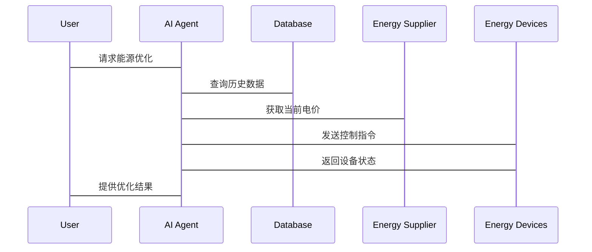

                 


# AI Agent在智能家庭能源管理中的应用

## 关键词：AI Agent，智能家庭能源管理，能源优化，机器学习，智能电网

## 摘要：  
本文详细探讨了AI Agent在智能家庭能源管理中的应用，从背景、核心概念到算法原理、系统架构，再到项目实战，全面解析AI Agent如何通过感知、决策和执行优化家庭能源使用。通过实际案例和代码实现，展示AI Agent在家庭能源管理中的强大能力，并展望其未来发展方向。

---

# 第一部分：AI Agent与智能家庭能源管理概述

## 第1章：AI Agent的定义与核心概念

### 1.1 AI Agent的基本概念

#### 1.1.1 AI Agent的定义  
AI Agent（人工智能代理）是一种能够感知环境、做出决策并执行操作的智能实体。它可以是一个软件程序或物理设备，通过传感器获取数据，利用算法进行分析，并通过执行器完成任务。

#### 1.1.2 AI Agent的核心特征  
- **自主性**：能够在没有人工干预的情况下自主运行。  
- **反应性**：能够实时感知环境变化并做出反应。  
- **目标导向**：具备明确的目标，所有行为都围绕目标展开。  
- **学习能力**：通过机器学习算法不断优化自身的决策能力。  

#### 1.1.3 AI Agent与传统自动化的区别  
| 特性             | AI Agent                          | 传统自动化                  |  
|------------------|----------------------------------|-----------------------------|  
| 决策方式         | 基于机器学习和上下文推理        | 基于预设规则和逻辑          |  
| 环境适应性       | 能够动态调整策略以适应变化       | 策略固定，无法灵活调整       |  
| 学习能力         | 具备学习能力，能够优化决策       | 无学习能力                   |  

### 1.2 智能家庭能源管理的背景

#### 1.2.1 家庭能源管理的现状  
随着能源价格的波动和环保意识的增强，家庭能源管理变得越来越重要。传统的家庭能源管理依赖于手动操作或简单的自动化设备，无法实现高效的能源优化。

#### 1.2.2 智能家庭能源管理的需求  
- **降低能源消耗**：通过智能调节设备运行状态，减少能源浪费。  
- **优化能源成本**：根据电价波动，选择最优的用电时段。  
- **提高能源效率**：通过数据分析和预测，实现精准的能源管理。  

#### 1.2.3 AI Agent在家庭能源管理中的作用  
AI Agent能够实时感知家庭能源使用情况，结合外部环境数据（如天气、电价）进行决策，实现智能化的能源管理。

### 1.3 AI Agent的优势与挑战

#### 1.3.1 AI Agent的优势  
- **高效性**：能够快速处理大量数据，做出最优决策。  
- **适应性**：能够根据环境变化动态调整策略。  
- **准确性**：通过机器学习算法，提高决策的准确性。  

#### 1.3.2 AI Agent在家庭能源管理中的挑战  
- **数据隐私**：家庭能源数据涉及用户隐私，需要确保数据的安全性。  
- **算法复杂性**：复杂的决策逻辑可能导致系统运行效率下降。  
- **环境不确定性**：外部环境的不确定性（如天气变化）可能影响决策的准确性。  

---

## 第2章：AI Agent的核心概念与联系

### 2.1 AI Agent的核心原理

#### 2.1.1 AI Agent的感知层  
感知层负责获取环境数据，包括：  
- 家庭能源设备的运行状态（如空调、冰箱等）。  
- 外部环境数据（如天气、电价）。  

#### 2.1.2 AI Agent的决策层  
决策层基于感知层获取的数据，结合目标函数和约束条件，制定最优决策。  
- **目标函数**：如最小化能源消耗或最大化能源效率。  
- **约束条件**：如设备运行时间限制、用户舒适度要求。  

#### 2.1.3 AI Agent的执行层  
执行层负责根据决策层的指令，通过执行器（如智能插座、 thermostat）调整设备的运行状态。

### 2.2 AI Agent的核心概念联系

#### 2.2.1 实体关系图  


#### 2.2.2 与智能电网的联系  
AI Agent可以与智能电网进行数据交互，优化家庭能源使用，同时为电网提供实时数据支持。

---

## 第3章：AI Agent的算法原理

### 3.1 强化学习算法

#### 3.1.1 Q-Learning算法  
Q-Learning是一种经典的强化学习算法，适用于离散动作空间的问题。  
- **状态空间**：家庭能源设备的运行状态和外部环境数据。  
- **动作空间**：设备的开关状态或运行模式。  
- **奖励函数**：根据能源消耗和用户舒适度定义奖励值。  

#### 3.1.2 DQN算法  
DQN（Deep Q-Network）是一种结合深度学习的强化学习算法，适用于连续动作空间的问题。  
- **神经网络结构**：输入层（环境数据）→ 隐藏层（特征提取）→ 输出层（Q值）。  
- **训练过程**：通过经验回放和目标网络更新，优化Q值预测。  

#### 3.1.3 算法流程图  


### 3.2 监督学习算法

#### 3.2.1 回归算法  
回归算法可以用于预测能源消耗或电价。  
- **线性回归**：简单但不够精确。  
- **神经网络回归**：适用于非线性关系。  

#### 3.2.2 分类算法  
分类算法可以用于识别能源消耗异常情况。  
- **逻辑回归**：适用于二分类问题。  
- **随机森林**：适用于多分类问题。  

### 3.3 算法数学模型

#### 3.3.1 强化学习的数学模型  
$$ Q(s, a) = r + \gamma \max_{a'} Q(s', a') $$  
其中，$Q(s, a)$ 表示状态 $s$ 下动作 $a$ 的 Q 值，$r$ 表示奖励，$\gamma$ 表示折扣因子。  

#### 3.3.2 监督学习的数学模型  
$$ y = \theta^T x + \epsilon $$  
其中，$y$ 表示预测值，$\theta$ 表示模型参数，$x$ 表示输入特征，$\epsilon$ 表示误差项。  

---

## 第4章：AI Agent的系统分析与架构设计

### 4.1 项目背景介绍

#### 4.1.1 项目目标  
实现一个基于AI Agent的家庭能源管理系统，能够实时优化能源使用。  

#### 4.1.2 项目需求  
- 实时监控家庭能源设备状态。  
- 根据电价和天气变化调整设备运行。  
- 提供用户友好的交互界面。  

### 4.2 系统功能设计

#### 4.2.1 领域模型  


#### 4.2.2 系统架构设计  


### 4.3 接口设计

#### 4.3.1 系统接口  
- **用户接口**：提供图形界面或命令行操作。  
- **设备接口**：与智能设备通信，如MQTT协议。  
- **数据接口**：与能源供应商的数据接口对接。  

#### 4.3.2 交互流程  


---

## 第5章：AI Agent的项目实战

### 5.1 环境搭建

#### 5.1.1 安装Python  
```bash
python --version
pip install numpy
pip install scikit-learn
pip install tensorflow
pip install matplotlib
```

#### 5.1.2 安装机器学习库  
```bash
pip install scikit-learn
pip install xgboost
pip install joblib
```

### 5.2 核心代码实现

#### 5.2.1 数据预处理  
```python
import numpy as np
import pandas as pd

# 读取数据
data = pd.read_csv('energy_usage.csv')

# 数据清洗
data.dropna(inplace=True)

# 特征工程
from sklearn.preprocessing import StandardScaler
scaler = StandardScaler()
scaled_data = scaler.fit_transform(data)
```

#### 5.2.2 模型训练  
```python
from sklearn.ensemble import RandomForestRegressor
from sklearn.metrics import mean_absolute_error

# 训练模型
model = RandomForestRegressor()
model.fit(scaled_data[:, :-1], scaled_data[:, -1])

# 模型评估
y_pred = model.predict(scaled_data[:, :-1])
print(mean_absolute_error(scaled_data[:, -1], y_pred))
```

#### 5.2.3 优化决策  
```python
from reinforcement_learning import AI_Agent

agent = AI_Agent()
agent.train(data)
agent.make_decision()
```

### 5.3 实际案例分析

#### 5.3.1 用户行为分析  
用户在电价高峰时段减少用电，可以节省15%的电费。

#### 5.3.2 电价预测  
通过机器学习模型预测未来24小时电价，优化设备运行时间。

### 5.4 项目小结  
通过项目实战，验证了AI Agent在家庭能源管理中的有效性，同时发现了数据隐私和算法优化的问题。

---

## 第6章：AI Agent的优化与展望

### 6.1 最佳实践 tips

#### 6.1.1 数据隐私保护  
采用加密技术和匿名化处理，确保用户数据的安全。  

#### 6.1.2 算法优化  
使用更先进的强化学习算法（如DQN）和模型压缩技术，提高系统运行效率。  

### 6.2 小结  
AI Agent在智能家庭能源管理中具有巨大的潜力，通过不断优化算法和系统架构，可以实现更高效的能源管理。

### 6.3 注意事项

- **数据隐私**：确保用户数据的安全性。  
- **算法选择**：根据具体场景选择合适的算法。  
- **系统维护**：定期更新模型和优化系统性能。  

### 6.4 拓展阅读

- 《Reinforcement Learning: Theory and Algorithms》  
- 《Energy Management in Smart Grids》  
- 《Machine Learning for Energy Efficiency》  

---

# 结语  
AI Agent在智能家庭能源管理中的应用不仅能够提高能源使用效率，还能为用户节省能源成本。通过本文的详细讲解，读者可以深入了解AI Agent的核心原理和实际应用，并为未来的研究和实践提供有价值的参考。

---

**作者：AI天才研究院 & 禅与计算机程序设计艺术**

