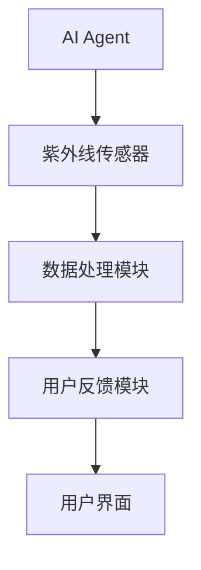
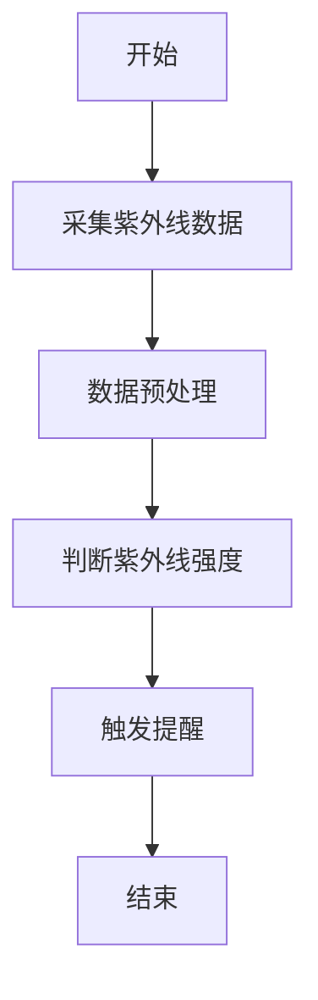
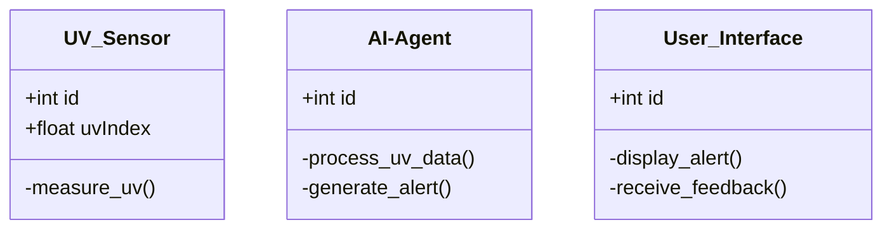
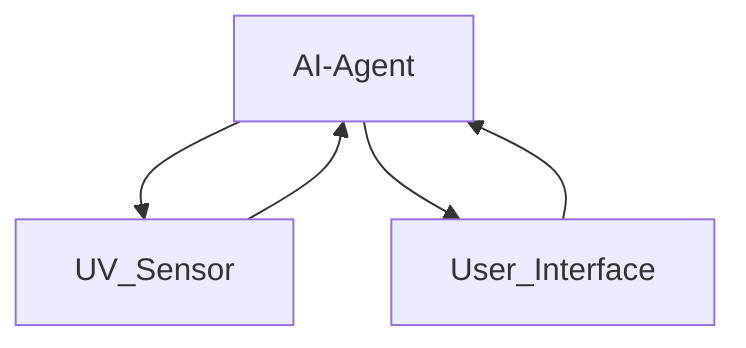
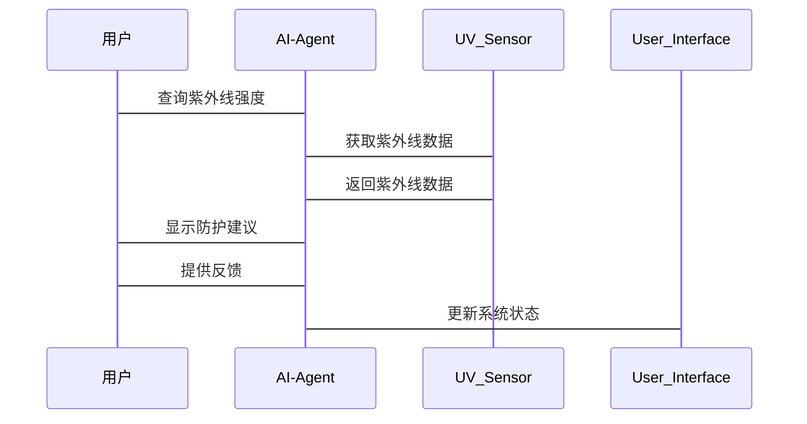

                 


```markdown
# AI Agent在智能帽子中的紫外线防护提醒

## 关键词
AI Agent, 智能帽子, 紫外线防护, 紫外线传感器, 数据处理, 用户反馈, 系统架构

## 摘要
本文详细探讨了AI Agent在智能帽子中的紫外线防护提醒系统的实现与应用。首先介绍了紫外线防护的重要性及其在智能帽子中的应用背景，接着分析了AI Agent的核心概念与紫外线传感器的工作原理。通过详细讲解算法原理、系统架构设计，结合实际案例分析，展示了如何利用AI技术实现智能化的紫外线防护提醒功能。最后，提供了项目实战指南和最佳实践建议。

## 第一部分: 背景介绍

### 1.1 问题背景
#### 1.1.1 紫外线的危害与防护的重要性
紫外线是太阳辐射中的一部分，分为UVA、UVB和UVC三种类型。其中，UVB是导致皮肤晒伤和皮肤癌的主要原因。随着全球气候变化和臭氧层的破坏，紫外线强度逐年增加，紫外线防护的重要性日益凸显。

#### 1.1.2 智能帽子的发展趋势
智能帽子作为一种新兴的可穿戴设备，集成了多种传感器和智能技术，能够实时监测环境数据并提供相应的反馈。紫外线防护提醒是智能帽子的重要功能之一，通过AI Agent实现智能化的紫外线防护提醒，为用户提供个性化的防护建议。

#### 1.1.3 AI Agent在智能帽子中的应用潜力
AI Agent（人工智能代理）是一种能够感知环境、理解用户需求并提供智能服务的实体。在智能帽子中，AI Agent可以实时监测紫外线强度，结合用户的皮肤敏感度、地理位置和天气预报，提供个性化的紫外线防护建议。

### 1.2 问题描述
#### 1.2.1 紫外线防护提醒的需求分析
用户在户外活动时，需要实时了解紫外线强度，并根据强度调整防护措施。传统的方法依赖于手动查询紫外线指数，这种方式不够便捷且容易遗忘。因此，智能帽子需要能够实时监测紫外线强度，并通过AI Agent主动提醒用户采取防护措施。

#### 1.2.2 智能帽子的现有功能与不足
现有的智能帽子主要依赖于单一传感器的数据采集和简单的数据处理，缺乏智能化的决策能力。用户反馈机制也不够完善，无法根据用户的实际需求提供个性化的服务。

#### 1.2.3 AI Agent在紫外线防护中的具体应用场景
AI Agent可以实时监测紫外线强度，结合用户的地理位置、天气预报和皮肤敏感度，提供个性化的紫外线防护建议。例如，在紫外线强度较高时，AI Agent可以主动提醒用户涂抹防晒霜或佩戴帽子，避免紫外线的伤害。

### 1.3 解决方案
#### 1.3.1 AI Agent的核心功能设计
AI Agent需要具备以下核心功能：
- 实时监测紫外线强度
- 结合用户的地理位置和天气预报
- 提供个性化的紫外线防护建议

#### 1.3.2 紫外线传感器的数据采集与处理
紫外线传感器需要能够准确采集紫外线强度数据，并通过数据预处理算法消除噪声，提高数据的准确性。

#### 1.3.3 用户反馈机制的实现
用户反馈机制需要能够实时接收用户的反馈信息，并根据反馈信息调整AI Agent的行为策略，提高用户体验。

### 1.4 边界与外延
#### 1.4.1 AI Agent的功能边界
AI Agent的主要功能是实时监测紫外线强度并提供防护建议，不涉及其他功能，如健康监测或导航。

#### 1.4.2 紫外线防护提醒的适用场景
紫外线防护提醒适用于所有户外活动，如徒步旅行、野餐、运动等。

#### 1.4.3 系统的可扩展性与未来发展方向
系统设计具有良好的可扩展性，未来可以集成更多的传感器和功能，如温度、湿度、空气质量等，提供更加全面的环境监测服务。

### 1.5 概念结构与核心要素组成
#### 1.5.1 AI Agent的基本组成
AI Agent由感知模块、决策模块和执行模块组成。感知模块负责采集环境数据，决策模块根据数据制定策略，执行模块负责执行策略并提供反馈。

#### 1.5.2 紫外线传感器的工作原理
紫外线传感器通过光电效应将紫外线辐射强度转化为电信号，经过放大和滤波处理后，得到准确的紫外线强度数据。

#### 1.5.3 用户交互界面的设计原则
用户交互界面需要简洁直观，能够实时显示紫外线强度和防护建议，并支持用户反馈功能。

## 第二部分: 核心概念与联系

### 2.1 AI Agent的原理与特点
#### 2.1.1 AI Agent的基本原理
AI Agent通过感知环境、理解用户需求并提供智能服务。其核心是数据处理和决策算法，能够根据环境数据和用户反馈动态调整行为策略。

#### 2.1.2 AI Agent的核心特点对比
| 特性 | 传统算法 | AI Agent |
|------|-----------|-----------|
| 智能性 | 单一任务处理 | 多任务协同 |
| 学习能力 | 无 | 有 |
| 适应性 | 无 | 有 |

#### 2.1.3 AI Agent与传统算法的区别
AI Agent具有更强的智能性和适应性，能够根据环境变化和用户反馈动态调整行为策略，而传统算法通常只能完成单一任务，缺乏灵活性。

### 2.2 紫外线防护提醒系统的实体关系图


## 第三部分: 算法原理讲解

### 3.1 紫外线防护提醒算法流程


### 3.2 Python实现示例
```python
import numpy as np

def uv_protection_alert(uv_index):
    if uv_index >= 3:
        return "建议使用防晒霜或帽子"
    else:
        return "当前紫外线强度较低，无需特别防护"

# 示例数据
uv_sensor_data = np.array([2.5, 4.0, 3.8])
```

### 3.3 算法的数学模型和公式
紫外线强度可以通过以下公式计算：
$$ UV Index = a \times UVB + b \times UVA $$

其中，a和b是比例系数，UVB和UVA是传感器测量的紫外线辐射强度。

### 3.4 算法实现的注意事项
在实现算法时，需要注意数据的准确性和实时性。同时，还需要考虑传感器的噪声和环境干扰，确保算法的鲁棒性和稳定性。

## 第四部分: 系统分析与架构设计方案

### 4.1 项目场景介绍
智能帽子紫外线防护提醒系统是一个典型的物联网应用，通过AI Agent实现智能化的环境监测和用户服务。

### 4.2 系统功能设计
#### 4.2.1 领域模型类图


#### 4.2.2 系统架构设计


#### 4.2.3 系统接口设计
系统接口包括：
- UV_Sensor接口：提供紫外线强度数据
- AI-Agent接口：提供紫外线防护建议
- User_Interface接口：显示紫外线防护建议并接收用户反馈

#### 4.2.4 系统交互设计


## 第五部分: 项目实战

### 5.1 环境安装
需要安装以下工具和库：
- Python 3.8+
- numpy
- mermaid
- matplotlib

### 5.2 系统核心实现源代码
```python
import numpy as np
import time

class UV_Sensor:
    def __init__(self):
        self.uv_index = 0.0

    def measure_uv(self):
        # 模拟传感器数据
        self.uv_index = np.random.uniform(0, 5)
        return self.uv_index

class AI-Agent:
    def __init__(self, sensor):
        self.sensor = sensor
        self.uv_threshold = 3.0

    def process_uv_data(self):
        uv_data = self.sensor.measure_uv()
        if uv_data >= self.uv_threshold:
            return "建议使用防晒霜或帽子"
        else:
            return "当前紫外线强度较低，无需特别防护"

# 使用示例
sensor = UV_Sensor()
agent = AI-Agent(sensor)

while True:
    print(agent.process_uv_data())
    time.sleep(60)
```

### 5.3 代码应用解读与分析
上述代码实现了一个简单的紫外线防护提醒系统，AI-Agent通过传感器获取紫外线强度数据，并根据预设阈值提供防护建议。系统每隔60秒更新一次数据，实时显示防护建议。

### 5.4 实际案例分析
假设当前紫外线强度为4.0，AI-Agent将触发提醒，建议用户使用防晒霜或帽子。如果紫外线强度为2.5，AI-Agent将提示用户无需特别防护。

### 5.5 项目小结
通过本项目，我们实现了AI-Agent在智能帽子中的紫外线防护提醒功能，展示了AI技术在可穿戴设备中的应用潜力。

## 第六部分: 最佳实践

### 6.1 小结
本文详细介绍了AI-Agent在智能帽子中的紫外线防护提醒系统的实现与应用，通过理论分析和实际案例展示了AI技术在环境监测和用户服务中的重要作用。

### 6.2 注意事项
- 传感器数据的准确性直接影响系统的性能，需要定期校准和维护。
- 系统的安全性和隐私保护也是需要重点关注的方面，确保用户数据的安全。

### 6.3 拓展阅读
- 《AI in Wearable Technology》
- 《Smart Sensors and IoT Applications》
- 《Python for Data Science and Machine Learning》

## 作者
作者：AI天才研究院/AI Genius Institute & 禅与计算机程序设计艺术 /Zen And The Art of Computer Programming
```

