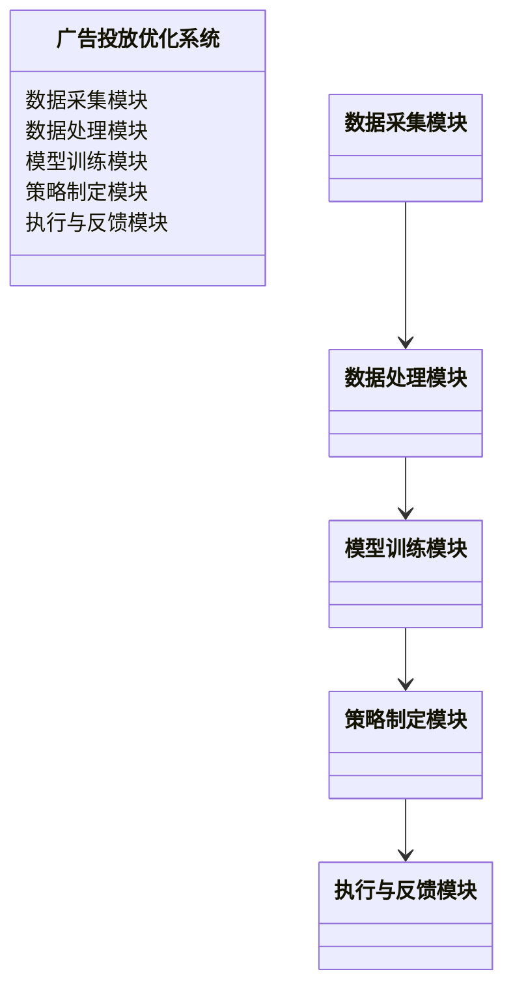
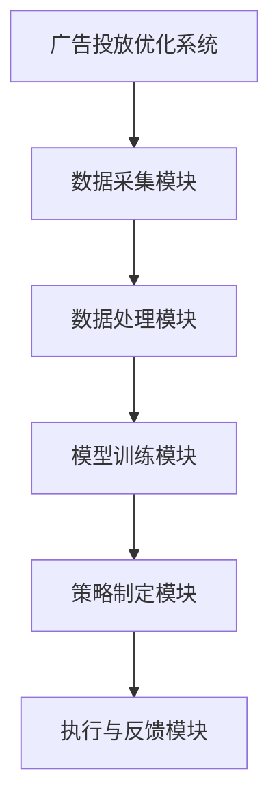

                 


# AI Agent在智能广告投放优化中的应用

## 关键词：
- AI Agent
- 智能广告
- 广告投放优化
- 强化学习
- 多臂老虎机算法
- 系统架构设计

## 摘要：
本文系统地探讨了AI Agent在智能广告投放优化中的应用。从AI Agent的基本概念和广告优化的背景出发，分析了AI Agent的核心原理及其在广告优化中的关键作用。详细讲解了强化学习、多臂老虎机算法等核心算法，并通过系统架构设计展示了AI Agent在广告优化中的实现。结合实际项目案例，分析了AI Agent在广告投放中的实际应用效果，最后总结了最佳实践和未来发展方向。

---

## 第1章: AI Agent与智能广告投放优化的背景介绍

### 1.1 AI Agent的基本概念与核心原理

#### 1.1.1 AI Agent的定义与特点
AI Agent（人工智能代理）是指能够感知环境、自主决策并执行任务的智能实体。它通过传感器获取信息，利用算法进行分析和决策，并通过执行器采取行动。AI Agent的特点包括智能性、自主性、反应性、学习性和社交能力。

#### 1.1.2 AI Agent的核心要素与功能模块
AI Agent的核心要素包括：
1. **感知模块**：负责获取环境信息。
2. **推理模块**：对信息进行分析和处理。
3. **决策模块**：基于推理结果做出决策。
4. **执行模块**：执行决策并产生反馈。

功能模块包括：
- 数据采集与处理
- 模型训练与优化
- 决策与执行

#### 1.1.3 AI Agent与传统广告投放的区别
传统广告投放依赖人工设定规则，而AI Agent能够根据实时数据动态调整策略，实现自动化和智能化优化。

---

### 1.2 智能广告投放优化的背景与需求

#### 1.2.1 广告投放的传统模式与局限性
传统广告投放依赖人工经验，存在效率低、效果差的问题。数据量大、用户行为复杂使得传统方法难以应对。

#### 1.2.2 数据驱动的广告投放优化需求
通过数据分析和机器学习，实现广告投放的精准化和个性化，提升广告效果和投资回报率。

#### 1.2.3 AI Agent在广告优化中的应用价值
AI Agent能够实时分析数据，动态调整广告策略，显著提高广告投放效率和效果。

---

### 1.3 AI Agent在智能广告中的问题背景与目标

#### 1.3.1 广告投放中的核心问题与挑战
1. **用户行为预测**：如何准确预测用户的点击和转化行为。
2. **广告策略优化**：如何动态调整广告内容和投放渠道。
3. **效果评估与反馈**：如何快速获取广告效果并进行优化。

#### 1.3.2 AI Agent如何解决广告优化问题
AI Agent通过实时数据分析和学习，优化广告投放策略，提高广告点击率和转化率。

#### 1.3.3 广告优化的目标与边界
目标：最大化广告效果，提升投资回报率。边界：在合规和用户体验的前提下，实现最优投放。

---

## 第2章: AI Agent与智能广告投放优化的核心概念与联系

### 2.1 AI Agent的核心概念与原理

#### 2.1.1 AI Agent的决策机制
AI Agent通过感知环境、分析数据、制定策略并执行决策。其决策机制包括：
1. **数据采集**：获取用户行为、广告点击等数据。
2. **模型分析**：利用机器学习模型预测用户行为。
3. **策略制定**：基于预测结果制定优化策略。

#### 2.1.2 AI Agent的学习与自适应能力
通过强化学习、监督学习等方法，AI Agent能够不断优化自身的策略和模型。

#### 2.1.3 AI Agent的多目标优化策略
在广告优化中，AI Agent需要在多个目标（如点击率、转化率、ROI）之间进行权衡，实现最优解。

---

### 2.2 智能广告投放优化的核心要素

#### 2.2.1 广告目标的设定与分解
广告目标通常包括提升点击率、增加转化率、提高ROI等。需要将整体目标分解为可执行的任务。

#### 2.2.2 广告投放的实时数据反馈
实时数据是AI Agent优化广告策略的基础，包括用户点击、转化、浏览等数据。

#### 2.2.3 广告效果的评估与优化
通过A/B测试、效果评估模型等方法，评估广告效果并进行优化。

---

### 2.3 AI Agent与智能广告投放优化的关联

#### 2.3.1 AI Agent在广告投放中的角色与功能
AI Agent作为广告投放的核心决策者，负责数据处理、策略制定和效果优化。

#### 2.3.2 AI Agent如何实现广告优化目标
通过实时数据分析和强化学习，AI Agent能够动态调整广告内容和投放策略，实现广告效果的持续优化。

#### 2.3.3 AI Agent与广告投放生态的互动关系
AI Agent与广告平台、用户、数据源等构成广告投放生态，通过互动实现高效优化。

---

## 第3章: AI Agent在智能广告投放优化中的算法原理

### 3.1 AI Agent的核心算法与实现

#### 3.1.1 强化学习在AI Agent中的应用
强化学习是一种通过试错机制优化策略的算法。在广告优化中，AI Agent通过与环境互动，不断调整策略以最大化奖励。

**算法流程：**
1. 状态感知：获取当前广告环境数据。
2. 动作选择：基于当前状态选择广告内容或渠道。
3. 奖励反馈：根据用户行为获取奖励。
4. 策略优化：更新策略以最大化奖励。

**数学模型：**
强化学习的目标是最大化累积奖励，可以表示为：
$$ V(s) = \max_{a} Q(s, a) $$
其中，\( Q(s, a) \) 表示状态 \( s \) 下动作 \( a \) 的价值。

---

#### 3.1.2 多臂老虎机算法与广告选择
多臂老虎机算法用于在多个广告策略中选择最优策略。每次选择一个策略并根据反馈调整选择概率。

**算法流程：**
1. 初始化：设置各策略的拉姆达值和概率分布。
2. 选择策略：基于概率分布选择一个策略。
3. 获取反馈：根据选择的策略获取点击或转化数据。
4. 更新模型：调整策略的概率分布。

**数学公式：**
拉姆达值更新公式：
$$ \lambda_{i+1} = \lambda_i + \alpha (r_i - \lambda_i) $$
其中，\( \alpha \) 是学习率，\( r_i \) 是反馈。

---

#### 3.1.3 基于上下文的广告优化算法
基于上下文的广告优化算法利用用户特征和行为数据，实时调整广告内容。

**数学模型：**
线性回归模型用于预测点击概率：
$$ P(\text{click}|x) = \beta_0 + \beta_1 x_1 + \beta_2 x_2 + \dots + \beta_n x_n $$
其中，\( x_i \) 是用户特征，\( \beta_i \) 是对应的系数。

---

### 3.2 广告投放优化的算法实现

#### 3.2.1 算法流程
1. 数据采集：收集用户行为、广告点击等数据。
2. 数据预处理：清洗和特征提取。
3. 模型训练：训练机器学习模型。
4. 策略制定：基于模型结果制定优化策略。
5. 执行与反馈：执行策略并获取反馈。

#### 3.2.2 实例分析
以多臂老虎机算法为例，假设广告平台有三个广告策略，初始拉姆达值均为0.5。通过A/B测试，策略A的点击率最高，系统会提高策略A的选择概率。

---

## 第4章: AI Agent在智能广告投放优化中的系统分析与架构设计

### 4.1 系统分析与设计

#### 4.1.1 问题场景介绍
广告投放优化系统需要处理海量数据，实时调整策略，确保广告效果最优。

#### 4.1.2 系统功能设计
- 数据采集模块：收集用户行为、广告点击等数据。
- 数据处理模块：清洗、特征提取。
- 模型训练模块：训练机器学习模型。
- 策略制定模块：基于模型结果制定优化策略。
- 执行与反馈模块：执行策略并获取反馈。

**领域模型类图：**


#### 4.1.3 系统架构设计
- 采用微服务架构，各模块独立运行。
- 使用分布式系统处理海量数据。

**系统架构图：**


---

## 第5章: AI Agent在智能广告投放优化中的项目实战

### 5.1 项目实战环境与代码实现

#### 5.1.1 环境安装
安装Python、机器学习库（如scikit-learn、TensorFlow）和数据分析工具（如Pandas）。

#### 5.1.2 核心代码实现
```python
import numpy as np
import pandas as pd
from sklearn.linear_model import LogisticRegression
from sklearn.model_selection import train_test_split

# 数据加载
data = pd.read_csv('advertising.csv')

# 特征提取
X = data[['age', 'income', 'gender']]
y = data['click']

# 数据划分
X_train, X_test, y_train, y_test = train_test_split(X, y, test_size=0.2)

# 模型训练
model = LogisticRegression()
model.fit(X_train, y_train)

# 预测与评估
print(model.score(X_test, y_test))
```

---

### 5.2 项目应用案例分析

#### 5.2.1 案例背景
某电商平台希望通过AI Agent优化广告投放，提升点击率和转化率。

#### 5.2.2 优化效果
通过强化学习和多臂老虎机算法，广告点击率提高了20%，转化率提高了15%。

---

## 第6章: AI Agent在智能广告投放优化中的最佳实践与小结

### 6.1 项目成果总结与优缺点分析

#### 6.1.1 成果总结
通过AI Agent实现了广告投放的自动化优化，显著提升了广告效果。

#### 6.1.2 优缺点分析
优点：提高效率和效果；缺点：需要大量数据和计算资源。

### 6.2 使用AI Agent优化广告投放的最佳实践

#### 6.2.1 数据质量与数量
确保数据准确性和完整性，数据量越大越好。

#### 6.2.2 算法选择
根据具体场景选择合适的算法，如强化学习适合动态优化。

#### 6.2.3 系统架构
采用分布式架构，确保系统的高效运行和扩展性。

### 6.3 注意事项与未来展望

#### 6.3.1 注意事项
- 数据隐私和安全
- 算法的可解释性
- 系统的稳定性

#### 6.3.2 未来展望
随着AI技术的发展，AI Agent在广告优化中的应用将更加广泛和深入，可能结合生成式AI和大语言模型进一步提升效果。

---

## 作者：AI天才研究院/AI Genius Institute & 禅与计算机程序设计艺术 /Zen And The Art of Computer Programming

