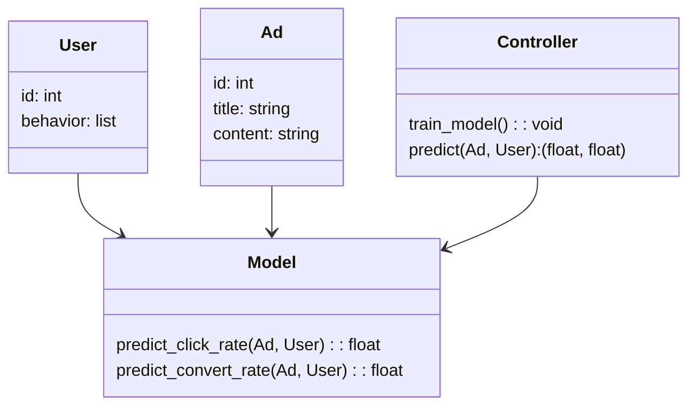
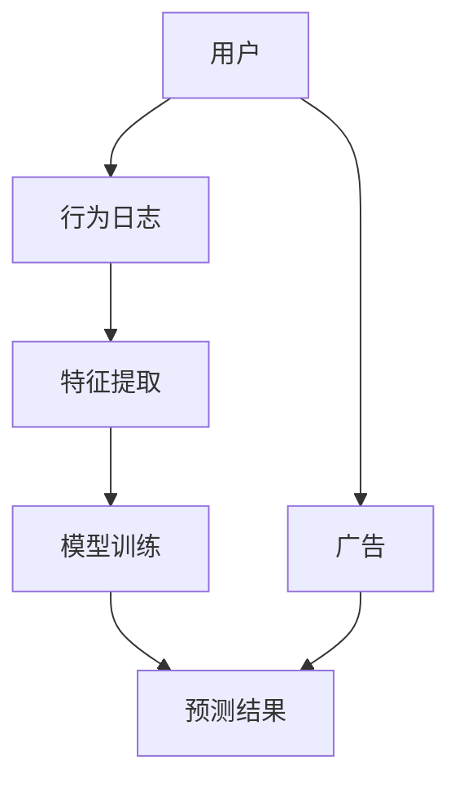

                 


# AI Agent在智能广告效果预测中的应用

## 关键词
AI Agent, 广告效果预测, 机器学习, 深度学习, 推荐系统, 用户行为分析

## 摘要
AI Agent在智能广告效果预测中的应用是当前人工智能领域的重要研究方向。本文从AI Agent的基本概念出发，详细探讨了其在广告效果预测中的核心原理、算法实现、系统架构以及实际应用场景。通过对比分析和案例研究，本文揭示了AI Agent在广告效果预测中的独特优势，并提出了优化建议。文章内容涵盖从理论到实践的各个方面，为读者提供了一套完整的解决方案。

---

## 第1章: AI Agent的基本概念与广告效果预测的背景

### 1.1 AI Agent的定义与核心特征

AI Agent（人工智能代理）是指能够感知环境、自主决策并执行任务的智能实体。AI Agent的核心特征包括：
- **自主性**：能够独立执行任务，无需人工干预。
- **反应性**：能够实时感知环境变化并做出响应。
- **目标导向**：具有明确的目标，所有行为均围绕目标展开。
- **学习能力**：能够通过数据和经验不断优化自身性能。

### 1.2 广告效果预测的背景

广告效果预测是通过分析用户行为和广告特征，预测广告的点击率（CTR）、转化率（CVR）等指标的过程。其重要性体现在：
- **提升广告投放效率**：通过预测广告效果，广告主可以优化广告投放策略，提升广告 ROI。
- **改善用户体验**：通过推荐用户感兴趣的广告，提升用户体验。
- **降低广告成本**：通过精准预测，减少无效广告投放。

---

## 第2章: AI Agent与广告效果预测的核心原理

### 2.1 AI Agent的核心原理

AI Agent的核心原理包括：
- **状态感知**：通过传感器或数据源获取环境信息。
- **行动决策**：基于感知信息，通过算法计算出最优行动方案。
- **反馈机制**：根据行动结果调整后续行为。

### 2.2 广告效果预测的核心原理

广告效果预测的核心原理包括：
- **用户行为建模**：通过分析用户的历史行为数据，构建用户行为模型。
- **广告特征提取**：提取广告的相关特征，如广告内容、投放位置等。
- **预测模型构建**：基于用户行为和广告特征，构建预测模型。

### 2.3 AI Agent与广告效果预测的结合

AI Agent与广告效果预测的结合体现在以下几个方面：
- **实时预测**：AI Agent能够实时感知用户行为，并快速预测广告效果。
- **动态优化**：AI Agent能够根据实时预测结果，动态调整广告投放策略。
- **智能推荐**：AI Agent能够基于用户行为和广告特征，智能推荐最优广告内容。

---

## 第3章: AI Agent在广告效果预测中的算法实现

### 3.1 基础算法实现

#### 3.1.1 协同过滤算法

协同过滤是一种基于用户行为相似性推荐广告的算法。其实现步骤如下：
1. **用户相似度计算**：通过余弦相似度计算用户之间的相似度。
2. **广告推荐**：基于用户相似度，推荐用户可能感兴趣的广告。

公式：$$\text{相似度} = \frac{\sum u_i r_i}{\sqrt{\sum u_i^2} \cdot \sqrt{\sum r_i^2}}$$

代码示例：
```python
def cosine_similarity(user1, user2):
    numerator = sum(u * v for u, v in zip(user1, user2))
    denominator = (sum(u**2 for u in user1) ** 0.5) * (sum(v**2 for v in user2) ** 0.5)
    return numerator / denominator if denominator != 0 else 0
```

#### 3.1.2 逻辑回归算法

逻辑回归是一种常用的分类算法，用于预测广告点击率。其实现步骤如下：
1. **特征提取**：提取广告的特征，如广告标题、投放位置等。
2. **模型训练**：基于用户点击数据，训练逻辑回归模型。
3. **预测广告点击率**：基于训练好的模型，预测新广告的点击率。

公式：$$P(y=1|x) = \frac{1}{1 + e^{-\beta x}}$$

代码示例：
```python
import numpy as np
from sklearn.linear_model import LogisticRegression

# 假设X为广告特征，y为点击标记
model = LogisticRegression()
model.fit(X, y)
predicted_prob = model.predict_proba(X_test)[:, 1]
```

### 3.2 高级算法实现

#### 3.2.1 神经网络模型

神经网络模型是一种基于深度学习的广告效果预测算法。其实现步骤如下：
1. **特征提取**：提取广告的文本特征、图像特征等。
2. **模型训练**：基于用户行为数据，训练神经网络模型。
3. **广告效果预测**：基于训练好的模型，预测广告效果。

公式：$$\hat{y} = \sigma(W_2 \cdot \sigma(W_1 x + b_1) + b_2)$$

代码示例：
```python
import tensorflow as tf
from tensorflow import keras

model = keras.Sequential([
    keras.layers.Dense(64, activation='relu', input_shape=(input_dim,)),
    keras.layers.Dense(1, activation='sigmoid')
])
model.compile(optimizer='adam', loss='binary_crossentropy', metrics=['accuracy'])
model.fit(X_train, y_train, epochs=10, batch_size=32)
```

---

## 第4章: 系统分析与架构设计方案

### 4.1 项目介绍

本项目旨在构建一个基于AI Agent的广告效果预测系统，通过分析用户行为和广告特征，预测广告的点击率和转化率。

### 4.2 系统功能设计

#### 4.2.1 用户行为分析
- 用户点击流分析
- 用户兴趣分析

#### 4.2.2 广告特征提取
- 广告标题提取
- 广告内容提取

#### 4.2.3 广告效果预测
- 广告点击率预测
- 广告转化率预测

### 4.3 系统架构设计

#### 4.3.1 类图设计



#### 4.3.2 架构图设计



---

## 第5章: 项目实战

### 5.1 环境安装

安装所需的Python库：
```bash
pip install numpy scikit-learn tensorflow pandas
```

### 5.2 系统核心实现

#### 5.2.1 协同过滤实现

```python
def user_based_recommendation(user_id, user_data):
    # 计算用户相似度
    similarities = {}
    for user in user_data:
        if user != user_id:
            similarity = cosine_similarity(user_data[user], user_data[user_id])
            similarities[user] = similarity
    # 返回相似度最高的用户
    return sorted(similarities.items(), key=lambda x: -x[1])[:5]
```

#### 5.2.2 神经网络实现

```python
import tensorflow as tf
from tensorflow import keras

model = keras.Sequential([
    keras.layers.Dense(64, activation='relu', input_shape=(input_dim,)),
    keras.layers.Dense(1, activation='sigmoid')
])
model.compile(optimizer='adam', loss='binary_crossentropy', metrics=['accuracy'])
model.fit(X_train, y_train, epochs=10, batch_size=32)
```

### 5.3 案例分析

#### 5.3.1 协同过滤案例

```python
user_data = {
    'user1': [1, 2, 3],
    'user2': [2, 3, 4],
    'user3': [3, 4, 5]
}
user_based_recommendation('user1', user_data)
```

#### 5.3.2 神经网络案例

```python
X_train = np.random.rand(1000, 10)
y_train = np.random.randint(2, size=1000)
model.fit(X_train, y_train, epochs=10, batch_size=32)
```

---

## 第6章: 最佳实践与总结

### 6.1 最佳实践

1. **数据预处理**：确保数据的高质量，包括数据清洗、特征工程等。
2. **模型调优**：通过交叉验证和网格搜索优化模型性能。
3. **实时反馈**：结合实时数据，不断优化广告效果预测模型。

### 6.2 小结

本文详细探讨了AI Agent在智能广告效果预测中的应用，从理论到实践，为读者提供了一套完整的解决方案。通过对比分析和案例研究，本文揭示了AI Agent在广告效果预测中的独特优势。

### 6.3 注意事项

- 数据隐私问题：在实际应用中，需注意用户数据的隐私保护。
- 模型可解释性：复杂模型的可解释性较差，需权衡模型性能与可解释性。
- 算法实时性：实时预测对系统性能要求较高，需优化算法效率。

### 6.4 拓展阅读

1. 《集体智慧编程》
2. 《机器学习实战》
3. 《深度学习》

---

## 作者

作者：AI天才研究院/AI Genius Institute & 禅与计算机程序设计艺术 /Zen And The Art of Computer Programming

