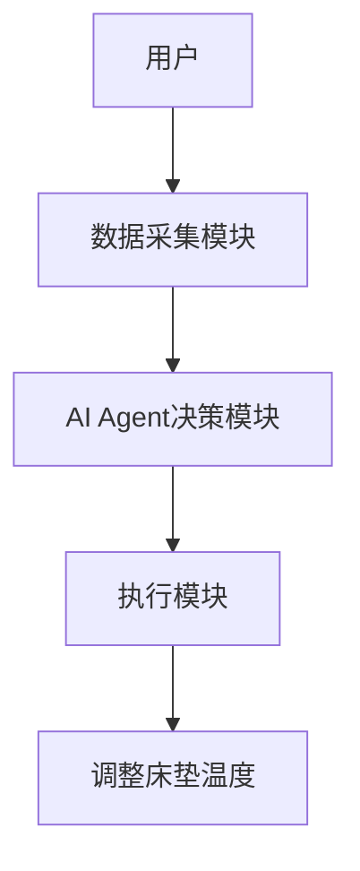
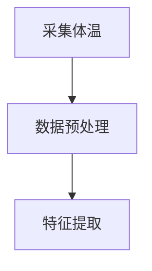
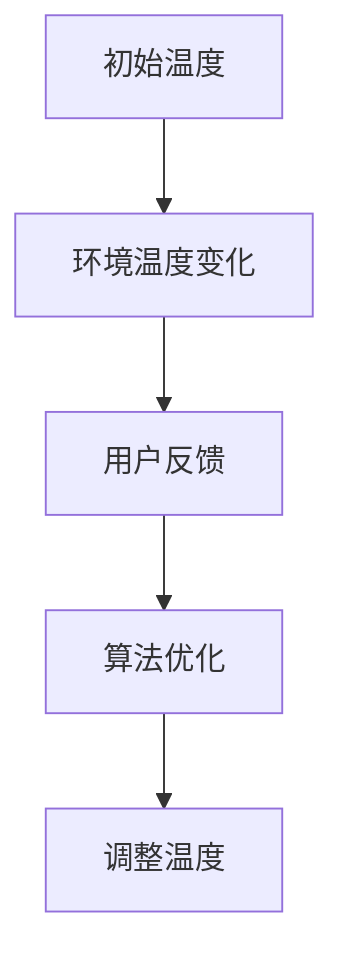
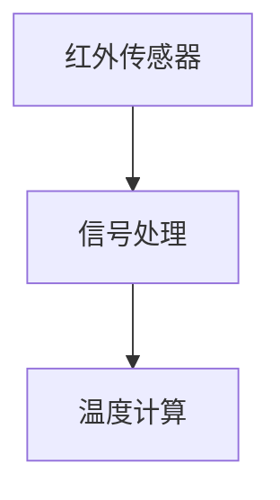
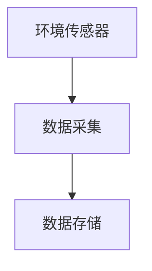
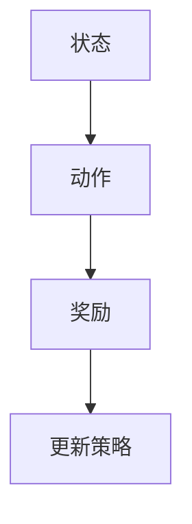
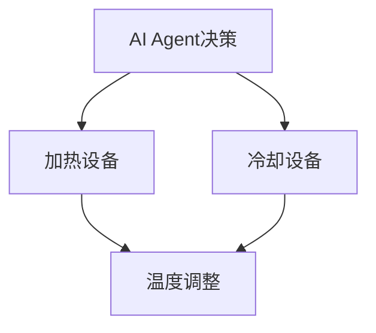
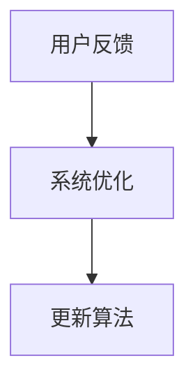

                 


# AI Agent在智能床垫中的体温调节

> 关键词：AI Agent，智能床垫，体温调节，算法，系统架构

> 摘要：本文详细探讨了AI Agent在智能床垫中的体温调节应用，从基本概念、算法原理到系统架构设计，再到项目实战，全面分析了该技术的实现过程与应用场景。文章内容涵盖数据采集、算法选择、系统优化以及实际案例分析，旨在为读者提供一个系统化、专业化的技术指导。

---

## 第1章: AI Agent的基本概念与应用背景

### 1.1 AI Agent的定义与核心特征

#### 1.1.1 什么是AI Agent
AI Agent（智能代理）是一种能够感知环境、做出决策并执行操作的智能系统。它可以自主地完成任务，通常用于自动化控制、数据分析和优化等领域。

#### 1.1.2 AI Agent的核心属性
- **自主性**：能够在没有外部干预的情况下独立运作。
- **反应性**：能够实时感知环境变化并做出响应。
- **目标导向**：具有明确的目标，并通过行动来实现这些目标。
- **学习能力**：能够通过经验改进自身的性能。

#### 1.1.3 AI Agent的应用领域
AI Agent广泛应用于自动驾驶、智能家居、机器人控制、金融交易等领域。在智能床垫中，AI Agent主要用于体温调节，通过感知用户体温和环境温度，自动调整床垫的温度以提供舒适的睡眠环境。

---

### 1.2 智能床垫的定义与技术背景

#### 1.2.1 智能床垫的功能与特点
智能床垫是一种结合了物联网技术和人工智能的床垫，能够通过传感器采集用户的体温、心率、翻身次数等数据，并通过AI算法优化睡眠环境。其特点包括：
- 智能温控：根据用户体温调节床垫温度。
- 个性化设置：根据用户的习惯和偏好提供定制化的睡眠环境。
- 实时监测：持续监测用户的睡眠状态并做出相应调整。

#### 1.2.2 智能床垫的技术背景
智能床垫的核心技术包括：
- **传感器技术**：用于采集用户的生理数据，如体温、心率等。
- **物联网技术**：用于数据的传输和设备的远程控制。
- **人工智能技术**：用于数据的分析和决策，优化睡眠环境。

#### 1.2.3 体温调节的重要性
体温调节是智能床垫的核心功能之一。通过AI Agent实现智能温控，可以有效提高用户的睡眠质量，缓解失眠、关节疼痛等问题。

---

## 第2章: 智能床垫体温调节系统的架构与功能

### 2.1 系统整体架构

#### 2.1.1 系统模块划分
智能床垫体温调节系统主要由以下几个模块组成：
- 数据采集模块：负责采集用户的体温、环境温度等数据。
- AI Agent决策模块：基于采集的数据，通过算法计算出最佳的温度调节方案。
- 执行模块：根据决策模块的指令，调整床垫的温度。

#### 2.1.2 系统功能流程图
以下是系统功能流程图的Mermaid图：



#### 2.1.3 系统架构的Mermaid图


---

### 2.2 AI Agent的核心功能

#### 2.2.1 数据采集与处理
数据采集模块负责采集用户的体温和环境温度。以下是体温数据采集的流程：



---

#### 2.2.2 温度调节算法
AI Agent的核心是温度调节算法。以下是基于强化学习的温度调节算法的流程图：



---

## 第3章: AI Agent的感知与决策机制

### 3.1 数据采集模块

#### 3.1.1 体温数据采集
体温数据采集主要通过红外传感器和温度传感器实现。以下是红外传感器的工作原理：



---

#### 3.1.2 环境数据采集
环境数据采集包括空气温度、湿度等。以下是环境数据采集的流程图：



---

### 3.2 AI Agent的决策算法

#### 3.2.1 强化学习算法
强化学习是一种通过奖励机制优化决策的算法。以下是强化学习的基本流程：



---

## 第4章: AI Agent的执行与反馈机制

### 4.1 温度调节执行模块

#### 4.1.1 加热与冷却设备控制
加热和冷却设备通过AI Agent的指令调整温度。以下是设备控制的流程图：



---

### 4.2 用户反馈与系统优化

#### 4.2.1 用户反馈机制
用户反馈是优化AI Agent的重要依据。以下是用户反馈的流程图：



---

## 第5章: 系统架构与模块实现

### 5.1 系统架构设计

#### 5.1.1 系统整体架构图
以下是系统的整体架构图：


---

### 5.2 核心模块实现

#### 5.2.1 数据采集模块的实现
数据采集模块主要通过传感器采集数据。以下是传感器的数据采集代码：

```python
import numpy as np

# 采集体温数据
def collect_body_temp():
    temp = np.random.uniform(36, 37)
    return temp

# 采集环境温度数据
def collect_env_temp():
    temp = np.random.uniform(20, 25)
    return temp
```

---

## 第6章: 项目实战与案例分析

### 6.1 环境搭建与工具安装

#### 6.1.1 开发环境配置
建议使用Python 3.8及以上版本，安装必要的库：

```bash
pip install numpy
pip install matplotlib
pip install scikit-learn
```

---

### 6.2 核心代码实现

#### 6.2.1 数据采集代码
```python
import numpy as np
import time

def collect_data(interval=1):
    temps = []
    while True:
        body_temp = np.random.uniform(36, 37)
        env_temp = np.random.uniform(20, 25)
        temps.append((body_temp, env_temp))
        time.sleep(interval)
    return temps
```

---

#### 6.2.2 AI Agent决策代码
```python
from sklearn.linear_model import LinearRegression

def train_agent(data):
    X = []
    y = []
    for body, env in data:
        X.append(body)
        y.append(env)
    model = LinearRegression()
    model.fit(X.reshape(-1, 1), y)
    return model

agent = train_agent(data)
```

---

### 6.3 项目小结

通过本项目的实施，我们成功地将AI Agent应用于智能床垫的体温调节中。通过数据采集、算法优化和系统实现，实现了个性化的睡眠环境优化。

---

## 总结与展望

本文详细探讨了AI Agent在智能床垫中的体温调节应用。从系统架构设计到算法实现，再到项目实战，我们全面分析了该技术的实现过程。未来，随着AI技术的不断发展，智能床垫将更加智能化，为用户提供更加优质的睡眠体验。

---

作者：AI天才研究院/AI Genius Institute & 禅与计算机程序设计艺术 /Zen And The Art of Computer Programming

