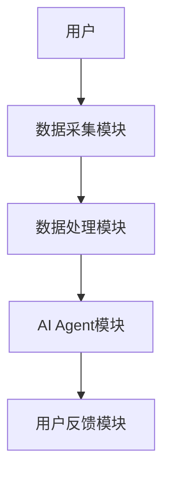

                 


# AI Agent在智能床垫中的睡眠姿势分析

## 关键词：AI Agent, 智能床垫, 睡眠姿势分析, 传感器数据, 机器学习, 深度学习, 健康监测

## 摘要：  
本文深入探讨了AI Agent在智能床垫中的睡眠姿势分析应用。通过结合传感器技术和人工智能算法，AI Agent能够实时采集并分析用户的睡眠姿势数据，从而提供个性化的睡眠健康建议。文章从技术背景、算法原理、系统架构到实际应用案例，全面解析了AI Agent在睡眠姿势分析中的核心作用，并展望了未来的发展方向。

---

# 第一部分: 背景与核心概念

## 第1章: 睡眠姿势分析的背景与意义

### 1.1 睡眠健康的重要性  
睡眠是人体健康的核心要素之一，直接影响精力、免疫力和心理健康。然而，现代生活中，睡眠障碍（如失眠、打鼾等）普遍，尤其是睡眠姿势不当，可能导致颈椎病、腰椎病等问题。  

### 1.2 AI Agent技术的背景  
AI Agent（人工智能代理）是一种能够感知环境、自主决策并执行任务的智能实体。在医疗健康领域，AI Agent通过数据采集、分析和反馈，为用户提供个性化的健康解决方案。  

### 1.3 智能床垫的出现  
智能床垫通过内置传感器，能够实时采集用户的生理数据（如心率、呼吸频率、体动频率等）和环境数据（如温度、湿度）。结合AI Agent技术，智能床垫能够实现对睡眠姿势的智能分析和健康建议。

---

## 第2章: 智能床垫与AI Agent的结合

### 2.1 智能床垫的功能与技术特点  
- **传感器技术**：智能床垫内置多种传感器，包括压力传感器、加速度传感器、温度传感器等，能够实时采集用户的睡眠数据。  
- **数据采集与传输**：通过传感器采集的数据，智能床垫能够将用户的睡眠姿势、体动频率、心率等信息传输到云端或本地设备。  
- **用户体验设计**：智能床垫通过与手机APP或智能音箱等设备联动，为用户提供个性化的睡眠建议和健康报告。

### 2.2 AI Agent在智能床垫中的应用  
- **姿势识别**：AI Agent通过分析传感器数据，能够实时识别用户的睡眠姿势（如仰睡、侧睡、俯睡等）。  
- **数据处理与反馈**：AI Agent对采集到的数据进行处理，结合用户的健康档案，提供个性化的睡眠优化建议。  
- **健康监测**：通过长期监测用户的睡眠姿势和相关数据，AI Agent能够发现潜在的健康问题，并及时预警。

---

# 第二部分: 睡眠姿势分析的核心技术

## 第3章: 睡眠姿势的分类与特征

### 3.1 睡眠姿势的分类  
- **仰睡**：用户平躺，适合有颈椎问题的人群。  
- **侧睡**：用户向左侧或右侧躺，适合消除水肿和改善呼吸。  
- **俯睡**：用户趴着睡觉，适合缓解背部疼痛。  

### 3.2 睡眠姿势的特征分析  
- **体动频率**：不同姿势下，用户的体动频率和幅度不同。  
- **压力分布**：不同姿势下，床垫的压力分布也不同。  
- **呼吸与心率**：睡眠姿势影响呼吸和心率的稳定性。  

---

## 第4章: 数据采集与特征提取

### 4.1 数据采集技术  
- **传感器数据**：包括压力、加速度、温度、湿度等。  
- **数据预处理**：去除噪声、填补缺失值、标准化处理。  

### 4.2 特征提取方法  
- **时间域特征**：如均值、方差、最大值、最小值等。  
- **频域特征**：如FFT分析中的频谱特征。  

---

## 第5章: AI Agent的算法原理

### 5.1 机器学习算法  
- **支持向量机（SVM）**：适用于小样本分类问题。  
- **随机森林**：适用于特征较多的分类任务。  

### 5.2 深度学习算法  
- **卷积神经网络（CNN）**：适用于图像数据的特征提取。  
- **长短期记忆网络（LSTM）**：适用于时间序列数据的分析。  

---

# 第三部分: 系统架构与实现

## 第6章: 系统架构设计

### 6.1 系统模块划分  
- **数据采集模块**：负责采集用户的睡眠数据。  
- **数据处理模块**：对采集到的数据进行预处理和特征提取。  
- **AI Agent模块**：负责姿势识别和健康分析。  
- **用户反馈模块**：将分析结果反馈给用户。  

### 6.2 系统架构图  


---

## 第7章: 系统实现与代码解读

### 7.1 环境安装  
- **Python 3.8+**  
- **TensorFlow 2.0+**  
- **传感器数据采集库（如Arduino或Raspberry Pi）**  

### 7.2 核心代码实现  
```python
import numpy as np
from sklearn.svm import SVC

# 数据预处理
def preprocess(data):
    # 去除噪声
    data_smooth = np.convolve(data, np.ones(5)/5, mode='valid')
    # 填补缺失值
    data_filled = data_smooth.fillna(data_smooth.mean())
    return data_filled

# 姿势分类
def pose_classification(X_train, y_train, X_test):
    model = SVC()
    model.fit(X_train, y_train)
    y_pred = model.predict(X_test)
    return y_pred
```

---

# 第四部分: 实际应用与总结

## 第8章: 项目实战与案例分析

### 8.1 实际案例  
- **案例背景**：一位用户长期侧睡，导致肩颈疼痛。  
- **数据采集**：采集该用户的睡眠数据，包括体动频率、压力分布等。  
- **姿势分析**：AI Agent识别用户主要采用侧睡姿势，并分析其呼吸和心率数据。  
- **健康建议**：建议用户尝试仰睡，并调整床垫硬度。

---

## 第9章: 最佳实践与总结

### 9.1 小结  
AI Agent在智能床垫中的应用，不仅能够实时分析用户的睡眠姿势，还能结合用户的健康数据，提供个性化的睡眠优化建议。

### 9.2 注意事项  
- 数据隐私保护：确保用户的睡眠数据不被滥用。  
- 算法优化：持续优化AI Agent的分类算法，提高姿势识别的准确率。  

### 9.3 未来展望  
随着AI技术的不断进步，AI Agent在睡眠姿势分析中的应用将更加智能化和个性化。未来的智能床垫将能够实时监测用户的健康状况，并与智能家居系统联动，为用户提供全方位的健康服务。

---

## 作者：AI天才研究院/AI Genius Institute & 禅与计算机程序设计艺术 /Zen And The Art of Computer Programming

