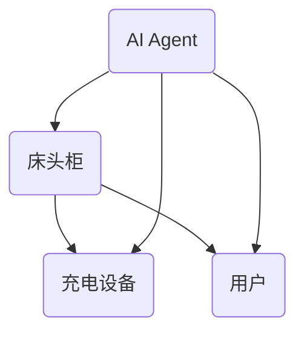
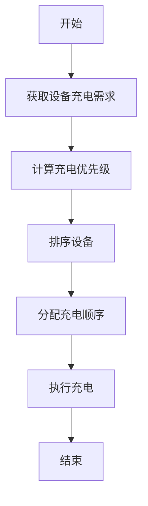
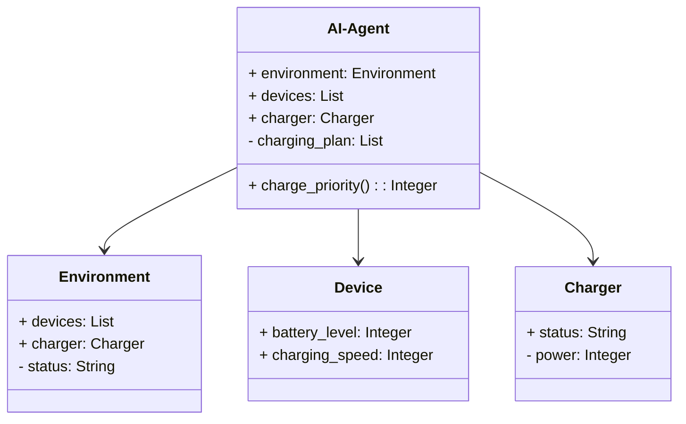
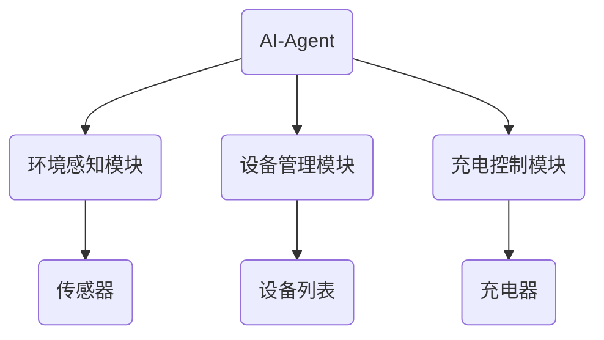

                 


# AI Agent在智能床头柜中的充电管理

> 关键词：AI Agent, 智能床头柜, 充电管理, 算法原理, 系统架构设计

> 摘要：本文探讨AI Agent在智能床头柜中的充电管理应用，从背景介绍到项目实战，详细分析其技术原理、系统架构设计、算法实现及实际应用案例。通过多维度的分析，揭示AI Agent如何优化充电管理，提升用户体验。

---

## 第一部分: AI Agent与智能床头柜充电管理背景介绍

### 第1章: AI Agent与智能床头柜充电管理概述

#### 1.1 AI Agent的基本概念
AI Agent，即人工智能代理，是一种能够感知环境、自主决策并执行任务的智能实体。它结合了感知、推理、规划和执行能力，能够根据环境变化动态调整行为。AI Agent在智能床头柜中的应用，使其能够智能地管理充电设备，优化充电效率，提升用户体验。

#### 1.2 智能床头柜的定义与特点
智能床头柜是一种集成AI技术的智能家居设备，具备智能充电管理、环境感知、用户交互等多种功能。其特点包括：
- **智能化**：通过AI Agent实现自动化管理。
- **互联性**：与智能家居系统无缝连接，支持远程控制。
- **用户友好**：提供便捷的充电服务和个性化设置。

#### 1.3 充电管理的必要性
随着智能家居的普及，家庭中使用的电子设备越来越多，传统的充电管理方式已无法满足用户需求。AI Agent通过智能调度和优化充电顺序，可以有效提高充电效率，延长设备使用寿命，同时减少能源浪费。

#### 1.4 本章小结
本章介绍了AI Agent的基本概念、智能床头柜的定义及其特点，分析了充电管理的必要性，为后续内容奠定了基础。

---

## 第二部分: AI Agent在智能床头柜充电管理中的核心概念与联系

### 第2章: AI Agent的核心概念与原理

#### 2.1 AI Agent的结构与功能
AI Agent的结构通常包括感知层、决策层和执行层：
- **感知层**：通过传感器或API接口获取环境信息。
- **决策层**：基于感知信息进行推理和规划，制定最优决策。
- **执行层**：通过执行机构（如充电器）实现决策。

#### 2.2 AI Agent与智能床头柜的关联
AI Agent在智能床头柜中的角色是管理充电设备的运行。它通过与床头柜硬件的交互，实现设备的智能充电管理。例如，当检测到用户的手机电量低时，AI Agent会优先启动充电功能。

#### 2.3 AI Agent的属性特征对比
以下是AI Agent与其他管理方式的对比：

| 对比维度       | AI Agent                          | 传统定时器                     | 简单传感器                     |
|----------------|-----------------------------------|-------------------------------|-------------------------------|
| 智能性          | 高                                 | 低                             | 低                             |
| 学习能力        | 支持机器学习                      | 无                             | 无                             |
| 决策能力        | 支持动态决策                      | 固定时间表                     | 基于简单条件                   |

#### 2.4 系统实体关系图
以下是系统的实体关系图：



---

## 第三部分: AI Agent充电管理的算法原理

### 第3章: AI Agent充电管理的算法原理

#### 3.1 算法概述
AI Agent通过优先级调度算法优化充电顺序。算法根据设备的充电需求、剩余电量、充电优先级等因素，动态调整充电顺序。

#### 3.2 算法流程图
以下是算法流程图：



#### 3.3 算法实现代码
以下是优先级调度算法的Python代码实现：

```python
def charge_priority(chargingDevices):
    devices = []
    for dev in chargingDevices:
        priority = dev.battery_level * 10 + dev.charging_speed
        devices.append((priority, dev.device_id))
    devices.sort(reverse=True, key=lambda x: x[0])
    return devices

chargingDevices = [
    {"battery_level": 20, "charging_speed": 1},
    {"battery_level": 30, "charging_speed": 2},
    {"battery_level": 25, "charging_speed": 3}
]

result = charge_priority(chargingDevices)
print(result)
```

#### 3.4 数学模型
优先级计算公式：

$$ \text{priority} = \text{battery\_level} \times 10 + \text{charging\_speed} $$

---

## 第四部分: 系统分析与架构设计

### 第4章: 系统分析与架构设计

#### 4.1 系统功能设计
以下是系统功能设计的类图：



#### 4.2 系统架构设计
以下是系统架构设计图：



---

## 第五部分: 项目实战

### 第5章: 项目实战

#### 5.1 环境安装
需要安装以下库和工具：
- Python 3.8+
- Mermaid CLI
- Graphviz

#### 5.2 核心代码实现
以下是核心代码实现：

```python
class Charger:
    def __init__(self):
        self.status = "idle"
        self.power = 100

    def start_charge(self, device):
        self.status = "charging"
        self.power -= device.charging_speed

class Device:
    def __init__(self, battery_level, charging_speed):
        self.battery_level = battery_level
        self.charging_speed = charging_speed

    def get_priority(self):
        return self.battery_level * 10 + self.charging_speed

# 示例
 charger = Charger()
 devices = [
     Device(20, 1),
     Device(30, 2),
     Device(25, 3)
 ]

 for dev in devices:
     print(f"Device {dev.charging_speed} priority: {dev.get_priority()}")
 ```

#### 5.3 实际案例分析
通过实际案例分析，展示系统在不同场景下的表现，例如多设备同时充电时的优先级排序。

#### 5.4 项目小结
总结项目成果，分析经验教训，提出改进建议。

---

## 第六部分: 最佳实践、小结、注意事项

### 第6章: 最佳实践与小结

#### 6.1 最佳实践
- **算法优化**：定期更新优先级算法，适应用户需求变化。
- **系统安全**：加强数据安全和权限管理，防止未经授权的访问。
- **用户体验优化**：提供可视化界面和个性化的充电设置。

#### 6.2 小结
本文详细探讨了AI Agent在智能床头柜充电管理中的应用，从理论到实践，全面分析了其技术原理、系统架构和实现方案。

#### 6.3 注意事项
- 确保系统兼容性，支持多种设备类型。
- 定期维护和更新系统，确保长期稳定运行。

---

## 结语

通过本文的分析，读者可以全面了解AI Agent在智能床头柜充电管理中的应用，掌握其技术原理和实现方法。未来，随着AI技术的不断发展，智能床头柜的充电管理将更加智能化和个性化。

---

## 作者

作者：AI天才研究院/AI Genius Institute & 禅与计算机程序设计艺术 /Zen And The Art of Computer Programming

