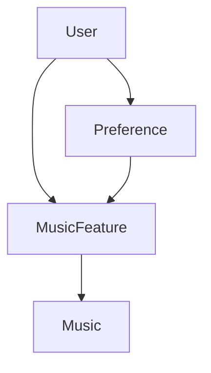
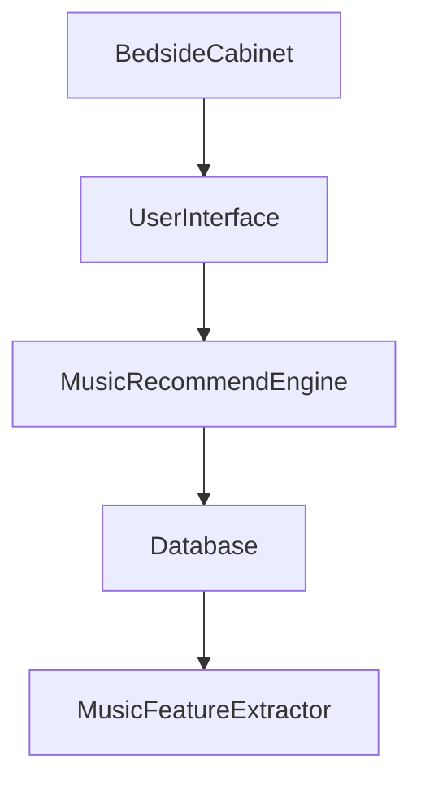
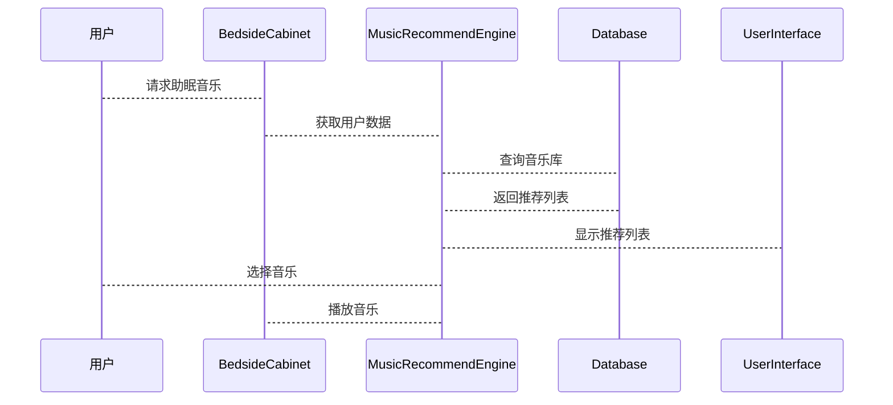

                 


# AI Agent在智能床头柜中的助眠音乐定制

> 关键词：AI Agent, 智能床头柜, 助眠音乐, 个性化推荐, 机器学习

> 摘要：本文探讨了AI Agent在智能床头柜中用于助眠音乐定制的应用。通过分析助眠音乐的个性化需求，结合AI Agent的核心原理，提出了基于协同过滤和深度学习的推荐算法，并设计了系统的架构和交互流程，最后通过实际案例展示了AI Agent在助眠音乐定制中的优势。

---

# 第一部分: AI Agent与助眠音乐定制的背景与基础

## 第1章: 问题背景与需求分析

### 1.1 助眠音乐的现状与挑战
- 当前助眠音乐的使用现状：用户对个性化音乐需求强烈，但传统方法难以满足。
- 现有解决方案的局限性：缺乏个性化推荐，音乐选择单一，用户体验差。
- 用户需求的多样化与个性化：不同用户对音乐风格、节奏、情感的需求差异显著。

### 1.2 AI Agent的基本概念与作用
- AI Agent的定义：智能代理，能够感知环境并自主决策。
- AI Agent的特点：自主性、反应性、目标导向。
- AI Agent在智能设备中的应用：个性化推荐、智能控制、用户交互。

### 1.3 智能床头柜的功能与应用场景
- 功能模块：音乐播放、环境监测、用户交互。
- 助眠音乐定制的具体需求：根据用户情绪、生理状态推荐音乐。
- 用户体验与场景分析：睡前使用，强调舒适性和便捷性。

## 第2章: 助眠音乐定制的核心概念与联系

### 2.1 AI Agent的核心原理
- 基于机器学习的音乐推荐算法：协同过滤、内容推荐、深度学习。
- 个性化推荐模型：考虑用户偏好、情绪状态和环境因素。

### 2.2 助眠音乐的属性与特征分析
- 音乐风格的分类：古典、爵士、轻音乐等。
- 音乐节奏与用户情绪的关系：慢节奏音乐有助于放松。
- 音乐情感分析：识别音乐中的情感特征。

### 2.3 系统核心概念的ER实体关系图


## 第3章: 助眠音乐推荐算法的数学模型与实现

### 3.1 基于协同过滤的推荐算法
- 用户相似度计算公式：
$$ \text{相似度} = \frac{\sum (u_i - \bar{u})(v_i - \bar{v})}{\sqrt{\sum (u_i - \bar{u})^2} \cdot \sqrt{\sum (v_i - \bar{v})^2}} $$
- 项目相似度计算：
$$ \text{相似度} = \frac{\sum (u_i - \bar{u})(v_i - \bar{v})}{\sqrt{\sum (u_i - \bar{u})^2} \cdot \sqrt{\sum (v_i - \bar{v})^2}} $$

### 3.2 基于内容的推荐算法
- 音乐特征提取：分析音乐的节奏、音调、情感。
- 内容相似度计算：基于音乐特征向量的相似度。

### 3.3 深度学习模型的推荐算法
- 神经网络模型：用于音乐特征提取和用户偏好预测。
- 生成模型：生成符合用户需求的音乐片段。

---

# 第二部分: 助眠音乐定制系统的分析与设计

## 第4章: 系统分析与架构设计

### 4.1 问题场景介绍
- 用户需求：个性化助眠音乐推荐。
- 系统功能：数据采集、推荐引擎、交互界面。

### 4.2 系统功能设计
- 用户数据采集模块：收集用户情绪、生理数据。
- 音乐推荐引擎：基于AI算法推荐音乐。
- 用户交互界面：展示推荐结果并收集反馈。

### 4.3 系统架构设计


### 4.4 系统接口设计
- 数据接口：与智能设备和传感器的数据接口对接。
- 推荐接口：向用户展示推荐结果。

### 4.5 系统交互流程


---

# 第三部分: 助眠音乐定制系统的实现与优化

## 第5章: 项目实战与实现细节

### 5.1 环境安装与配置
- 开发环境：Python、Jupyter Notebook。
- 库的安装：Pandas、NumPy、Scikit-learn、TensorFlow。

### 5.2 核心代码实现
```python
import numpy as np
from sklearn.metrics.pairwise import cosine_similarity

# 示例协同过滤算法实现
def user_based_recommendation(users_data):
    user_mean = np.mean(users_data, axis=1).reshape(-1,1)
    centered_data = users_data - user_mean
    similarity = cosine_similarity(centered_data)
    return similarity
```

### 5.3 案例分析与结果解读
- 实际案例：基于协同过滤算法为特定用户推荐音乐。
- 结果解读：分析推荐结果的有效性和准确性。

---

## 第6章: 最佳实践与优化建议

### 6.1 系统优化建议
- 数据优化：引入更多用户行为数据。
- 算法优化：结合协同过滤和深度学习模型。

### 6.2 用户体验优化
- 交互设计：简化用户操作，提升反馈响应速度。

### 6.3 注意事项
- 数据隐私保护：确保用户数据的安全性。
- 系统稳定性：保证推荐引擎的高可用性。

---

## 第7章: 总结与展望

### 7.1 全文总结
- AI Agent在助眠音乐定制中的核心作用。
- 系统设计与实现的关键点。

### 7.2 未来展望
- 新算法的应用：如图神经网络。
- 新技术的结合：如增强现实技术。

---

# 作者：AI天才研究院 & 禅与计算机程序设计艺术

