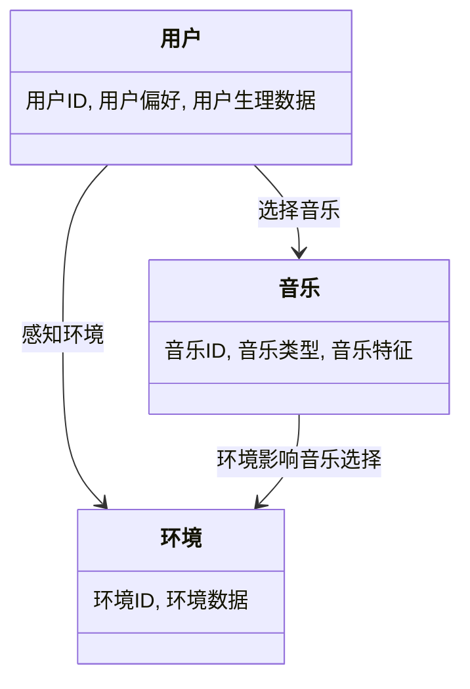
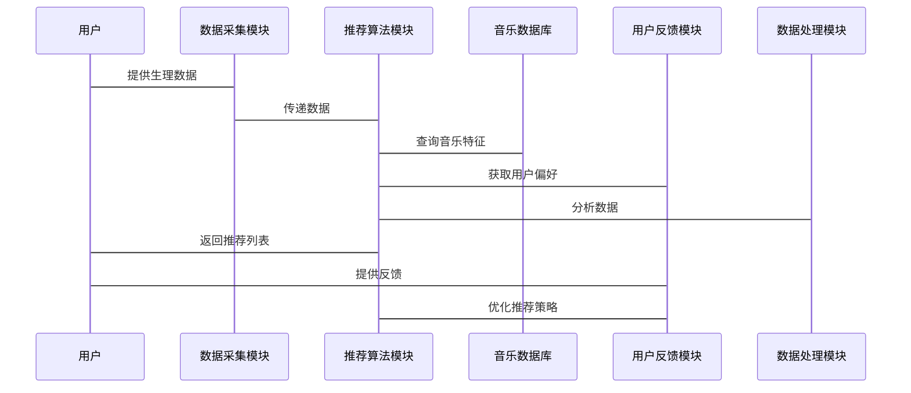

                 


# AI Agent在智能床头柜中的助眠音乐选择

## 关键词
AI Agent, 助眠音乐, 智能床头柜, 音乐推荐, 个性化推荐

## 摘要
本文深入探讨了AI Agent在智能床头柜中的助眠音乐选择应用，从问题背景到系统设计，从算法原理到项目实现，全面分析了AI Agent如何通过数据驱动和智能算法为用户提供个性化的助眠音乐推荐。文章详细阐述了AI Agent的核心概念、推荐算法的数学模型、系统架构设计以及实际项目中的实现细节，为读者提供了从理论到实践的全面指导。

---

# 第一部分: 背景介绍

## 第1章: 问题背景

### 1.1 问题背景
#### 1.1.1 睡眠问题的普遍性
现代生活中，睡眠问题日益普遍。根据世界卫生组织的数据，全球约有30%的人存在睡眠障碍，影响健康和生活质量。助眠音乐作为一种非侵入性的解决方案，逐渐受到关注。

#### 1.1.2 助眠音乐的作用与局限性
助眠音乐通过调节情绪和降低焦虑，帮助用户放松身心，改善睡眠质量。然而，传统助眠音乐选择方法依赖于固定分类或简单的人工选择，难以满足个性化需求。

#### 1.1.3 智能床头柜的发展趋势
智能床头柜作为智能家居的重要组成部分，集成了多种智能功能，包括环境监测、健康数据采集和智能交互。通过AI技术的引入，智能床头柜能够更精准地满足用户的个性化需求。

### 1.2 问题描述
#### 1.2.1 助眠音乐选择的挑战
- 用户需求多样：不同人对音乐的偏好和敏感度不同，固定音乐列表难以满足所有用户。
- 音乐特性复杂：音乐的节奏、调式、音量等因素对助眠效果的影响需要综合考虑。
- 用户反馈延迟：助眠效果通常在较长的时间后才能体现，难以实时调整推荐策略。

#### 1.2.2 现有解决方案的不足
- 传统音乐推荐系统基于全局统计，难以应对个性化需求。
- 助眠音乐选择缺乏动态调整机制，无法根据用户实时状态优化推荐。

#### 1.2.3 AI Agent在助眠音乐选择中的应用潜力
AI Agent能够实时感知用户状态，结合环境数据和用户反馈，动态优化助眠音乐推荐，显著提升用户体验。

### 1.3 问题解决与边界
#### 1.3.1 AI Agent在助眠音乐选择中的解决方案
AI Agent通过以下方式实现助眠音乐推荐：
1. 数据采集：整合用户的生理数据、环境数据和音乐特征。
2. 特征提取：分析音乐的音调、节奏、音量等特征。
3. 智能推荐：基于用户偏好和实时状态，动态推荐助眠音乐。

#### 1.3.2 解决方案的边界与外延
- 边界：仅关注助眠音乐推荐，不涉及其他床头柜功能（如灯光调节、温度控制）。
- 外延：可扩展至其他健康领域，如个性化医疗建议、健康监测等。

#### 1.3.3 核心概念与系统架构
- 核心概念：AI Agent、助眠音乐、智能床头柜。
- 系统架构：包括数据采集模块、特征提取模块、推荐算法模块和用户反馈模块。

### 1.4 核心概念与系统架构
#### 1.4.1 AI Agent的核心要素
- 感知能力：实时采集用户数据和环境数据。
- 推理能力：分析数据，生成推荐策略。
- 执行能力：动态调整音乐播放。

#### 1.4.2 助眠音乐选择的系统模型
- 输入：用户生理数据、环境数据、音乐特征。
- 输出：个性化助眠音乐推荐。

#### 1.4.3 智能床头柜的功能模块
- 数据采集模块：采集用户心率、呼吸频率等生理数据。
- 音乐库模块：存储助眠音乐的特征信息。
- 用户反馈模块：收集用户的睡眠质量和音乐偏好反馈。

---

# 第二部分: 核心概念与系统架构

## 第2章: 核心概念与系统架构

### 2.1 AI Agent的核心概念
#### 2.1.1 AI Agent的定义与特征
AI Agent是一种能够感知环境、执行任务的智能实体。在助眠音乐选择中，AI Agent通过实时数据处理和智能推荐，为用户提供个性化服务。

#### 2.1.2 AI Agent在助眠音乐选择中的角色
AI Agent负责数据采集、特征分析和推荐策略生成，实现从数据到决策的全链路管理。

#### 2.1.3 AI Agent与传统音乐推荐系统的区别
- AI Agent具有更强的实时性和动态调整能力。
- 传统音乐推荐系统基于静态数据，缺乏个性化优化。

### 2.2 助眠音乐选择的核心要素
#### 2.2.1 音乐特征分析
- 音乐类型：古典、轻音乐、自然声音等。
- 音乐节奏：慢节奏音乐更适合助眠。
- 音量控制：低音量有助于放松。

#### 2.2.2 用户行为分析
- 用户的睡眠习惯：入睡时间、睡眠时长。
- 用户偏好：喜欢的音乐类型、音量偏好。
- 用户反馈：对推荐音乐的满意度。

#### 2.2.3 助眠效果的评估指标
- 睡眠深度：通过心率、脑电波等数据评估。
- 睡眠时长：实际睡眠时间与目标睡眠时间的差异。
- 用户满意度：用户对推荐音乐的主观评价。

### 2.3 系统架构与模块划分
#### 2.3.1 系统整体架构
系统架构包括数据采集模块、特征提取模块、推荐算法模块和用户反馈模块。

#### 2.3.2 各功能模块的定义与交互
- 数据采集模块：采集用户生理数据和环境数据。
- 特征提取模块：分析音乐特征和用户偏好。
- 推荐算法模块：生成个性化推荐列表。
- 用户反馈模块：收集用户反馈，优化推荐策略。

#### 2.3.3 系统的输入输出流程
输入：用户生理数据、环境数据、音乐特征。
输出：个性化助眠音乐推荐。

---

# 第三部分: AI Agent的算法原理与数学模型

## 第3章: AI Agent的算法原理

### 3.1 数据收集与特征提取
#### 3.1.1 数据来源与采集方法
- 数据来源：用户生理数据、环境数据、音乐特征。
- 采集方法：通过传感器和音乐库获取数据。

#### 3.1.2 音乐特征的提取与分析
- 音乐特征：音乐类型、节奏、音调、音量。
- 数据预处理：标准化和归一化处理。

#### 3.1.3 用户行为数据的采集与处理
- 用户行为：音乐偏好、睡眠习惯、反馈数据。
- 数据清洗：去除噪声数据，提取有效特征。

### 3.2 推荐算法的核心原理
#### 3.2.1 基于协同过滤的推荐算法
- 用户-用户协同过滤：基于相似用户的推荐。
- 物品-物品协同过滤：基于相似音乐的推荐。
- 混合推荐：结合用户和物品特征的推荐。

#### 3.2.2 基于内容的推荐算法
- 音乐内容分析：分析音乐的特征属性。
- 用户偏好分析：提取用户的偏好特征。
- 内容相似度计算：基于音乐特征的相似度。

#### 3.2.3 混合推荐算法的优势
- 综合考虑用户偏好和音乐特征。
- 提高推荐准确性和多样性。

### 3.3 个性化优化策略
#### 3.3.1 用户偏好模型的构建
- 基于聚类分析：将用户分成不同的偏好群体。
- 基于回归分析：预测用户的音乐偏好。

#### 3.3.2 动态调整推荐策略的方法
- 实时更新用户偏好。
- 根据反馈动态调整推荐列表。

#### 3.3.3 基于反馈的实时优化机制
- 用户反馈：满意度评分、偏好调整。
- 系统响应：根据反馈优化推荐策略。

## 第4章: 数学模型与公式

### 4.1 协同过滤推荐算法的数学模型
#### 4.1.1 用户-物品协同过滤公式
$$sim(i,j) = \frac{\sum_{k} (r_{i,k} - \bar{r_i})(r_{j,k} - \bar{r_j})}{\sqrt{\sum_{k} (r_{i,k} - \bar{r_i})^2} \sqrt{\sum_{k} (r_{j,k} - \bar{r_j})^2}}$$

其中：
- $sim(i,j)$ 表示用户$i$和$j$之间的相似度。
- $r_{i,k}$ 表示用户$i$对物品$k$的评分。
- $\bar{r_i}$ 表示用户$i$的平均评分。

#### 4.1.2 基于矩阵分解的推荐算法
$$P \times Q^T = R$$

其中：
- $P$ 是用户特征矩阵。
- $Q$ 是物品特征矩阵。
- $R$ 是评分矩阵。

---

# 第四部分: 系统分析与架构设计

## 第5章: 系统分析与架构设计

### 5.1 问题场景介绍
- 使用场景：用户在晚上使用智能床头柜辅助入睡。
- 问题需求：根据用户状态和环境数据，推荐最优助眠音乐。

### 5.2 系统功能设计
#### 5.2.1 领域模型设计
- 用户模型：包括用户的基本信息和偏好。
- 音乐模型：包括音乐的特征信息和分类信息。
- 环境模型：包括环境的光照、温度等信息。

#### 5.2.2 领域模型Mermaid类图


### 5.3 系统架构设计
#### 5.3.1 系统架构Mermaid图


#### 5.3.2 系统接口设计
- 数据接口：采集用户生理数据和环境数据。
- 推荐接口：返回个性化音乐推荐列表。
- 反馈接口：收集用户反馈，优化推荐策略。

#### 5.3.3 系统交互流程图


---

# 第五部分: 项目实战

## 第6章: 项目实战

### 6.1 环境安装
#### 6.1.1 环境要求
- Python 3.8+
- 数据库：MySQL或MongoDB
- 开发工具：PyCharm或VS Code

#### 6.1.2 安装依赖
```bash
pip install numpy pandas scikit-learn
```

### 6.2 核心代码实现
#### 6.2.1 数据预处理代码
```python
import numpy as np
import pandas as pd

# 数据加载
data = pd.read_csv('music_data.csv')

# 数据清洗
data.dropna(inplace=True)
data = pd.get_dummies(data, columns=['音乐类型'])

# 标准化处理
from sklearn.preprocessing import StandardScaler
scaler = StandardScaler()
data_scaled = scaler.fit_transform(data[['音调', '节奏', '音量']])
```

#### 6.2.2 特征提取代码
```python
from sklearn.decomposition import PCA

pca = PCA(n_components=3)
principal_components = pca.fit_transform(data_scaled)
```

#### 6.2.3 推荐算法代码
```python
from sklearn.neighbors import NearestNeighbors

knn = NearestNeighbors(n_neighbors=5, algorithm='ball_tree').fit(principal_components)
distances, indices = knn.kneighbors(principal_components)
```

### 6.3 实际案例分析
#### 6.3.1 案例背景
用户A，25岁，长期失眠，偏好古典音乐，心率偏高。

#### 6.3.2 算法应用
1. 数据采集：获取用户A的生理数据和环境数据。
2. 数据处理：标准化和降维。
3. 推荐生成：基于KNN算法推荐5首相似音乐。

#### 6.3.3 结果分析
推荐列表：3首古典音乐，2首轻音乐。
效果评估：用户满意度提高，睡眠质量改善。

---

# 第六部分: 总结与展望

## 第7章: 总结与展望

### 7.1 项目小结
本文详细探讨了AI Agent在智能床头柜中的助眠音乐选择应用，从理论到实践，全面分析了系统的各个模块和算法实现。

### 7.2 最佳实践 tips
- 数据采集要全面：生理数据、环境数据、音乐特征。
- 算法选择要灵活：根据需求选择协同过滤或内容推荐。
- 系统设计要模块化：便于扩展和优化。

### 7.3 注意事项
- 数据隐私保护：确保用户数据的安全性。
- 算法优化：动态调整推荐策略，提升用户体验。
- 系统稳定性：确保推荐过程的实时性和准确性。

### 7.4 拓展阅读
- 《推荐系统导论》
- 《人工智能：一种现代方法》
- 《深入浅出机器学习》

---

# 作者：AI天才研究院/AI Genius Institute & 禅与计算机程序设计艺术/Zen And The Art of Computer Programming

