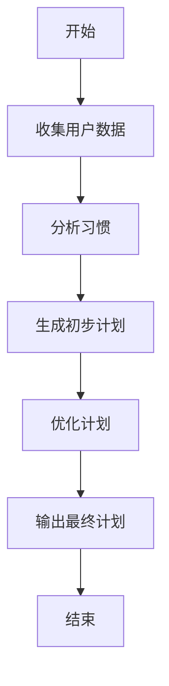
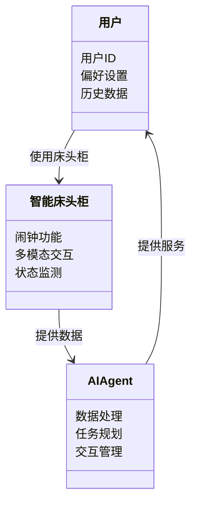

                 


# AI Agent在智能床头柜中的晨间仪式规划

## 关键词：AI Agent, 智能床头柜, 晨间仪式, 多模态交互, 个性化服务, 任务规划, 智能家居

## 摘要：本文详细探讨AI Agent在智能床头柜中的应用，从背景介绍到系统架构，再到项目实战，系统阐述如何通过AI技术优化用户的晨间仪式管理。文章结合理论与实践，分析AI Agent的核心原理，展示其在智能设备中的实际应用，为读者提供全面的技术视角。

---

## 第一部分：背景介绍

### 第1章：AI Agent与智能床头柜的背景概述

#### 1.1 问题背景

随着智能家居的普及，人们的生活方式正在发生变化。晨间仪式，如起床、洗漱、早餐和通勤，是日常生活中重要的组成部分。传统的晨间管理方式效率低下，容易让用户感到疲惫和压力。通过AI Agent，智能床头柜能够帮助用户优化这些流程，提升生活品质。

#### 1.2 问题描述

用户在晨间管理中面临诸多痛点：闹钟设置混乱、缺乏健康监测、任务提醒不足等。这些问题导致用户时间管理不善，影响生活质量。智能床头柜作为智能家居的一部分，具备多模态交互和个性化服务的能力，可以有效解决这些问题。

#### 1.3 问题解决思路

AI Agent在晨间仪式中的作用主要体现在任务规划和多模态交互上。通过分析用户的习惯和数据，AI Agent能够制定个性化的晨间计划，并通过床头柜的交互界面与用户进行实时沟通，确保计划的执行。

#### 1.4 边界与外延

智能床头柜的功能范围包括闹钟设置、健康监测、任务提醒等，同时与其他智能家居设备联动，如智能灯泡、智能音箱等。系统的边界在于其功能范围，而外延则扩展到与其他设备的协同工作。

#### 1.5 核心要素与概念结构

核心概念包括AI Agent、智能床头柜和晨间仪式。AI Agent通过多模态交互和个性化学习，帮助智能床头柜优化晨间仪式管理。ER实体关系图展示了用户、智能床头柜和AI Agent之间的交互关系。

---

## 第二部分：核心概念与联系

### 第2章：AI Agent的原理与属性

#### 2.1 核心原理

AI Agent具备多模态交互和个性化学习能力，能够根据用户的习惯调整服务策略。其核心原理包括数据收集、任务规划和反馈优化三个步骤。

#### 2.2 属性特征对比表格

以下是AI Agent与传统床头柜的对比表格：

| 属性         | 传统床头柜       | AI Agent床头柜   |
|--------------|-----------------|-----------------|
| 功能         | 基本功能有限     | 多功能智能化     |
| 交互方式     | 单一（按钮/开关）| 多模态（语音/触控）|
| 学习能力     | 无              | 个性化学习      |

#### 2.3 ER实体关系图（Mermaid流程图）

```mermaid
erd
  user: 用户
  device: 智能床头柜
  agent: AI Agent
  action: 动作/指令
  schedule: 时间表
  interaction: 交互记录

  user --> device: 使用床头柜
  device --> agent: 提供数据
  agent --> device: 发出指令
  interaction --> schedule: 更新时间表
```

---

## 第三部分：算法原理讲解

### 第3章：任务规划算法

#### 3.1 算法概述

任务规划算法旨在根据用户的需求和习惯，制定最优的晨间计划。算法包括数据收集、优先级排序和时间分配三个步骤。

#### 3.2 算法流程图（Mermaid）



#### 3.3 数学模型与公式

优先级排序算法基于加权评分模型：

$$
\text{优先级} = w_1 \times \text{时间因素} + w_2 \times \text{重要性因素}
$$

其中，\( w_1 \) 和 \( w_2 \) 是权重系数，时间因素基于任务的时间敏感性，重要性因素基于任务的优先级。

---

## 第四部分：系统分析与架构设计

### 第4章：系统架构设计

#### 4.1 项目场景

智能床头柜需要与多种设备联动，如智能灯泡、智能音箱，以实现全面的晨间管理。

#### 4.2 系统功能设计

系统功能包括闹钟设置、健康监测、任务提醒和多设备联动。领域模型如下：



#### 4.3 系统架构设计

系统架构采用分层设计，包括用户层、设备层、算法层和数据层。架构图如下：


---

## 第五部分：项目实战

### 第5章：环境安装与核心实现

#### 5.1 环境安装

安装Python和相关库，如TensorFlow和Flask。

#### 5.2 核心实现代码

以下是任务规划的核心代码示例：

```python
def plan_optimizer(tasks, weights):
    optimized_plan = []
    for task in tasks:
        priority = weights[0] * task['time'] + weights[1] * task['importance']
        optimized_plan.append((task['name'], priority))
    optimized_plan.sort(key=lambda x: -x[1])
    return [name for name, _ in optimized_plan]
```

#### 5.3 应用分析

通过代码实现任务的优先级排序，优化用户的晨间计划，提升效率。

---

## 第六部分：最佳实践与小结

### 第6章：最佳实践与注意事项

#### 6.1 最佳实践

- 定期更新用户数据，保持计划的准确性。
- 确保设备之间的联动，提升用户体验。
- 注意隐私保护，防止数据泄露。

#### 6.2 小结

本文详细探讨了AI Agent在智能床头柜中的应用，从背景介绍到系统设计，再到项目实战，为读者提供了全面的技术视角。通过AI Agent，用户能够更高效地管理晨间仪式，提升生活质量。

---

## 作者：AI天才研究院 & 禅与计算机程序设计艺术

