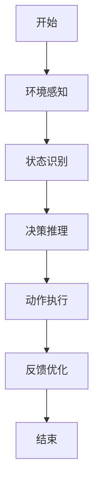
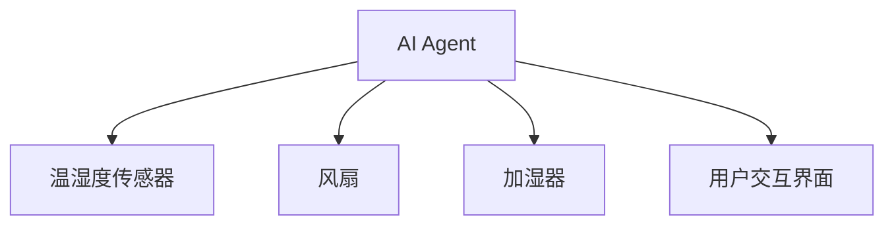

                 


# AI Agent在智能床头柜中的温湿度调节

## 关键词
AI Agent, 温湿度调节, 智能床头柜, 智能家居, 物联网, 人工智能

## 摘要
本文探讨AI Agent在智能床头柜中的温湿度调节应用，分析其工作原理、系统架构，并通过实际案例展示其应用。文章结构清晰，内容详实，涵盖背景、核心概念、算法、系统设计、项目实战和总结等部分，适合技术爱好者和智能家居开发者阅读。

## 第一部分：背景与概念

### 第1章：AI Agent与温湿度调节的背景

#### 1.1 问题背景
智能家居的发展趋势推动了AI Agent的应用，温湿度调节对舒适度和健康至关重要。AI Agent在智能家居中的应用潜力巨大。

#### 1.2 问题描述
传统温湿度调节方法存在局限性，如固定模式和被动响应。AI Agent能够提供智能化、个性化解决方案。

#### 1.3 问题解决
AI Agent通过实时感知环境，智能决策，主动调节，显著提升温湿度调节的效果和用户体验。

#### 1.4 边界与外延
系统边界包括环境传感器、执行机构和用户交互。外延扩展涵盖与其他设备的协同和更复杂的调节策略。

#### 1.5 概念结构与核心要素
AI Agent由感知、推理和执行模块构成，构成系统的核心要素，包括传感器、算法和执行机构。

## 第二部分：核心概念与联系

### 第2章：AI Agent的核心原理

#### 2.1 AI Agent的基本原理
AI Agent通过环境感知、决策推理和行为执行实现温湿度调节。状态感知涉及温度、湿度和用户偏好。

#### 2.2 温湿度调节的数学模型
建立线性回归模型，公式：$$T = a \cdot t + b \cdot h + c$$，其中T为目标温度，t为当前温度，h为湿度，c为常数。

#### 2.3 AI Agent与温湿度调节的关系
数据流分析显示，AI Agent接收传感器数据，处理后发送调节指令。交互流程图展示系统的工作流程。

## 第三部分：算法原理与实现

### 第3章：AI Agent的算法实现

#### 3.1 算法原理
状态空间构建基于温度和湿度，决策树用于推理，动作选择基于优化策略。

#### 3.2 算法流程图


#### 3.3 算法实现
```python
class AI-Agent:
    def __init__(self):
        self.sensors = []
        self.actuators = []
    
    def感知环境(self):
        # 获取传感器数据
        pass
    
    def决策(self, data):
        # 调节策略
        return action
    
    def执行(self, action):
        # 操作执行机构
        pass
```

## 第四部分：系统分析与架构设计

### 第4章：系统架构设计

#### 4.1 项目场景介绍
智能床头柜集成温湿度传感器、风扇和加湿器，AI Agent协调各设备，实现智能调节。

#### 4.2 系统功能设计
领域模型类图展示传感器、执行机构和AI Agent的交互关系。

#### 4.3 系统架构图


## 第五部分：项目实战

### 第5章：AI Agent的温湿度调节实现

#### 5.1 环境安装
安装Python、numpy和pandas库，配置传感器和执行机构。

#### 5.2 核心实现
编写AI Agent代码，实现环境感知、决策和执行功能。

#### 5.3 案例分析
通过具体案例展示系统如何根据环境变化调节温湿度，优化用户体验。

## 第六部分：总结与展望

### 第6章：项目总结与经验分享

#### 6.1 项目小结
AI Agent成功实现了智能温湿度调节，显著提升用户体验。

#### 6.2 经验总结
数据收集和模型优化是关键，传感器精度和算法优化影响系统性能。

#### 6.3 展望与建议
未来研究多传感器融合和自适应学习算法，提升系统智能化水平。

## 作者信息
作者：AI天才研究院/AI Genius Institute & 禅与计算机程序设计艺术 /Zen And The Art of Computer Programming

---

通过以上步骤，文章详细探讨了AI Agent在智能床头柜中的温湿度调节应用，从背景到实现，全面解析其技术细节和实际应用，为读者提供了丰富的知识和实践指导。

