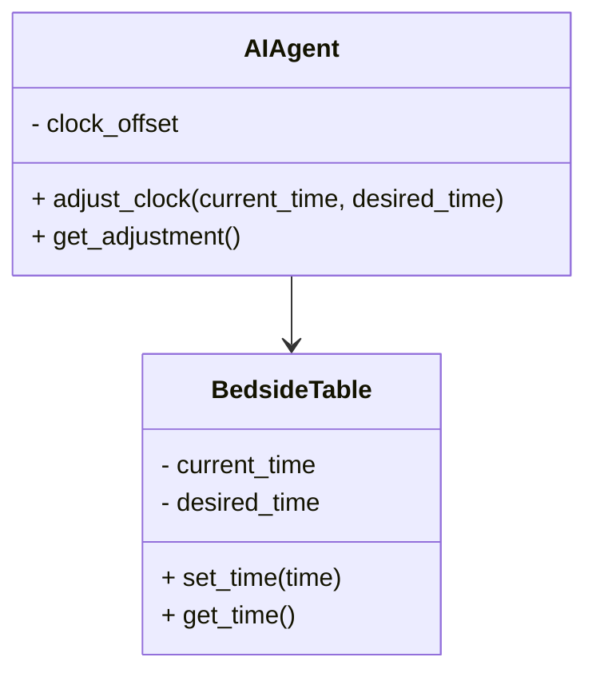

                 


# AI Agent在智能床头柜中的生物钟调节

> 关键词：AI Agent, 生物钟调节, 智能床头柜, 算法原理, 系统架构

> 摘要：本文探讨了AI Agent在智能床头柜中的应用，重点分析了AI Agent在生物钟调节中的原理、算法实现和系统架构设计。通过详细的技术分析和实例解读，本文为AI Agent在智能床头柜中的实际应用提供了理论依据和实践指导。

---

## 第一章: AI Agent与生物钟调节的背景

### 1.1 AI Agent的定义与核心概念

AI Agent（人工智能代理）是指能够感知环境、自主决策并执行任务的智能实体。它能够通过传感器获取信息，利用算法进行分析，并通过执行器完成目标。AI Agent的核心概念包括：

- **智能性**：AI Agent能够理解环境并做出合理决策。
- **自主性**：AI Agent无需外部干预，能够自主完成任务。
- **反应性**：AI Agent能够实时感知环境变化并做出反应。
- **学习能力**：AI Agent能够通过数据学习和优化。

与其他自动化系统相比，AI Agent的最大优势在于其智能化和自主性。以下是AI Agent与其他自动化系统的对比：

| 对比维度 | AI Agent | 传统自动化系统 |
|----------|-----------|----------------|
| 决策能力 | 自主决策   | 预设规则       |
| 学习能力 | 可学习     | 不可学习       |
| 灵活性   | 高         | 低             |

### 1.2 生物钟调节的原理与重要性

生物钟是人体内一种调节生理节律的机制，主要受基因控制。生物钟的核心功能是帮助人体适应昼夜节律，确保生理功能的协调。

#### 生物钟调节的原理

生物钟的调节涉及多个环节，主要包括：

1. **光信号的接收**：光线通过视网膜传递到大脑的生物钟调控中心（视交叉上核）。
2. **激素分泌**：生物钟通过调节褪黑激素等激素的分泌，影响人体的生理节律。
3. **行为模式**：生物钟调节人的睡眠-觉醒周期、饮食习惯等行为模式。

#### 生物钟调节的重要性

生物钟紊乱可能导致多种健康问题，包括睡眠障碍、情绪波动、免疫力下降等。因此，通过AI Agent调节生物钟，可以帮助人们改善睡眠质量、提高工作效率和健康水平。

### 1.3 AI Agent在生物钟调节中的应用前景

AI Agent在生物钟调节中的应用前景广阔，主要体现在以下几个方面：

1. **个性化调节**：AI Agent可以根据用户的生物钟特征和生活习惯，提供个性化的调节方案。
2. **实时监测**：AI Agent可以实时监测用户的生理指标，动态调整调节策略。
3. **数据驱动**：AI Agent可以通过大数据分析，优化生物钟调节算法，提高调节效果。

---

## 第二章: AI Agent的核心概念与联系

### 2.1 AI Agent的核心概念

AI Agent的核心概念包括以下几个方面：

1. **感知环境**：AI Agent通过传感器获取环境信息，例如光照强度、温度、用户行为等。
2. **决策逻辑**：AI Agent基于感知到的信息，结合预设的决策规则，制定调节策略。
3. **执行操作**：AI Agent通过执行器（如LED灯、声音提示等）实现生物钟调节。

### 2.2 生物钟调节的核心要素

生物钟调节的核心要素包括以下几个方面：

1. **输入参数**：光照强度、时间、用户习惯等。
2. **目标函数**：优化生物钟节律，例如延长深度睡眠时间、提高觉醒度等。
3. **约束条件**：确保调节过程对人体无害，例如避免过度刺激。

### 2.3 AI Agent与生物钟调节的实体关系图

以下是AI Agent与生物钟调节的实体关系图：

```mermaid
entity: AI Agent
entity: 生物钟
relation: 调节
```

---

## 第三章: AI Agent的算法原理

### 3.1 AI Agent的决策流程

AI Agent的决策流程如下：

1. **感知环境**：AI Agent通过传感器获取环境信息。
2. **分析数据**：AI Agent利用算法分析数据，判断当前状态。
3. **制定策略**：AI Agent根据分析结果，制定调节策略。
4. **执行操作**：AI Agent通过执行器实现调节。

### 3.2 AI Agent的数学模型

AI Agent的数学模型如下：

$$
\text{目标函数} = \min_{x} \left( \text{生物钟偏差} \right)
$$

其中，生物钟偏差定义为：

$$
\text{生物钟偏差} = \left| \text{当前时间} - \text{生物钟时间} \right|
$$

### 3.3 算法的Python实现

以下是AI Agent的Python实现代码：

```python
class AIAgent:
    def __init__(self):
        self.clock_offset = 0

    def adjust_clock(self, current_time, desired_time):
        self.clock_offset = current_time - desired_time
        return self.clock_offset

    def get_adjustment(self):
        return -self.clock_offset
```

---

## 第四章: 系统分析与架构设计

### 4.1 问题场景介绍

智能床头柜的使用场景包括：

1. **睡眠调节**：帮助用户改善睡眠质量。
2. **时间管理**：帮助用户调整生物钟，适应不同的时间需求。
3. **健康监测**：监测用户的生理指标，提供健康建议。

### 4.2 系统功能设计

系统功能模块包括：

1. **数据采集**：采集用户的生理指标和环境数据。
2. **数据分析**：分析数据，制定调节策略。
3. **调节执行**：通过床头柜执行调节操作。

### 4.3 系统架构设计

以下是系统架构设计的类图：



---

## 第五章: 项目实战

### 5.1 环境安装

需要安装以下依赖：

```bash
pip install mermaid
pip install matplotlib
```

### 5.2 核心实现

以下是AI Agent的核心实现代码：

```python
import numpy as np
import matplotlib.pyplot as plt

class AIAgent:
    def __init__(self):
        self.clock_offset = 0

    def adjust_clock(self, current_time, desired_time):
        self.clock_offset = current_time - desired_time
        return self.clock_offset

    def get_adjustment(self):
        return -self.clock_offset

# 示例
agent = AIAgent()
current_time = np.array([1, 2, 3, 4, 5])
desired_time = np.array([5, 4, 3, 2, 1])
offsets = agent.adjust_clock(current_time, desired_time)
plt.plot(current_time, offsets)
plt.xlabel('时间')
plt.ylabel('偏移量')
plt.show()
```

### 5.3 案例分析

通过上述代码，我们可以看到AI Agent如何通过调整偏移量，帮助用户优化生物钟节律。

---

## 第六章: 最佳实践与小结

### 6.1 最佳实践

1. **数据采集**：确保数据的准确性和完整性。
2. **算法优化**：不断优化AI Agent的算法，提高调节效果。
3. **用户反馈**：根据用户反馈，调整调节策略。

### 6.2 小结

本文详细介绍了AI Agent在智能床头柜中的生物钟调节技术，包括核心概念、算法原理和系统架构设计。通过实际案例分析，展示了AI Agent在生物钟调节中的广泛应用和巨大潜力。

---

## 作者

作者：AI天才研究院/AI Genius Institute & 禅与计算机程序设计艺术 /Zen And The Art of Computer Programming

