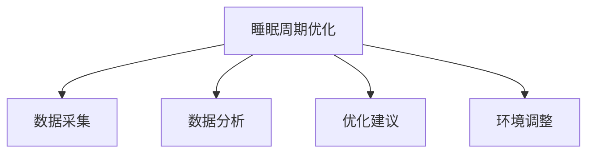

                 


# AI Agent在智能床头柜中的睡眠周期优化

## 关键词：AI Agent，智能床头柜，睡眠周期优化，多模态数据，机器学习

## 摘要：本文详细探讨了AI Agent在智能床头柜中的应用，特别是在睡眠周期优化方面的技术实现。通过分析睡眠周期的特征，结合AI Agent的算法原理，提出了基于多模态数据的优化方法，并通过系统架构设计和项目实战展示了其实现过程。

---

# 第1章：睡眠周期优化的背景与问题描述

## 1.1 问题背景

### 1.1.1 现代人睡眠问题的现状
随着生活节奏的加快，现代人普遍存在睡眠不足或睡眠质量差的问题。根据世界卫生组织的数据，全球约有30%的人存在睡眠障碍，其中睡眠周期紊乱是常见的问题之一。睡眠不足不仅影响日常生活，还可能导致多种健康问题，如肥胖、糖尿病和心理疾病等。

### 1.1.2 睡眠周期对健康的影响
睡眠周期是指人在一天中的睡眠模式，通常包括快速眼动睡眠（REM）和非快速眼动睡眠（NREM）阶段。正常的睡眠周期有助于身体修复和大脑功能的正常运行。睡眠周期紊乱可能导致注意力不集中、记忆力减退以及情绪波动等问题。

### 1.1.3 睡眠优化技术的发展历程
睡眠优化技术经历了从简单的时间管理到基于传感器的数据分析，再到人工智能辅助的个性化优化的过程。随着技术的进步，智能设备逐渐成为睡眠优化的重要工具。

## 1.2 问题描述

### 1.2.1 睡眠周期的定义与特征
睡眠周期是指人在24小时内经历的多个睡眠阶段，通常包括REM和NREM阶段。每个阶段的时间比例和顺序因人而异，受个体差异和外部环境的影响。

### 1.2.2 睡眠周期优化的目标与意义
优化睡眠周期的目标是通过调整睡眠时间和质量，使个体在身体和心理上达到最佳状态。这不仅有助于提高生活质量，还能预防多种健康问题。

### 1.2.3 智能床头柜的潜力与局限性
智能床头柜可以通过集成多种传感器和智能设备，实时监测用户的睡眠数据，并通过AI Agent进行分析和优化。然而，其局限性包括数据采集的准确性、算法的复杂性和用户接受度等问题。

## 1.3 问题解决思路

### 1.3.1 AI Agent在睡眠优化中的作用
AI Agent可以实时监测用户的睡眠数据，分析其睡眠周期，并提供个性化的优化建议。通过与床头柜的交互，AI Agent能够调整环境参数，如光线和温度，以促进优质睡眠。

### 1.3.2 智能床头柜的硬件与软件结合
智能床头柜需要集成多种传感器，如心率监测器、动作传感器和环境监测器，并结合AI算法进行数据处理和优化。硬件和软件的结合是实现睡眠优化的关键。

### 1.3.3 多模态数据采集与分析
通过采集多模态数据（如心率、体温、环境数据等），AI Agent能够更准确地分析用户的睡眠状态，并提供个性化的优化建议。

## 1.4 睡眠周期优化的边界与外延

### 1.4.1 优化的边界条件
优化的边界包括用户的基本生理数据、环境条件和个体差异。AI Agent需要在这些边界内进行调整，确保优化建议的有效性和安全性。

### 1.4.2 优化的外延范围
优化不仅限于睡眠周期本身，还包括与睡眠相关的健康问题，如压力管理和情绪调节。通过综合考虑这些因素，AI Agent可以提供更全面的优化建议。

### 1.4.3 与其他健康优化系统的区别
与传统的健康优化系统相比，AI Agent在智能床头柜中的应用更加个性化和实时性，能够根据用户的动态数据进行实时调整。

## 1.5 核心要素与概念结构

### 1.5.1 核心概念组成
睡眠周期优化的核心要素包括数据采集、数据分析、优化建议和环境调整。

### 1.5.2 概念之间的关系
通过概念图展示了各要素之间的关系，AI Agent作为核心，连接数据采集和环境调整，实现睡眠周期的优化。

### 1.5.3 概念结构图


---

# 第2章：AI Agent与智能床头柜的核心概念与联系

## 2.1 AI Agent的核心原理

### 2.1.1 AI Agent的基本定义
AI Agent是一种能够感知环境、自主决策并采取行动的智能体。在睡眠优化中，AI Agent通过监测用户的睡眠数据，分析并调整环境参数，以优化睡眠质量。

### 2.1.2 AI Agent的核心原理
AI Agent的工作流程包括数据采集、特征提取、模型训练和决策执行。通过机器学习算法，AI Agent能够从数据中学习用户的睡眠模式，并提供个性化的优化建议。

### 2.1.3 AI Agent的分类与特点
AI Agent可以根据智能水平分为反应式和认知式。反应式AI Agent根据当前数据做出反应，而认知式AI Agent能够进行规划和推理。

## 2.2 智能床头柜的系统架构

### 2.2.1 智能床头柜的功能模块
智能床头柜通常包括数据采集模块、数据处理模块和环境控制模块。数据采集模块负责收集用户的生理数据和环境数据，数据处理模块通过AI算法进行分析，环境控制模块根据分析结果调整环境参数。

### 2.2.2 系统的硬件组成
硬件部分包括传感器（如心率传感器、动作传感器）、环境监测器（如温度、湿度传感器）和控制模块（如智能灯、空调控制器）。

### 2.2.3 系统的软件架构
软件架构包括数据采集接口、AI算法模块和用户界面。数据采集接口负责与硬件交互，AI算法模块进行数据分析和优化，用户界面提供人机交互。

## 2.3 AI Agent与智能床头柜的关系

### 2.3.1 AI Agent在智能床头柜中的角色
AI Agent作为智能床头柜的核心，负责数据处理和决策制定。它通过分析用户的睡眠数据，调整环境参数，以优化用户的睡眠质量。

### 2.3.2 AI Agent与床头柜硬件的交互
AI Agent通过与硬件的交互，实现数据采集和环境控制。硬件为AI Agent提供数据输入，AI Agent通过决策算法调整硬件输出。

### 2.3.3 概念属性对比表格

| 概念       | 属性               |
|------------|--------------------|
| AI Agent   | 智能、自主、实时    |
| 智能床头柜 | 多功能、智能化、交互 |

### 2.3.4 ER实体关系图

```mermaid
erd
bedside Cabinet [智能床头柜] 
- 睡眠数据表 SleepData {
  用户ID User_ID
  时间戳 Timestamp
  心率 HeartRate
  体温 Temperature
}
AI Agent [AI Agent] 
- 睡眠优化表 SleepOptimization {
  用户ID User_ID
  时间戳 Timestamp
  优化建议 Optimization_Suggestion
}
```

---

通过以上分析，我们详细探讨了AI Agent在智能床头柜中的应用，特别是在睡眠周期优化方面的技术实现。后续章节将深入讨论算法原理、数学模型、系统架构设计和项目实战等内容，为读者提供全面的技术指导。

