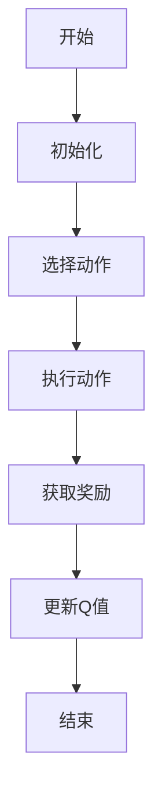
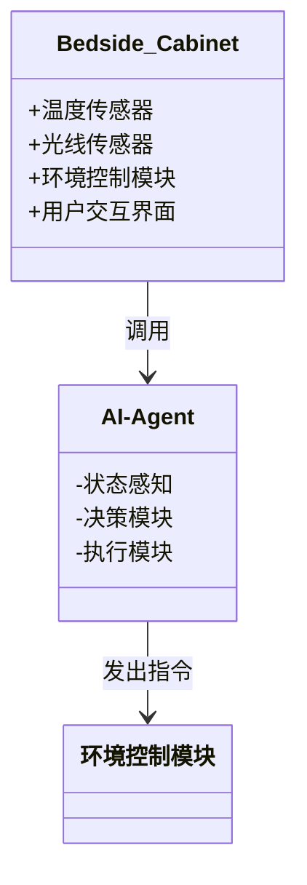

                 


# AI Agent在智能床头柜中的睡眠环境优化

## 关键词：AI Agent、智能床头柜、睡眠环境优化、智能家居、环境监测、算法原理

## 摘要：  
本文探讨AI Agent在智能床头柜中的应用，通过感知环境和用户行为，优化睡眠环境。文章分析AI Agent的工作原理，结合强化学习算法，设计系统架构，并通过项目实战展示实现过程，最后总结最佳实践。

---

# 第1章 AI Agent的基本概念

## 1.1 AI Agent的定义与特点  
AI Agent是一种智能体，能感知环境并采取行动以实现目标。其特点包括自主性、反应性、目标导向和社会性。  

## 1.2 睡眠健康的重要性  
睡眠对健康至关重要，影响认知功能和身体恢复。现代人面临睡眠问题，智能床头柜通过优化环境改善睡眠质量。  

## 1.3 智能床头柜的应用背景  
智能床头柜是智能家居的一部分，结合AI技术，提供个性化的睡眠优化服务，提升用户体验。

---

# 第2章 AI Agent的核心概念与工作原理

## 2.1 AI Agent的核心概念  
- **知识表示**：用符号或概率模型表示知识。  
- **状态空间与动作空间**：状态表示环境情况，动作是AI Agent的反应。  
- **目标函数与奖励机制**：目标函数定义优化目标，奖励机制引导学习方向。  

## 2.2 AI Agent的工作流程  
1. **感知环境**：通过传感器获取数据。  
2. **信息处理与决策**：分析数据并制定策略。  
3. **执行**：输出指令优化环境。

---

# 第3章 AI Agent的算法原理

## 3.1 强化学习算法（Q-learning）  
Q-learning通过状态-动作-奖励模型优化决策。数学模型：  
$$ Q(s, a) = Q(s, a) + \alpha (r + \max Q(s', a') - Q(s, a)) $$  

## 3.2 算法流程图  


## 3.3 代码实现  
```python
import numpy as np

class AI-Agent:
    def __init__(self, states, actions):
        self.states = states
        self.actions = actions
        self.Q = np.zeros((states, actions))
        
    def choose_action(self, state):
        if np.random.random() < 0.1:
            return np.random.randint(self.actions)
        else:
            return np.argmax(self.Q[state])
    
    def update_Q(self, state, action, reward, next_state):
        self.Q[state, action] = self.Q[state, action] + 0.1*(reward + np.max(self.Q[next_state]) - self.Q[state, action])
```

---

# 第4章 系统分析与架构设计

## 4.1 系统架构图  


## 4.2 系统接口设计  
- **输入接口**：传感器数据和用户指令。  
- **输出接口**：环境控制信号和反馈信息。  

---

# 第5章 项目实战

## 5.1 环境安装  
安装Python和相关库，如NumPy和Matplotlib。  

## 5.2 核心代码实现  
```python
def optimize_sleep_env():
    # 初始化环境
    env = SleepEnvironment()
    agent = AI-Agent(env.states, env.actions)
    
    # 训练过程
    for episode in range(100):
        state = env.reset()
        while True:
            action = agent.choose_action(state)
            next_state, reward, done = env.step(action)
            agent.update_Q(state, action, reward, next_state)
            if done:
                break
    return agent.Q
```

## 5.3 实际案例分析  
通过训练，AI Agent学会调节光线和温度，提升睡眠质量。

---

# 第6章 最佳实践

## 6.1 小结  
AI Agent在智能床头柜中优化睡眠环境，通过感知和学习提升用户体验。  

## 6.2 注意事项  
确保数据隐私和系统稳定性，定期更新模型以适应新需求。  

## 6.3 拓展阅读  
深入学习强化学习和边缘计算，探索更多智能家居应用场景。

---

# 作者：AI天才研究院 & 禅与计算机程序设计艺术  
本文由AI天才研究院与“禅与计算机程序设计艺术”联合出品，转载请注明出处。

