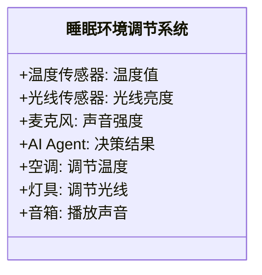
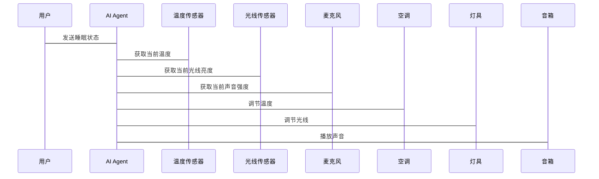

                 


# AI Agent在智能床头柜中的睡眠环境调节

## 关键词：AI Agent, 智能床头柜, 睡眠环境调节, 睡眠健康, 人工智能, 睡眠优化

## 摘要：本文详细探讨了AI Agent在智能床头柜中的应用，重点分析了睡眠环境调节的核心算法、系统架构设计以及实际项目实现。文章从睡眠健康的重要性出发，逐步深入到AI Agent的核心原理、数学模型、系统设计和项目实战，最后总结了最佳实践经验和未来的发展方向。

---

## 第一部分: 背景与概念

### 第1章: 睡眠健康与智能床头柜的背景

#### 1.1 睡眠健康的重要性
睡眠是人类健康的基础，直接影响着身体和心理健康。根据世界卫生组织的数据，全球约有27%的人存在睡眠问题。良好的睡眠质量有助于提高免疫力、记忆力和工作效率，而睡眠不足则会导致注意力下降、情绪波动和慢性疾病的发生。现代生活方式的改变，如电子设备的普及、工作压力的增加，使得睡眠问题更加普遍。

#### 1.2 智能床头柜的发展背景
智能床头柜是智能家居领域的重要组成部分，它通过集成多种传感器和执行器，能够实时感知睡眠环境的变化，并通过AI Agent进行智能调节。智能床头柜的发展得益于物联网技术的进步和人工智能算法的优化。目前，市场上的智能床头柜主要通过调节温度、光线和声音来改善睡眠质量。

#### 1.3 智能家居在睡眠健康中的潜力
智能家居设备可以通过数据采集和智能分析，为用户提供个性化的睡眠解决方案。AI Agent在智能床头柜中的应用，不仅能够实时监测睡眠环境，还能根据用户的睡眠习惯和健康状况，提供个性化的调节方案。通过与其它智能家居设备的协同工作，AI Agent可以实现更全面的睡眠健康管理。

### 第2章: AI Agent的基本概念与应用场景

#### 2.1 AI Agent的定义与特点
AI Agent（智能代理）是一种能够感知环境、自主决策并执行任务的智能系统。AI Agent的核心特点包括：
- **自主性**：能够在没有外部干预的情况下独立运行。
- **反应性**：能够实时感知环境变化并做出响应。
- **学习能力**：通过数据和经验不断优化自身的决策能力。
- **可扩展性**：能够适应不同的应用场景和环境。

#### 2.2 AI Agent在智能床头柜中的应用场景
在智能床头柜中，AI Agent的主要任务是通过调节睡眠环境来优化用户的睡眠质量。具体应用场景包括：
- **温度调节**：根据用户的睡眠阶段和环境温度变化，自动调整空调或电热毯的温度。
- **光线调节**：在睡前或睡醒时，通过调节灯光亮度和色温，帮助用户放松或清醒。
- **声音调节**：根据用户的睡眠状态，自动调整白噪声或轻音乐的播放强度和节奏。

#### 2.3 AI Agent与传统自动化的区别
与传统自动化系统相比，AI Agent具有更强的智能性和适应性。传统自动化系统通常是基于固定的规则进行操作，而AI Agent能够通过学习和优化，不断改进自身的决策能力。例如，传统空调只能根据设定的温度进行开关，而AI Agent可以根据用户的睡眠习惯和环境变化，动态调整温度。

### 第3章: 睡眠环境调节的系统架构

#### 3.1 睡眠环境调节的核心要素
睡眠环境调节的核心要素包括：
- **温度**：温度过高或过低都会影响睡眠质量。通常，最佳睡眠温度在16°C到24°C之间。
- **光线**：光线的亮度和色温对人的生物钟有重要影响。睡前使用柔和的暖光可以促进褪黑激素的分泌，帮助入睡。
- **声音**：环境噪音过大会影响睡眠深度。白噪声或轻音乐可以有效掩盖外界噪音，提高睡眠质量。

#### 3.2 睡眠环境调节的系统架构
睡眠环境调节系统通常包括以下几个功能模块：
- **数据采集模块**：通过温度传感器、光线传感器和麦克风等设备，采集睡眠环境的数据。
- **数据处理模块**：对采集到的数据进行预处理和特征提取，例如去除噪声、提取频谱特征等。
- **决策模块**：基于机器学习模型，根据当前环境和用户的睡眠状态，决策如何调节环境参数。
- **执行模块**：通过执行器（如空调、灯具、音箱等）实现环境参数的调节。

#### 3.3 睡眠环境调节系统的可扩展性设计
为了适应不同的用户需求和环境变化，睡眠环境调节系统需要具备良好的可扩展性。例如，系统可以通过增加新的传感器或执行器，支持更多的环境调节方式。此外，系统还可以通过云端数据共享，实现多设备协同工作。

---

## 第二部分: AI Agent的核心原理

### 第4章: AI Agent的核心算法原理

#### 4.1 AI Agent的感知与决策算法
AI Agent的感知与决策算法主要包括以下步骤：
1. **数据采集**：通过传感器采集环境数据，例如温度、光线和声音。
2. **特征提取**：对采集到的数据进行预处理和特征提取，例如提取温度的平均值和波动幅度。
3. **状态识别**：基于特征数据，识别当前的睡眠状态，例如浅睡、深睡或清醒。
4. **决策优化**：根据睡眠状态和环境参数，优化决策，例如调整温度或光线。

#### 4.2 AI Agent的执行与反馈机制
AI Agent的执行与反馈机制包括以下步骤：
1. **决策执行**：根据决策结果，通过执行器调节环境参数，例如打开空调或关闭灯具。
2. **反馈采集**：采集执行后的环境数据和用户的反馈，例如用户是否感到舒适。
3. **系统优化**：根据反馈数据，优化AI Agent的算法和决策模型。

#### 4.3 睡眠环境调节的数学建模
睡眠环境调节的数学建模需要考虑多个因素，例如温度、光线和声音对睡眠质量的影响。可以通过以下步骤进行建模：
1. **数据收集**：收集用户的睡眠数据和环境数据。
2. **特征选择**：选择与睡眠质量相关的特征，例如温度、光线亮度和声音强度。
3. **模型训练**：使用机器学习算法（如支持向量机或随机森林）训练模型，预测睡眠质量。
4. **模型优化**：通过交叉验证和超参数调优，优化模型的性能。

### 第5章: AI Agent的数学模型与公式

#### 5.1 睡眠环境调节的数学建模
睡眠环境调节的数学建模可以表示为一个优化问题。假设睡眠质量由多个环境参数决定，目标是最优化这些参数以提高睡眠质量。可以表示为：
$$
\text{最大化} \quad Q = f(T, L, S)
$$
其中，\( Q \) 是睡眠质量，\( T \) 是温度，\( L \) 是光线亮度，\( S \) 是声音强度。

#### 5.2 核心算法的数学公式
AI Agent的核心算法通常基于机器学习模型。例如，基于强化学习的优化模型可以表示为：
$$
Q(s, a) = Q(s, a) + \alpha \left(r + \max_{a'} Q(s', a') - Q(s, a)\right)
$$
其中，\( Q(s, a) \) 是状态-动作值函数，\( \alpha \) 是学习率，\( r \) 是奖励，\( s \) 是当前状态，\( a \) 是当前动作，\( s' \) 是下一个状态。

---

## 第三部分: 系统分析与架构设计

### 第6章: 系统分析与架构设计方案

#### 6.1 睡眠环境调节系统的需求分析
睡眠环境调节系统的需求分析包括以下几个方面：
- **功能需求**：支持温度、光线和声音调节，能够根据用户的睡眠状态进行智能调节。
- **性能需求**：系统需要实时响应用户的睡眠状态变化，调节速度要快。
- **接口需求**：系统需要与智能家居设备和用户终端进行数据交互。

#### 6.2 睡眠环境调节系统的领域模型
睡眠环境调节系统的领域模型可以用Mermaid类图表示，如下：



#### 6.3 睡眠环境调节系统的架构设计
睡眠环境调节系统的架构设计可以用Mermaid架构图表示，如下：

```mermaid
topology
    client -> AI Agent: 发送睡眠数据
    AI Agent -> 空调: 调节温度
    AI Agent -> 灯具: 调节光线
    AI Agent -> 音箱: 播放声音
    睡眠数据 -> 数据存储: 存储历史数据
    数据存储 -> AI Agent: 提供训练数据
```

#### 6.4 睡眠环境调节系统的交互设计
睡眠环境调节系统的交互设计可以用Mermaid序列图表示，如下：



---

## 第四部分: 项目实战

### 第7章: 项目实战与代码实现

#### 7.1 项目环境安装
为了实现AI Agent在智能床头柜中的睡眠环境调节，需要安装以下环境：
- **Python 3.8或更高版本**
- **NumPy和Pandas库**
- **Scikit-learn库**
- **Mermaid图生成工具**

#### 7.2 系统核心代码实现

##### 数据预处理代码
```python
import numpy as np
import pandas as pd

# 加载数据
data = pd.read_csv('sleep_data.csv')

# 数据清洗
data.dropna(inplace=True)
data = data[(data['temperature'] >= 16) & (data['temperature'] <= 24)]
```

##### 机器学习模型训练代码
```python
from sklearn.model

