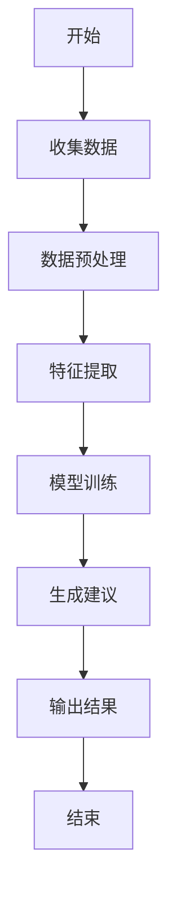
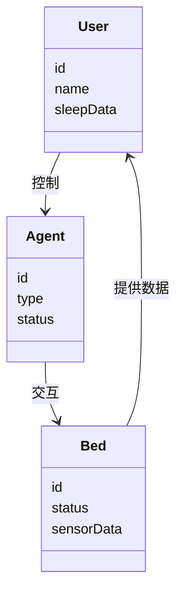
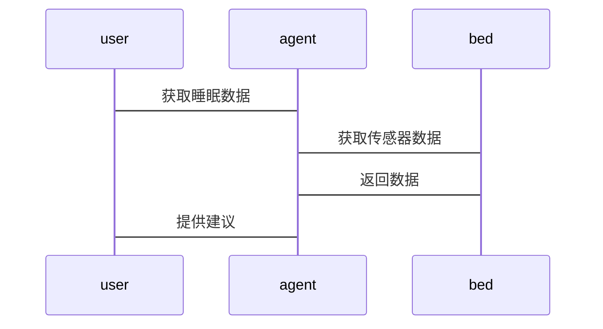

                 


# AI Agent在智能床头柜中的睡眠辅助功能

## 关键词：
- AI Agent
- 智能床头柜
- 睡眠辅助
- 算法原理
- 系统架构
- 项目实战

## 摘要：
本文详细探讨了AI Agent在智能床头柜中的睡眠辅助功能，从背景介绍、核心概念、算法原理到系统架构设计，再到项目实战，全面分析了如何利用AI技术提升睡眠健康。文章通过详细的流程图、类图和代码示例，展示了AI Agent在智能床头柜中的实际应用，并提出了最佳实践建议。

---

## 第1章: AI Agent与智能床头柜的背景介绍

### 1.1 问题背景与描述
#### 1.1.1 睡眠健康的重要性
睡眠是人体健康的核心要素之一，直接影响精神状态、工作效率和身体健康。现代人面临睡眠问题，如失眠、睡眠呼吸暂停综合征等，这些问题需要有效的解决方案。

#### 1.1.2 现有睡眠辅助工具的局限性
传统的睡眠辅助工具如闹钟、睡眠监测手环虽然有一定效果，但存在功能单一、缺乏智能化、无法提供个性化解决方案等问题。

#### 1.1.3 AI Agent在睡眠辅助中的潜力
AI Agent能够通过数据分析和机器学习，提供个性化的睡眠建议和实时监控，弥补传统工具的不足。

### 1.2 AI Agent的核心概念与定义
#### 1.2.1 AI Agent的基本定义
AI Agent是一种智能代理，能够感知环境、执行任务并做出决策。在智能床头柜中，AI Agent负责收集数据、分析并提供睡眠建议。

#### 1.2.2 智能床头柜的功能特点
智能床头柜集成了多种传感器，能够监测心率、呼吸频率、睡眠阶段等数据，并通过AI Agent进行分析。

#### 1.2.3 AI Agent与智能床头柜的结合
AI Agent作为智能床头柜的核心，负责数据处理和决策，为用户提供个性化的睡眠辅助服务。

### 1.3 问题解决与边界分析
#### 1.3.1 睡眠辅助的核心问题
解决睡眠质量差、失眠等问题，提供个性化睡眠改善方案。

#### 1.3.2 AI Agent在睡眠辅助中的边界
AI Agent的功能限于数据收集和分析，不涉及医疗诊断。

#### 1.3.3 智能床头柜的功能外延
包括环境监测、智能控制、数据同步等功能。

### 1.4 核心概念结构与组成
#### 1.4.1 AI Agent的组成要素
感知层、决策层、执行层。

#### 1.4.2 智能床头柜的功能模块
传感器模块、数据处理模块、用户交互模块。

#### 1.4.3 两者的交互关系
AI Agent通过传感器获取数据，分析后控制床头柜执行操作。

---

## 第2章: AI Agent与智能床头柜的核心概念联系

### 2.1 核心概念原理
#### 2.1.1 AI Agent的工作原理
通过数据收集、分析和决策，实现智能化的睡眠辅助。

#### 2.1.2 智能床头柜的传感器与执行机构
传感器收集数据，执行机构根据AI Agent的指令进行调整。

#### 2.1.3 两者的协同机制
AI Agent分析数据，床头柜执行调整，两者协同实现睡眠优化。

### 2.2 概念属性对比分析
#### 2.2.1 AI Agent的属性特征
智能性、自主性、反应性。

#### 2.2.2 智能床头柜的属性特征
智能化、互联性、实时性。

#### 2.2.3 两者属性对比表格
| 属性 | AI Agent | 智能床头柜 |
|------|-----------|------------|
| 智能性 | 高 | 中 |
| 自主性 | 高 | 中 |
| 互联性 | 中 | 高 |

### 2.3 ER实体关系图
```mermaid
erDiagram
    user {
        id
        name
        sleepData
    }
    agent {
        id
        type
        status
    }
    bed {
        id
        status
        sensorData
    }
    user --> agent : 控制
    agent --> bed : 交互
    bed --> user : 提供数据
```

---

## 第3章: AI Agent的算法原理与实现

### 3.1 算法原理概述
#### 3.1.1 AI Agent的基本算法
基于机器学习的算法，如K-近邻、支持向量机等。

#### 3.1.2 睡眠数据分析算法
数据预处理、特征提取、模型训练。

#### 3.1.3 个性化睡眠辅助算法
根据用户数据，生成个性化建议。

### 3.2 算法流程图


### 3.3 算法实现代码
```python
def sleep_analysis(data):
    # 数据预处理
    processed_data = preprocess(data)
    # 特征提取
    features = extract_features(processed_data)
    # 模型训练
    model = train_model(features)
    # 生成建议
    advice = generate_advice(model, features)
    return advice
```

---

## 第4章: 系统分析与架构设计

### 4.1 问题场景介绍
睡眠监测、个性化建议、环境控制。

### 4.2 系统功能设计
#### 4.2.1 领域模型


#### 4.2.2 系统架构设计


### 4.3 系统接口设计
#### 4.3.1 API接口
```http
GET /api/sleep/status
POST /api/sleep/control
```

#### 4.3.2 接口描述
- `/api/sleep/status`：获取睡眠状态。
- `/api/sleep/control`：发送控制指令。

### 4.4 系统交互流程
#### 4.4.1 交互流程图


---

## 第5章: 项目实战

### 5.1 环境安装
安装Python、传感器库、机器学习库。

### 5.2 系统核心实现源代码
```python
# 传感器数据读取
import sensor_library

def get_sensor_data():
    return sensor_library.read_data()

# 数据处理
def preprocess(data):
    return data.dropna()

# 特征提取
def extract_features(data):
    features = data[['heart_rate', 'breathing_rate']]
    return features

# 模型训练
from sklearn.svm import SVC

def train_model(features, labels):
    model = SVC()
    model.fit(features, labels)
    return model

# 生成建议
def generate_advice(model, features):
    prediction = model.predict(features)
    advice = {'status': prediction[0]}
    return advice
```

### 5.3 实际案例分析
用户A使用智能床头柜，通过AI Agent分析数据，生成个性化睡眠建议，改善睡眠质量。

### 5.4 项目小结
项目实现了AI Agent在智能床头柜中的睡眠辅助功能，展示了其实际应用价值。

---

## 第6章: 最佳实践与小结

### 6.1 最佳实践tips
- 数据隐私保护。
- 系统稳定性保障。
- 用户体验优化。

### 6.2 项目小结
AI Agent在智能床头柜中的应用提升了睡眠辅助的智能化水平，为用户提供了更好的睡眠解决方案。

### 6.3 注意事项
确保数据安全，定期更新模型。

### 6.4 拓展阅读
进一步研究AI在睡眠医学中的应用。

---

## 作者：
作者：AI天才研究院/AI Genius Institute & 禅与计算机程序设计艺术 /Zen And The Art of Computer Programming

