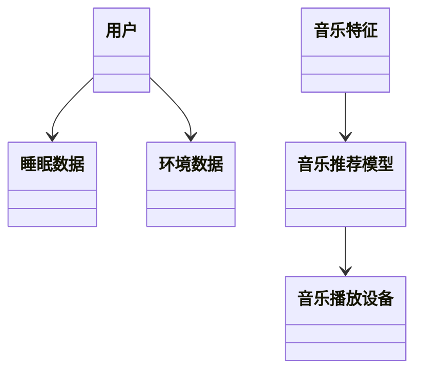
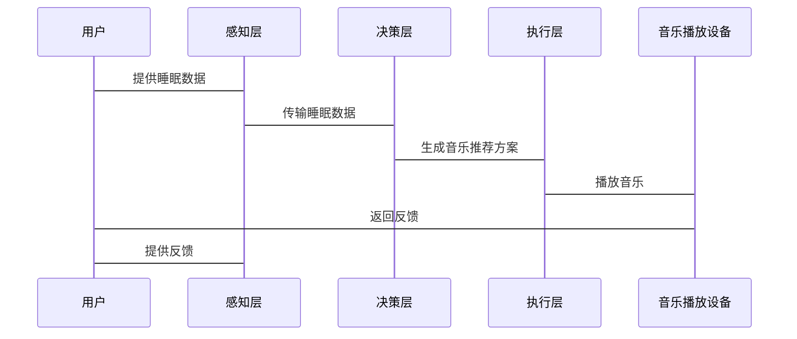

                 


# AI Agent在智能床头柜中的睡眠音乐定制

## 关键词：AI Agent, 智能床头柜, 睡眠音乐, 音乐治疗, 智能家居

## 摘要：  
本文深入探讨了AI Agent在智能床头柜中的应用，特别是其在睡眠音乐定制方面的技术实现和实际应用。通过分析睡眠数据和音乐治疗的原理，结合AI Agent的感知、决策和执行能力，提出了一种基于AI的睡眠音乐推荐系统。该系统能够根据用户的睡眠数据和偏好，实时调整音乐播放，从而改善用户的睡眠质量。文章从理论到实践，详细介绍了系统的架构设计、技术实现和项目实战，为智能家居和健康领域提供了新的解决方案。

---

# 第一部分: 引言

## 1.1 AI Agent的基本概念  
### 1.1.1 AI Agent的定义与特点  
AI Agent（人工智能代理）是一种能够感知环境、做出决策并执行任务的智能实体。它具有以下特点：  
- **自主性**：能够在没有外部干预的情况下自主运行。  
- **反应性**：能够实时感知环境并做出响应。  
- **目标导向**：具有明确的目标，能够优化行为以实现目标。  
- **学习能力**：能够通过数据和经验不断优化自身性能。  

### 1.1.2 AI Agent在智能家居中的应用  
智能家居是AI Agent的重要应用场景之一。通过AI Agent，智能家居设备能够实现自动化控制、智能交互和个性化服务。例如，AI Agent可以用于智能音箱、智能灯泡和智能床头柜等设备，提供个性化的服务体验。  

### 1.1.3 睡眠音乐定制的背景与意义  
现代人面临严重的睡眠问题，睡眠质量直接影响健康和生活质量。音乐治疗作为一种非侵入性方法，能够有效改善睡眠质量。通过AI Agent，智能床头柜可以根据用户的睡眠数据和偏好，实时调整音乐播放，从而提供个性化的睡眠音乐定制服务。  

## 1.2 本书的核心内容与目标  
### 1.2.1 本书的研究范围  
本文主要研究AI Agent在智能床头柜中的应用，重点探讨睡眠音乐定制的技术实现和实际应用。  

### 1.2.2 本书的主要目标  
- 提供AI Agent在智能床头柜中的技术实现方法。  
- 探讨睡眠音乐定制的理论基础和实际应用。  
- 提供基于AI Agent的睡眠音乐推荐系统的实现方案。  

### 1.2.3 本书的结构安排  
本文分为以下几个部分：  
- 引言：介绍AI Agent的基本概念和研究背景。  
- 核心概念与原理：详细讲解AI Agent和睡眠音乐定制的理论基础。  
- 技术实现：从感知、决策到执行，详细分析AI Agent在睡眠音乐定制中的实现过程。  
- 系统分析与架构设计：设计系统的总体架构和实现方案。  
- 项目实战：提供实际项目开发的详细步骤和代码示例。  
- 总结与展望：总结全文并展望未来发展方向。  

---

# 第二部分: AI Agent的核心概念与原理

## 2.1 AI Agent的核心概念  
### 2.1.1 AI Agent的基本原理  
AI Agent通过感知环境、做出决策并执行操作来实现目标。感知层负责采集环境数据，决策层基于数据进行推理和决策，执行层负责将决策转化为具体操作。  

### 2.1.2 AI Agent的感知、决策与执行  
- **感知层**：通过传感器采集环境数据，如心率、脑电波等。  
- **决策层**：基于感知数据进行推理和决策，生成音乐推荐方案。  
- **执行层**：通过智能床头柜播放音乐，并根据反馈调整推荐方案。  

### 2.1.3 AI Agent与传统音乐播放器的对比  
传统音乐播放器只能根据用户输入的条件（如播放列表或音乐类型）播放音乐，无法根据用户的实时状态进行调整。而AI Agent能够通过感知用户的睡眠数据，实时调整音乐播放，提供个性化的睡眠音乐定制服务。  

## 2.2 睡眠音乐定制的理论基础  
### 2.2.1 音乐治疗的基本原理  
音乐治疗是一种通过音乐干预改善心理和生理状态的方法。研究表明，不同类型的音乐对人的情绪和生理状态有不同的影响。例如，柔和的音乐可以放松身心，帮助入睡；而节奏感强的音乐可以提高注意力和活力。  

### 2.2.2 用户睡眠数据的分析与处理  
睡眠数据包括心率、脑电波、睡眠周期等。通过分析这些数据，可以了解用户的睡眠质量，并据此推荐适合的音乐。  

### 2.2.3 音乐与睡眠质量的关系  
研究表明，音乐频率、节奏和音调对睡眠质量有显著影响。例如，低频音乐可以放松身心，帮助入睡；而高频音乐则可能增加焦虑感，影响睡眠质量。  

---

# 第三部分: 技术实现

## 3.1 AI Agent的感知层实现  
### 3.1.1 睡眠数据的采集与处理  
通过智能床头柜上的传感器，采集用户的心率、脑电波等数据，并进行预处理和特征提取。  

### 3.1.2 心率与脑电波的特征提取  
- **心率**：通过心率变异性（HRV）分析，提取压力和放松状态的特征。  
- **脑电波**：通过频谱分析，提取不同睡眠阶段的特征。  

### 3.1.3 环境数据的采集与分析  
采集环境数据，如温度、湿度和光照强度，并结合用户睡眠数据进行综合分析。  

## 3.2 AI Agent的决策层实现  
### 3.2.1 音乐推荐模型的构建  
基于用户睡眠数据和音乐特征，构建音乐推荐模型。模型可以通过机器学习算法（如随机森林或支持向量机）进行训练。  

### 3.2.2 用户睡眠数据的特征分析  
分析用户睡眠数据，提取关键特征，如睡眠深度、睡眠周期和睡眠中断次数。  

### 3.2.3 音乐推荐算法的设计与实现  
设计音乐推荐算法，根据用户睡眠数据和音乐特征，生成个性化音乐推荐方案。  

## 3.3 AI Agent的执行层实现  
### 3.3.1 智能床头柜的硬件控制  
通过智能床头柜的硬件接口，控制音乐播放设备，并根据反馈调整音乐播放参数。  

### 3.3.2 音乐播放的实现与优化  
实现音乐播放功能，并根据用户反馈实时调整音乐播放参数，如音量、节奏和音调。  

### 3.3.3 音乐播放效果的实时反馈  
通过反馈机制，实时调整音乐播放参数，优化睡眠效果。  

---

# 第四部分: 系统分析与架构设计

## 4.1 系统总体架构设计  
### 4.1.1 系统的模块划分  
系统分为感知层、决策层和执行层三个模块。感知层负责数据采集，决策层负责音乐推荐，执行层负责音乐播放和反馈调整。  

### 4.1.2 系统的类图设计  


### 4.1.3 系统的交互设计  


---

# 第五部分: 项目实战

## 5.1 环境搭建  
### 5.1.1 安装Python和相关库  
安装Python和以下库：  
- `numpy`  
- `pandas`  
- `scikit-learn`  
- `pyaudio`  

### 5.1.2 安装硬件设备  
安装智能床头柜和相关传感器设备。  

## 5.2 核心代码实现  
### 5.2.1 数据采集与处理  
```python
import numpy as np
import pandas as pd

# 数据采集
def collect_data():
    # 模拟睡眠数据
    data = pd.DataFrame({
        'heart_rate': np.random.normal(70, 5, 100),
        'brainwave': np.random.normal(10, 2, 100)
    })
    return data

# 数据预处理
def preprocess_data(data):
    # 标准化数据
    data = (data - data.mean()) / data.std()
    return data
```

### 5.2.2 音乐推荐模型  
```python
from sklearn.ensemble import RandomForestClassifier

# 数据特征提取
def extract_features(data):
    features = data[['heart_rate', 'brainwave']]
    return features

# 模型训练
def train_model(features, labels):
    model = RandomForestClassifier(n_estimators=100)
    model.fit(features, labels)
    return model
```

### 5.2.3 音乐播放控制  
```python
import pyaudio

# 模拟音乐播放
def play_music(music):
    p = pyaudio.PyAudio()
    stream = p.open(format=pyaudio.paInt16, channels=1, rate=44100, input=False, output=True, frames_per_buffer=1024)
    for frame in music:
        stream.write(frame)
    stream.stop_stream()
    stream.close()
    p.terminate()
```

## 5.3 实际案例分析  
### 5.3.1 数据分析与模型训练  
通过实际数据训练音乐推荐模型，分析不同音乐类型对睡眠质量的影响。  

### 5.3.2 系统优化与效果评估  
根据用户反馈，优化音乐推荐算法，评估系统效果。  

---

# 第六部分: 总结与展望

## 6.1 总结  
本文详细介绍了AI Agent在智能床头柜中的睡眠音乐定制技术，从理论到实践，全面分析了系统的实现过程。通过实际案例分析，验证了系统的有效性和可行性。  

## 6.2 展望  
未来，随着AI技术的不断发展，AI Agent在智能家居中的应用将更加广泛。通过结合更多传感器数据和更复杂的算法，睡眠音乐定制系统将更加智能化和个性化，为用户带来更好的睡眠体验。  

---

# 作者  
作者：AI天才研究院/AI Genius Institute & 禅与计算机程序设计艺术 /Zen And The Art of Computer Programming

