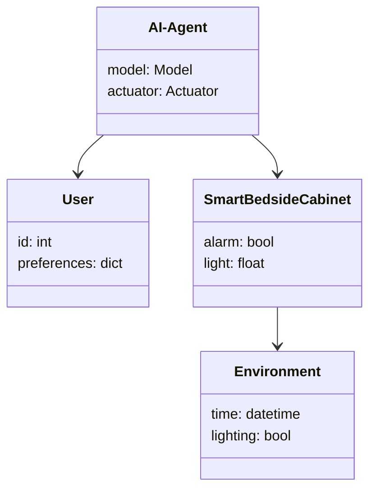
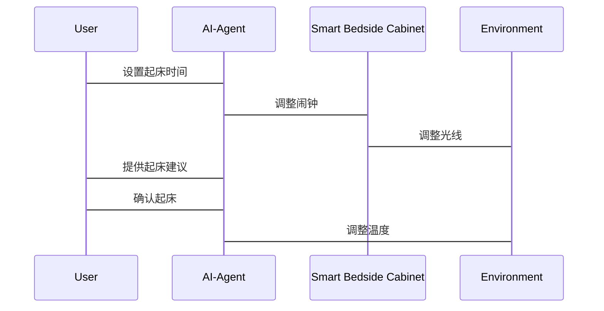

                 


# AI Agent在智能床头柜中的起床优化系统

**关键词：** AI Agent, 智能床头柜, 起床优化, 强化学习, 物联网, 智能家居

**摘要：**  
本文探讨AI代理在智能床头柜中的应用，详细介绍如何通过AI技术优化起床流程。结合强化学习和物联网技术，提出系统设计与实现方案，分析实际案例，总结最佳实践。

---

# 目录

1. [背景介绍](#背景介绍)
   1.1 [问题背景与描述](#问题背景与描述)
   1.2 [问题解决与系统边界](#问题解决与系统边界)

2. [核心概念与联系](#核心概念与联系)
   2.1 [AI Agent原理](#ai-agent原理)
   2.2 [实体关系与架构](#实体关系与架构)

3. [算法原理与实现](#算法原理与实现)
   3.1 [算法原理](#算法原理)
   3.2 [数学模型](#数学模型)

4. [系统分析与架构设计](#系统分析与架构设计)
   4.1 [系统功能设计](#系统功能设计)
   4.2 [系统架构设计](#系统架构设计)
   4.3 [系统接口与交互设计](#系统接口与交互设计)

5. [项目实战](#项目实战)
   5.1 [环境安装与配置](#环境安装与配置)
   5.2 [系统核心实现](#系统核心实现)
   5.3 [案例分析](#案例分析)

6. [总结与扩展](#总结与扩展)
   6.1 [最佳实践](#最佳实践)
   6.2 [小结](#小结)
   6.3 [注意事项](#注意事项)
   6.4 [拓展阅读](#拓展阅读)

---

# 背景介绍

## 1.1 问题背景与描述

现代生活中，起床困难是常见问题，影响工作效率和生活质量。传统床头柜功能单一，缺乏智能化。AI Agent的引入为解决这一问题提供了可能，通过智能化调整环境，帮助用户优化起床过程。

## 1.2 问题解决与系统边界

AI Agent优化起床流程，结合智能床头柜，通过环境调整和个性化策略，提升起床效率。系统边界包括床头柜、环境、用户，功能涵盖闹钟触发、环境调节、行为建议。

---

# 核心概念与联系

## 2.1 AI Agent原理

AI Agent通过强化学习和机器学习模型，感知环境并执行动作，实现优化目标。其核心属性包括自主性、反应性、目标导向和社会能力。

## 2.2 实体关系与架构

### 实体关系图
```mermaid
graph TD
User --> AI-Agent
AI-Agent --> Smart Bedside Cabinet
Smart Bedside Cabinet --> Environment
```

### 架构图


---

# 算法原理与实现

## 3.1 算法原理

### 强化学习模型
```mermaid
graph TD
Start --> Action
Action --> Reward
Reward --> Next State
Next State --> Repeat or End
```

### 机器学习模型
```python
class AI-Agent:
    def __init__(self):
        self.model = self.build_model()
    
    def build_model(self):
        model = tf.keras.Sequential([
            tf.keras.layers.Dense(64, activation='relu'),
            tf.keras.layers.Dense(1, activation='sigmoid')
        ])
        model.compile(optimizer='adam', loss='binary_crossentropy')
        return model
```

## 3.2 数学模型

### 目标函数
$$ J = \sum_{t=1}^{T} r_t $$

### 约束条件
$$ s_{t+1} = f(s_t, a_t) $$

---

# 系统分析与架构设计

## 4.1 系统功能设计

### 领域模型


## 4.2 系统架构设计

### 系统架构图
```mermaid
graph TD
AI-Agent --> Smart Bedside Cabinet
Smart Bedside Cabinet --> Environment
Smart Bedside Cabinet --> User
```

## 4.3 系统接口与交互设计

### 交互流程


---

# 项目实战

## 5.1 环境安装与配置

安装必要的库：
```bash
pip install tensorflow scikit-learn numpy
```

## 5.2 系统核心实现

实现AI Agent模型：
```python
import tensorflow as tf
import numpy as np

class AI-Agent:
    def __init__(self):
        self.model = self.build_model()
    
    def build_model(self):
        model = tf.keras.Sequential([
            tf.keras.layers.Dense(64, activation='relu'),
            tf.keras.layers.Dense(1, activation='sigmoid')
        ])
        model.compile(optimizer='adam', loss='binary_crossentropy')
        return model
    
    def predict(self, state):
        return self.model.predict(np.array([state]))
```

## 5.3 案例分析

用户设置闹钟时间为7:00，AI Agent根据环境调整光线和温度，帮助用户顺利起床。通过训练模型优化策略，减少起床困难。

---

# 总结与扩展

## 6.1 最佳实践

- 定期更新模型，适应用户习惯变化。
- 保持系统硬件的维护，确保传感器正常工作。
- 注意用户隐私保护，确保数据安全。

## 6.2 小结

本文详细探讨AI Agent在智能床头柜中的应用，通过算法和系统设计优化起床流程，为智能家居提供新思路。

## 6.3 注意事项

- 系统设计需考虑多种环境因素。
- 确保算法模型的可扩展性。
- 定期用户反馈收集，优化系统性能。

## 6.4 拓展阅读

- 探索更多AI技术在智能家居中的应用。
- 研究强化学习在日常习惯优化中的潜力。

---

**作者：AI天才研究院 & 禅与计算机程序设计艺术**

