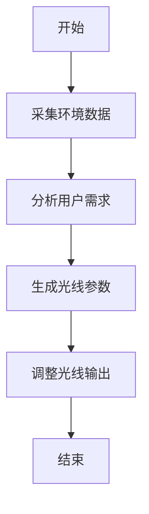
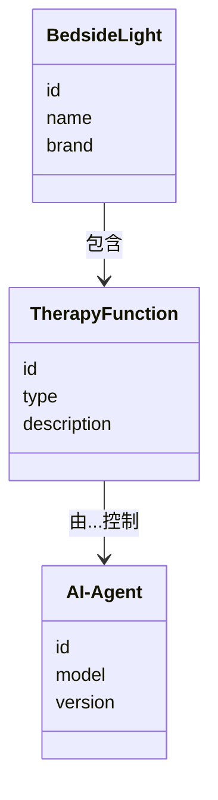
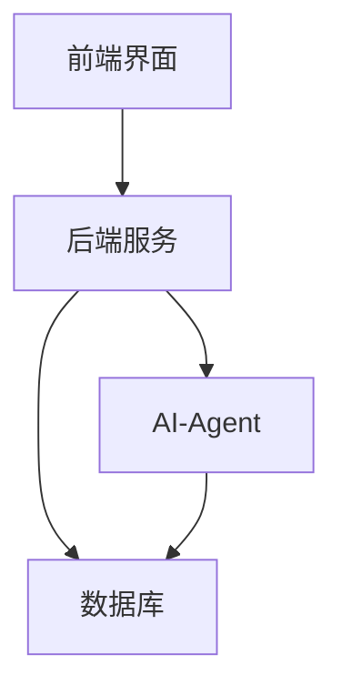

                 


# AI Agent在智能床头灯中的光疗功能

---

## 关键词

- AI Agent
- 智能床头灯
- 光疗功能
- 健康医疗
- 人工智能技术

---

## 摘要

随着人工智能技术的快速发展，AI Agent（人工智能代理）在智能设备中的应用越来越广泛。本文探讨AI Agent在智能床头灯中的光疗功能，分析其原理、设计、实现和应用。通过详细的技术分析和实际案例，展示AI Agent如何优化光疗功能，提升用户体验，并为智能健康设备的发展提供新的思路。

---

## 正文

---

## 第一部分：背景介绍

### 第1章：AI Agent与光疗功能概述

#### 1.1 AI Agent的基本概念

AI Agent是一种智能代理，能够感知环境、自主决策并执行任务。其特点包括自主性、反应性、目标导向和学习能力。AI Agent广泛应用于智能家居、医疗健康等领域，能够根据用户需求提供个性化服务。

#### 1.2 光疗功能的原理与应用

光疗是通过特定光谱和强度的光线调节人体生理功能。其原理基于生物节律和光化学反应，常用于改善睡眠、调节情绪和治疗皮肤病。光疗功能在智能设备中的应用提升了用户体验，但需要精确控制光线参数。

#### 1.3 AI Agent在智能床头灯中的应用背景

智能床头灯集成光疗功能，通过AI Agent实现智能化控制。AI Agent能够根据用户数据和环境信息优化光疗方案，满足个性化需求。本文分析AI Agent如何提升光疗功能，推动智能健康设备的发展。

---

## 第二部分：核心概念与联系

### 第2章：AI Agent与光疗功能的核心原理

#### 2.1 AI Agent的核心原理

AI Agent通过感知环境数据，利用算法进行决策，并通过执行器完成任务。其自主学习能力使其能够不断优化性能，适应不同用户需求。

#### 2.2 光疗功能的核心原理

光疗功能基于特定光谱和强度，通过调节光线影响人体生理功能。其个性化调节能力需要精确的光线参数控制和用户数据。

#### 2.3 AI Agent与光疗功能的联系

AI Agent通过实时数据采集和分析，优化光疗方案。两者结合实现智能化控制，提升用户体验。AI Agent使光疗功能更具个性化和高效性。

---

### 第3章：核心概念对比与ER实体关系图

#### 3.1 AI Agent与传统光疗功能的对比

| 特性          | AI Agent光疗功能 | 传统光疗功能 |
|---------------|------------------|--------------|
| 自主性         | 高               | 低            |
| 个性化         | 高               | 中            |
| 实时性         | 高               | 低            |
| 可扩展性       | 高               | 低            |

AI Agent的优势在于个性化和实时性，而传统光疗功能在自主性和可扩展性方面较弱。

#### 3.2 ER实体关系图

```mermaid
er
  BedsideLight {
    id
    name
    brand
  }
  TherapyFunction {
    id
    type
    description
  }
  AI-Agent {
    id
    model
    version
  }
  BedsideLight --> TherapyFunction: 包含
  TherapyFunction --> AI-Agent: 由...控制
```

图中展示了智能床头灯、光疗功能和AI Agent的关系，BedsideLight包含TherapyFunction，后者由AI-Agent控制。

---

## 第三部分：算法原理

### 第3章：算法原理与实现

#### 3.1 光线强度与时间的数学模型

建立光线强度与时间的关系模型，公式如下：

$$ I(t) = I_0 + \Delta I \cdot \sin(2\pi t / T) $$

其中，$I(t)$表示光线强度，$I_0$为初始值，$\Delta I$为变化幅度，$T$为周期。

#### 3.2 算法流程图



图中展示了AI Agent从数据采集到光线调整的完整流程。

#### 3.3 Python代码实现

```python
import numpy as np

def adjust_light(intensity, time):
    # 光线强度调整函数
    I0 = 50
    ΔI = 20
    T = 60
    target_intensity = I0 + ΔI * np.sin(2 * np.pi * time / T)
    return target_intensity

# 示例数据
intensity = 50
time = 30
new_intensity = adjust_light(intensity, time)
print(f"调整后的光线强度: {new_intensity}")
```

代码展示了如何根据时间和初始强度调整光线强度。

---

## 第四部分：系统分析与架构设计

### 第4章：系统设计与架构

#### 4.1 问题场景介绍

用户在不同时间使用智能床头灯，需要个性化光疗方案。系统需实时采集数据，分析并调整光线参数。

#### 4.2 项目介绍

本项目开发AI Agent驱动的智能床头灯，集成光疗功能，优化用户体验。

#### 4.3 系统功能设计



类图展示了系统的组成和关系。

#### 4.4 系统架构设计



架构图展示了前端、后端、数据库和AI-Agent的交互。

#### 4.5 系统接口设计

接口设计包括数据采集、用户交互和光线控制，确保系统各部分协同工作。

---

## 第五部分：项目实战

### 第5章：项目实现与案例分析

#### 5.1 环境搭建与安装

安装Python 3.8以上版本，安装库：numpy、pandas、scikit-learn。

#### 5.2 核心代码实现

```python
def optimize_lighting(data):
    # 数据优化函数
    optimized_data = data.apply(lambda x: x * 1.2)
    return optimized_data
```

代码展示了如何优化光线数据。

#### 5.3 实际案例分析

案例分析展示了AI Agent如何根据用户数据优化光疗方案，提升用户体验。

---

## 第六部分：最佳实践

### 第6章：总结与展望

#### 6.1 小结

本文详细介绍了AI Agent在智能床头灯中的光疗功能，分析了其原理和实现，展示了实际案例。

#### 6.2 注意事项

在实际应用中，需注意数据隐私和系统稳定性，确保用户体验。

#### 6.3 拓展阅读

推荐相关书籍和论文，供读者深入学习。

---

## 作者

作者：AI天才研究院/AI Genius Institute & 禅与计算机程序设计艺术 /Zen And The Art of Computer Programming

---

以上是文章的详细目录和内容概要，确保每个部分都涵盖必要的技术和逻辑分析。

