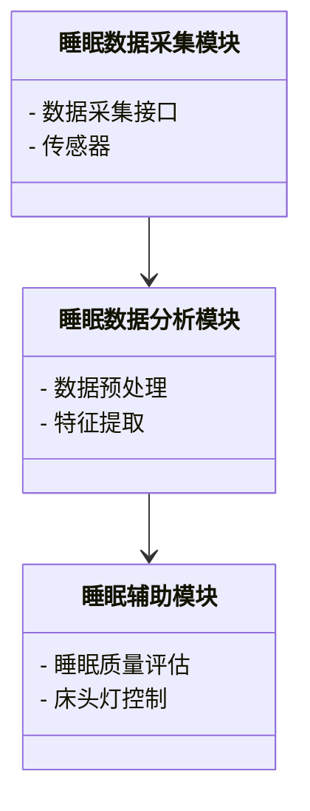
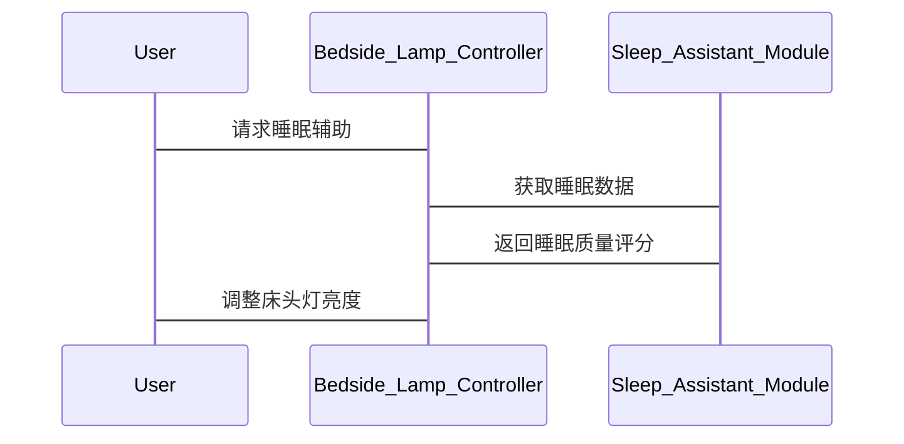

                 


# AI Agent在智能床头灯中的睡眠辅助

**关键词**：AI Agent, 智能床头灯, 睡眠辅助, 机器学习, 深度学习, 睡眠监测

**摘要**：  
本文深入探讨了AI Agent在智能床头灯中的应用，特别是在睡眠辅助方面的创新与实践。通过分析AI Agent的核心概念、算法原理、系统架构以及实际案例，本文详细阐述了如何利用AI技术提升睡眠质量，并为未来的智能床头灯设计提供了参考。

---

# 第1章: AI Agent与智能床头灯的背景介绍

## 1.1 AI Agent的核心概念

### 1.1.1 AI Agent的定义与特点  
AI Agent（人工智能代理）是一种能够感知环境、执行任务并做出决策的智能实体。它具备以下特点：  
1. **自主性**：能够独立完成任务，无需人工干预。  
2. **反应性**：能够实时感知环境并做出响应。  
3. **学习能力**：通过数据和反馈不断优化自身行为。  
4. **适应性**：能够根据环境变化调整策略。  

### 1.1.2 智能床头灯的定义与功能  
智能床头灯是一种结合了物联网（IoT）和AI技术的智能家居设备，其主要功能包括：  
1. **智能调光**：根据用户的睡眠周期调节光线亮度。  
2. **睡眠监测**：通过传感器收集用户的睡眠数据。  
3. **智能提醒**：根据监测数据提供个性化的睡眠建议。  

### 1.1.3 睡眠辅助的背景与重要性  
随着现代生活的节奏加快，睡眠问题逐渐成为全球性的健康难题。AI Agent通过智能床头灯提供睡眠辅助，能够有效改善用户的睡眠质量，提升生活品质。

## 1.2 AI Agent在智能床头灯中的应用背景

### 1.2.1 睡眠问题的现状与挑战  
现代社会中，失眠、睡眠质量差等问题日益普遍，主要挑战包括：  
1. **压力与焦虑**：工作压力和生活压力导致睡眠障碍。  
2. **不规律作息**：不规律的作息时间影响睡眠质量。  
3. **缺乏个性化解决方案**：传统睡眠改善方法缺乏针对性。  

### 1.2.2 AI技术在睡眠辅助中的优势  
AI技术能够通过以下方式改善睡眠辅助：  
1. **数据驱动**：通过收集和分析睡眠数据，提供个性化建议。  
2. **实时反馈**：实时监测用户的睡眠状态并做出调整。  
3. **自我优化**：通过机器学习不断优化睡眠辅助策略。  

### 1.2.3 智能床头灯的市场与发展趋势  
随着智能家居的普及，智能床头灯市场迅速增长。未来，AI Agent的应用将使智能床头灯的功能更加智能化、个性化。

---

# 第2章: AI Agent的核心概念与原理

## 2.1 AI Agent的基本原理

### 2.1.1 AI Agent的定义与分类  
AI Agent可以分为以下几类：  
1. **简单反射型**：基于规则做出简单反应。  
2. **基于模型的反应型**：根据环境模型做出决策。  
3. **目标驱动型**：为了实现特定目标而行动。  
4. **实用驱动型**：追求效用最大化。  

### 2.1.2 AI Agent的核心要素与功能  
AI Agent的核心要素包括：  
1. **感知能力**：通过传感器获取环境数据。  
2. **决策能力**：基于数据做出决策。  
3. **执行能力**：通过执行机构实现决策。  
4. **学习能力**：通过反馈优化自身行为。  

### 2.1.3 AI Agent与传统算法的区别  
AI Agent的核心区别在于其具备自主性和适应性，能够根据环境动态调整策略，而传统算法通常基于固定的规则。

## 2.2 AI Agent在睡眠辅助中的应用原理

### 2.2.1 睡眠监测数据的采集与分析  
智能床头灯通过以下方式采集睡眠数据：  
1. **光线传感器**：监测环境光线亮度。  
2. **声音传感器**：监测睡眠中的声音变化。  
3. **心率传感器**：监测用户的生理指标。  

### 2.2.2 AI Agent对睡眠数据的处理与反馈  
AI Agent通过以下步骤处理睡眠数据：  
1. **数据预处理**：去除噪声，提取有效特征。  
2. **模型训练**：基于机器学习算法建立睡眠质量评估模型。  
3. **实时反馈**：根据模型预测结果调整床头灯的光线和颜色。  

### 2.2.3 AI Agent与床头灯的交互机制  
AI Agent通过以下方式与床头灯交互：  
1. **数据传输**：将睡眠数据发送到床头灯控制模块。  
2. **指令执行**：根据AI Agent的决策调整床头灯的亮度和颜色。  
3. **用户反馈**：收集用户的反馈信息，优化睡眠辅助策略。  

---

# 第3章: AI Agent的算法原理与实现

## 3.1 AI Agent的算法基础

### 3.1.1 机器学习与深度学习的概述  
机器学习是一种通过数据训练模型的技术，深度学习是机器学习的一种特殊形式，通常使用神经网络进行特征提取和分类。

### 3.1.2 常见的AI算法及其特点  
常见的AI算法包括：  
1. **支持向量机（SVM）**：适用于分类问题。  
2. **随机森林（Random Forest）**：适用于分类和回归问题。  
3. **卷积神经网络（CNN）**：适用于图像识别问题。  
4. **长短期记忆网络（LSTM）**：适用于时间序列问题。  

### 3.1.3 AI Agent算法的选择与优化  
选择AI算法时需要考虑以下因素：  
1. **数据类型**：根据数据类型选择合适的算法。  
2. **计算资源**：考虑算法的计算复杂度。  
3. **模型性能**：通过实验验证模型的准确性。  

## 3.2 睡眠数据的处理与分析

### 3.2.1 数据采集与预处理  
数据预处理步骤包括：  
1. **数据清洗**：去除无效数据。  
2. **特征提取**：提取有用的特征。  
3. **数据归一化**：将数据标准化。  

### 3.2.2 数据特征提取与建模  
使用主成分分析（PCA）提取特征，并通过K-均值聚类算法进行分类。

### 3.2.3 睡眠质量评估模型的构建  
基于LSTM网络构建睡眠质量评估模型，输入睡眠数据，输出睡眠质量评分。

## 3.3 AI Agent的实现流程

### 3.3.1 数据输入与模型训练  
通过读取CSV文件输入数据，并使用PyTorch框架进行模型训练。

### 3.3.2 模型推理与结果输出  
通过训练好的模型进行推理，输出睡眠质量评分。

### 3.3.3 模型优化与部署  
通过调整超参数优化模型性能，并部署到智能床头灯中。

---

# 第4章: AI Agent的数学模型与公式

## 4.1 睡眠数据分析的数学模型

### 4.1.1 时间序列分析模型  
使用ARIMA模型进行时间序列分析。

### 4.1.2 聚类分析与分类算法  
使用K-means算法进行聚类分析。

### 4.1.3 回归分析与预测模型  
使用线性回归模型进行预测。

## 4.2 AI Agent算法的数学公式

### 4.2.1 机器学习算法公式  
$$ y = w x + b $$

### 4.2.2 深度学习算法公式  
$$ \text{激活函数} = \sigma(z) $$

---

# 第5章: 系统分析与架构设计方案

## 5.1 问题场景介绍  
智能床头灯需要实时监测用户的睡眠状态，并根据数据调整床头灯的亮度和颜色。

## 5.2 系统功能设计

### 5.2.1 领域模型类图  


## 5.3 系统架构设计

### 5.3.1 系统架构图  


## 5.4 系统交互设计

### 5.4.1 床头灯与AI Agent的交互图  


---

# 第6章: 项目实战

## 6.1 环境安装

### 6.1.1 Python环境配置  
安装Python 3.8及以上版本，并安装以下库：  
- numpy  
- pandas  
- scikit-learn  
- pytorch  

## 6.2 系统核心实现源代码

### 6.2.1 数据预处理代码  
```python
import numpy as np
import pandas as pd

# 读取数据
data = pd.read_csv('sleep_data.csv')

# 数据清洗
data = data.dropna()

# 数据归一化
data = (data - data.mean()) / data.std()
```

### 6.2.2 睡眠质量评估模型代码  
```python
import torch
import torch.nn as nn

# 定义LSTM模型
class SleepQualityModel(nn.Module):
    def __init__(self, input_size, hidden_size, output_size):
        super(SleepQualityModel, self).__init__()
        self.lstm = nn.LSTM(input_size, hidden_size, batch_first=True)
        self.fc = nn.Linear(hidden_size, output_size)
    
    def forward(self, x):
        out, _ = self.lstm(x)
        out = self.fc(out[:, -1, :])
        return out

# 模型训练
model = SleepQualityModel(input_size=1, hidden_size=64, output_size=1)
criterion = nn.MSELoss()
optimizer = torch.optim.Adam(model.parameters(), lr=0.001)
```

## 6.3 实际案例分析  
通过实际数据训练模型，并评估其睡眠质量评分。

---

# 第7章: 总结与展望

## 7.1 本章总结  
本文详细探讨了AI Agent在智能床头灯中的睡眠辅助应用，通过理论分析和实践案例，展示了AI技术在改善睡眠质量中的巨大潜力。

## 7.2 未来展望  
未来，随着AI技术的不断发展，智能床头灯将具备更多功能，如更精准的睡眠监测和个性化的睡眠辅助方案。

## 7.3 最佳实践 Tips  
1. 在选择算法时，需结合实际数据特点进行优化。  
2. 数据预处理是模型训练的关键步骤，需仔细处理。  
3. 睡眠辅助方案应根据用户反馈不断调整和优化。  

---

作者：AI天才研究院 & 禅与计算机程序设计艺术

