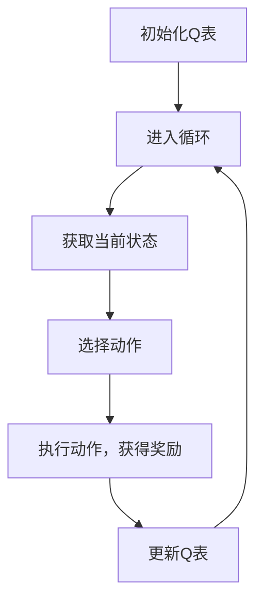
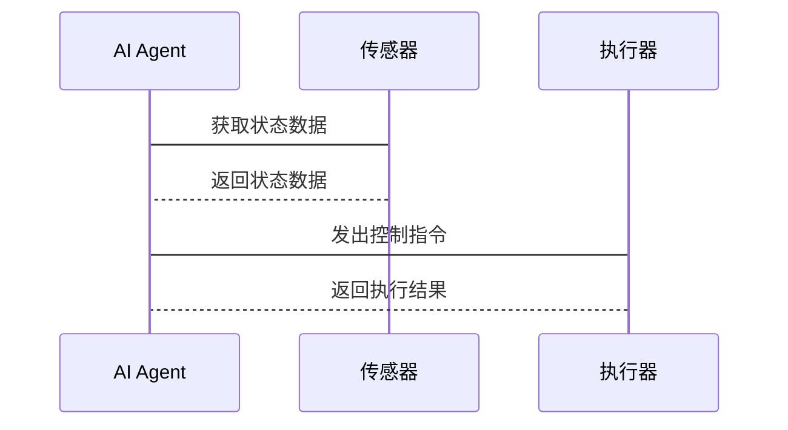
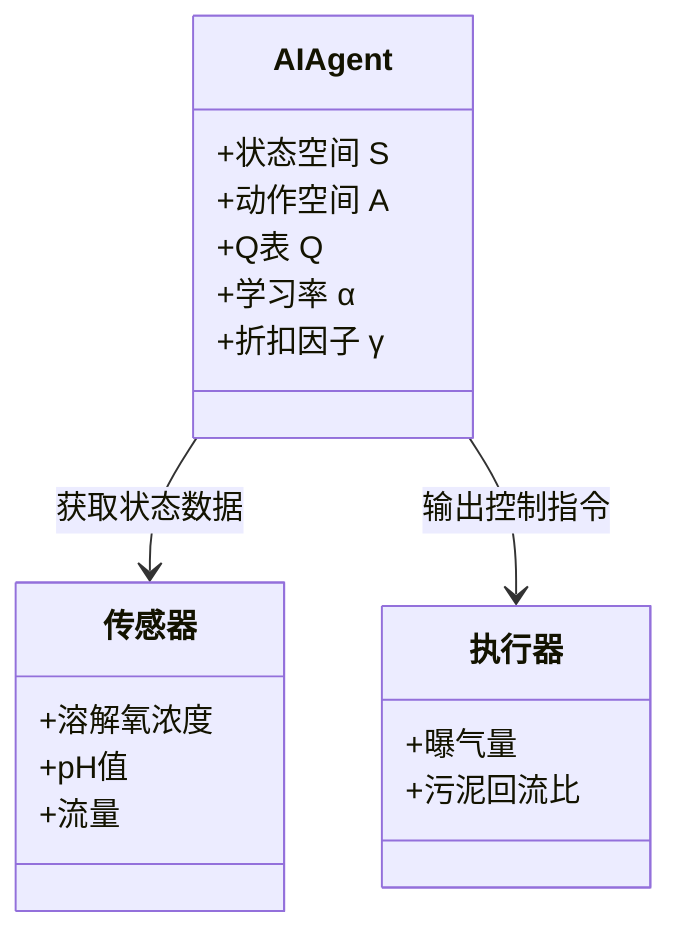

                 


# AI Agent在智能废水处理中的实践

> **关键词**：AI Agent，智能废水处理，Q-learning算法，系统架构，废水处理优化

> **摘要**：  
本文详细探讨了AI Agent在智能废水处理系统中的应用，从理论基础到实际案例，系统性地分析了AI Agent如何通过数学模型和算法优化废水处理流程。文章首先介绍了AI Agent的核心概念与原理，随后通过Q-learning算法的详细推导，展示了AI Agent在废水处理中的具体实现。接着，从系统架构设计到实际项目部署，结合Mermaid图和Python代码，深入剖析了AI Agent在废水处理系统中的应用场景与实现细节。最后，本文总结了AI Agent在智能废水处理中的优势，并展望了未来的发展方向。

---

# 第一部分: 引言

## 1.1 AI Agent与智能废水处理的背景

### 1.1.1 智能废水处理的背景与挑战  
随着工业化进程的加快，废水处理已成为环境保护的重要课题。传统的废水处理系统通常依赖人工操作和固定规则，难以应对复杂多变的水质变化和处理需求。如何提高废水处理的效率、降低成本、减少资源浪费，成为行业的重要挑战。

### 1.1.2 AI Agent在废水处理中的应用前景  
AI Agent（人工智能代理）作为一种能够自主感知环境、决策并执行任务的智能体，具备实时优化和自适应调整的能力。将其应用于废水处理系统中，可以通过动态调整处理参数，优化处理流程，显著提高处理效率和质量。

### 1.1.3 本书的核心目标与内容框架  
本书的核心目标是通过理论与实践相结合的方式，详细讲解AI Agent在智能废水处理中的应用。内容框架包括AI Agent的基本概念、算法原理、系统设计、项目实战以及案例分析，旨在为读者提供从理论到实践的全面指导。

---

## 1.2 本书的读者定位与学习方法

### 1.2.1 本书的读者定位  
本书主要面向环境工程领域的工程师、研究人员以及对人工智能技术感兴趣的编程人员。读者应具备一定的编程基础和废水处理知识，以便更好地理解AI Agent在废水处理中的具体应用。

### 1.2.2 学习本书的建议方法  
建议读者在学习本书时，结合理论与实践，逐步完成算法实现和系统设计。可以通过阅读相关文献、动手实践项目以及参与讨论组来加深理解。

### 1.2.3 本书的结构与内容概览  
本书分为引言、AI Agent核心概念、算法原理、系统设计、项目实战和总结展望六个部分，内容详实，逻辑清晰。

---

# 第二部分: AI Agent的核心概念与原理

## 2.1 AI Agent的基本概念

### 2.1.1 AI Agent的定义与分类  
AI Agent是一种能够感知环境、自主决策并执行任务的智能体。根据应用场景的不同，AI Agent可以分为推理式Agent、反应式Agent和混合式Agent。

### 2.1.2 AI Agent的核心特征与属性  
AI Agent的核心特征包括自主性、反应性、目标导向和学习能力。这些特征使其能够适应复杂环境并优化处理流程。

### 2.1.3 AI Agent与传统控制系统的区别  
与传统控制系统相比，AI Agent具有更强的自适应能力和学习能力，能够通过经验优化决策策略。

---

## 2.2 AI Agent在废水处理中的应用

### 2.2.1 废水处理的基本流程与关键环节  
废水处理通常包括预处理、生物处理和深度处理三个阶段。AI Agent可以通过实时监测和调整处理参数，优化每个阶段的处理效果。

### 2.2.2 AI Agent在废水处理中的应用场景  
AI Agent可以用于优化曝气池的溶解氧控制、污泥回流比调整以及处理系统的能耗优化。

### 2.2.3 AI Agent与废水处理系统的结合方式  
AI Agent通过与传感器、执行器和数据库的交互，实现对废水处理系统的实时监控和优化控制。

---

## 2.3 AI Agent的核心算法与数学模型

### 2.3.1 状态空间与动作空间的定义  
状态空间是系统所有可能的状态的集合，动作空间是AI Agent在每个状态下可以执行的动作的集合。

### 2.3.2 Q-learning算法的数学模型  
Q-learning算法的数学公式如下：
$$ Q(s,a) = Q(s,a) + \alpha \left[ r + \gamma \max Q(s',a') - Q(s,a) \right] $$  
其中，$Q(s,a)$表示状态$s$下执行动作$a$的期望奖励，$\alpha$是学习率，$\gamma$是折扣因子。

### 2.3.3 其他相关算法的简要介绍  
除了Q-learning，还可以使用策略梯度算法和Actor-Critic算法来优化AI Agent的决策过程。

---

# 第三部分: AI Agent的数学模型与算法原理

## 3.1 状态空间与动作空间的建模

### 3.1.1 状态空间的定义与表示  
状态空间可以表示为$S = \{s_1, s_2, \ldots, s_n\}$，其中每个状态$s_i$表示系统的某个特征，例如溶解氧浓度。

### 3.1.2 动作空间的定义与表示  
动作空间可以表示为$A = \{a_1, a_2, \ldots, a_m\}$，其中每个动作$a_j$表示AI Agent可以执行的操作，例如调整曝气量。

### 3.1.3 状态转移概率的计算  
通过马尔可夫决策过程（MDP），可以计算从状态$s$执行动作$a$后转移到状态$s'$的概率$P(s' | s,a)$。

---

## 3.2 Q-learning算法的详细推导

### 3.2.1 Q-learning算法的基本原理  
Q-learning算法通过不断更新Q值表，学习状态-动作对的期望奖励值，最终找到最优策略。

### 3.2.2 Q-learning算法的数学公式  
如前所述，Q-learning的更新公式为：
$$ Q(s,a) = Q(s,a) + \alpha \left[ r + \gamma \max Q(s',a') - Q(s,a) \right] $$  

### 3.2.3 Q-learning算法的收敛性分析  
Q-learning算法在离线和在线两种模式下均具有收敛性，能够在有限步数内找到最优策略。

---

## 3.3 算法实现的伪代码与流程图

### 3.3.1 Q-learning算法的伪代码实现  
```python
初始化Q表为全0
while True:
    状态s = 获取当前状态
    动作a = 选择动作（ε-greedy策略）
    执行动作a，获得奖励r
    更新Q表：
        Q(s, a) = Q(s, a) + α * (r + γ * max(Q(s', a')) - Q(s, a))
```

### 3.3.2 算法流程图（Mermaid格式）  


---

# 第四部分: 废水处理系统的系统设计与架构

## 4.1 废水处理系统的总体架构

### 4.1.1 系统的功能模块划分  
废水处理系统可以划分为传感器模块、AI Agent控制模块、执行器模块和数据库模块。

### 4.1.2 系统的硬件与软件架构  
硬件部分包括传感器、执行器和计算平台，软件部分包括AI Agent算法和数据库管理系统。

### 4.1.3 系统的通信与数据流设计  
系统通过工业物联网（IIoT）实现设备间的通信，数据流包括状态数据、动作指令和奖励反馈。

---

## 4.2 AI Agent在废水处理系统中的角色

### 4.2.1 AI Agent作为控制器的角色  
AI Agent通过实时监测溶解氧浓度等参数，动态调整曝气量和污泥回流比。

### 4.2.2 AI Agent与传感器、执行器的交互  
AI Agent通过传感器获取状态信息，通过执行器输出控制指令，实现对废水处理过程的优化控制。

---

## 4.3 系统的交互设计

### 4.3.1 系统交互流程  


---

## 4.4 系统的实体关系图

### 4.4.1 实体关系图  


---

# 第五部分: 项目实战

## 5.1 项目环境配置

### 5.1.1 系统需求  
需要安装Python、TensorFlow和一些常用的库。

### 5.1.2 环境配置代码  
```bash
pip install numpy
pip install matplotlib
pip install scikit-learn
pip install tensorflow
```

---

## 5.2 系统核心实现

### 5.2.1 Q-learning算法的实现  
```python
import numpy as np

class AI-Agent:
    def __init__(self, state_space_size, action_space_size):
        self.Q = np.zeros((state_space_size, action_space_size))
        self.alpha = 0.1
        self.gamma = 0.99

    def choose_action(self, state):
        if np.random.random() < 0.1:
            return np.random.randint(0, action_space_size)
        else:
            return np.argmax(self.Q[state, :])

    def update_Q(self, state, action, reward, next_state):
        self.Q[state, action] = self.Q[state, action] + self.alpha * (reward + self.gamma * np.max(self.Q[next_state, :]) - self.Q[state, action])
```

---

## 5.3 项目实现流程

### 5.3.1 环境搭建  
安装所需的库并配置开发环境。

### 5.3.2 代码实现  
编写AI Agent的核心代码，实现Q-learning算法。

### 5.3.3 系统集成  
将AI Agent与传感器、执行器集成，实现废水处理系统的实时优化。

---

## 5.4 项目测试与优化

### 5.4.1 系统测试  
在模拟环境中测试AI Agent的性能，记录处理效果和能耗数据。

### 5.4.2 参数优化  
调整学习率和折扣因子，优化AI Agent的决策策略。

---

## 5.5 项目小结

### 5.5.1 实践总结  
通过项目实战，验证了AI Agent在废水处理中的有效性，优化了系统的处理效率和能耗。

### 5.5.2 实践中的注意事项  
在实际应用中，需要注意传感器的精度和系统的实时性，确保AI Agent的稳定运行。

---

# 第六部分: 总结与展望

## 6.1 总结

### 6.1.1 核心观点回顾  
AI Agent通过实时优化处理参数，显著提高了废水处理系统的效率和质量。

### 6.1.2 技术优势总结  
AI Agent具备自适应能力和学习能力，能够应对复杂多变的废水处理场景。

---

## 6.2 展望

### 6.2.1 未来发展方向  
未来可以研究更高效的算法，如深度强化学习，进一步优化废水处理系统。

### 6.2.2 技术应用潜力  
AI Agent在智能废水处理中的应用潜力巨大，有望成为环保领域的重要技术手段。

---

## 6.3 最佳实践 tips

### 6.3.1 技术实现建议  
建议在实际应用中结合多种传感器和执行器，确保系统的实时性和稳定性。

### 6.3.2 问题解决思路  
在遇到系统性能瓶颈时，可以尝试优化算法参数或引入新的传感器数据。

### 6.3.3 性能优化技巧  
通过并行计算和分布式系统设计，进一步提高AI Agent的处理效率。

---

## 6.4 注意事项

### 6.4.1 系统维护  
定期维护传感器和执行器，确保系统的正常运行。

### 6.4.2 数据安全  
保护系统的数据安全，防止数据泄露和恶意攻击。

---

# 作者：AI天才研究院/AI Genius Institute & 禅与计算机程序设计艺术 /Zen And The Art of Computer Programming

---

通过以上结构，文章详细阐述了AI Agent在智能废水处理中的应用，从理论到实践，从算法到系统设计，为读者提供了全面的指导。

