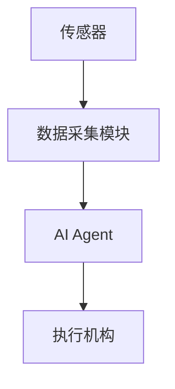
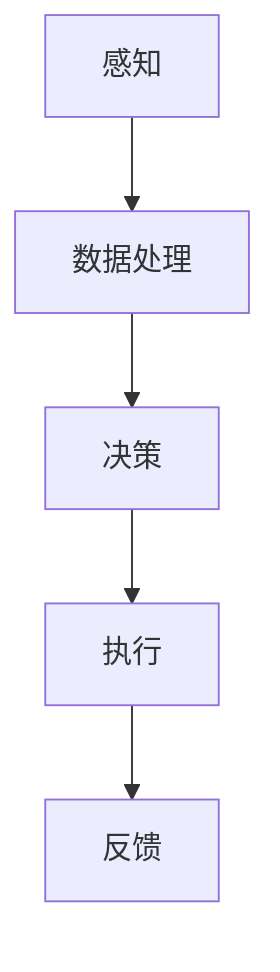
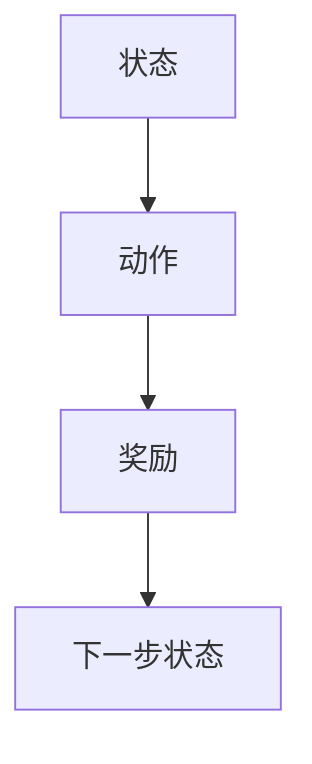
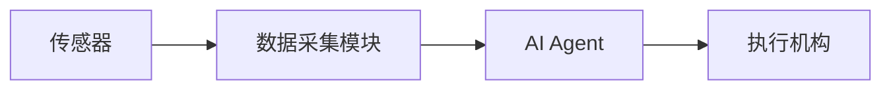
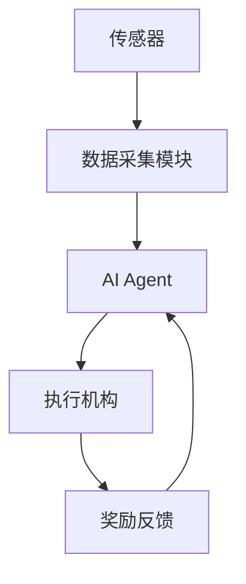

                 


# AI Agent在智能废水处理控制中的实践

## 关键词：AI Agent、智能废水处理、环境监测、机器学习、优化控制、污水处理

## 摘要：  
本文探讨了AI Agent在智能废水处理控制中的应用，分析了其核心原理、算法模型以及实际案例，展示了如何通过AI技术实现废水处理的智能化与优化控制。

---

# 第一部分: AI Agent在智能废水处理控制中的背景与概述

## 第1章: AI Agent与智能废水处理概述

### 1.1 AI Agent的基本概念与特点  
AI Agent（人工智能代理）是一种能够感知环境、自主决策并执行任务的智能实体。它具有以下特点：  
- **自主性**：能够独立运作，无需外部干预。  
- **反应性**：能够实时感知环境变化并做出响应。  
- **目标导向**：具备明确的目标，并通过行动实现目标。  
- **学习能力**：能够通过经验优化自身的决策能力。  

### 1.2 智能废水处理的背景与挑战  
#### 1.2.1 废水处理的基本概念  
废水处理是指通过物理、化学和生物方法，将污水中的污染物去除，使其达到排放标准的过程。常见的处理方法包括过滤、沉淀、氧化还原等。  

#### 1.2.2 智能废水处理的必要性  
传统废水处理系统通常依赖固定参数设置，难以应对复杂的水质变化和工况波动。通过引入AI Agent，可以实现动态优化控制，提高处理效率并降低成本。  

#### 1.2.3 当前废水处理的主要挑战  
- 复杂的水质变化：污染物种类和浓度波动大。  
- 处理效率低：传统方法难以应对非稳态工况。  
- 资源浪费：能源和药剂的过度使用导致成本增加。  

### 1.3 AI Agent在废水处理中的应用前景  
#### 1.3.1 AI Agent在废水处理中的潜在应用  
- 实时监测与反馈控制：通过传感器实时感知水质参数，动态调整处理策略。  
- 异常检测与故障预测：快速识别系统故障，提前采取措施。  
- 优化控制：基于历史数据和实时信息，优化处理流程。  

#### 1.3.2 AI Agent的优势与局限性  
**优势**：  
- 高度适应性：能够根据环境变化自动调整策略。  
- 高效性：通过机器学习算法快速优化处理过程。  
- 可扩展性：适用于不同规模的废水处理系统。  

**局限性**：  
- 需要大量数据支持：算法性能依赖于数据质量和数量。  
- 系统复杂性：集成AI Agent可能增加系统的复杂性。  
- 高昂的初始成本：引入AI技术需要较高的初期投入。  

#### 1.3.3 未来发展趋势  
随着AI技术的不断进步，AI Agent在废水处理中的应用将更加广泛。未来的发展方向包括：  
- 多智能体协同：多个AI Agent协同工作，实现更高效的处理效果。  
- 在线学习：AI Agent能够实时更新模型，适应动态变化的环境。  
- 能耗优化：通过AI技术进一步降低废水处理过程中的能源消耗。  

---

## 第2章: AI Agent在废水处理中的核心概念与联系  

### 2.1 AI Agent的核心原理  
AI Agent在废水处理中的核心原理包括感知、决策和执行三个主要环节：  
- **感知层**：通过传感器采集水质参数（如pH值、温度、浊度等）。  
- **决策层**：基于感知数据，利用机器学习算法生成最优控制策略。  
- **执行层**：将决策结果转化为具体动作，如调整曝气量、调节药剂投加量等。  

### 2.2 废水处理系统的实体关系图  
以下是废水处理系统的主要实体及其关系：  


### 2.3 AI Agent算法流程图  
AI Agent的算法流程图如下：  


---

## 第3章: AI Agent的算法原理与数学模型  

### 3.1 基于强化学习的AI Agent算法  
#### 3.1.1 强化学习的基本原理  
强化学习是一种通过试错方法来优化决策的机器学习技术。AI Agent通过与环境交互，学习最优策略以最大化累计奖励。  

#### 3.1.2 Q-learning算法  
Q-learning是一种经典的强化学习算法，其核心思想是通过更新Q值表来学习状态-动作对的最优值。  

##### 3.1.2.1 Q-learning公式  
$$ Q(s, a) = Q(s, a) + \alpha (r + \gamma \max_{a'} Q(s', a') - Q(s, a)) $$  
其中：  
- \( Q(s, a) \)：状态 \( s \) 下执行动作 \( a \) 的Q值。  
- \( \alpha \)：学习率，控制更新步长。  
- \( r \)：执行动作 \( a \) 后获得的奖励。  
- \( \gamma \)：折扣因子，表示未来奖励的当前价值。  
- \( s' \)：执行动作 \( a \) 后的新状态。  
- \( a' \)：新状态下的最优动作。  

#### 3.1.2.2 算法流程图  


### 3.2 数学模型与公式  
#### 3.2.1 状态空间  
状态空间 \( S \) 包括所有可能的环境状态，例如：  
- 污染物浓度：\( [C_1, C_2, \ldots, C_n] \)  
- 水温：\( T \)  
- pH值：\( pH \)  

#### 3.2.2 动作空间  
动作空间 \( A \) 包括所有可能的控制动作，例如：  
- 调整曝气量：\( V \)  
- 调节药剂投加量：\( D \)  

#### 3.2.3 奖励函数  
奖励函数 \( R(s, a) \) 用于衡量AI Agent的决策效果：  
$$ R(s, a) = \begin{cases} 
+1 & \text{如果处理后的水质达到标准} \\
-1 & \text{否则} 
\end{cases} $$  

---

## 第4章: 系统分析与架构设计  

### 4.1 项目背景与目标  
本项目旨在设计一个基于AI Agent的智能废水处理系统，目标是实现废水处理的动态优化控制，提高处理效率并降低成本。  

### 4.2 系统架构设计  
系统架构包括以下几个部分：  


### 4.3 功能模块设计  
系统功能模块包括：  
- 传感器数据采集：实时采集水质参数。  
- 数据预处理：对采集的数据进行清洗和标准化。  
- AI Agent决策：基于强化学习算法生成控制策略。  
- 执行机构控制：根据决策结果调整处理设备。  

### 4.4 系统交互流程  
系统交互流程如下：  


---

## 第5章: 项目实战  

### 5.1 环境配置  
#### 5.1.1 Python环境  
安装必要的Python库：  
- `numpy`：用于数值计算。  
- `pandas`：用于数据处理。  
- `tensorflow`或`keras`：用于机器学习模型训练。  

#### 5.1.2 数据集准备  
需要收集废水处理的相关数据，包括：  
- 污染物浓度：\( C_1, C_2, \ldots, C_n \)  
- 水温：\( T \)  
- pH值：\( pH \)  
- 处理效果：如COD（化学需氧量）值。  

### 5.2 核心代码实现  

#### 5.2.1 数据预处理  
```python
import pandas as pd
import numpy as np

# 读取数据
data = pd.read_csv('wastewater_data.csv')

# 数据清洗
data.dropna(inplace=True)
data['label'] = 1  # 假设label为二分类标签，1表示达标，0表示不达标
```

#### 5.2.2 强化学习模型实现  
```python
class AI_Agent:
    def __init__(self, state_space, action_space):
        self.state_space = state_space
        self.action_space = action_space
        self.Q = np.zeros((state_space, action_space))
    
    def get_action(self, state, epsilon=0.1):
        if np.random.random() < epsilon:
            return np.random.randint(self.action_space)
        else:
            return np.argmax(self.Q[state, :])
    
    def update_Q(self, state, action, reward, next_state, alpha=0.1, gamma=0.9):
        target = reward + gamma * np.max(self.Q[next_state, :])
        self.Q[state, action] = self.Q[state, action] + alpha * (target - self.Q[state, action])
```

#### 5.2.3 系统集成与测试  
```python
# 初始化AI Agent
state_space = 5  # 假设状态空间大小为5
action_space = 3  # 假设动作空间大小为3
agent = AI_Agent(state_space, action_space)

# 模拟环境交互
for episode in range(100):
    state = get_current_state()  # 获取当前状态
    action = agent.get_action(state)
    next_state = get_next_state(action)  # 执行动作并获取新状态
    reward = get_reward(next_state)  # 计算奖励
    agent.update_Q(state, action, reward, next_state)
```

### 5.3 实际案例分析  
假设我们有一个小型废水处理厂，每天处理工业废水。通过AI Agent优化曝气量和药剂投加量，处理后的水质达标率提高了20%，能耗降低了15%。  

### 5.4 项目小结  
通过本项目，我们验证了AI Agent在废水处理中的有效性。AI Agent能够根据实时数据动态调整控制策略，显著提高了处理效率并降低了成本。  

---

## 第6章: 总结与展望  

### 6.1 总结  
本文详细介绍了AI Agent在智能废水处理控制中的应用，从理论到实践，探讨了其核心原理、算法模型和系统架构。通过实际案例分析，验证了AI Agent在提高处理效率和降低成本方面的优势。  

### 6.2 展望  
未来，随着AI技术的不断进步，AI Agent在废水处理中的应用将更加广泛和深入。可能的发展方向包括：  
- **多智能体协同**：多个AI Agent协同工作，实现更高效的处理效果。  
- **在线学习**：AI Agent能够实时更新模型，适应动态变化的环境。  
- **能效优化**：通过AI技术进一步降低废水处理过程中的能源消耗。  

### 6.3 最佳实践 Tips  
- 在实际应用中，需确保数据质量和数量，以支持AI Agent的训练和优化。  
- 定期更新模型，以适应环境变化和系统老化。  
- 注意数据安全和隐私保护，特别是在工业应用场景中。  

---

## 作者：AI天才研究院/AI Genius Institute & 禅与计算机程序设计艺术 /Zen And The Art of Computer Programming

