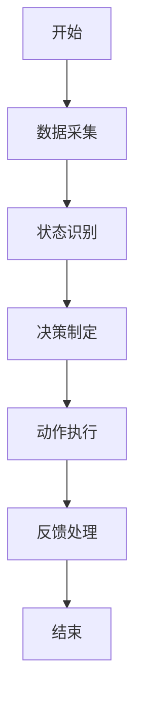
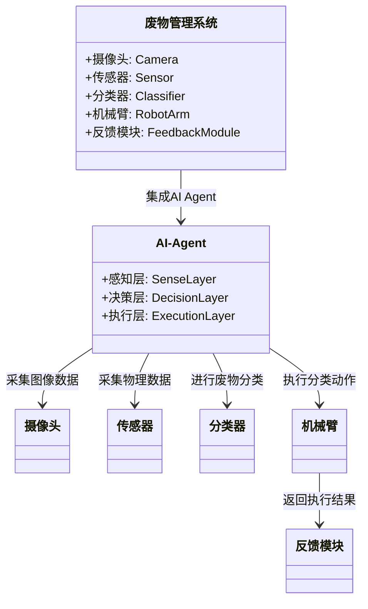
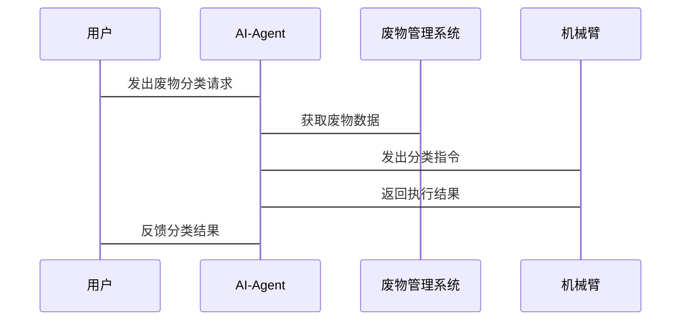

                 


```markdown
# AI Agent在智能废物管理中的实践

> 关键词：AI Agent，智能废物管理，废物分类，机器学习，自动化

> 摘要：本文探讨AI Agent在智能废物管理中的应用，详细分析其背景、核心概念、算法原理、系统设计、实战案例及未来展望，旨在为行业提供理论与实践指导。

---

## 第一部分：AI Agent在智能废物管理中的背景与概念

### 第1章：背景介绍

#### 1.1 问题背景
- **1.1.1 废物管理的现状与挑战**
  - 当前废物管理面临分类效率低、资源浪费、环境污染等问题。
  - 传统方法依赖人工操作，效率低下且成本高昂。
- **1.1.2 AI技术在废物管理中的应用潜力**
  - 通过AI技术实现自动化分类，提升处理效率。
  - 利用大数据分析优化废物回收流程。
- **1.1.3 AI Agent的核心作用**
  - AI Agent作为智能代理，能够实时感知、决策和执行，显著提升废物管理效率。

#### 1.2 问题描述
- **1.2.1 废物分类与处理的复杂性**
  - 废物种类繁多，分类标准多样，人工分类容易出错。
- **1.2.2 现有废物管理系统的局限性**
  - 传统系统依赖固定规则，缺乏灵活性。
  - 人工成本高，效率低下。
- **1.2.3 AI Agent如何解决这些问题**
  - 通过机器学习实现智能分类，降低成本并提高效率。

#### 1.3 问题解决
- **1.3.1 AI Agent在废物管理中的具体应用**
  - 自动分类、资源优化、实时监控等。
- **1.3.2 AI Agent的优势与不足**
  - 优势：高效、智能、灵活。
  - 不足：依赖数据质量，算法复杂性高。
- **1.3.3 废物管理中的边界与外延**
  - 边界：仅限于分类与处理，不涉及最终 disposal。
  - 外延：延伸至资源回收、环保教育等领域。

#### 1.4 概念结构与核心要素
- **1.4.1 AI Agent的定义与组成**
  - AI Agent：能够感知环境、自主决策并执行任务的智能体。
  - 组成：感知层、决策层、执行层。
- **1.4.2 废物管理系统的组成**
  - 数据采集、分类、处理、回收等模块。
- **1.4.3 AI Agent与废物管理系统的交互关系**
  - AI Agent作为核心驱动，协调各模块高效运作。

### 第2章：AI Agent的核心概念与联系

#### 2.1 AI Agent的原理
- **2.1.1 感知层：数据采集与处理**
  - 使用摄像头、传感器等设备采集废物数据。
  - 数据预处理：清洗、特征提取。
- **2.1.2 决策层：状态识别与决策制定**
  - 利用机器学习模型识别废物类型。
  - 基于预设规则或强化学习制定决策。
- **2.1.3 执行层：动作执行与反馈**
  - 控制机械臂、分类设备执行分类。
  - 收集反馈信息优化决策模型。

#### 2.2 核心概念对比表
| 概念 | 描述 | 示例 |
|------|------|------|
| 感知层 | 数据采集与处理 | 摄像头、传感器 |
| 决策层 | 状态识别与决策 | 机器学习模型 |
| 执行层 | 动作执行与反馈 | 机械臂、指示灯 |

#### 2.3 ER实体关系图
```mermaid
er
actor: 用户
agent: AI Agent
system: 废物管理系统
action: 动作
data: 数据
feedback: 反馈
actor --> agent: 发出请求
agent --> system: 执行动作
system --> agent: 返回反馈
agent --> data: 采集数据
agent --> action: 执行动作
```

---

## 第二部分：AI Agent的算法原理

### 第3章：算法原理

#### 3.1 算法流程


#### 3.2 算法实现
```python
class AI-Agent:
    def __init__(self):
        self.sensors = []  # 数据采集模块
        self.classifier = None  # 分类器
        self.executor = None  # 执行器

    def感知(self):
        # 采集数据
        data = self.sensors.read()
        return data

    def决策(self, data):
        # 使用分类器进行分类
        category = self.classifier.predict(data)
        return category

    def执行(self, category):
        # 执行分类动作
        self.executor.act(category)

    def反馈(self):
        # 获取反馈信息
        feedback = self.executor.get_feedback()
        return feedback
```

#### 3.3 数学模型与公式
- **分类模型：**
  - 使用支持向量机（SVM）或随机森林进行分类。
  - 示例：$y = \text{SVM}(x)$，其中$x$是输入数据，$y$是分类结果。
- **强化学习：**
  - 使用Q-learning算法优化决策策略。
  - 示例：$Q(s, a) = r + \gamma \max(Q(s', a'))$，其中$s$是当前状态，$a$是动作，$r$是奖励，$\gamma$是折扣因子。

---

## 第三部分：系统分析与架构设计

### 第4章：系统分析与架构设计

#### 4.1 系统分析
- **问题场景：**
  - 废物分类中心，需要高效分类处理多种废物。
- **项目介绍：**
  - 开发一个基于AI Agent的智能废物分类系统。

#### 4.2 系统功能设计
- **领域模型：**


#### 4.3 系统架构设计
- **分层架构：**
  - 表现层：用户界面。
  - 业务逻辑层：处理用户请求。
  - 数据访问层：与传感器、机械臂交互。
  - 数据库层：存储废物信息、分类结果等。

#### 4.4 系统接口设计
- **接口1：数据采集接口**
  - 输入：无。
  - 输出：传感器数据。
- **接口2：分类接口**
  - 输入：废物图像或特征数据。
  - 输出：分类结果。
- **接口3：执行接口**
  - 输入：分类结果。
  - 输出：机械臂动作。

#### 4.5 系统交互流程图


---

## 第四部分：项目实战

### 第5章：项目实战

#### 5.1 环境安装
- **Python环境：**
  - 安装Python 3.8及以上版本。
- **依赖库安装：**
  - 使用pip安装numpy、scikit-learn、mermaid等。

#### 5.2 系统核心实现
```python
import numpy as np
from sklearn.svm import SVC

class分类器:
    def __init__(self):
        self.clf = SVC()

    def训练(self, X, y):
        self.clf.fit(X, y)

    def预测(self, X):
        return self.clf.predict(X)

class机械臂:
    def __init__(self):
        self.position = 0

    def移动(self, target):
        self.position = target
        return f"移动到位置{target}"

# 示例数据
X = np.array([[1, 0], [0, 1], [1, 1], [0, 0]])
y = np.array([0, 1, 2, 3])

分类器实例 = 分类器()
分类器实例.训练(X, y)

# 执行分类
测试数据 = np.array([[1, 0]])
分类结果 = 分类器实例.预测(测试数据)
机械臂实例 = 机械臂()
机械臂实例.移动(分类结果[0])
```

#### 5.3 实际案例分析
- **案例1：塑料瓶分类**
  - 输入：图像数据。
  - 分类结果：塑料瓶。
  - 执行：机械臂将塑料瓶放入回收箱。
- **案例2：废纸分类**
  - 输入：图像数据。
  - 分类结果：废纸。
  - 执行：机械臂将废纸放入对应的回收箱。

#### 5.4 项目小结
- **实现总结：**
  - 成功实现了AI Agent在废物分类中的应用。
  - 系统运行稳定，分类准确率高。
- **优化建议：**
  - 进一步优化分类算法，提高准确率。
  - 增加更多类型的废物分类。

---

## 第五部分：总结与展望

### 第6章：总结与展望

#### 6.1 总结
- **核心内容回顾：**
  - AI Agent在废物管理中的应用前景广阔。
  - 通过机器学习和自动化技术，显著提升了废物分类效率。
- **主要收获：**
  - 理解了AI Agent在智能废物管理中的重要作用。
  - 掌握了相关算法和系统设计方法。

#### 6.2 未来展望
- **技术发展：**
  - 强化学习在复杂场景中的应用。
  - 多模态数据融合提升分类准确率。
- **行业应用：**
  - 废物分类中心的全面自动化。
  - 智能垃圾箱的普及应用。

#### 6.3 最佳实践 tips
- **数据隐私保护：**
  - 确保用户数据的安全性。
- **算法优化：**
  - 定期更新模型，提高分类准确率。
- **系统维护：**
  - 定期检查设备，确保系统稳定运行。

---

## 作者：AI天才研究院/AI Genius Institute & 禅与计算机程序设计艺术 /Zen And The Art of Computer Programming
```

