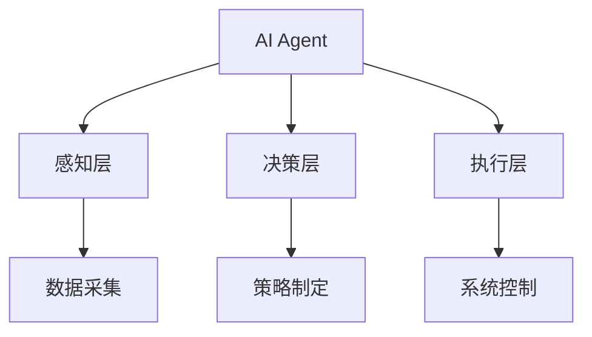
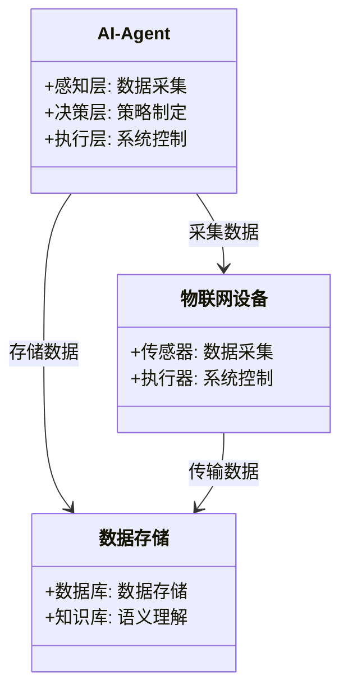
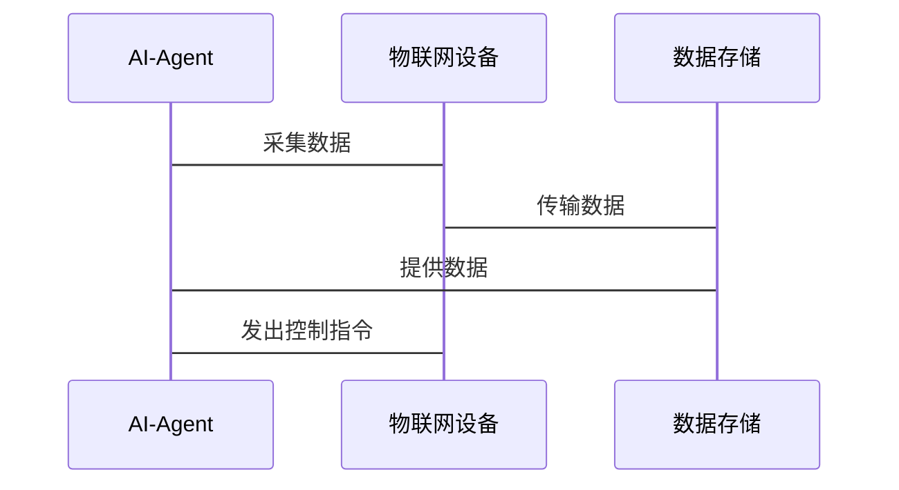

                 

# AI Agent在智能建筑管理中的应用

## 关键词：AI Agent、智能建筑管理、强化学习、物联网、知识图谱、机器学习

## 摘要：本文深入探讨了AI Agent在智能建筑管理中的应用，从AI Agent的基本概念到其在智能建筑管理中的核心算法、系统架构设计，再到实际项目中的应用，进行了全面的分析。文章详细讲解了AI Agent的原理、算法实现、系统架构设计，并通过实际案例展示了AI Agent在智能建筑管理中的优势和应用价值。

---

# 第1章: AI Agent与智能建筑管理概述

## 1.1 AI Agent的基本概念

### 1.1.1 AI Agent的定义与特点

人工智能代理（AI Agent）是指能够感知环境并采取行动以实现目标的智能实体。AI Agent的核心特点包括：

- **自主性**：能够在没有外部干预的情况下自主运行。
- **反应性**：能够实时感知环境并做出反应。
- **目标导向性**：所有的行动都是为了实现特定目标。
- **学习能力**：能够通过经验改进自己的行为。

### 1.1.2 AI Agent的核心功能与应用场景

AI Agent在智能建筑管理中的核心功能包括：

- **数据采集与处理**：通过物联网设备采集建筑环境数据。
- **决策与控制**：根据数据做出优化决策，并通过系统进行控制。
- **预测与规划**：基于历史数据和当前状态，预测未来趋势并制定优化计划。

### 1.1.3 智能建筑管理的定义与发展趋势

智能建筑管理是指通过智能化技术对建筑内的设备、环境和资源进行优化管理。随着物联网、大数据和人工智能技术的快速发展，智能建筑管理正在向更加智能化、自动化和可持续化的方向发展。

---

## 1.2 AI Agent在智能建筑管理中的应用背景

### 1.2.1 智能建筑管理的现状与挑战

目前，智能建筑管理主要依赖于传统的建筑管理系统（BMS），但存在以下挑战：

- **数据孤岛**：不同设备和系统之间缺乏有效集成。
- **决策滞后**：基于规则的系统响应速度较慢，难以应对复杂变化。
- **能耗问题**：传统管理方式能耗较高，无法实现最优能源管理。

### 1.2.2 AI Agent在智能建筑管理中的优势

AI Agent相比传统BMS具有以下优势：

- **实时性**：能够快速响应环境变化。
- **智能性**：能够自主学习和优化决策。
- **适应性**：能够根据环境变化自适应调整策略。

### 1.2.3 应用场景与典型案例

AI Agent在智能建筑管理中的典型应用场景包括：

- **能耗优化**：通过AI Agent实现 HVAC 系统的智能调节，降低能耗。
- **设备维护**：通过预测性维护减少设备故障，延长设备寿命。
- **用户行为分析**：根据用户行为优化室内环境设置。

---

## 1.3 本章小结

本章介绍了AI Agent的基本概念、核心功能及其在智能建筑管理中的应用背景。通过对比传统BMS，突出了AI Agent在智能建筑管理中的优势和应用价值。

---

# 第2章: AI Agent的核心概念与原理

## 2.1 AI Agent的核心概念

### 2.1.1 AI Agent的组成与结构

AI Agent的组成包括感知层、决策层和执行层。感知层负责数据采集，决策层负责策略制定，执行层负责具体操作。

### 2.1.2 AI Agent的行为模式与决策机制

AI Agent的行为模式包括反应式和目标式两种模式。反应式模式基于当前环境做出即时反应，目标式模式则基于目标制定长期规划。

### 2.1.3 AI Agent与传统建筑管理系统的区别

AI Agent相比传统BMS具有更强的自主性和学习能力，能够实现更复杂的优化决策。

---

## 2.2 AI Agent的原理与算法

### 2.2.1 AI Agent的感知与推理机制

AI Agent的感知机制包括数据采集和特征提取。推理机制则基于逻辑推理和概率推理。

### 2.2.2 基于强化学习的决策算法

强化学习是一种基于奖励机制的决策算法。通过不断试错，AI Agent能够找到最优策略。

### 2.2.3 多智能体协作的实现原理

多智能体协作通过通信和协调机制实现。每个智能体负责特定任务，通过共享信息实现协同优化。

---

## 2.3 AI Agent的核心技术对比

### 2.3.1 不同AI Agent算法的优缺点对比

| 算法类型    | 优点                          | 缺点                          |
|------------|-------------------------------|-------------------------------|
| Q-learning | 简单易实现，适合离散动作空间  | 需要大量试验，收敛速度慢      |
| DQN        | 能处理连续动作空间             | 实现复杂，训练时间较长        |

### 2.3.2 基于表格的对比分析

通过表格形式对比不同AI Agent算法的性能和应用场景。

### 2.3.3 ER实体关系图架构（Mermaid流程图）

---

## 2.4 本章小结

本章详细讲解了AI Agent的核心概念与原理，分析了不同算法的优缺点，并通过ER图展示了AI Agent的架构。

---

# 第3章: AI Agent在智能建筑管理中的技术基础

## 3.1 机器学习基础

### 3.1.1 机器学习的基本概念与分类

机器学习分为监督学习、无监督学习和半监督学习三类。

### 3.1.2 常见机器学习算法及其特点

常用的机器学习算法包括线性回归、支持向量机（SVM）和随机森林等。

### 3.1.3 深度学习与传统机器学习的对比

深度学习在处理非结构化数据方面具有优势，但需要大量数据和计算资源。

---

## 3.2 知识图谱与语义理解

### 3.2.1 知识图谱的构建与应用

知识图谱通过实体和关系构建语义网络，用于语义理解和意图识别。

### 3.2.2 基于语义理解的意图识别

通过自然语言处理技术，AI Agent能够理解用户的意图并做出响应。

### 3.2.3 知识图谱在智能建筑管理中的应用

知识图谱可以用于设备管理、用户行为分析和能耗优化等领域。

---

## 3.3 物联网与数据采集

### 3.3.1 物联网的基本概念与架构

物联网由感知层、网络层和应用层组成，用于数据的采集、传输和处理。

### 3.3.2 建筑管理中的数据采集技术

通过传感器和物联网设备采集建筑环境、设备状态等数据。

### 3.3.3 数据预处理与特征提取

数据预处理包括去噪和归一化，特征提取则是从数据中提取有用信息。

---

## 3.4 本章小结

本章介绍了AI Agent在智能建筑管理中的技术基础，包括机器学习、知识图谱和物联网等技术。

---

# 第4章: AI Agent在智能建筑管理中的算法原理

## 4.1 基于强化学习的AI Agent算法

### 4.1.1 强化学习的基本原理与数学模型

强化学习通过状态、动作和奖励的三元组进行学习。数学模型如下：

$$ R = r_t \text{, 其中 } t \text{ 表示时间步} $$

### 4.1.2 Q-learning算法的实现与应用

Q-learning算法通过Q表存储状态-动作值，数学模型如下：

$$ Q(s, a) = Q(s, a) + \alpha (r + \gamma \max Q(s', a')) - Q(s, a) $$

### 4.1.3 多智能体强化学习的挑战与解决方案

多智能体强化学习需要解决通信和协调问题，可以通过共享策略或分布式学习实现。

---

## 4.2 基于监督学习的AI Agent算法

### 4.2.1 监督学习的基本原理与数学模型

监督学习通过标签数据进行训练，数学模型如下：

$$ y = f(x) + \epsilon $$

### 4.2.2 分类与回归算法在AI Agent中的应用

分类算法用于设备状态分类，回归算法用于能耗预测。

### 4.2.3 基于决策树的AI Agent

决策树通过特征提取和规则推理实现决策，数学模型如下：

$$ \text{决策树模型} $$

---

## 4.3 本章小结

本章详细讲解了AI Agent在智能建筑管理中的算法原理，包括强化学习和监督学习的实现与应用。

---

# 第5章: AI Agent在智能建筑管理中的系统架构设计

## 5.1 系统功能设计

### 5.1.1 领域模型设计（Mermaid类图）

### 5.1.2 功能模块划分

系统功能模块包括数据采集、决策优化和系统控制三部分。

---

## 5.2 系统架构设计

### 5.2.1 系统架构设计（Mermaid架构图）

### 5.2.2 系统交互设计（Mermaid序列图）

---

## 5.3 本章小结

本章详细讲解了AI Agent在智能建筑管理中的系统架构设计，包括功能模块划分和系统交互设计。

---

# 第6章: AI Agent在智能建筑管理中的项目实战

## 6.1 项目环境安装

### 6.1.1 系统环境要求

需要安装Python、TensorFlow和Kafka等工具。

### 6.1.2 环境配置与依赖安装

安装必要的Python包，如numpy、pandas和scikit-learn。

---

## 6.2 系统核心实现

### 6.2.1 数据采集与处理

通过物联网设备采集数据并进行预处理。

### 6.2.2 AI Agent算法实现

实现强化学习算法并对数据进行训练。

### 6.2.3 系统集成与测试

将AI Agent集成到建筑管理系统中并进行测试。

---

## 6.3 项目小结

本章通过实际项目展示了AI Agent在智能建筑管理中的实现过程，包括环境配置、数据处理和系统集成。

---

# 第7章: AI Agent在智能建筑管理中的最佳实践

## 7.1 项目部署与维护

### 7.1.1 系统部署流程

包括环境搭建、代码部署和系统测试。

### 7.1.2 系统维护与优化

定期更新模型和优化算法。

---

## 7.2 最佳实践 Tips

- 定期更新模型以适应环境变化。
- 优化算法以提高系统性能。
- 加强数据安全和隐私保护。

---

## 7.3 本章小结

本章总结了AI Agent在智能建筑管理中的最佳实践，包括系统部署、维护和优化建议。

---

# 结语

通过本文的详细讲解，读者可以全面了解AI Agent在智能建筑管理中的应用。未来，随着技术的不断进步，AI Agent将在智能建筑管理中发挥更大的作用。

---

# 作者：AI天才研究院 & 禅与计算机程序设计艺术

