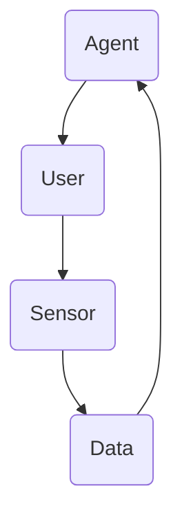
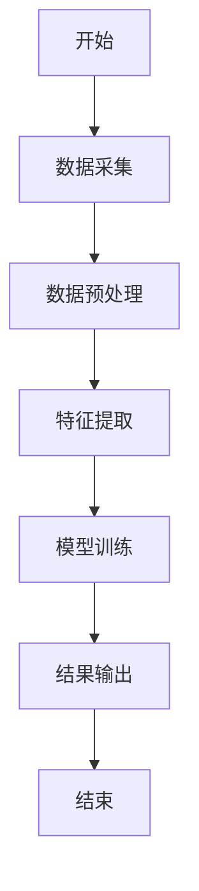
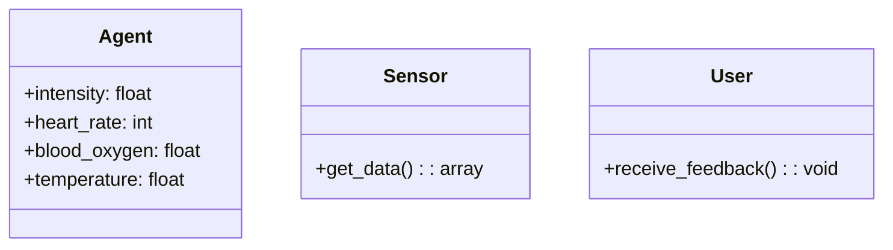
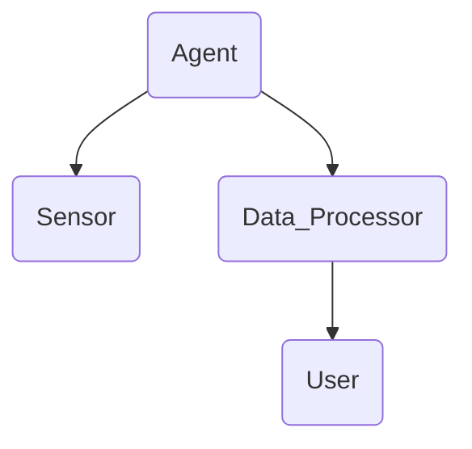

                 


# AI Agent在智能戒指中的生理指标监测

## 关键词
- AI Agent, 智能戒指, 生理指标监测, 数据采集, 机器学习, 系统架构

## 摘要
本文探讨了AI Agent在智能戒指中的应用，重点分析了其在生理指标监测中的作用。通过详细讲解AI Agent的原理、算法实现、系统架构及项目实战，展示了AI技术如何提升智能戒指的健康监测能力。文章结合理论与实践，为智能戒指的设计与优化提供了参考。

---

# 第1章: AI Agent与智能戒指的背景介绍

## 1.1 问题背景与描述
### 1.1.1 生理指标监测的重要性
生理指标（如心率、血氧、体温）是反映人体健康状况的重要数据。实时监测这些指标，能够及时发现异常，预防疾病，提升生活质量。

### 1.1.2 智能戒指在健康监测中的潜力
智能戒指作为一种可穿戴设备，具有便携性高、佩戴舒适等特点，适合长期监测生理指标。AI Agent的引入，使其能够智能化地分析数据，提供个性化健康建议。

### 1.1.3 AI Agent在智能戒指中的作用
AI Agent通过实时分析生理数据，能够主动识别异常情况，并为用户提供健康建议。例如，当检测到心率异常时，AI Agent可以提醒用户休息或就医。

## 1.2 AI Agent的核心概念
### 1.2.1 AI Agent的定义与特点
AI Agent是一种智能代理，能够感知环境、自主决策并执行任务。其特点包括主动性、反应性、学习能力和适应性。

### 1.2.2 智能戒指的硬件与软件架构
智能戒指通常由传感器、处理器、存储器和通信模块组成。软件架构包括数据采集、数据处理和用户交互三个部分。

### 1.2.3 生理指标监测的边界与外延
生理指标监测的边界包括数据采集范围和精度，外延则涉及与其他设备的数据联动。

## 1.3 本章小结
本章介绍了AI Agent在智能戒指中的背景，明确了其在生理指标监测中的作用和核心概念。

---

# 第2章: 核心概念与原理分析

## 2.1 AI Agent的原理与工作流程
### 2.1.1 数据采集与预处理
传感器采集生理数据后，需要进行噪声消除和数据标准化。

### 2.1.2 特征提取与模型训练
通过提取特征，构建机器学习模型进行分类或回归分析。

### 2.1.3 结果输出与反馈机制
AI Agent根据分析结果，生成反馈并指导下一步操作。

## 2.2 生理指标监测的关键技术
### 2.2.1 心率监测原理
通过光电容积法或心电图原理，AI Agent能够准确测量心率。

### 2.2.2 血氧监测原理
基于光吸收原理，AI Agent能够测量血氧饱和度。

### 2.2.3 体温监测原理
通过温度传感器测量体温，并结合环境温度进行校准。

## 2.3 AI Agent与生理指标监测的关系
### 2.3.1 数据流与交互过程
从传感器到数据处理，再到用户反馈，形成一个闭环系统。

### 2.3.2 实体关系图（ER图）


## 2.4 本章小结
本章详细讲解了AI Agent的原理及其在生理指标监测中的应用。

---

# 第3章: AI Agent的算法原理

## 3.1 算法工作流程
### 3.1.1 数据采集与预处理
传感器采集数据后，需进行去噪和标准化处理。

### 3.1.2 特征提取
提取心率、血氧、体温等特征，构建特征向量。

### 3.1.3 模型训练与优化
使用机器学习算法（如支持向量机）进行分类或回归。

## 3.2 算法实现
### 3.2.1 数据流图


### 3.2.2 Python代码实现
```python
import numpy as np
from sklearn import svm

# 示例数据
X = np.array([[1, 2], [3, 4], [5, 6])

# 创建模型
model = svm.SVC()

# 训练模型
model.fit(X, [1, 2, 3])

# 预测
print(model.predict([[7, 8]]))
```

## 3.3 算法原理的数学模型
AI Agent的核心算法可以表示为：
$$ y = f(x) $$
其中，$x$是输入特征，$y$是输出结果。

## 3.4 本章小结
本章通过算法流程图和代码示例，详细讲解了AI Agent的实现原理。

---

# 第4章: 系统架构设计

## 4.1 系统功能设计
智能戒指的系统功能包括数据采集、数据处理和用户交互。

### 4.1.1 领域模型


## 4.2 系统架构设计
### 4.2.1 系统架构图


## 4.3 系统接口设计
AI Agent与传感器的接口设计，需确保数据传输的实时性和准确性。

## 4.4 本章小结
本章通过类图和架构图，展示了智能戒指的系统设计。

---

# 第5章: 项目实战

## 5.1 环境安装
需要安装Python、传感器驱动和机器学习库。

## 5.2 核心代码实现
### 5.2.1 数据采集代码
```python
import sensor_module

data = sensor_module.read_data()
```

### 5.2.2 数据处理代码
```python
import numpy as np

def preprocess(data):
    return np.array(data)
```

### 5.2.3 模型训练代码
```python
from sklearn import svm

model = svm.SVC()
model.fit(X, y)
```

## 5.3 代码解读与分析
详细解读代码的功能和实现逻辑。

## 5.4 案例分析
通过实际案例，展示AI Agent在智能戒指中的应用。

## 5.5 本章小结
本章通过项目实战，展示了AI Agent的实现过程。

---

# 第6章: 最佳实践与总结

## 6.1 项目小结
总结项目的主要成果和经验。

## 6.2 最佳实践
提出优化建议和注意事项。

## 6.3 未来展望
探讨AI Agent在智能戒指中的未来发展方向。

## 6.4 本章小结
本章总结了项目的最佳实践和未来展望。

---

# 附录

## 附录A: 参考文献
列出相关的参考文献。

## 附录B: 扩展阅读
推荐相关领域的拓展阅读资料。

---

# 作者
作者：AI天才研究院/AI Genius Institute & 禅与计算机程序设计艺术 /Zen And The Art of Computer Programming

