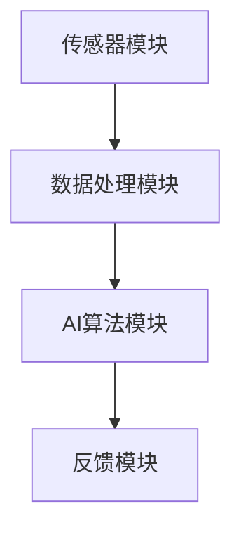
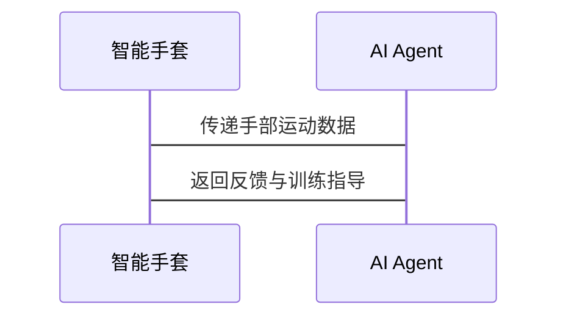

                 


# AI Agent在智能手套中的手部康复训练

> 关键词：AI Agent，智能手套，手部康复训练，强化学习，可穿戴设备，康复医疗

> 摘要：本文详细探讨了AI Agent在智能手套中的手部康复训练应用，分析了AI Agent的核心原理、算法实现、系统架构，以及在手部康复训练中的实际应用案例。通过结合传感器技术、无线通信技术和数据处理技术，AI Agent能够实时感知手部运动状态，提供个性化的康复训练方案，从而提高康复训练的效率和效果。

---

# 第一部分: 背景介绍

## 第1章: AI Agent与智能手套的基本概念

### 1.1 AI Agent的基本概念

#### 1.1.1 AI Agent的定义与分类
AI Agent（人工智能代理）是指能够感知环境、自主决策并执行任务的智能体。它可以分为简单反射型、基于模型的反应型、目标驱动型和实用驱动型等几类。AI Agent的核心能力包括感知、决策、执行和学习。

#### 1.1.2 智能手套的定义与功能
智能手套是一种集成了多种传感器和智能算法的可穿戴设备，能够实时感知手部的运动状态、肌电信号和环境信息，并通过AI算法提供实时反馈和康复训练指导。

#### 1.1.3 AI Agent在智能手套中的作用
在手部康复训练中，AI Agent通过分析手部运动数据，提供个性化的康复训练方案，实时纠正错误动作，提高康复训练的效率和效果。

---

## 第2章: 手部康复训练的背景与需求

### 2.1 手部康复的基本原理
手部康复训练的目标是通过科学的训练方法，恢复手部的灵活性、力量和协调性。传统的康复训练通常依赖于手动操作和物理治疗师的指导，而智能化的康复训练设备能够提供更精准、更个性化的训练方案。

### 2.2 手部康复训练的传统方法与不足
传统的手部康复训练方法存在以下问题：
1. 缺乏实时反馈，患者难以掌握正确的动作要领。
2. 康复训练方案缺乏个性化，无法根据患者的实际情况进行调整。
3. 康复训练的过程缺乏趣味性，患者容易失去耐心。

### 2.3 智能化康复训练的优势
智能化的康复训练设备（如智能手套）结合AI Agent技术，能够实现以下优势：
1. 实时感知手部运动状态，提供即时反馈。
2. 根据患者的具体情况，动态调整康复训练方案。
3. 提供趣味性强的训练内容，提高患者的康复积极性。

---

# 第二部分: AI Agent的核心原理与算法

## 第3章: AI Agent的核心原理

### 3.1 AI Agent的基本原理
AI Agent通过感知环境信息、分析决策并执行动作来实现目标。其核心流程包括以下几个步骤：
1. **感知环境**：通过传感器获取手部运动数据。
2. **分析决策**：基于感知数据，分析手部运动状态并生成决策。
3. **执行动作**：根据决策结果，执行相应的动作或提供反馈。

#### 3.1.1 状态空间与动作空间的定义
- **状态空间**：表示手部运动的可能状态，包括角度、速度、加速度等。
- **动作空间**：表示AI Agent能够执行的动作，如提供反馈、调整训练强度等。

#### 3.1.2 奖励机制与目标函数
AI Agent通过奖励机制来优化其决策策略。例如，当患者完成一个正确的动作时，AI Agent会给予正向奖励；当动作错误时，给予负向奖励。

---

## 第4章: AI Agent的算法实现

### 4.1 强化学习算法的实现

#### 4.1.1 Q-learning算法的实现
Q-learning是一种经典的强化学习算法，其核心思想是通过不断更新Q值表来优化决策策略。Q值表记录了状态-动作对的价值，公式如下：

$$ Q(s, a) = Q(s, a) + \alpha \cdot [r + \gamma \cdot \max Q(s', a') - Q(s, a)] $$

其中：
- $\alpha$ 是学习率。
- $\gamma$ 是折扣因子。
- $r$ 是奖励值。

#### 4.1.2 DQN算法的实现
DQN（Deep Q-Network）算法将Q值表替换为深度神经网络，通过端到端的方式学习最优决策策略。DQN的网络结构通常包括输入层、隐藏层和输出层，输出层的大小等于动作空间的大小。

#### 4.1.3 算法的数学模型与公式
DQN算法的核心思想是通过最小化预测值与实际值的差值来优化神经网络的权重。优化目标函数可以表示为：

$$ \min \mathbb{E}[ (y - Q(s, a))^2 ] $$

其中：
- $y = r + \gamma \cdot \max Q(s', a')$
- $Q(s, a)$ 是当前网络的预测值。

---

## 第5章: AI Agent在智能手套中的系统架构

### 5.1 系统功能设计
智能手套系统的主要功能包括：
1. **数据采集**：通过传感器采集手部运动数据。
2. **数据处理**：对采集的数据进行预处理和特征提取。
3. **AI算法**：基于强化学习算法生成决策。
4. **反馈与指导**：根据决策结果提供实时反馈和训练指导。

#### 5.1.1 数据流的处理流程
手部运动数据 → 数据采集模块 → 数据预处理 → AI算法模块 → 决策结果 → 反馈模块。

### 5.2 系统架构设计



---

# 第三部分: 项目实战与代码实现

## 第6章: 项目实战

### 6.1 环境搭建
1. **硬件设备**：智能手套（集成传感器模块）。
2. **软件环境**：Python 3.8+，TensorFlow 2.0+，NumPy。

### 6.2 核心代码实现

#### 6.2.1 强化学习算法的实现

```python
import numpy as np
import tensorflow as tf

class DQNAgent:
    def __init__(self, state_space, action_space):
        self.state_space = state_space
        self.action_space = action_space
        self.model = self.build_model()
    
    def build_model(self):
        model = tf.keras.Sequential()
        model.add(tf.keras.layers.Dense(24, input_dim=self.state_space, activation='relu'))
        model.add(tf.keras.layers.Dense(24, activation='relu'))
        model.add(tf.keras.layers.Dense(self.action_space, activation='linear'))
        model.compile(loss='mean_squared_error', optimizer=tf.keras.optimizers.Adam(learning_rate=0.001))
        return model
    
    def remember(self, state, action, reward, next_state):
        # 简化版的memory实现，实际应用中需要使用经验回放
        pass
    
    def act(self, state):
        if np.random.random() < 0.99:
            q_values = self.model.predict(state)
            return np.argmax(q_values[0])
        else:
            return np.random.randint(self.action_space)
    
    def train(self, state, action, reward, next_state):
        target = reward + 0.99 * np.max(self.model.predict(next_state)[0])
        q_values = self.model.predict(state)
        q_values[0][action] = target
        self.model.fit(state, q_values, epochs=1, verbose=0)
```

#### 6.2.2 系统交互流程



---

## 第7章: 最佳实践与小结

### 7.1 小结
本文详细探讨了AI Agent在智能手套中的手部康复训练应用，分析了AI Agent的核心原理、算法实现和系统架构。通过结合强化学习算法和智能手套技术，能够实现个性化的康复训练方案，显著提高康复训练的效率和效果。

### 7.2 注意事项
- 在实际应用中，需要考虑传感器的精度和稳定性。
- 算法的训练数据需要多样化，以提高模型的泛化能力。
- 系统的实时性和安全性是需要重点关注的方面。

### 7.3 未来研究方向
- 探索更先进的强化学习算法，如基于策略梯度的方法。
- 研究如何结合虚拟现实技术，提供更沉浸式的康复训练体验。
- 探讨如何将AI Agent技术应用于更广泛的康复领域，如肢体康复、运动康复等。

---

# 作者：AI天才研究院 & 禅与计算机程序设计艺术

---

通过以上思考和分析，本文系统地介绍了AI Agent在智能手套中的手部康复训练应用，从理论到实践，为读者提供了全面的技术解读。

