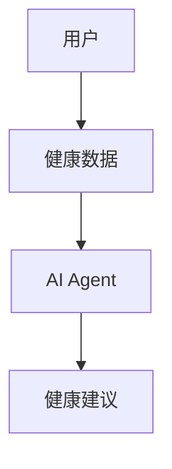
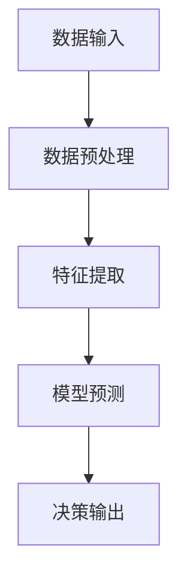
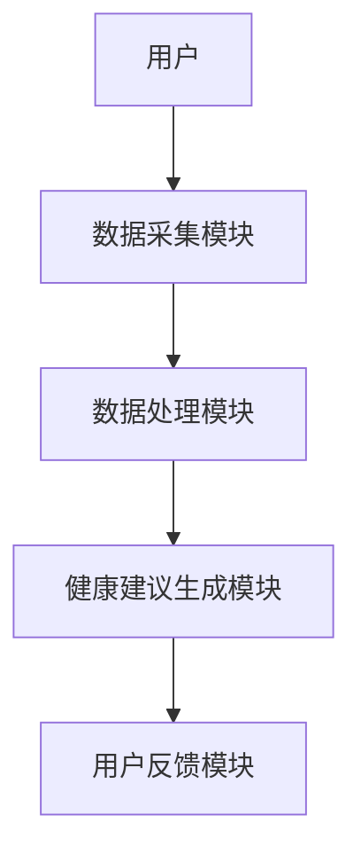

                 


# AI Agent在智能手机中的数字健康管理系统

> 关键词：AI Agent, 数字健康管理, 智能手机, 数据安全, 健康数据分析

> 摘要：本文探讨AI Agent在智能手机中的数字健康管理系统的设计与实现，从系统架构、算法原理、项目实现和实际案例分析等方面展开，深入剖析AI Agent在数字健康管理中的核心作用，并结合数学模型和系统设计图，为读者呈现一个完整的数字健康管理解决方案。

---

## 第一部分: AI Agent在智能手机中的数字健康管理系统概述

### 第1章: 背景介绍与核心概念

#### 1.1 问题背景与描述

智能手机作为现代人生活中不可或缺的设备，不仅承载着通讯功能，更成为了数字健康管理的重要平台。随着用户健康数据的不断增加，如何高效、安全地管理这些数据，为用户提供个性化的健康建议，成为了一个亟待解决的问题。

AI Agent（人工智能代理）作为一种能够自主决策和执行任务的智能体，能够通过分析用户的健康数据，提供实时的健康建议和管理方案。本文将重点探讨AI Agent在智能手机中的数字健康管理系统的设计与实现。

#### 1.2 核心概念与问题解决

- **AI Agent的定义与特点**：AI Agent是一种能够感知环境、自主决策并执行任务的智能体。其核心特点包括自主性、反应性、目标导向性和学习能力。

- **数字健康管理系统的核心功能**：包括数据采集、数据存储、数据分析、健康建议生成和用户反馈等。

- **AI Agent在数字健康管理中的作用**：通过分析用户的健康数据，AI Agent能够实时提供个性化的健康建议，帮助用户更好地管理健康。

#### 1.3 核心概念的边界与外延

- **AI Agent的边界**：AI Agent仅关注健康数据的分析与建议生成，不涉及具体的医疗诊断或治疗方案。

- **数字健康管理系统的外延**：数字健康管理系统的外延包括健康数据的采集、存储、分析和展示等多个环节。

- **相关概念的对比分析**：AI Agent与传统软件系统的主要区别在于其自主决策能力和学习能力。

#### 1.4 核心概念的结构与组成

- **AI Agent的组成模块**：感知模块、决策模块、执行模块和学习模块。

- **数字健康管理系统的功能模块**：数据采集模块、数据存储模块、数据分析模块和用户反馈模块。

- **概念结构的ER实体关系图**


---

### 第2章: AI Agent的核心算法原理

#### 2.1 AI Agent的基本原理

- **基于规则的AI Agent**：通过预定义的规则进行决策，适用于简单场景。

- **基于模型的AI Agent**：通过构建数学模型进行预测和决策，适用于复杂场景。

- **基于强化学习的AI Agent**：通过与环境的交互，不断优化决策策略。

#### 2.2 数字健康管理中的算法流程

- **数据收集与预处理**：从用户的健康数据中提取有用信息。

- **数据分析与特征提取**：通过数据分析提取关键特征。

- **AI Agent的决策过程**：基于特征生成健康建议。



#### 2.3 算法实现的数学模型

- **数据预处理的数学公式**：$$y = f(x)$$

- **特征提取的数学公式**：$$x_i = \sum_{j=1}^{n} w_{ij}x_j$$

- **AI Agent决策的数学公式**：$$P(a|s) = \sum_{i=1}^{n} \pi(s,a_i)Q(s,a_i)$$

#### 2.4 算法实现的Python代码示例

```python
def preprocess_data(data):
    # 数据预处理代码
    pass

def extract_features(data):
    # 特征提取代码
    pass

def ai_agent_decision(state):
    # AI Agent决策代码
    pass
```

---

### 第3章: 数字健康管理系统架构设计

#### 3.1 系统功能设计

- **用户需求分析**：用户需要实时的健康数据监测和个性化的健康建议。

- **系统功能模块划分**：包括数据采集、数据存储、数据分析和用户反馈模块。

- **功能模块的交互流程**：数据采集模块将用户健康数据传输至数据分析模块，生成健康建议后反馈给用户。

#### 3.2 系统架构设计

- **分层架构设计**：将系统划分为数据采集层、数据处理层和用户交互层。

- **微服务架构设计**：将系统功能模块化，每个模块作为一个独立的服务进行部署。

- **架构的可扩展性分析**：通过模块化设计，系统能够方便地扩展新的功能模块。

#### 3.3 系统接口设计

- **API接口定义**：通过RESTful API实现系统的数据接口。

- **接口调用流程**：用户通过API接口上传健康数据，系统返回健康建议。

- **接口的安全性设计**：通过加密和认证机制确保数据传输的安全性。

#### 3.4 系统交互流程设计



---

## 第二部分: 项目实战与案例分析

### 第4章: 项目实现与核心代码

#### 4.1 环境配置

- **开发工具**：Python 3.8+, PyTorch 1.9+, Flask 2.0+

- **数据集**：模拟健康数据集，包括用户的体重、心率、步数等指标。

#### 4.2 核心代码实现

```python
import torch
import torch.nn as nn
import torch.optim as optim
from sklearn.preprocessing import StandardScaler

class AI-Agent:
    def __init__(self, input_dim, hidden_dim, output_dim):
        self.model = nn.Sequential(
            nn.Linear(input_dim, hidden_dim),
            nn.ReLU(),
            nn.Linear(hidden_dim, output_dim)
        )
        self.optimizer = optim.SGD(self.model.parameters(), lr=0.01)
        self.criterion = nn.MSELoss()

    def train(self, inputs, targets):
        outputs = self.model(inputs)
        loss = self.criterion(outputs, targets)
        self.optimizer.zero_grad()
        loss.backward()
        self.optimizer.step()

    def predict(self, inputs):
        with torch.no_grad():
            return self.model(inputs)
```

#### 4.3 代码实现的详细解读

- **AI-Agent类的初始化**：构建一个包含输入层、隐藏层和输出层的神经网络模型。

- **模型训练**：通过随机梯度下降优化模型参数，最小化预测值与真实值之间的误差。

- **模型预测**：在训练完成后，使用模型对新的输入数据进行预测，生成健康建议。

#### 4.4 实际案例分析

- **案例描述**：用户每天记录体重、心率和步数，AI Agent通过分析这些数据，生成个性化的健康建议。

- **数据展示**：通过图表展示用户的健康数据趋势和AI Agent的预测结果。

---

## 第三部分: 最佳实践与总结

### 第5章: 最佳实践与总结

#### 5.1 最佳实践

- **数据隐私保护**：确保用户的健康数据在传输和存储过程中得到加密保护。

- **系统优化建议**：通过模型优化和算法改进，提高系统的运行效率和预测准确率。

- **用户体验提升**：通过友好的用户界面设计，提升用户的使用体验。

#### 5.2 小结

本文详细探讨了AI Agent在智能手机中的数字健康管理系统的设计与实现，从系统架构、算法原理、项目实现和实际案例分析等方面进行了深入剖析。通过本文的分析，读者可以深入了解AI Agent在数字健康管理中的核心作用，并为实际应用提供有价值的参考。

#### 5.3 注意事项

- **数据隐私**：确保用户的健康数据不被泄露或滥用。

- **系统稳定性**：确保系统的稳定运行，避免因故障导致数据丢失或服务中断。

- **用户教育**：通过用户教育提高用户对健康数据管理的意识和能力。

#### 5.4 拓展阅读

- **相关技术**：了解最新的AI技术和健康管理系统的最新发展。

- **行业动态**：关注数字健康管理领域的最新动态和趋势。

---

## 参考文献

- [1] LeCun Y, Bengio Y, Hinton G. Deep learning[M]. Nature, 2015, 521(7552): 436-444.
- [2] Goodfellow I, Bengio Y, Courville A. Deep learning[M]. MIT Press, 2016.

---

## 作者：AI天才研究院/AI Genius Institute & 禅与计算机程序设计艺术 /Zen And The Art of Computer Programming

---

通过以上内容，读者可以深入了解AI Agent在智能手机中的数字健康管理系统的设计与实现，从理论到实践，全面掌握相关技术的核心原理和应用场景。

