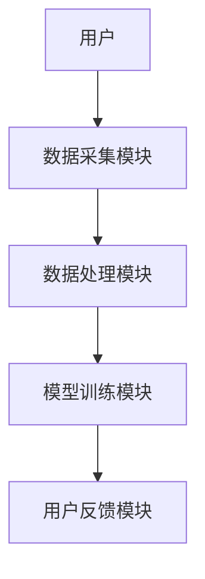

                 


```markdown
# AI Agent在智能手环中的情绪状态监测

> 关键词：AI Agent, 情绪状态监测, 智能手环, 传感器数据, 机器学习, 深度学习

> 摘要：本文探讨了AI Agent在智能手环中的应用，重点分析了情绪状态监测的核心技术与实现方法。通过详细阐述AI Agent的基本原理、算法实现、系统架构设计以及实际项目案例，本文为读者提供了一个全面了解和应用AI Agent进行情绪监测的框架。

---

# 第一部分: 背景介绍与核心概念

## 第1章: 情绪状态监测的背景与问题背景
### 1.1 情绪状态监测的重要性
#### 1.1.1 情绪状态监测的定义与意义
情绪状态监测是指通过分析个体的生理数据和行为数据，推断其当前情绪状态的技术。在智能手环等可穿戴设备中，情绪状态监测可以帮助用户更好地了解自己的情绪变化，提供个性化的健康建议。

#### 1.1.2 情绪状态监测的应用场景
- 健康管理：通过监测情绪波动，帮助用户识别压力过大、焦虑等情绪问题。
- 个性化反馈：为用户提供情绪调节建议，如运动、冥想等。
- 智能交互：与智能设备联动，根据情绪状态调整设备的反馈方式。

#### 1.1.3 情绪状态监测的边界与外延
- 数据采集范围：心率、皮肤电活动、加速度等生理数据。
- 应用场景限制：主要关注情绪监测，不涉及情感分析或语义理解。

### 1.2 AI Agent的基本概念与特点
#### 1.2.1 AI Agent的定义
AI Agent是一种智能代理，能够感知环境、自主决策并执行任务。在情绪监测中，AI Agent负责数据处理、模型训练和结果反馈。

#### 1.2.2 AI Agent的核心特点
- 自主性：无需人工干预，自动完成数据处理和分析。
- 反应性：能够实时响应数据变化，调整监测策略。
- 学习能力：通过机器学习模型不断优化情绪监测的准确性。

### 1.3 AI Agent在智能手环中的应用
#### 1.3.1 智能手环的功能与架构
- 数据采集：心率、皮肤电活动、加速度、体温等。
- 数据传输：通过蓝牙或Wi-Fi将数据传输到云端或本地设备。
- 用户交互：通过手环屏幕或手机APP显示情绪监测结果。

#### 1.3.2 情绪状态监测的核心原理
情绪状态监测基于生理数据与情绪状态的相关性。例如，心率变异性（HRV）与压力水平相关，皮肤电活动（EDA）与情绪波动相关。

#### 1.3.3 AI Agent与情绪状态监测的关系
AI Agent作为智能手环的核心模块，负责数据处理、模型训练和结果反馈。通过AI Agent，手环能够实时监测用户情绪状态并提供个性化建议。

---

## 第2章: 情绪状态监测的核心概念与联系
### 2.1 情绪状态监测的核心原理
#### 2.1.1 情绪状态监测的数学模型
情绪状态监测通常采用分类模型，将生理数据映射到情绪类别（如平静、紧张、兴奋等）。常用的模型包括支持向量机（SVM）、随机森林（RF）和长短期记忆网络（LSTM）。

#### 2.1.2 情绪状态监测的特征提取方法
- 基于时序分析：提取心率变异性（HRV）特征，如均值、标准差、最大值等。
- 基于频域分析：提取EDA信号的频谱特征，如功率谱密度（PSD）。

#### 2.1.3 情绪状态监测的算法选择与优化
根据数据特征和应用场景选择合适的算法。例如，对于小样本数据，随机森林可能更适合；对于时序数据，LSTM可能表现更好。

### 2.2 情绪状态监测与AI Agent的关系
#### 2.2.1 AI Agent作为数据处理的核心
AI Agent负责整合来自不同传感器的数据，进行特征提取和模型训练。

#### 2.2.2 AI Agent作为决策支持的工具
通过分析情绪数据，AI Agent可以为用户提供个性化的情绪调节建议。

#### 2.2.3 AI Agent作为用户反馈的桥梁
AI Agent能够实时反馈用户情绪状态，并与智能设备联动，提供相应的服务。

---

## 第3章: 情绪状态监测的算法原理与实现
### 3.1 算法原理
#### 3.1.1 支持向量机（SVM）
SVM是一种常用的分类算法，适用于小样本数据。其核心思想是将数据映射到高维空间，找到一个最优超平面进行分类。

$$
\text{SVM的目标函数：} \quad \min_{w,b} \frac{1}{2}||w||^2 + C \sum_{i=1}^n \xi_i
$$

#### 3.1.2 随机森林（RF）
随机森林是一种基于决策树的集成算法，适用于特征较多的数据集。其优势在于能够处理非线性关系和特征冗余。

#### 3.1.3 长短期记忆网络（LSTM）
LSTM适用于时序数据的分析，能够捕捉数据的长程依赖关系。

### 3.2 算法实现
#### 3.2.1 数据预处理
- 数据清洗：去除异常值和噪声。
- 特征提取：提取心率变异性（HRV）和皮肤电活动（EDA）的特征。

#### 3.2.2 模型训练
- 使用训练数据训练模型，调整超参数以优化性能。

#### 3.2.3 模型评估
- 通过准确率、召回率和F1分数评估模型性能。

### 3.3 算法优化
#### 3.3.1 超参数优化
- 使用网格搜索或随机搜索优化模型超参数。

#### 3.3.2 模型集成
- 将多个模型的结果进行融合，提高预测准确率。

---

## 第4章: 系统分析与架构设计
### 4.1 系统架构设计
#### 4.1.1 系统功能模块
- 数据采集模块：采集心率、EDA等数据。
- 数据处理模块：进行特征提取和数据预处理。
- 模型训练模块：训练情绪分类模型。
- 用户反馈模块：显示情绪监测结果并提供反馈。

#### 4.1.2 系统架构图


### 4.2 接口设计与交互流程
#### 4.2.1 数据接口
- 数据采集接口：通过蓝牙或Wi-Fi接收传感器数据。
- 数据处理接口：将数据传递到数据处理模块。

#### 4.2.2 交互流程
- 用户佩戴手环，设备采集生理数据。
- 数据传输到云端或本地设备进行处理。
- 模型分析情绪状态并反馈给用户。

---

## 第5章: 项目实战
### 5.1 环境搭建
- 安装Python、TensorFlow、Scikit-learn等工具。

### 5.2 核心实现
```python
import numpy as np
from sklearn.ensemble import RandomForestClassifier
from sklearn.metrics import accuracy_score

# 数据预处理
X = np.load('features.npy')
y = np.load('labels.npy')

# 模型训练
model = RandomForestClassifier()
model.fit(X, y)

# 模型评估
y_pred = model.predict(X)
print(accuracy_score(y, y_pred))
```

### 5.3 实际案例分析
- 通过实际数据展示模型的预测结果，并分析其准确性。

---

## 第6章: 最佳实践与小结
### 6.1 最佳实践
- 数据预处理是关键，确保数据质量和特征提取的有效性。
- 模型选择应根据数据特点和应用场景进行调整。

### 6.2 小结
本文详细介绍了AI Agent在智能手环中的情绪状态监测技术，从理论到实践，为读者提供了一个全面的学习框架。

---

# 作者：AI天才研究院 & 禅与计算机程序设计艺术

---

通过本文，读者可以深入了解AI Agent在智能手环中的应用，掌握情绪状态监测的核心技术与实现方法。希望本文能够为相关领域的研究和实践提供有价值的参考。
```

