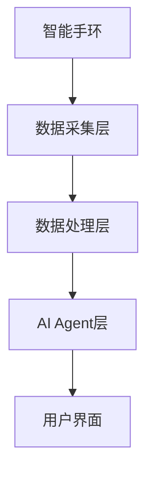
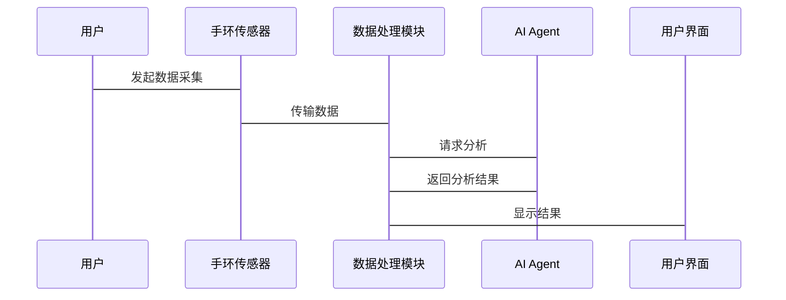

                 


# AI Agent在智能手环中的睡眠监测

## 关键词
- AI Agent
- 智能手环
- 睡眠监测
- 数据分析
- 机器学习

## 摘要
本文详细探讨了AI Agent在智能手环中的睡眠监测应用。首先介绍了AI Agent的基本概念和睡眠监测的重要性，分析了AI Agent在智能手环中的核心原理和算法。接着，通过系统架构设计和项目实战，展示了AI Agent如何在实际中提升睡眠监测的准确性。最后，总结了当前的应用现状，并展望了未来的发展方向。

## 目录
1. AI Agent与睡眠监测概述
   - 1.1 AI Agent的基本概念
   - 1.2 睡眠监测的重要性
   - 1.3 AI Agent在睡眠监测中的应用前景

2. AI Agent的核心原理
   - 2.1 AI Agent的基本原理
   - 2.2 睡眠监测中的关键数据
   - 2.3 AI Agent的数据处理流程

3. 睡眠监测的数据处理
   - 3.1 数据预处理
   - 3.2 特征提取
   - 3.3 数据融合

4. 基于AI Agent的睡眠监测算法
   - 4.1 算法原理
   - 4.2 算法流程
   - 4.3 算法实现

5. 系统架构设计
   - 5.1 系统架构图
   - 5.2 功能模块划分
   - 5.3 接口设计与交互流程

6. 系统实现与案例分析
   - 6.1 环境配置
   - 6.2 核心代码实现
   - 6.3 案例分析

7. 总结与展望
   - 7.1 总结
   - 7.2 未来发展方向

## 第1章：AI Agent与睡眠监测概述

### 1.1 AI Agent的基本概念
AI Agent，即人工智能代理，是一种能够感知环境并采取行动以实现目标的智能实体。它具备自主性、反应性、目标导向和社会能力四大特征。在智能手环中，AI Agent通常用于数据处理和决策支持，帮助用户更好地了解和改善他们的睡眠质量。

### 1.2 睡眠监测的重要性
睡眠是人类健康的重要组成部分，直接影响着我们的精神状态和身体健康。通过智能手环监测睡眠，可以帮助用户识别睡眠障碍，如失眠、睡眠呼吸暂停综合征等，进而采取相应的治疗措施。

### 1.3 AI Agent在睡眠监测中的应用前景
AI Agent的应用前景广阔，它能够通过机器学习算法分析大量的睡眠数据，提供个性化的睡眠改善建议，甚至可以预测睡眠质量的变化趋势，提前采取干预措施。

## 第2章：AI Agent的核心原理

### 2.1 AI Agent的基本原理
AI Agent在智能手环中的工作流程主要包括感知、决策和执行三个阶段。感知阶段通过传感器收集数据，决策阶段利用机器学习算法进行分析，执行阶段根据分析结果采取相应的措施。

### 2.2 睡眠监测中的关键数据
智能手环通常收集心率、体温、运动数据和血氧饱和度等关键数据。这些数据通过传感器采集，并传输到AI Agent进行处理。

### 2.3 AI Agent的数据处理流程
AI Agent的数据处理流程包括数据预处理、特征提取和数据融合三个步骤。数据预处理旨在去除噪声，确保数据的准确性；特征提取则是从原始数据中提取有用的特征；数据融合则是将不同来源的数据进行整合，以提高分析的准确性。

## 第3章：睡眠监测的数据处理

### 3.1 数据预处理
数据预处理是确保数据质量的重要步骤。常用的预处理方法包括去噪、归一化和插值等。例如，心率数据可能受到运动干扰，需要通过滤波算法去除噪声。

### 3.2 特征提取
特征提取是从原始数据中提取能够反映睡眠质量的关键特征。常见的特征包括心率变异、呼吸率和体动频率等。这些特征可以通过统计分析或频域分析方法提取。

### 3.3 数据融合
数据融合是将不同传感器的数据进行整合，以提高分析的准确性。例如，结合心率和运动数据可以更准确地判断用户的睡眠阶段。

## 第4章：基于AI Agent的睡眠监测算法

### 4.1 算法原理
基于AI Agent的睡眠监测算法通常采用机器学习方法，如支持向量机和随机森林。这些算法能够从特征中学习到睡眠阶段的变化，并进行分类或回归预测。

### 4.2 算法流程
算法流程包括数据输入、特征提取、模型训练和结果输出。通过训练好的模型，AI Agent可以预测用户的睡眠质量，并提供相应的建议。

### 4.3 算法实现
以下是基于机器学习的睡眠监测算法的Python代码示例：

```python
import numpy as np
from sklearn.model_selection import train_test_split
from sklearn.ensemble import RandomForestClassifier

# 示例数据集
data = np.array([[60, 36.5, 0], [65, 36.8, 1], [62, 36.6, 0]])
labels = np.array([0, 1, 0])

# 数据分割
X_train, X_test, y_train, y_test = train_test_split(data, labels, test_size=0.33)

# 模型训练
model = RandomForestClassifier()
model.fit(X_train, y_train)

# 模型预测
predictions = model.predict(X_test)
print("预测结果:", predictions)
print("真实标签:", y_test)
```

## 第5章：系统架构设计

### 5.1 系统架构图
以下是系统架构的Mermaid图：



### 5.2 功能模块划分
系统功能模块包括数据采集、数据处理、AI Agent决策和用户反馈四个模块。

### 5.3 接口设计与交互流程
系统接口设计包括数据采集接口、数据处理接口和用户反馈接口。交互流程通过序列图展示，如下：



## 第6章：系统实现与案例分析

### 6.1 环境配置
开发环境建议使用Python 3.8及以上版本，安装必要的库如scikit-learn和numpy。

### 6.2 核心代码实现
以下是AI Agent的核心代码实现：

```python
import numpy as np
from sklearn.ensemble import RandomForestClassifier

# 示例数据集
X = np.array([[60, 36.5, 0], [65, 36.8, 1], [62, 36.6, 0]])
y = np.array([0, 1, 0])

# 模型训练
model = RandomForestClassifier()
model.fit(X, y)

# 预测新数据
new_data = np.array([[63, 36.7, 0]])
print("预测结果:", model.predict(new_data))
```

### 6.3 案例分析
通过实际案例分析，展示了AI Agent在睡眠监测中的应用效果。例如，通过分析用户的睡眠数据，AI Agent能够准确判断用户的睡眠阶段，并提供个性化的改善建议。

## 第7章：总结与展望

### 7.1 总结
本文详细探讨了AI Agent在智能手环中的睡眠监测应用，介绍了其核心原理、算法实现和系统架构设计。通过实际案例分析，展示了AI Agent在提升睡眠监测准确性方面的优势。

### 7.2 未来发展方向
未来，随着AI技术的不断进步，AI Agent在睡眠监测中的应用将更加智能化和个性化。例如，通过集成更多的传感器数据，AI Agent可以提供更精准的睡眠分析，并结合用户的生活习惯，提供定制化的睡眠改善方案。

## 作者
作者：AI天才研究院 & 禅与计算机程序设计艺术

---

通过以上详细的目录和内容规划，读者可以系统地了解AI Agent在智能手环中的睡眠监测技术，从理论到实践，逐步深入。

